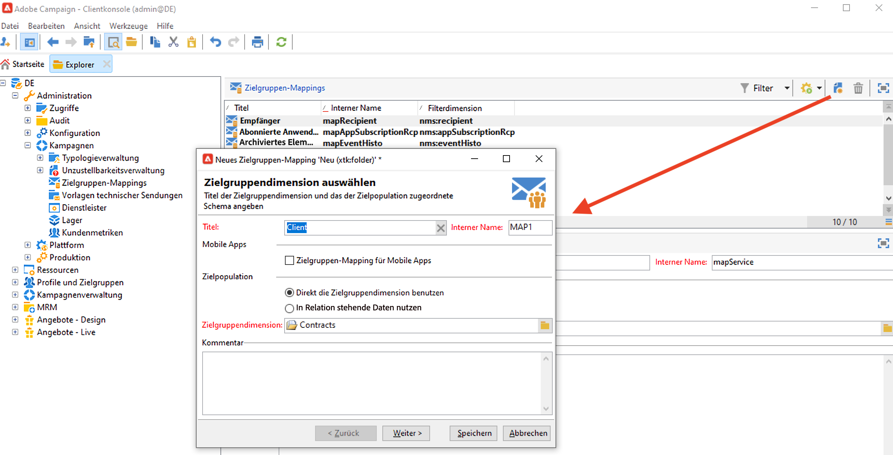
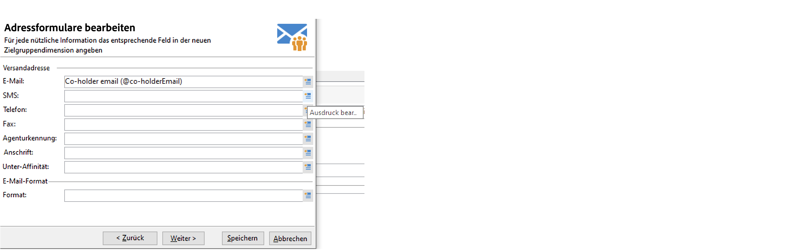
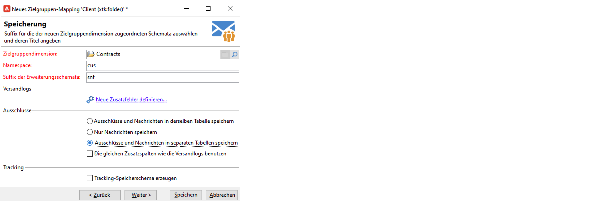
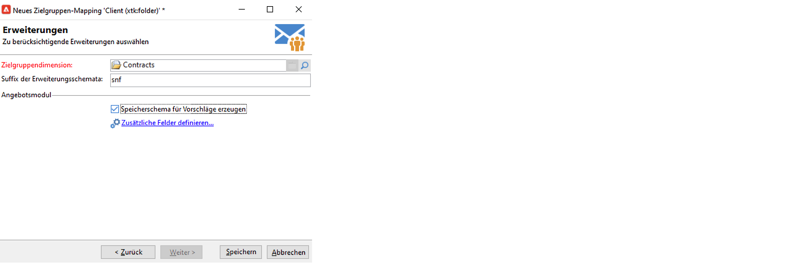

# Arbeiten mit Zielgruppen-Mappings{#gs-target-mappings}

Standardmäßig sind in Versandvorlagen die **[!UICONTROL Empfänger]** ausgewählt. Ihr Zielgruppen-Mapping verwendet daher die Felder der **nms:recipient**-Tabelle.

Sie können für Ihre Sendungen aber auch andere Zielgruppen-Mappings verwenden oder ein neues Zielgruppen-Mapping erstellen.

## Integrierte Zielgruppen-Mappings {#ootb-mappings}

Adobe Campaign verfügt über die folgenden integrierten Zielgruppen-Mappings:

| Name | Verwendung Verwendungszweck | Schema |
|---|---|---|
| Empfänger | Versand an Empfänger (integrierte Empfängertabelle) | nms:recipient |
| Besucher | Versand an Besucher, deren Profile beispielsweise über Empfehlungen (Viral Marketing) erfasst wurden. | mns:visitor |
| Abonnements  | Versand richtet sich an Abonnenten eines Informationsdienstes wie z. B. einen Newsletter | nms:subscription |
| Besucher-Abonnements | Versand richtet sich an Besucher, die einen Informationsdienst beziehen | nms:visitorSub |
| Benutzer | Versand richtet sich an Adobe-Campaign-Benutzer | nms:operator |
| Externe Datei | Versand basiert auf einer Datei, die alle notwendigen Informationen enthält | Ohne Schema oder Zielgruppe |

## Erstellen eines Zielgruppen-Mappings {#new-mapping}

Sie können auch selbst ein Zielgruppen-Mapping erstellen. Sie benötigen beispielsweise ein benutzerdefiniertes Zielgruppen-Mapping, wenn:

* eine benutzerdefinierte Empfängertabelle verwendet wird,
* eine Filterdimension konfiguriert wird, die sich von der integrierten Zielgruppendimension auf dem Zielgruppen-Mapping-Bildschirm unterscheidet.

Weitere Informationen über benutzerdefinierte Empfängertabellen finden sich auf [dieser Seite](../dev/custom-recipient.md).

Der Adobe Campaign-Assistent zur Erstellung von Zielgruppen-Mappings hilft Ihnen bei der Erstellung aller Schemata, die zur Verwendung Ihres benutzerdefinierten Zielgruppen-Mappings erforderlich sind.

1. Navigieren Sie im Adobe Campaign-Explorer zu **[!UICONTROL Administration]** `>` **[!UICONTROL Kampagnenverwaltung]** `>` **[!UICONTROL Zielgruppen-Mappings]**.

1. Erstellen Sie ein neues Zielgruppen-Mapping und wählen Sie Ihr benutzerdefiniertes Schema als Zielgruppenedimension aus.

   

1. Geben Sie die Felder an, in denen die Profilinformationen gespeichert sind: Nachname, Vorname, E-Mail, Adresse etc.

   

1. Geben Sie die Parameter für die Speicherung der Informationen an, einschließlich des Suffix der Erweiterungsschemata, damit diese leicht identifiziert werden können.

   

   Wählen Sie aus, ob Ausschlüsse (**excludelog**) mit Nachrichten (**broadlog**) oder in einer separaten Tabelle gespeichert werden sollen.

   Sie können für dieses Versand-Mapping (**trackinglog**) auch auswählen, ob Tracking verwaltet werden soll.

1. Wählen Sie dann die entsprechenden Erweiterungen aus. Der Erweiterungstyp hängt von Ihren Campaign-Einstellungen und Add-ons ab.

   

   Klicken Sie auf die Schaltfläche **[!UICONTROL Speichern]**, um mit der Erstellung des Versand-Mappings zu beginnen: Alle verknüpften Tabellen werden automatisch auf der Basis der ausgewählten Parameter erstellt.

