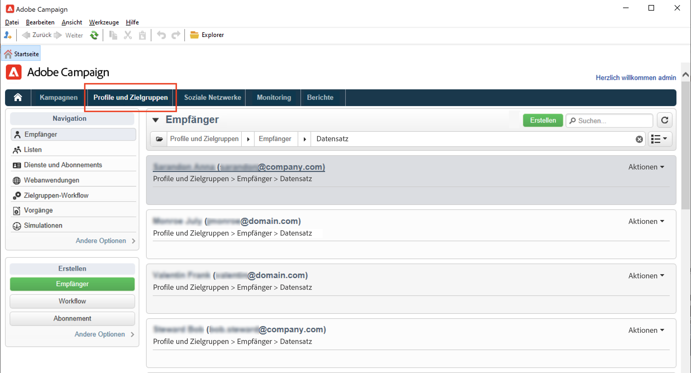
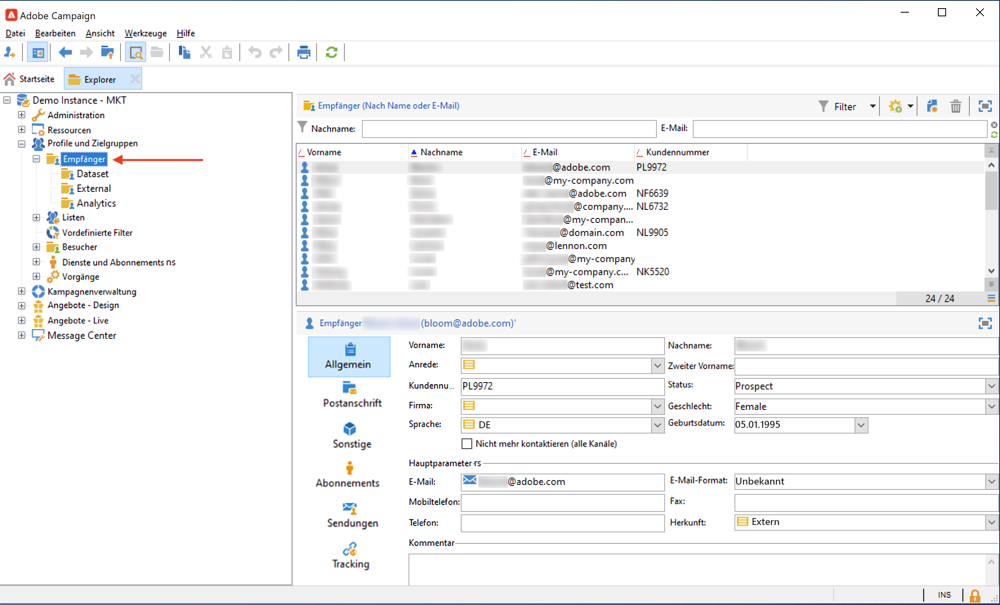
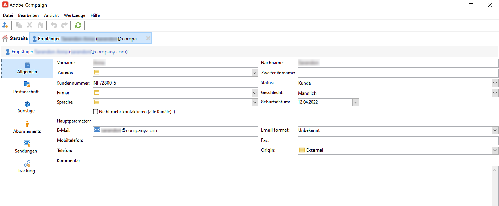
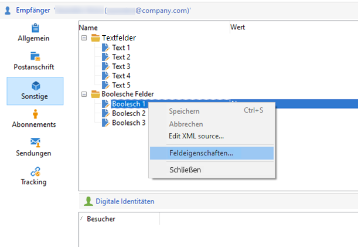
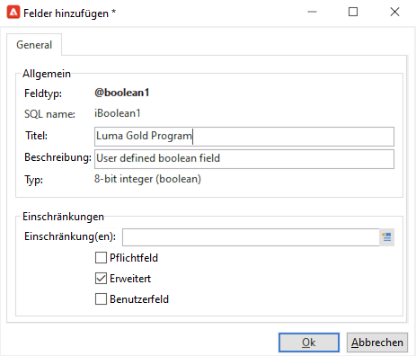
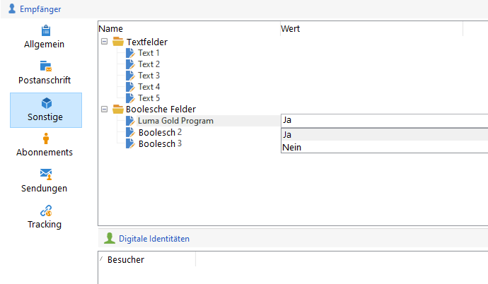
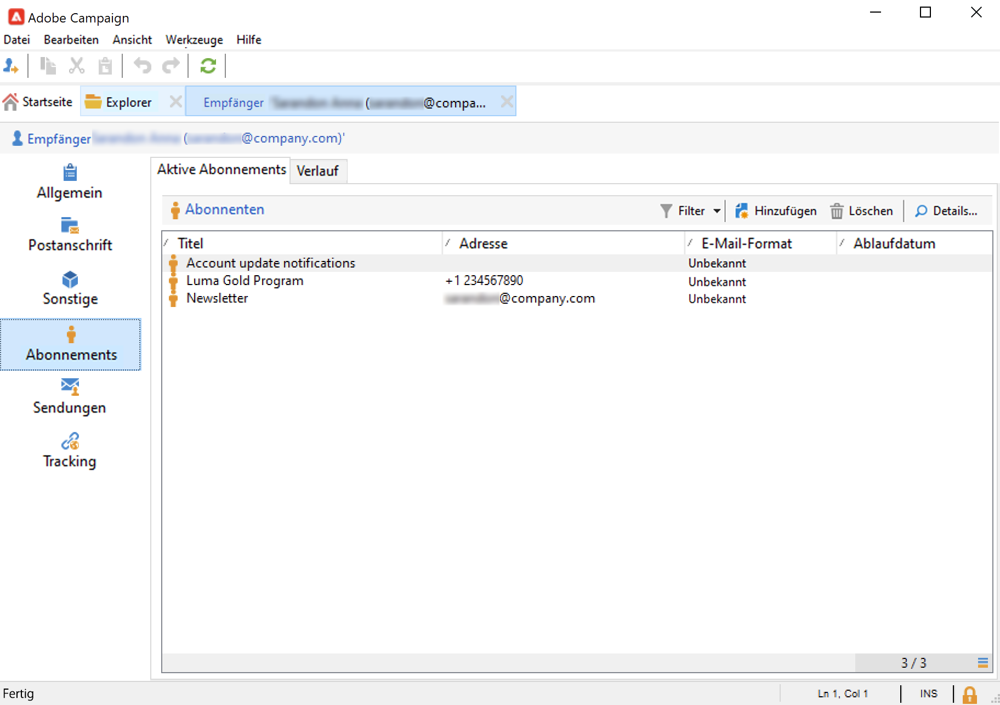

# Anzeige vorhandener Profile{#view-profiles}

Gehen Sie zu **[!UICONTROL Profile und Zielgruppen]**, um auf in der Adobe Campaign-Datenbank gespeicherte Empfänger zuzugreifen.

Auf dieser Seite können Sie einen [Neuen Empfänger erstellen](create-profiles.md), einen vorhandenen Empfänger bearbeiten und auf seine Profildetails zugreifen.

Erweiterte Möglichkeiten zur Bearbeitung von Profilen erhalten Sie, wenn Sie über den Link **[!UICONTROL Explorer]** auf der Adobe Campaign-Startseite auf die Campaign-Baumstruktur zugreifen.

>[!CAUTION]
>
>Der integrierte Bildschirm &quot;Empfänger&quot; wird durch ein XML-Schema und das zugehörige Formular definiert. Das XML-Schema ist im Knoten **[!UICONTROL Administration > Konfiguration > Datenschemata]** der Adobe Campaign-Explorer-Baumstruktur gespeichert. Nur erfahrene Benutzer dürfen Änderungen an diesen Schemas vornehmen.

## Bearbeiten von Profilen{#edit-a-profiles}

Wählen Sie ein Profil aus, um auf einem neuen Tab Details anzuzeigen.

Die Informationen zu einem Profil werden nach Themen geordnet in verschiedenen Tabs angezeigt. Diese Tabs und ihr Inhalt variieren je nach Ihrer Konfiguration und den installierten Packages.

Für einen typischen integrierten Empfänger können Sie auf die folgenden Tabs zugreifen:

* **[!UICONTROL Allgemein]**: für alle allgemeinen Profildaten. Insbesondere enthält dieser Tab den Nachnamen, Vornamen, die E-Mail-Adresse, das E-Mail-Format usw.

   Auf diese Tab wird auch die **Opt-out**-Kennzeichnung für das Profil gespeichert. Wenn die Option **[!UICONTROL Nicht mehr kontaktieren (alle Kanäle)]** aktiviert ist, befindet sich das Profil auf der Blockierungsliste. Diese Informationen werden den Kontaktdaten hinzugefügt, wenn der Empfänger beispielsweise auf einen Abmelde-Link in einem Newsletter geklickt hat. Solch ein Empfänger wird auf keinem Kanal (E-Mail, Briefpost usw.) mehr ausgewählt. Weitere Informationen hierzu finden Sie auf [dieser Seite](../send/quarantines.md).

* **Postanschrift**, die die Briefpost-Adresse des ausgewählten Profils enthält.

   Sie können in diesem Bildschirm den Qualitätsindex der Adresse und die Anzahl der Fehler in der Adresse überprüfen. Diese Informationen werden direkt vom Briefpost-Dienstleister basierend auf der Anzahl der bei früheren Sendungen gefundenen Fehler verwendet und können nicht manuell geändert werden.

* **Sonstiges**: für spezifische Felder, die je nach Bedarf personalisiert und ausgefüllt werden können.

   Verwenden Sie das Kontextmenü **[!UICONTROL Feldeigenschaften...]**, um die Namen der Felder zu ändern und ihr Format zu definieren.

   

   Geben Sie die neuen Einstellungen wie folgt ein:

   

   Überprüfen Sie die Aktualisierung in der Benutzeroberfläche:

   

   >[!CAUTION]
   >Änderungen gelten für alle Empfänger.

* **Abonnements**: für alle aktiven Abonnements von Services. Verwenden Sie den Tab **Verlauf**, um auf die Details der An- und Abmeldungen für diesen Kontakt zuzugreifen.

   

   Weitere Informationen zu Abonnements finden Sie in [diesem Abschnitt](../start/subscriptions.md).

* **Sendungen**: für alle Versand-Logs für das ausgewählte Profil. In diesem Tab können Sie auf den Marketing-Verlauf des Kontakts zugreifen: Titel, Daten und Status aller an das Profil adressierten Versandaktionen auf allen Kanälen.

* **Tracking**: für alle Tracking-Logs für das ausgewählte Profil. Diese Informationen werden verwendet, um das Verhalten von Profilen im Anschluss an Sendungen zu verfolgen. Dieser Tab zeigt alle in Sendungen getrackten URLs an. In der Regel enthält die anpassbare Liste folgende Daten: die geklickte URL, Datum und Uhrzeit des Klicks, das Dokument, in dem die URL enthalten war

   Weitere Informationen zum Tracking finden Sie in [diesem Abschnitt](../start/tracking.md).

## Aktive Profile {#active-profiles}

Aktive Profile sind die Profile, die zu Fakturierungszwecken berücksichtigt werden.

Für die Fakturierung werden nur **aktive** Profile berücksichtigt. Ein Profil wird als aktiv betrachtet, wenn es in den vergangenen zwölf Monaten über einen beliebigen Kanal angesprochen wurde oder mit ihm kommuniziert wurde.

Ein Profil, das für mehrere Sendungen ausgewählt wurde, wird nur einmal gezählt.

Die Anzahl der aktiven Profile ist nur für **Marketing-Instanzen** verfügbar. Sie ist nicht für Ausführungsinstanzen verfügbar, d. h. MID (Mid-Sourcing)- und RT (Message Center-/Echtzeit-Messaging)-Instanzen.

>[!NOTE]
>
>Sie können auch die Anzahl der aktiven Profile in Ihrer Instanz direkt über das Control Panel von Campaign überwachen. Weitere Informationen hierzu finden Sie in der [Dokumentation zu Control Panel](https://experienceleague.adobe.com/docs/control-panel/using/performance-monitoring/active-profiles-monitoring.html?lang=de).
