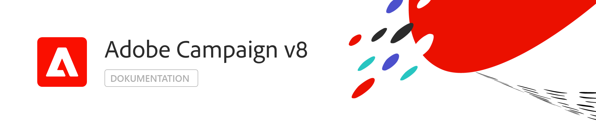

# Hilfe {#campaign-documentation}

## Neue Funktionen

* **[ [!DNL Adobe Campaign]](start/get-started.md)** – Wichtige Funktionen und Anwendungsfälle

* **[Neue Funktionen in v8](start/whats-new.md)** – Entdecken Sie die Möglichkeiten von Campaign v8

* **[Implementierungsrichtlinien](start/implement.md)** – Hier erfahren Sie, wie Sie Ihre Implementierung beginnen.

* **[Von v7 zu v8](start/capability-matrix.md)** – Planen Sie den Wechsel von Campaign Classic v7 zu v8? Die wichtigsten Unterschiede

## Erste Schritte

<table>
<tr>
  <td valign="bottom">
    
    

    <a href="start/connect.md">Herstellen einer Verbindung zu Campaign</a>
    

     
  </td>

<td valign="bottom">
      
    
<a href="start/import.md">Profile importieren</a>
    

     
  </td>
  <td valign="bottom">
    
    

    <a href="start/create-message.md">E-Mail erstellen</a>
    

     
  </td>
</tr>
</table>

## Mehr Ressourcen

* [Bekannte Einschränkungen](start/known-limitations.md)
* [Architektur](dev/architecture.md)
* [Messen und Verfolgen](start/reporting.md)
* [Herstellen von Verbindungen zu anderen Lösungen](connect/integration.md)
* [Häufig gestellte Fragen zu Campaign v8](start/campaign-faq.md)
* [Adobe Campaign v8 - Produktbeschreibung](https://helpx.adobe.com/legal/product-descriptions/adobe-campaign-managed-cloud-services.html)
