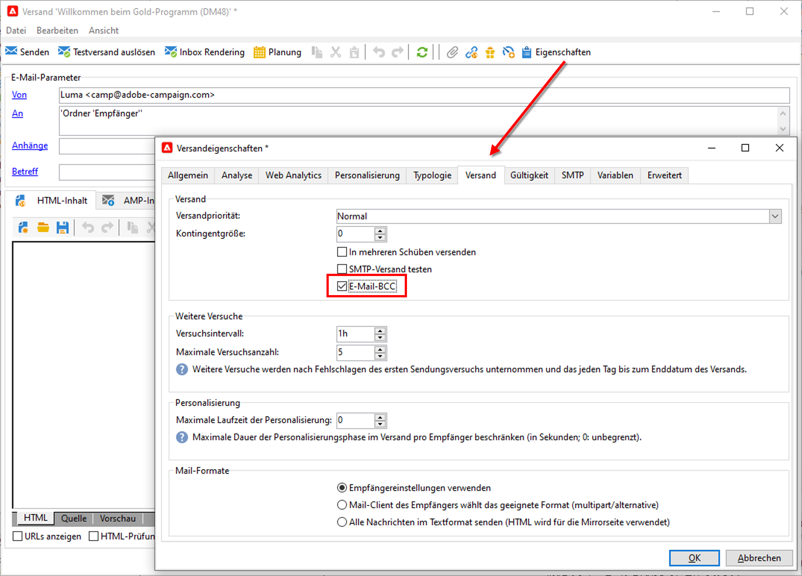

# Einstellungen für den E-Mail-Kanal in Campaign

## E-Mail-BCC

Sie können Adobe Campaign so konfigurieren, dass von den von der Plattform gesendeten E-Mails eine Kopie beibehalten wird.

>[!NOTE]
>Die Funktion &quot;E-Mail-BCC&quot; ist optional. Prüfen Sie diesbezüglich Ihren Lizenzvertrag.

Adobe Campaign selbst ermöglicht keine Verwaltung von archivierten Dateien. Sie können aber die gewünschten Nachrichten an eine bestimmte Adresse senden, wo sie mithilfe eines externen Systems verarbeitet und archiviert werden.

Dazu werden E-Mail-Dateien, die den gesendeten E-Mails entsprechen, auf einen Remote-Server, z. B. einen SMTP-E-Mail-Server, übertragen. Das Archivierungsziel ist eine BCC-E-Mail-Adresse (für die Versand-Empfänger unsichtbar), die Sie angeben müssen.

Bitte beachten Sie Folgendes:

* Sie können nur **eine** BCC-E-Mail-Adresse verwenden.

* Nur erfolgreich gesendete E-Mails werden berücksichtigt, Absprünge nicht.

 Als Benutzer von Managed Cloud Services [kontaktieren Sie Adobe](../start/campaign-faq.md#support), um E-Mail-BCC in Campaign zu aktivieren. Die gewünschte BCC-E-Mail-Adresse muss dem Adobe-Team, das die Adresse für Sie konfigurieren wird, mitgeteilt werden.

Nachdem E-Mail-BCC konfiguriert wurde, stellen Sie sicher, dass die Funktion in der Versandvorlage oder im Versand über die Option **E-Mail-BCC** aktiviert ist.

**Verwandte Themen** in der Dokumentation zu Campaign Classic v7:

* [Mirror-Seite erstellen](https://experienceleague.adobe.com/docs/campaign-classic/using/sending-messages/sending-emails/sending-an-email/email-parameters.html?lang=de#generating-mirror-page){target=&quot;_blank&quot;}

* [E-Mail-Format auswählen](https://experienceleague.adobe.com/docs/campaign-classic/using/sending-messages/sending-emails/sending-an-email/email-parameters.html?lang=de#selecting-message-formats){target=&quot;_blank&quot;}

* [Zeichencodierung auswählen](https://experienceleague.adobe.com/docs/campaign-classic/using/sending-messages/sending-emails/sending-an-email/email-parameters.html?lang=de#character-encoding){target=&quot;_blank&quot;}

* [Bounce-E-Mail-Adresse festlegen](https://experienceleague.adobe.com/docs/campaign-classic/using/sending-messages/sending-emails/sending-an-email/email-parameters.html?lang=de#managing-bounce-emails){target=&quot;_blank&quot;}

* [E-Mail-Versandvorlagen verwenden](https://experienceleague.adobe.com/docs/campaign-classic/using/sending-messages/using-delivery-templates/about-templates.html?lang=de){target=&quot;_blank&quot;}

* [Fehlgeschlagene Sendungen analysieren](https://experienceleague.adobe.com/docs/campaign-classic/using/sending-messages/monitoring-deliveries/understanding-delivery-failures.html?lang=de){target=&quot;_blank&quot;} 
