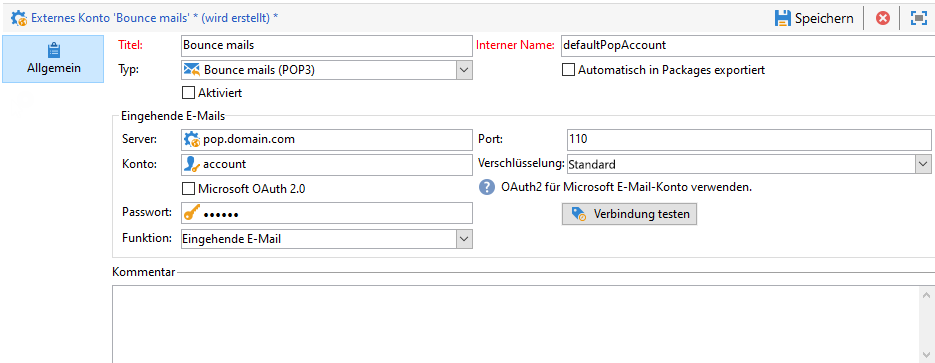
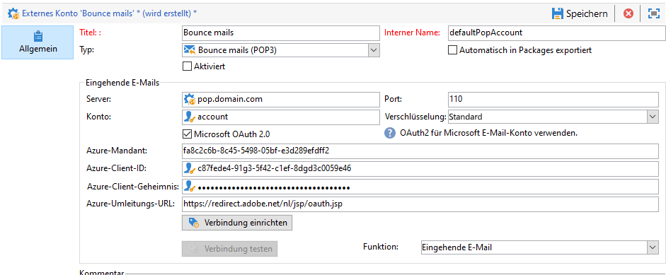

# Externe Konten konfigurieren {#config-external-accounts}

Adobe Campaign enthält eine Reihe vordefinierter externer Konten. Um Verbindungen zu externen Systemen einzurichten, können Sie neue externe Konten erstellen.

Externe Konten werden von technischen Prozessen, wie technischen Workflows oder Kampagnen-Workflows, verwendet. Beispiel: Bei der Einrichtung eines Dateitransfers in einem Workflow oder bei einem Datenaustausch mit einem anderen Programm (Adobe Target, Experience Manager usw.) müssen Sie ein externes Konto auswählen.

Sie können über Adobe Campaign **[!UICONTROL Explorer]** auf externe Konten zugreifen: Navigieren Sie zu **[!UICONTROL Administration]** `>` **[!UICONTROL Plattform]** `>` **[!UICONTROL Externe Konten]**.

>[!CAUTION]
>
>* Wenn Sie Managed Cloud Services-Benutzer oder -Benutzerin sind, konfiguriert Adobe externe Konten für Ihre Instanz, die nicht geändert werden dürfen.
>
>* Im Kontext einer [Enterprise (FFDA)-Bereitstellung](../architecture/enterprise-deployment.md) verwaltet ein spezielles externes **[!UICONTROL Full FDA]**-Konto (ffda) die Verbindung zwischen der lokalen Campaign-Datenbank und der Cloud-Datenbank ([!DNL Snowflake]).
>

## Campaign-spezifische externe Konten {#ac-external-accounts}

Die folgenden technischen Konten werden von Adobe Campaign verwendet, um bestimmte Prozesse zu aktivieren und auszuführen.

### Bounce Messages {#bounce-mails-external-account}

>[!NOTE]
>
>Die Microsoft Exchange Online OAuth 2.0-Authentifizierung für POP3-Funktionen ist ab Campaign v8.3 verfügbar. Informationen zu Ihrer Version finden Sie in [diesem Abschnitt](../start/compatibility-matrix.md#how-to-check-your-campaign-version-and-buildversion)..
>

Das externe Konto **Bounce Messages** gibt das externe POP3-Konto an, das für die Verbindung mit dem E-Mail-Service verwendet werden soll. Alle Server, die für den POP3-Zugriff konfiguriert sind, können für den Empfang von Antwortsendungen verwendet werden.

Weitere Informationen über eingehende E-Mails finden Sie auf [dieser Seite](https://experienceleague.adobe.com/docs/campaign/automation/workflows/wf-activities/event-activities/inbound-emails.html?lang=de)..

Um das externe Konto für **[!UICONTROL Bounce-Messages (defaultPopAccount)]** zu konfigurieren, benötigen Sie folgende Informationen:

* **[!UICONTROL Server]** - URL des POP3-Servers.

* **[!UICONTROL Port]** – Port-Nummer der POP3-Verbindung. Der Standard-Port ist 110.

* **[!UICONTROL Konto]** – Name der Benutzerin oder des Benutzers

* **[!UICONTROL Passwort]** – Passwort des Benutzerkontos.

* **[!UICONTROL Verschlüsselung]** – Typ der gewählten Verschlüsselung mit den Optionen **[!UICONTROL Standardmäßig]**, **[!UICONTROL POP3 + STARTTLS]**, **[!UICONTROL POP3]** oder **[!UICONTROL POP3S]**.

  Das externe Konto **Bounce Messages** gibt das externe POP3-Konto an, das für die Verbindung mit dem E-Mail-Service verwendet werden soll. Alle Server, die für den POP3-Zugriff konfiguriert sind, können für den Empfang von Antwortsendungen verwendet werden.

* **[!UICONTROL Funktion]** – Eingehende E-Mail- oder SOAP-Router

>[!CAUTION]
>
>Bevor Sie Ihr externes POP3-Konto mit Microsoft OAuth 2.0 konfigurieren, müssen Sie die Anwendung zunächst im Azure-Portal registrieren. Weiterführende Informationen hierzu finden Sie auf [dieser Seite](https://docs.microsoft.com/de-de/azure/active-directory/develop/quickstart-register-app){target="_blank"}.
>

Um ein externes POP3-Programm mit Microsoft OAuth 2.0 zu konfigurieren, markieren Sie die Option **[!UICONTROL Microsoft OAuth 2.0]** und füllen Sie die folgenden Felder aus:

* **[!UICONTROL Azure-Mandant]** - Eine Azure-ID (oder Verzeichnis-ID bzw. Mandanten-ID) finden Sie in der Dropdown-Liste **Grundlagen** der Anwendungsübersicht im Azure-Portal.

* **[!UICONTROL Azure Client ID]** – Client-ID (oder Anwendungs- (Client) ID) finden Sie in der Dropdown-Liste **Grundlagen** der Anwendungsübersicht im Azure-Portal.

* **[!UICONTROL Azure-Client-Geheimnis]** – Die Client-Geheimnis-ID finden Sie in der Spalte **Client-Geheimnisse** im Menü **Zertifikate und Geheimnisse** Ihrer Anwendung im Azure-Portal.

* **[!UICONTROL Azure-Umleitungs-URL]** – Die Umleitungs-URL finden Sie im Menü **Authentifizierung** Ihrer Anwendung im Azure-Portal. Sie sollte mit der folgenden Syntax enden: `nl/jsp/oauth.jsp`, z. B. `https://redirect.adobe.net/nl/jsp/oauth.jsp`.

  Nachdem Sie Ihre unterschiedlichen Anmeldedaten eingegeben haben, können Sie auf **[!UICONTROL Verbindung einrichten]** klicken, um die Konfiguration Ihres externen Kontos abzuschließen.

### Routing {#routing}

Mit dem externen **[!UICONTROL Routing]**-Konto können Sie jeden in Adobe Campaign verfügbaren Kanal abhängig von den installierten Packages konfigurieren.

### Ausführungsinstanz {#execution-instance}

Im Kontext der Transaktionsnachrichten werden die Ausführungsinstanzen mit der Kontrollinstanz verknüpft und miteinander verbunden. Transaktionsnachrichten-Vorlagen werden in der Ausführungsinstanz bereitgestellt. Weitere Informationen zur Message Center-Architektur finden Sie auf [dieser Seite](../architecture/architecture.md#transac-msg-archi).

## Zugriff auf externe Systemkonten {#external-syst-external-accounts}

* **Externe Datenbank (FDA)** - Ein externes Konto vom Typ **Externe Datenbank** wird verwendet, um über Federated Data Access (FDA) eine Verbindung mit einer externen Datenbank herzustellen. Weitere Informationen zur Option „Federated Data Access“ (FDA) finden Sie in [diesem Abschnitt](../connect/fda.md).

  Externe Datenbanken, die mit Adobe Campaign v8 kompatibel sind, sind in der [Kompatibilitätsmatrix](../start/compatibility-matrix.md) aufgeführt.

* **Twitter** – Ein externes Konto vom Typ **Twitter** wird verwendet, um Campaign mit Ihrem Twitter-Konto zu verbinden und Nachrichten in Ihrem Namen zu posten. Weitere Informationen zur Twitter-Integration finden Sie in [diesem Abschnitt](../connect/ac-tw.md).

## Externe Konten zur Integration von Adobe-Lösungen {#adobe-integration-external-accounts}

* **Adobe Experience Cloud** - Ein externes Konto vom Typ **[!UICONTROL Adobe Experience Cloud]** wird verwendet, um Adobe Identity Management Service (IMS) für die Verbindung mit Adobe Campaign zu implementieren. Weitere Informationen zu Adobe Identity Management Service (IMS) finden Sie in [diesem Abschnitt](../start/connect.md#logon-to-ac).

* **Web-Analyse** – Das externe **[!UICONTROL Web-Analyse (Adobe Analytics)]**-Konto wird verwendet, um die Datenübertragung von Adobe Analytics an Adobe Campaign zu konfigurieren. Weitere Informationen zur Integration von Adobe Campaign mit Adobe Analytics finden Sie auf [dieser Seite](../connect/ac-aa.md).

* **Adobe Experience Manager** – Mit dem externen **[!UICONTROL AEM]**-Konto können Sie den Inhalt Ihrer E-Mail-Sendungen und Ihrer Formulare direkt in Adobe Experience Manager verwalten. Weitere Informationen zur Integration von Adobe Campaign mit Adobe Analytics finden Sie auf [dieser Seite](../connect/ac-aem.md).

## Externe CRM-Connector-Konten {#crm-external-accounts}

* **Microsoft Dynamics CRM** – Das externe **[!UICONTROL Microsoft Dynamics CRM]**-Konto ermöglicht den Import und Export von Microsoft Dynamics-Daten in Adobe Campaign. Weitere Informationen zur Integration von Adobe Campaign mit Microsoft Dynamics CRM finden Sie auf [dieser Seite](../connect/ac-ms-dyn.md).

* **Salesforce.com** – Das externe **[!UICONTROL Salesforce CRM]**-Konto ermöglicht den Import und Export von Salesforce-Daten in Adobe Campaign. Weitere Informationen zur Integration von Adobe Campaign mit dem CRM Salesforce.com finden Sie auf [dieser Seite](../connect/ac-sfdc.md).

## Übertragen von Daten mit externen Konten {#transfer-data-external-accounts}

Diese externen Konten können mithilfe einer Workflow-Aktivität vom Typ **[!UICONTROL Dateiübertragung]** zum Importieren oder Exportieren von Daten in Adobe Campaign verwendet werden. Weitere Informationen zur **Dateiübertragung** in Workflows finden Sie auf [dieser Seite](https://experienceleague.adobe.com/docs/campaign/automation/workflows/wf-activities/event-activities/file-transfer.html?lang=de).

* **FTP und SFTP** – Mit dem externen **FTP**-Konto können Sie den Zugriff auf einen Server außerhalb von Adobe Campaign konfigurieren und testen. Sie können aber auch Ihre eigenen externen Konten erstellen, um eine Verbindung mit externen Systemen wie SFTP- oder FTP-Servern zum Zweck des Dateitransfers herzustellen.

  Geben Sie dazu in diesem externen Konto die Adresse und die Zugangsdaten für die Verbindungsherstellung zum SFTP- oder FTP-Server an.

  >[!NOTE]
  >
  >Ab Version 8.5 können Sie sich jetzt bei der Konfiguration Ihres externen SFTP-Kontos sicher mit einem privaten Schlüssel authentifizieren. [Weitere Informationen zur Schlüsselverwaltung](https://experienceleague.adobe.com/docs/control-panel/using/sftp-management/key-management.html?lang=de)

* **Amazon Simple Storage Service (S3)** – Die **AWS S3**-Verbindung kann zum Importieren oder Exportieren von Daten in Adobe Campaign über die Workflow-Aktivität **[!UICONTROL Datei übertragen]** verwendet werden. Zum Einrichten dieses neuen externen Kontos benötigen Sie die folgenden Informationen:

   * **[!UICONTROL AWS-S3-Konto-Server]**: URL Ihres Servers, wie folgt ausgefüllt:   `<S3bucket name>.s3.amazonaws.com/<s3object path>`

   * **[!UICONTROL Kennung des AWS-Zugriffsschlüssels]**: Erfahren Sie in der [Amazon-Dokumentation](https://docs.aws.amazon.com/general/latest/gr/aws-sec-cred-types.html#access-keys-and-secret-access-keys), wie Sie die Kennung Ihres AWS-Zugangsschlüssels finden.{target="_blank"}

   * **[!UICONTROL Geheimer Zugriffsschlüssel für AWS]**: Erfahren Sie in der [Amazon-Dokumentation](https://aws.amazon.com/fr/blogs/security/wheres-my-secret-access-key/), wie Sie Ihren geheimen AWS-Zugriffsschlüssel finden.{target="_blank"}

   * **[!UICONTROL AWS-Region]**: Weitere Informationen zu AWS-Regionen finden Sie in der [Amazon-Dokumentation](https://aws.amazon.com/about-aws/global-infrastructure/regions_az/){target="_blank"}.

   * Die Checkbox **[!UICONTROL Server-seitige Verschlüsselung verwenden]** ermöglicht es Ihnen, Ihre Datei in S3 im verschlüsselten Modus zu speichern. Erfahren Sie in der [Amazon-Dokumentation](https://docs.aws.amazon.com/general/latest/gr/aws-sec-cred-types.html#access-keys-and-secret-access-keys), wie Sie die Kennung des Zugriffsschlüssels und den geheimen Zugriffsschlüssel finden.{target="_blank"}

* **Azure Blob Storage** – Das externe **Azure**-Konto kann mithilfe einer Workflow-Aktivität vom Typ **[!UICONTROL Dateiübertragung]** zum Importieren oder Exportieren von Daten in Adobe Campaign verwendet werden. Um das externe **Azure**-Konto für die gemeinsame Verwendung mit Adobe Campaign zu konfigurieren, müssen Sie die folgenden Informationen eingeben:

   * **[!UICONTROL Server]**: URL Ihres Azure Blob Storage-Servers

   * **[!UICONTROL Verschlüsselung]**: Art der Verschlüsselung, **[!UICONTROL Keine]** oder **[!UICONTROL SSL]**.

   * **[!UICONTROL Zugriffsschlüssel]**: Erfahren Sie in der [Microsoft-Dokumentation](https://docs.microsoft.com/de-de/azure/storage/common/storage-account-keys-manage?tabs=azure-portal), wie Sie Ihren **[!UICONTROL Zugriffsschlüssel]** finden{target="_blank"}.
