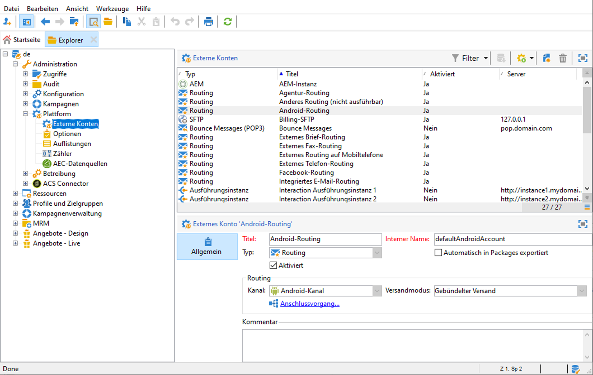

# Externe Konten konfigurieren

Adobe Campaign enthält eine Reihe vordefinierter externer Konten. Um Verbindungen mit externen Systemen einzurichten, können Sie neue externe Konten erstellen.

Externe Konten werden von technischen Prozessen, wie technischen Workflows oder Kampagnen-Workflows, verwendet. Wenn Sie beispielsweise eine Dateiübertragung in einem Workflow oder einen Datenaustausch mit einer anderen Anwendung (Adobe Target, Experience Manager usw.) einrichten, müssen Sie ein externes Konto auswählen.

Sie können über Adobe Campaign **[!UICONTROL Explorer]** auf externe Konten zugreifen: Navigieren Sie zu **[!UICONTROL Administration]** `>` **[!UICONTROL Plattform]** `>` **[!UICONTROL Externe Konten]**.




>[!CAUTION]
>
>Ein bestimmtes externes **[!UICONTROL Full FDA]** (ffda)-Konto verwaltet die Verbindung zwischen der lokalen Campaign-Datenbank und der Cloud-Datenbank ([!DNL Snowflake]).
>
>Als Managed Cloud Services-Benutzer wird dieses externe Konto von Adobe für Ihre Instanz konfiguriert. Sie darf nicht geändert werden.


## Kampagnenspezifische externe Konten

Die folgenden technischen Konten werden von Adobe Campaign verwendet, um bestimmte Prozesse zu aktivieren und auszuführen.

:Sprache_Ballon: Als Benutzer von Managed Cloud Services konfigurieren Sie Adobe alle Campaign-spezifischen externen Konten für Sie.

* **Bounce Messages (POP3)**

   Das externe Konto **Bounce Messages** gibt das externe POP3-Konto an, das für die Verbindung mit dem E-Mail-Dienst verwendet werden soll. Alle Server, die für den POP3-Zugriff konfiguriert sind, können für den Empfang von Antwortsendungen verwendet werden.

   [!DNL :arrow_upper_right:] Weitere Informationen zu eingehenden E-Mails finden Sie in der Dokumentation zu  [Campaign Classic v7 .](https://experienceleague.adobe.com/docs/campaign-classic/using/automating-with-workflows/event-activities/inbound-emails.html)

* **Routing**

   Mit dem externen **[!UICONTROL Routing]**-Konto können Sie jeden in Adobe Campaign verfügbaren Kanal abhängig von den installierten Packages konfigurieren.

   >[!CAUTION]
   >
   >Das externe Konto **[!UICONTROL Internes E-Mail-Versand-Routing]** (defaultEmailBulk) **darf in Adobe Campaign v8 nicht** aktiviert sein.

* **Ausführungsinstanz konfigurieren**

   Im Zusammenhang mit Transaktionsnachrichten werden die Ausführungsinstanzen mit der Kontrollinstanz verknüpft und miteinander verbunden. Transaktionsnachrichten-Vorlagen werden in der Ausführungsinstanz bereitgestellt.

   [!DNL :bulb:] Weitere Informationen zur Message Center-Architektur finden Sie auf  [dieser Seite](../dev/architecture.md#transac-msg-archi).

## Zugriff auf externe Systemkonten

* **Externe Datenbank (FDA)**

   Verwenden Sie das externe Konto **Externe Datenbank**, um über FDA eine Verbindung zu einer externen Datenbank herzustellen.

   Externe Datenbanken, die mit Adobe Campaign v8 kompatibel sind, sind in der [Kompatibilitätsmatrix](../start/compatibility-matrix.md) aufgeführt.

   [!DNL :bulb:] Weiterführende Informationen zur Option Federated Data Access (FDA) finden Sie in  [diesem Abschnitt](../connect/fda.md).

## Externe Konten zur Integration von Adobe Solution

* **Adobe Experience Cloud**

   Um über eine Adobe ID eine Verbindung zur Adobe Campaign-Konsole herzustellen, müssen Sie das externe Konto **[!UICONTROL Adobe Experience Cloud]** konfigurieren.

   [!DNL :bulb:] Weitere Informationen zu Adobe Identity Management Service (IMS) finden Sie in  [diesem Abschnitt](../start/connect.md#connect-ims).

   :Sprache_Ballon: Als Benutzer von Managed Cloud Services kontaktieren Sie [Adobe](../start/campaign-faq.md#support), um die Adobe IMS in Campaign zu implementieren.

* **Web Analytics**

   Verwenden Sie das externe Konto **[!UICONTROL Web Analytics (Adobe Analytics)]** , um die Datenübertragung von Adobe Analytics zu Adobe Campaign zu konfigurieren.

   [!DNL :bulb:] Weitere Informationen zur Integration von Adobe Campaign mit Adobe Analytics finden Sie auf  [dieser Seite](../connect/ac-aa.md).

   :Sprache_Ballon: Als Benutzer von Managed Cloud Services kontaktieren Sie [Adobe](../start/campaign-faq.md#support), um Adobe Analytics in Campaign zu integrieren.

   * **Adobe Experience Manager**
   Mit dem externen Konto **[!UICONTROL AEM]** können Sie den Inhalt Ihrer E-Mail-Sendungen sowie Ihrer Formulare direkt in Adobe Experience Manager verwalten.

   [!DNL :bulb:] Weitere Informationen zur Integration von Adobe Campaign mit Adobe Analytics finden Sie auf  [dieser Seite](../connect/ac-aem.md).

   :Sprache_Ballon: Als Benutzer von Managed Cloud Services kontaktieren Sie [Adobe](../start/campaign-faq.md#support), um Adobe Experience Manager in Adobe Campaign zu integrieren.


## Externe CRM-Connector-Konten

* **Microsoft Dynamics CRM**

   Das externe **[!UICONTROL Microsoft Dynamics CRM]**-Konto ermöglicht den Import und Export von Microsoft Dynamics-Daten in Adobe Campaign.

   [!DNL :bulb:] Weitere Informationen zur Integration von Adobe Campaign mit Microsoft Dynamics CRM finden Sie auf  [dieser Seite](../connect/crm.md).

   Beim Bereitstellungstyp **[!UICONTROL Web-API]** und der Authentifizierung mit **[!UICONTROL Passwort]** müssen Sie die folgenden Details angeben:

   * **[!UICONTROL Konto]**: Konto, mit dem die Anmeldung bei Microsoft CRM erfolgt

   * **[!UICONTROL Server]**: URL Ihres Microsoft CRM-Servers

   * **[!UICONTROL Client-Kennung]**: Client-ID, die über das Verwaltungsportal von Microsoft Azure im Feld  **[!UICONTROL Aktualisieren der]** Codekategorie,  **[!UICONTROL Client-]** ID, gefunden werden kann.

   * **[!UICONTROL CRM-Version]**: Version des CRM zwischen  **[!UICONTROL Dynamics CRM 2007]**,  **[!UICONTROL Dynamics CRM 2015]** oder  **[!UICONTROL Dynamics CRM 2016]**.
   Beim Bereitstellungstyp **[!UICONTROL Web-API]** und der Authentifizierung mit **[!UICONTROL Zertifikat]** müssen Sie die folgenden Details angeben:

   * **[!UICONTROL Server]**: URL Ihres Microsoft CRM-Servers

   * **[!UICONTROL Privater Schlüssel (Base64-kodiert)]**: Privater Schlüssel mit Base64-Kodierung

   * **[!UICONTROL Benutzerdefinierte Schlüsselkennung]**

   * **[!UICONTROL Schlüsselkennung]**

   * **[!UICONTROL Client-Kennung]**: Client-ID, die Sie über das Verwaltungsportal von Microsoft Azure in der Kategorie **[!UICONTROL Code aktualisieren]** im Feld **[!UICONTROL Client-ID]** finden.

   * **[!UICONTROL CRM-Version]**: Version des CRM zwischen  **[!UICONTROL Dynamics CRM 2007]**,  **[!UICONTROL Dynamics CRM 2015]** oder  **[!UICONTROL Dynamics CRM 2016]**.


* **Salesforce.com**

   Das externe **[!UICONTROL Salesforce CRM]**-Konto ermöglicht den Import und Export von Salesforce-Daten in Adobe Campaign.

   Um dieses externe Konto für die gemeinsame Verwendung mit Adobe Campaign zu konfigurieren, müssen Sie die folgenden Informationen eingeben:

   * **[!UICONTROL Konto]**: Konto für die Anmeldung bei Salesforce CRM.

   * **[!UICONTROL Kennwort]**: Passwort für die Anmeldung bei Salesforce CRM.

   * **[!UICONTROL Client-Kennung]**: Auf  [dieser Seite](https://help.salesforce.com/articleView?id=000205876&amp;type=1) erfahren Sie, wie Sie Ihre Client-Kennung finden.

   * **[!UICONTROL Security-Token]**: Erfahren Sie auf  [dieser Seite](https://help.salesforce.com/articleView?id=000205876&amp;type=1), wie Sie Ihr Sicherheits-Token finden.

   * **[!UICONTROL API-Version]**: Wählen Sie die Version der API aus. Für dieses externe Konto müssen Sie Salesforce CRM mit dem Konfigurationsassistenten konfigurieren.

## Externe Konten von Daten übertragen

Mit diesen externen Konten können Daten mithilfe einer Workflow-Aktivität vom Typ **[!UICONTROL Dateiübertragung]** in Adobe Campaign importiert oder exportiert werden.

[!DNL :arrow_upper_right:] Weitere Informationen zur Dateiübertragung in Workflows finden Sie in der Dokumentation zu  [Campaign Classic v7 .](https://experienceleague.adobe.com/docs/campaign-classic/using/automating-with-workflows/event-activities/file-transfer.html)

* **FTP und SFTP**

   Mit dem externen Konto **FTP** können Sie den Zugriff auf einen Server außerhalb von Adobe Campaign konfigurieren und testen. Um Verbindungen mit externen Systemen wie SFTP- oder FTP-Servern 898 einzurichten, die für Dateiübertragungen verwendet werden, können Sie eigene externe Konten erstellen.
Geben Sie dazu in diesem externen Konto die Adresse und die Anmeldeinformationen an, die zum Herstellen der Verbindung zum SFTP- oder FTP-Server verwendet werden.

* **Amazon Simple Storage Service (S3)**

   Der Connector **AWS S3** kann zum Importieren oder Exportieren von Daten nach Adobe Campaign mithilfe einer Workflow-Aktivität vom Typ **[!UICONTROL Dateiübertragung]** verwendet werden. Zum Einrichten dieses neuen externen Kontos benötigen Sie die folgenden Informationen:

   * **[!UICONTROL AWS-S3-Konto-Server]**: URL Ihres Servers, wie folgt ausgefüllt:   ```<S3bucket name>.s3.amazonaws.com/<s3object path>```

   * **[!UICONTROL Kennung des AWS-Zugriffsschlüssels]**: Erfahren Sie, wie Sie Ihre Kennung des AWS-Zugriffsschlüssels in der  [Amazon-Dokumentation](https://docs.aws.amazon.com/general/latest/gr/aws-sec-cred-types.html#access-keys-and-secret-access-keys)  finden.

   * **[!UICONTROL Geheimer AWS-Zugriffsschlüssel]**: Erfahren Sie in der  [Amazon-Dokumentation](https://aws.amazon.com/fr/blogs/security/wheres-my-secret-access-key/), wie Sie Ihren geheimen Zugriffsschlüssel für AWS finden.

   * **[!UICONTROL AWS-Region]**: Weitere Informationen zu AWS-Regionen finden Sie in der  [Amazon-Dokumentation](https://aws.amazon.com/about-aws/global-infrastructure/regions_az/).

   * Die Checkbox **[!UICONTROL Serverseitige Verschlüsselung verwenden]** ermöglicht es Ihnen, Ihre Datei in S3 im verschlüsselten Modus zu speichern. Erfahren Sie, wie Sie die Zugriffsschlüssel-ID und den geheimen Zugriffsschlüssel in der [Amazon-Dokumentation](https://docs.aws.amazon.com/general/latest/gr/aws-sec-cred-types.html#access-keys-and-secret-access-keys) finden.

* **Azur Blob-Speicherung**

   Das externe Konto **Azure** kann mithilfe einer Workflow-Aktivität vom Typ **[!UICONTROL Dateiübertragung]** zum Importieren oder Exportieren von Daten nach Adobe Campaign verwendet werden. Um das externe Konto **Azure** für die Verwendung mit Adobe Campaign zu konfigurieren, müssen Sie die folgenden Details angeben:

   * **[!UICONTROL Server]**: URL Ihres Azure Blob Storage-Servers

   * **[!UICONTROL Verschlüsselung]**: Verschlüsselungstyp zwischen  **** Nicht- **[!UICONTROL SSL]**.

   * **[!UICONTROL Zugriffsschlüssel]**: Erfahren Sie, wie Sie Ihren  **[!UICONTROL Access-]** Schlüssel in der  [Microsoft-Dokumentation](https://docs.microsoft.com/en-us/azure/storage/common/storage-account-keys-manage?tabs=azure-portal) finden.

