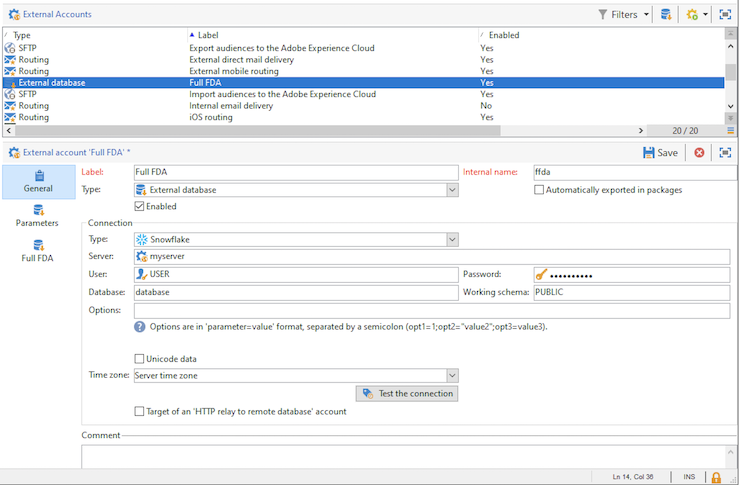

# Externe Konti konfigurieren

Adobe Campaign enthält eine Reihe vordefinierter externer Konten. Um Verbindungen zu externen Systemen einzurichten, können Sie neue Externe Konti erstellen.

Externe Konten werden von technischen Prozessen, wie technischen Workflows oder Kampagnen-Workflows, verwendet. Wenn Sie beispielsweise eine Dateiübertragung in einem Workflow oder einen Datenaustausch mit einer anderen Anwendung (Adobe Target, Experience Manager usw.) einrichten, müssen Sie ein Externe Konto auswählen.

:arrow_upper_right: Informationen zum Erstellen und Konfigurieren von Externen Konti in der [Campaign Classic-Dokumentation](https://experienceleague.adobe.com/docs/campaign-classic/using/installing-campaign-classic/accessing-external-database/external-accounts.html)

Ein bestimmtes Externe Konto verwaltet die Verbindung zwischen der lokalen Kampagne und der Cloud-Datenbank ([!DNL Snowflake]).

:language_ballon: Als Benutzer mit verwaltetem Cloud Services wird [!DNL Snowflake]-Externe Konto nach Adobe für Ihre Instanz konfiguriert.

Sie können auf dieses Externe Konto zugreifen, um die Einstellungen zu überprüfen und Replizierungs-Workflows auszuführen. Gehen Sie dazu wie folgt vor:

1. Klicken Sie in Kampagne **[!UICONTROL Explorer]** auf **[!UICONTROL Administration > Platform > Externen Kontos]**.

1. Wählen Sie das Externe Konto **[!UICONTROL Vollständige FDA]**.

Globale Einstellungen werden auf der Registerkarte **[!UICONTROL Allgemein]** angezeigt.

Verwenden Sie die Registerkarte **[!UICONTROL Parameter]** und dann die Schaltfläche **[!UICONTROL Funktionen bereitstellen]**, um Funktionen zu erstellen.

**hinzufügen PARAMETER DESC HIER**

Verwenden Sie die Registerkarte **[!UICONTROL Vollständige FDA]**, um die Ausführung des Replikationsarbeitsablaufs zu erzwingen.

**hinzufügen DETAILS HIER**

