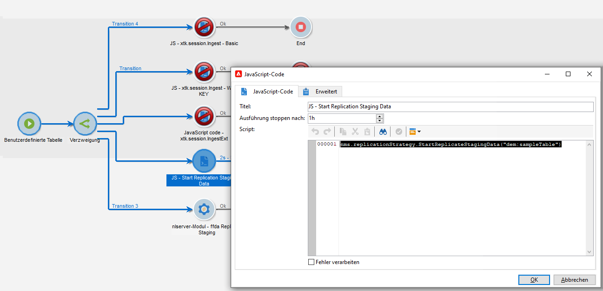
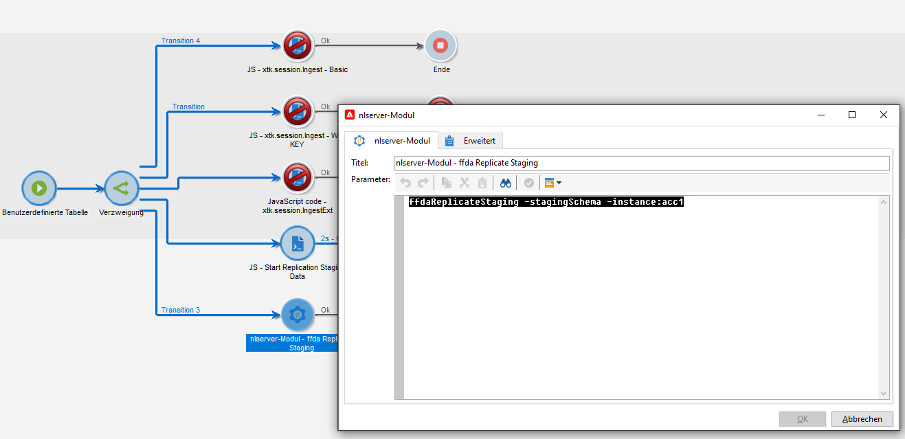

# Technische Workflows und Datenreplikation

## Technische Workflows{#tech-wf}

Adobe Campaign verfügt über eine Reihe integrierter technischer Workflows. Technische Workflows führen Prozesse oder Aufträge aus, die regelmäßig auf dem Server geplant werden.

Diese Workflows führen Wartungsarbeiten an der Datenbank durch, nutzen die Tracking-Informationen in den Versandlogs, erstellen wiederkehrende Kampagnen und vieles mehr.

[!DNL :arrow_upper_right:] Die vollständige Liste der technischen Workflows finden Sie in der Dokumentation zu  [Campaign Classic v7 .](https://experienceleague.adobe.com/docs/campaign-classic/using/automating-with-workflows/advanced-management/about-technical-workflows.html?lang=de)


Zusätzlich zu diesen technischen Workflows setzt Campaign v8 bei der Verwaltung von [Datenreplikation](#data-replication) auf spezifische technische Workflows.

* **[!UICONTROL Replizieren]**
von Referenztabellen Dieser Workflow führt die automatische Replikation integrierter Tabellen durch, die in der lokalen Campaign-Datenbank (Postgres) und der Cloud-Datenbank ([!DNL Snowflake]) vorhanden sein müssen. Die Ausführung ist für jede Stunde und jeden Tag geplant. Wenn das Feld **lastModified** vorhanden ist, erfolgt die Replikation schrittweise, andernfalls wird die gesamte Tabelle repliziert. Die Reihenfolge der Tabellen im Array unten entspricht der Reihenfolge, die vom Replikations-Workflow verwendet wird.
* **[!UICONTROL Replizieren von Staging-]**
DatenDieser Workflow repliziert Staging-Daten für Einzelaufrufe. Die Ausführung ist für jede Stunde und jeden Tag geplant.
* **[!UICONTROL FFDA sofort freigeben]**\
   Dieser Workflow führt eine sofortige Bereitstellung in der Cloud-Datenbank durch.
* **[!UICONTROL FFDA-Daten]**
sofort replizieren Dieser Workflow repliziert die XS-Daten für ein bestimmtes externes Konto.

Diese technischen Workflows sind im Knoten **[!UICONTROL Administration > Betreibung > Technische Workflows > Vollständige FFDA-Replikation]** des Campaign Explorers verfügbar. **Sie dürfen nicht geändert werden.**

Bei Bedarf können Sie die Datensynchronisation manuell starten. Klicken Sie dazu mit der rechten Maustaste auf die Aktivität **Planung** und wählen Sie **Aufgabe(n) jetzt ausführen**.

## Datenreplikation{#data-replication}

Einige integrierte Tabellen werden von der lokalen Campaign-Datenbank über die oben beschriebenen Workflows in die Cloud-Datenbank [!DNL Snowflake] repliziert.

Replikationsrichtlinien basieren auf der Größe der Tabellen. Einige Tabellen werden in Echtzeit repliziert, andere werden stündlich repliziert. Einige Tabellen werden inkrementell aktualisiert, wenn andere ersetzt werden.

Zusätzlich zum integrierten technischen Workflow **Replizieren Sie Referenztabellen** können Sie die Datenreplikation in Ihren Workflows erzwingen.

Sie haben folgende Möglichkeiten:

* Fügen Sie eine bestimmte **JavaScript-Code** -Aktivität mit dem folgenden Code hinzu:

```
nms.replicationStrategy.StartReplicateStagingData("dem:sampleTable")
```




* Fügen Sie eine bestimmte **nlmodule** -Aktivität mit dem folgenden Befehl hinzu:

```
nlserver ffdaReplicateStaging -stagingSchema -instance:acc1
```



**Verwandte Themen**

[!DNL :arrow_upper_right:] Informationen zu den ersten Schritten mit Workflows in der Dokumentation zu  [Campaign Classic v7](https://experienceleague.adobe.com/docs/campaign-classic/using/automating-with-workflows/introduction/about-workflows.html?lang=en#automating-with-workflows)

[!DNL :bulb:] Auf Datenaufbewahrungszeiträume in  [diesem Abschnitt zugreifen](../dev/datamodel-best-practices.md#data-retention)
