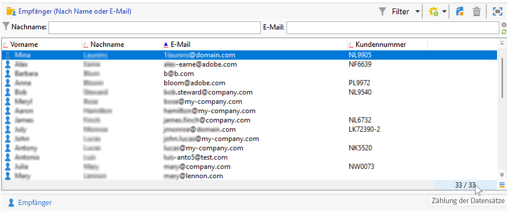
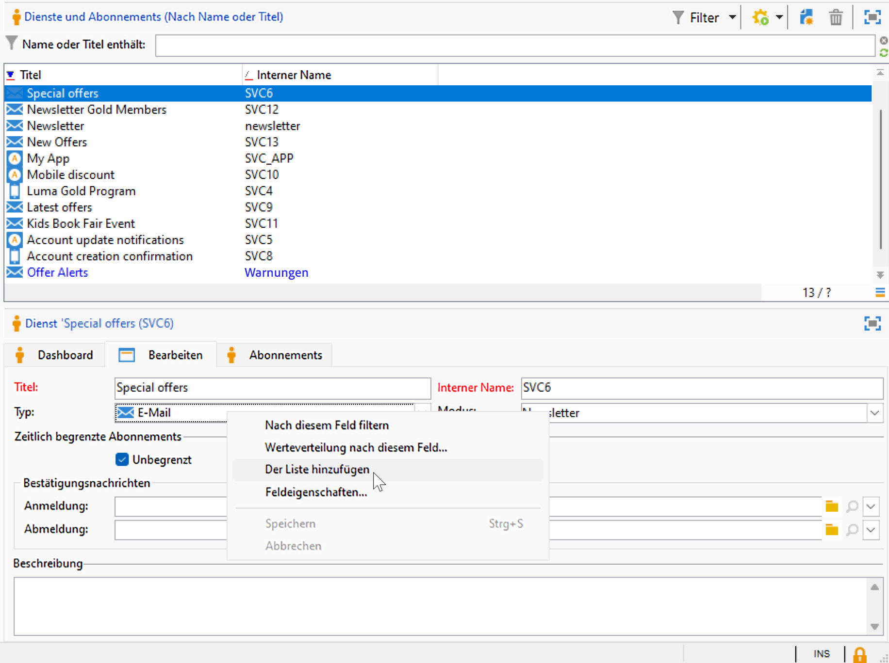
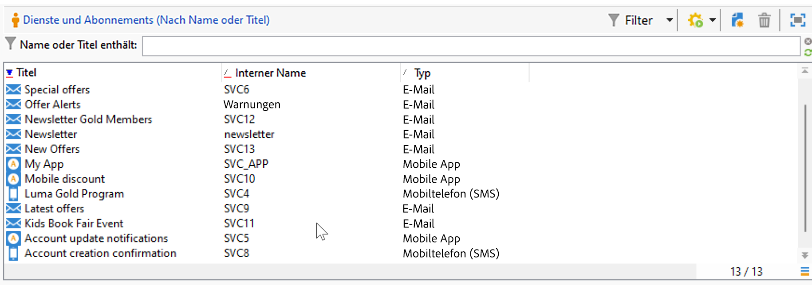
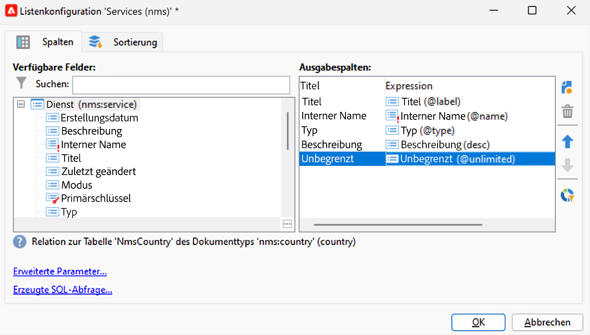
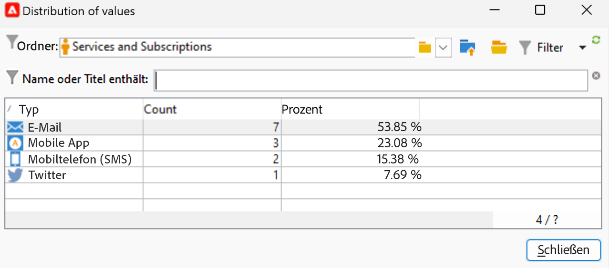
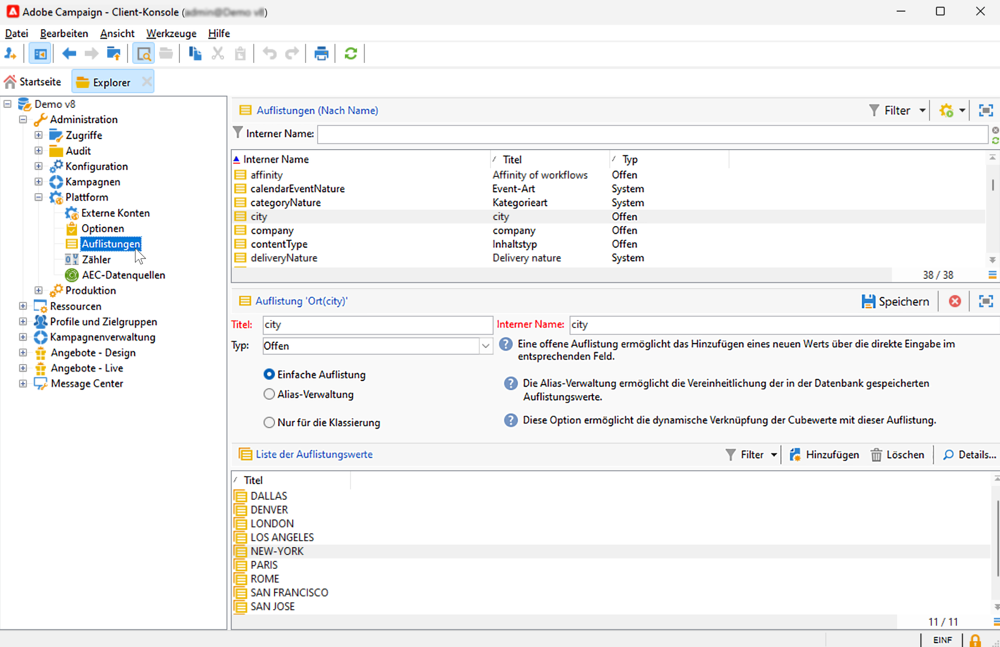
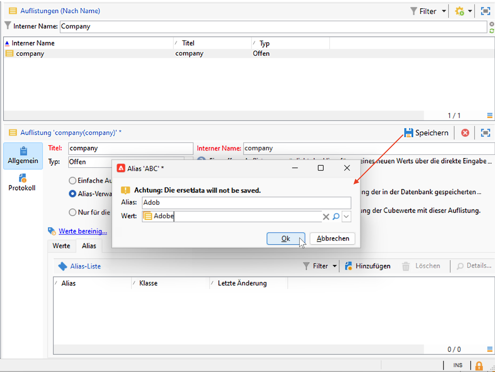
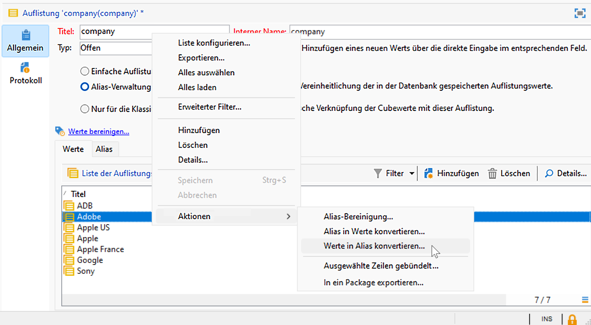
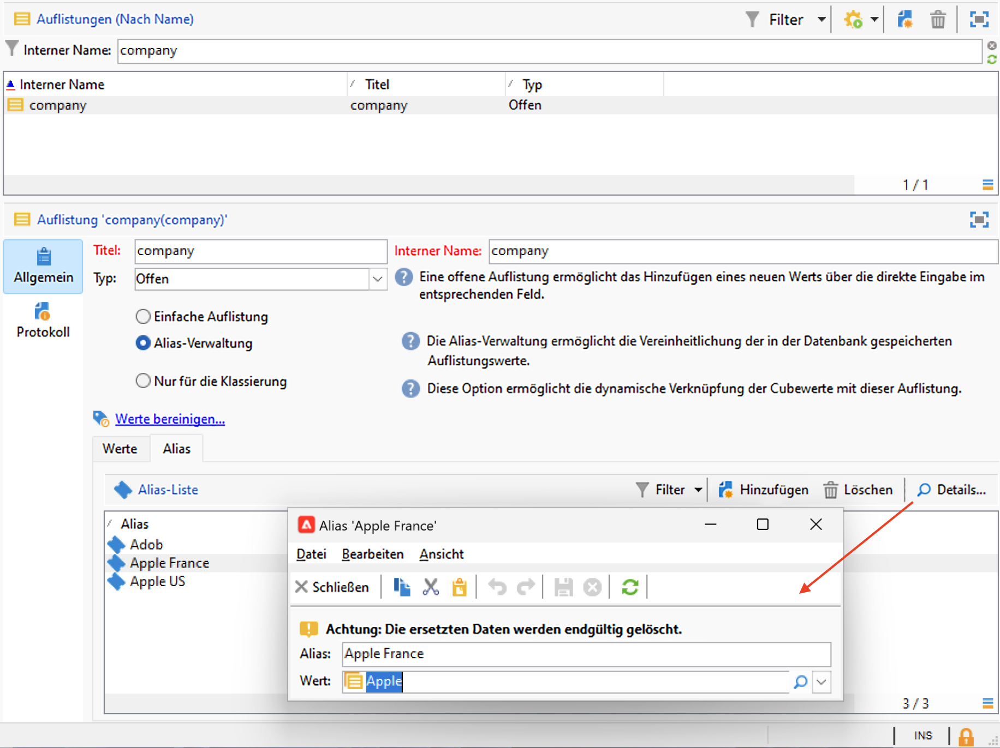

# Einstellungen der Campaign-Benutzeroberfläche {#ui-settings}

## Standardeinheiten {#default-units}

In Adobe Campaign können Werte für Felder, die eine Dauer angeben (z. B. Gültigkeitsdauer der Ressourcen, Validierungs-Deadline einer Aufgabe usw.), in den folgenden **Einheiten** ausgedrückt werden:

* **[!UICONTROL s]** für Sekunden
* **[!UICONTROL min]** für Minuten
* **[!UICONTROL h]** für Stunden
* **[!UICONTROL T]** für Tage

## Anpassen von Campaign Explorer{#customize-explorer}

Sie können Ordner zu Campaign Explorer hinzufügen, Ansichten erstellen und Berechtigungen zuweisen.

Auf [dieser Seite](../audiences/folders-and-views.md) erfahren Sie, wie Sie Ordner und Ansichten verwalten.

## Verwalten und Anpassen von Listen{#customize-lists}

In der Campaign-Client-Console werden die Daten in Listen angezeigt. Sie können diese Listen Ihren Bedürfnissen entsprechend anpassen. Sie können beispielsweise Spalten hinzufügen, Daten filtern, Datensätze zählen und Ihre Einstellungen speichern und freigeben.

Darüber hinaus können Sie Filter erstellen und speichern.  Weitere Informationen über Filter finden Sie auf [dieser Seite](../audiences/create-filters.md).

### Anzahl der Datensätze {#number-of-records}

Standardmäßig lädt Adobe Campaign die 200 ersten Datensätze einer Liste in den Arbeitsspeicher. Dies bedeutet, dass eventuell nicht alle Datensätze einer Tabelle angezeigt werden. Sie haben die Möglichkeit, die Anzahl an Datensätzen einer Liste zu zählen und zusätzliche Datensätze in den Arbeitsspeicher zu laden.

Im rechten unteren Bereich der Listenanzeige zeigt ein **Zähler** die Anzahl an geladenen Datensätzen sowie die Gesamt-Datensatzanzahl an (unter Berücksichtigung aller angewendeten Filter):

Wenn rechts anstelle der Gesamtzahl ein Fragezeichen angezeigt wird, wie etwa `240/?`, klicken Sie auf den Zähler, um die Berechnung zu starten.

Um zusätzliche Datensätze zu laden und anzuzeigen, klicken Sie auf **[!UICONTROL Weiter laden]**. Standardmäßig werden 200 Datensätze geladen. Um die standardmäßige Anzahl der Datensätze zu ändern, die geladen werden sollen, verwenden Sie das Symbol **[!UICONTROL Liste konfigurieren]** in der rechten unteren Ecke der Liste. Im Listenkonfigurationsfenster können Sie dann durch Klicken auf **[!UICONTROL Erweiterte Parameter]** (unten links) die Anzahl der abzurufenden Zeilen ändern.

Klicken Sie zum Laden aller Datensätze mit der rechten Maustaste auf die Liste und wählen Sie **[!UICONTROL Alles laden]**.

>[!CAUTION]
>
>Wenn eine Liste eine große Menge an Datensätzen enthält, kann das vollständige Laden einige Zeit in Anspruch nehmen.
>

### Hinzufügen und Entfernen von Spalten {#add-columns}

Für jede Liste kann die native Spaltenkonfiguration angepasst werden, um weitere Informationen anzuzeigen oder nicht verwendete Spalten auszublenden.

Wenn Daten in der Detailansicht eines Datensatzes sichtbar sind, klicken Sie mit der rechten Maustaste auf das Feld und wählen Sie **[!UICONTROL Der Liste hinzufügen]** aus.

Die Spalte wird rechts von den bereits angezeigten Spalten hinzugefügt.

Sie können auch den Listenkonfigurationsbildschirm verwenden, um Spalten hinzuzufügen und zu entfernen:

1. Klicken Sie in einer Datensatzliste auf das Symbol **[!UICONTROL Liste konfigurieren]** unten rechts.
1. Doppelklicken Sie auf die Felder, die der Liste **[!UICONTROL Verfügbare Felder]** hinzugefügt werden sollen, und sie werden zur Liste **[!UICONTROL Ausgabespalten]** hinzugefügt.

   

   >[!NOTE]
   >
   >Erweiterte Felder werden standardmäßig nicht angezeigt. Um sie anzuzeigen, klicken Sie auf das Symbol **Erweiterte Felder anzeigen** unten rechts in der Liste der verfügbaren Felder.
   >
   >Die Art der Felder (SQL-Felder, verknüpfte Tabellen, berechnete Felder usw.) wird durch verschiedene Symbole verdeutlicht. Für das jeweils ausgewählte Feld wird unter der Liste der verfügbaren Felder die entsprechende Beschreibung angezeigt.
   >

1. Mit den Pfeilen nach oben/unten können Sie die **Anzeigereihenfolge** ändern.

1. Wählen Sie **[!UICONTROL OK]** aus, um die Konfigurationen zu bestätigen und das Ergebnis anzuzeigen.

Wenn Sie eine Spalte entfernen möchten, wählen Sie sie aus und klicken Sie auf das **Papierkorb**-Symbol.

Sie können das Symbol **[!UICONTROL Werteverteilung]** verwenden, um die Aufteilung der Werte für das ausgewählte Feld im aktuellen Ordner anzeigen.

### Erstellen einer neuen Spalte {#create-a-new-column}

Sie können neue Spalten erstellen, um zusätzliche Felder in der Liste anzuzeigen.

Gehen Sie wie folgt vor, um eine Spalte zu erstellen:

1. Klicken Sie in einer Datensatzliste auf das Symbol **[!UICONTROL Liste konfigurieren]** unten rechts.
1. Klicken Sie auf das Symbol **[!UICONTROL Hinzufügen]**, um ein neues Feld in der Liste anzuzeigen.
1. Konfigurieren Sie Feld, das in der Spalte hinzugefügt werden soll.

### Anzeigen von Daten in Unterordnern {#display-sub-folders-records}

Bei Listen stehen zwei verschiedene Anzeigemodi zur Verfügung:

* Alle im ausgewählten Ordner enthaltenen Datensätze (Standard)
* Alle im ausgewählten Ordner und dessen Unterordnern enthaltenen Datensätze

Um zwischen den beiden Anzeigemodi zu wechseln, klicken Sie in der Campaign-Symbolleiste auf **[!UICONTROL Unterordner anzeigen]**.

### Speichern einer Listenkonfiguration {#saving-a-list-configuration}

Die Listenkonfigurationen werden für jede Benutzerin und jeden Benutzer lokal definiert. Wenn der lokale Cache gelöscht wird, werden lokale Konfigurationen deaktiviert.

Standardmäßig gelten die Einstellungsparameter für alle Listen mit dem entsprechenden Ordnertyp. Wenn Sie die Weise ändern, wie die Empfängerliste in einem Ordner angezeigt wird, wird diese Konfiguration auf alle anderen Empfängerordner angewendet.

Sie können mehr als eine Konfiguration speichern, um sie auf verschiedene Ordner desselben Typs anzuwenden. Die Konfiguration wird mit den Eigenschaften des Ordners gespeichert, der die Daten enthält, und kann erneut angewendet werden.

Gehen Sie folgendermaßen vor, um eine Listenkonfiguration zu speichern, damit sie wiederverwendet werden kann:

1. Klicken Sie im Explorer mit der rechten Maustaste auf den Ordner, der die angezeigten Daten enthält.
1. Wählen Sie **[!UICONTROL Eigenschaften]** aus.
1. Wählen Sie **[!UICONTROL Erweiterte Parameter]** aus und geben Sie im Feld **[!UICONTROL Konfiguration]** einen Namen ein.
1. Wählen Sie **[!UICONTROL OK]** und danach **[!UICONTROL Speichern]** aus.

Sie können diese Konfiguration dann auf jeden anderen Ordner desselben Typs anwenden. Weitere Informationen über Ordner finden Sie auf [dieser Seite](../audiences/folders-and-views.md).

### Exportieren einer Liste {#exporting-a-list}

Um Daten aus einer Liste zu exportieren, müssen Sie einen Export-Assistenten verwenden. Um darauf zuzugreifen, wählen Sie die aus der Liste zu exportierenden Elemente aus, klicken Sie mit der rechten Maustaste darauf und wählen Sie **[!UICONTROL Export...]**.

<!--The use of the import and export functions is explained in [Generic imports and exports](../../platform/using/about-generic-imports-exports.md).-->

>[!CAUTION]
>
>Listenelemente dürfen nicht mithilfe der Kopieren/Einfügen-Funktion exportiert werden.

### Sortieren einer Liste {#sorting-a-list}

Listen enthalten oft große Datenmengen, die sortiert und mit einfachen oder erweiterten Filtern eingeschränkt werden können. Während die Sortierung eine Anzeige aller Datensätze in steigender oder fallender Reihenfolge nach sich zieht, wird durch Anwendung von Filtern unter Kombination verschiedener Kriterien die Auswahl der anzuzeigenden Datensätze eingeschränkt.

Durch die Auswahl eines Spaltentitels werden die Daten aufsteigend oder absteigend sortiert oder die Sortierung aufgehoben. Ein blauer Pfeil vor dem Spaltentitel zeigt an, dass nach dieser Spalte sortiert wurde und ob es sich um eine auf- oder absteigende Sortierung handelt. Ein roter Unterstrich bedeutet, dass die Sortierung sich auf in der Datenbank indizierte Daten bezieht. Dieser Sortiermodus trägt zur Optimierung der Sortiervorgänge bei.

Sie können die Sortierung konfigurieren oder Sortierkriterien kombinieren. Gehen Sie dazu folgendermaßen vor:

1. Wählen Sie rechts unten von der Liste **[!UICONTROL Liste konfigurieren]** aus.
1. Wählen Sie im Listenkonfigurationsfenster den Tab **[!UICONTROL Sortierung]** aus.
1. Wählen Sie die zu sortierenden Felder und die Sortierrichtung aus (auf- oder absteigend).
1. Die Priorität der Sortierkriterien hängt von der Reihenfolge der Sortierungsspalten ab. Diese Reihenfolge kann mithilfe der Pfeile rechts in der Symbolleiste angepasst werden.

   Die Anzeige der Spalten in der Liste ist unabhängig von der Priorität der Sortierkriterien.

1. Wählen Sie **[!UICONTROL OK]** aus, um die Einstellungen zu bestätigen und das Ergebnis anzuzeigen.

## Arbeiten mit Auflistungen {#enumerations}

Eine Auflistung (auch als „Einzelaufstellung“ bezeichnet) ist eine Liste von Werten, die vom System zum Ausfüllen von Feldern vorgeschlagen werden. Verwenden Sie Auflistungen, um die Werte dieser Felder zu standardisieren, die Dateneingabe zu unterstützen oder sie in Abfragen zu verwenden.

Die Werteliste erscheint als Dropdown-Liste, aus der Sie den im Feld einzufügenden Wert auswählen können. Die Dropdown-Liste ermöglicht auch eine prädiktive Eingabe: Beim Eingeben der ersten Buchstaben füllt die Anwendung den Rest aus.

Die Bestimmung der Werte für Auflistungsfelder und ihre Verwaltung (Hinzufügen/Löschen eines Werts) erfolgen über den Verzeichnisknoten **[!UICONTROL Administration > Plattform > Auflistungen]**.

### Auflistungstypen {#types-of-enum}

Auflistungen werden im Ordner **[!UICONTROL Administration > Plattform > Auflistungen]** des Explorers gespeichert.

Sie können von einem der folgenden Typen sein: Offen, System, Emoticon oder Geschlossen.

* Eine Auflistung des Typs **Offen** ermöglicht es Benutzerinnen und Benutzern, neue Werte direkt in die auf dieser Auflistung basierenden Felder einzufügen.
* Ein Auflistung des Typs **Geschlossen** verfügt über eine feste Liste von Werten, die nur über den Ordner **[!UICONTROL Administration > Plattform > Auflistungen]** des Explorers geändert werden kann.
* Eine Auflistung des Typs **Emoticon** wird verwendet, um die Emoticon-Liste zu aktualisieren. Weitere Informationen
* Eine Auflistung des Typs **System** ist mit Systemfeldern verknüpft und enthält einen internen Namen.

Für Auflistungen des Typs **Offen** und **Geschlossen** sind spezifische Optionen verfügbar:

* **Einfache Auflistung** ist der Standardtyp.
* **Alias-Verwaltung** für die Auflistung wird verwendet, um die in der Datenbank gespeicherten Auflistungswerte zu harmonisieren. [Weitere Informationen](#alias-cleansing)
* **Reserviert für Klassierung** ist eine Option, durch die Sie Cube-Werte mit dieser Auflistung verknüpfen können. [Weitere Informationen](../reporting/gs-cubes.md)

### Alias-Bereinigung {#alias-cleansing}

In den Auflistungsfeldern können Sie einen Wert auswählen oder einen benutzerdefinierten Wert eingeben, der in der Dropdown-Liste nicht verfügbar ist. Benutzerdefinierte Werte können zu den vorhandenen Auflistungswerten als neue Werte hinzugefügt werden – in diesem Fall muss die Option **[!UICONTROL Offen]** ausgewählt sein. Diese benutzerdefinierten Werte können mithilfe der Funktionen der Alias-Verwaltung bereinigt werden. Wenn beispielsweise eine Benutzerin oder ein Benutzer `Adob` anstelle von `Adobe` eingibt, kann der Vorgang der Alias-Verwaltung dies automatisch durch den richtigen Begriff ersetzen.

>[!CAUTION]
>
>Die Datenbereinigung ist ein kritischer Prozess, der sich auf die Daten in der Datenbank auswirkt. Adobe Campaign aktualisiert Daten gebündelt, was zur Löschung von gewissen Werten führen kann. Dieser Vorgang ist daher erfahrenen Benutzerinnen und Benutzern vorbehalten.

Aktivieren Sie die Option **[!UICONTROL Alias-Verwaltung]**, um Datenbereinigungsfunktionen für eine Auflistung zu verwenden. Wenn diese Option ausgewählt ist, wird unten im Fenster die Registerkarte **[!UICONTROL Alias]** angezeigt.

Wenn ein Wert eingegeben wird, der nicht in der Auflistung einer Alias-Verwaltung vorhanden ist, wird er zur **Werte**-Liste hinzugefügt. Sie können [Aliase aus diesen Werten erstellen](#convert-to-alias) oder [neue Aliase von Grund auf erstellen](#create-alias).

#### Erstellen eines Alias{#create-alias}

Gehen Sie wie folgt vor, um einen Alias zu erstellen:

1. Wählen Sie auf der Registerkarte **[!UICONTROL Alias]** die Schaltfläche **[!UICONTROL Hinzufügen]**.
1. Geben Sie den Alias an, der konvertiert werden soll, und wählen Sie in der Dropdown-Liste den anzuwendenden Wert aus.

   

1. Klicken Sie auf **[!UICONTROL OK]** und bestätigen Sie.

1. Speichern Sie Ihre Änderungen. Die Ersetzung von Werten erfolgt durch den Workflow der **Alias-Verwaltung**, der jede Nacht ausgeführt wird. Weitere Informationen finden Sie unter [Datenbereinigung durchführen](#running-data-cleansing).

Bei allen auf dieser Auflistung basierenden Feldern, wenn ein Benutzer den Wert eingibt **Adobe** in einem Feld &quot;Firma&quot;(in der Adobe Campaign-Clientkonsole in einem Webformular) automatisch durch den Wert ersetzt **Adobe**.

#### Konvertieren eines falschen Werts in einen Alias{#convert-to-alias}

Sie können auch einen vorhandenen Auflistungswert in einen Alias konvertieren. Um dies durchzuführen:

1. Klicken Sie mit der rechten Maustaste in der Werteliste einer Auflistung und navigieren Sie zu **[!UICONTROL Aktionen… > Werte in Alias konvertieren…]**.

   

1. Wählen Sie die Werte aus, die in Aliasse konvertiert werden sollen, und klicken Sie auf **[!UICONTROL Weiter]**.
1. Klicken Sie auf **[!UICONTROL Starten]**, um die Konvertierung zu starten.

   Nach Abschluss der Ausführung werden die Aliasse auf der Registerkarte **Alias** der Liste hinzugefügt. Sie können einen korrekten Wert verknüpfen, um falsche Einträge zu ersetzen. Um dies durchzuführen:

1. Wählen Sie einen zu bereinigenden Wert aus.
1. Klicken Sie auf die Schaltfläche **Detail…**.
1. Wählen Sie den neuen Wert in der Dropdown-Liste aus.

   

>[!NOTE]
>
>Sie können die Anzahl von Eingaben eines Alias in der **[!UICONTROL Treffer]**-Spalte auf der Unterregisterkarte **[!UICONTROL Alias]** nachverfolgen. Sie zeigt an, wie oft dieser Wert eingegeben wurde.  [Weitere Informationen](#calculate-entry-occurrences).

#### Durchführen einer Datenbereinigung {#running-data-cleansing}

Die Datenbereinigung wird vom technischen Workflow der **[!UICONTROL Alias-Verwaltung]** durchgeführt. Er wird standardmäßig täglich ausgeführt.

Die Datenbereinigung kann über den Link **[!UICONTROL Werte bereinigen…]** ausgelöst werden.

Der Link **[!UICONTROL Erweiterte Parameter...]** ermöglicht die Festlegung des Datums, ab dem die gesammelten Werte berücksichtigt werden.

Klicken Sie auf die Schaltfläche **[!UICONTROL Starten]**, um die Datenbereinigung zu beginnen.

##### Überwachen der Eingabeanzahl {#calculate-entry-occurrences}

Die **[!UICONTROL Alias]** Unter-Tab einer Auflistung kann die Anzahl der Erscheinungen eines Alias unter allen eingegebenen Werten anzeigen. Diese Informationen sind eine Schätzung und werden im **[!UICONTROL Treffer]** Spalte.

>[!CAUTION]
>
>Die Berechnung der Alias-Eingabeanzahl kann lange dauern.
>

Sie können die Trefferberechnung manuell über den Link **[!UICONTROL Werte bereinigen…]** ausführen. Klicken Sie dazu auf die Schaltfläche **[!UICONTROL Erweiterte Parameter…]** und wählen Sie die gewünschten Optionen aus.

* **[!UICONTROL Anzahl der Alias-Erscheinungen aktualisieren]**: Ermöglicht es, die bereits berechneten Treffer ab dem angegebenen Berücksichtigungsdatum zu aktualisieren.
* **[!UICONTROL Anzahl der Alias-Erscheinungen von Beginn an neu berechnen]**: Ermöglicht die Durchführung der Berechnung auf der gesamten Adobe-Campaign-Plattform.

Sie können auch einen dedizierten Workflow erstellen, um die Berechnung automatisch in bestimmten Abständen durchzuführen, beispielsweise jede Woche.

Erstellen Sie hierfür eine Kopie des Workflows **[!UICONTROL Alias-Verwaltung]**, passen Sie die Planung an und konfigurieren Sie in der Aktivität **[!UICONTROL Bereinigung der Auflistungswerte]** folgende Parameter:

* **-updateHits**, um die Anzahl der Alias-Erscheinungen zu aktualisieren;
* **-updateHits:full**, um die Anzahl aller Alias-Erscheinungen neu zu berechnen.
