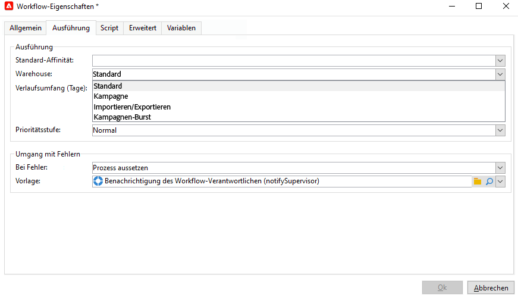
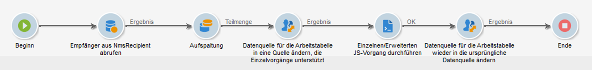

# Prozesse verwalten und automatisieren

Konfigurieren Sie Campaign, um leistungsstarke Automatisierungsfunktionen für Marketing-Kampagnen zu nutzen.

Sie können Folgendes einrichten:

* Workflows
* Wiederkehrende Kampagnen
* End-to-End-Validierungszyklus
* Warnhinweise
* Automatisches Senden von Berichten
* Erzeugte Ereignisse

## Entwerfen und Verwenden von Workflows{#gs-ac-wf}

Verwenden Sie Adobe Campaign-Workflows, um jeden Aspekt Ihrer Marketing-Kampagnen zu beschleunigen und zu skalieren – von der Erstellung von Segmenten über die Vorbereitung von Nachrichten bis hin zum Versand.

Erfahren Sie durch diese [End-to-End-Anwendungsfälle](#end-to-end-uc), wie Sie Workflows erstellen.

Weitere Informationen zur Benutzeroberfläche und Ausführung von Workflows finden Sie auf diesen Seiten: 

* [Erste Schritte mit Workflows](https://experienceleague.adobe.com/docs/campaign/automation/workflows/introduction/about-workflows.html?lang=de)

* [Best Practices bei Workflows](https://experienceleague.adobe.com/docs/campaign/automation/workflows/introduction/workflow-best-practices.html?lang=de)

* [Integrierte technische Workflows](https://experienceleague.adobe.com/docs/campaign/automation/workflows/introduction/wf-type/technical-workflows.html?lang=de)

* [Überwachen der Ausführung von Workflows](https://experienceleague.adobe.com/docs/campaign/automation/workflows/monitoring-workflows/monitor-workflow-execution.html?lang=de)

* [Erstellen einer Audience im Workflow einer Marketing-Kampagne](https://experienceleague.adobe.com/docs/campaign/automation/campaign-orchestration/marketing-campaign-target.html?lang=de)

## Workflow-Aktivitäten {#wf-activities}

Weitere Informationen über die verfügbaren Workflow-Aktivitäten finden Sie in [diesem Abschnitt](https://experienceleague.adobe.com/docs/campaign/automation/workflows/wf-activities/activities.html?lang=de).

Workflow-Aktivitäten sind in Kategorien gruppiert. Diese vier Aktivitätskategorien sind verfügbar:

* [Zielgruppenbestimmungsaktivitäten](https://experienceleague.adobe.com/docs/campaign/automation/workflows/wf-activities/targeting-activities/targeting-activities.html?lang=de): Abfrage, Lesen von Listen, Anreicherung, Vereinigung und mehr
* [Flusssteuerungs-Aktivitäten](https://experienceleague.adobe.com/docs/campaign/automation/workflows/wf-activities/flow-control-activities/flow-control-activities.html?lang=de): Planung, Verzweigung, Warnhinweis, externes Signal und mehr
* [Aktionsaktivitäten](https://experienceleague.adobe.com/docs/campaign/automation/workflows/wf-activities/action-activities/action-activities.html?lang=de): Kanalübergreifende Sendungen, JavaScript-Code, CRM-Aktivitäten, Aggregat aktualisieren und mehr
* [Ereignisaktivitäten](https://experienceleague.adobe.com/docs/campaign/automation/workflows/wf-activities/event-activities/event-activities.html?lang=de): Dateiübertragung, HTTP-Übertragung und mehr

### Aktivität „Datenquelle ändern“ {#change-data-source-activity}

Die Aktivität **[!UICONTROL Datenquelle ändern]** ermöglicht es Ihnen, die Datenquelle des Workflows **[!UICONTROL Arbeitstabelle]** zu ändern. Dies bietet mehr Flexibilität bei der Verwaltung von Daten in verschiedenen Datenquellen wie FDA, FFDA und lokalen Datenbanken.

Die **[!UICONTROL Arbeitstabelle]** ermöglicht es dem Adobe Campaign-Workflow, Daten zu verarbeiten und für die Workflow-Aktivitäten freizugeben.
Standardmäßig wird die **[!UICONTROL Arbeitstabelle]** in derselben Datenbank erstellt wie die Quelle der Daten, die abgefragt werden.

Wenn Sie beispielsweise die Tabelle **[!UICONTROL Profile]** in der Cloud-Datenbank abfragen, erstellen Sie eine **[!UICONTROL Arbeitstabelle]** in derselben Cloud-Datenbank.
Um dies zu ändern, können Sie die Aktivität **[!UICONTROL Datenquelle ändern]** hinzufügen, um eine andere Datenquelle für Ihre **[!UICONTROL Arbeitstabelle]** auszuwählen.

Beachten Sie, dass Sie bei Verwendung der Aktivität **[!UICONTROL Datenquelle ändern]** zur Cloud-Datenbank zurückkehren müssen, um die Ausführung des Workflows fortzusetzen.

So verwenden Sie die Aktivität **[!UICONTROL Datenquelle ändern]**:

1. Erstellen Sie einen Workflow.

1. Fragen Sie Ihre ausgewählten Empfänger mit einer **[!UICONTROL Abfrage]**-Aktivität ab.

   Weitere Informationen über die Aktivität **[!UICONTROL Abfrage]** finden Sie auf [dieser Seite](https://experienceleague.adobe.com/docs/campaign/automation/workflows/wf-activities/targeting-activities/query.html?lang=de).

1. Fügen Sie im Tab **[!UICONTROL Targeting]** die Aktivität **[!UICONTROL Datenquelle ändern]** hinzu und doppelklicken Sie darauf, um die Option **[!UICONTROL Standardmäßige Datenquelle]** auszuwählen.

   Die Arbeitstabelle, die das Ergebnis Ihrer Abfrage enthält, wird dann in die standardmäßige PostgreSQL-Datenbank verschoben.

1. Ziehen Sie aus der Registerkarte **[!UICONTROL Aktionen]** die Aktivität **[!UICONTROL JavaScript-Code]** per Drag-and-drop, um einzelne Vorgänge auf die Arbeitstabelle anzuwenden.

   Weitere Informationen über die Aktivität **[!UICONTROL JavaScript-Code]** finden Sie auf [dieser Seite](https://experienceleague.adobe.com/docs/campaign/automation/workflows/wf-activities/action-activities/sql-code-and-javascript-code.html?lang=de).

1. Fügen Sie eine weitere Aktivität vom Typ **[!UICONTROL Datenquelle ändern]** hinzu, um zur Cloud-Datenbank zurückzukehren.

   Doppelklicken Sie auf Ihre Aktivität und wählen Sie **[!UICONTROL Aktives externes FDA-Konto]** und dann das entsprechende externe Konto aus.

1. Sie können den Workflow jetzt starten.

## Verwalten von virtuellen Warehouses {#warehouse}

Nach der Erstellung Ihres Workflows haben Sie mit der Schaltfläche **[!UICONTROL Eigenschaften]** Zugriff auf weitere Konfigurationen.

Weitere Informationen über **Workflow-Eigenschaften** finden Sie auf [dieser Seite](https://experienceleague.adobe.com/docs/campaign/automation/workflows/advanced-management/workflow-properties.html?lang=de).

Auf der Registerkarte **[!UICONTROL Ausführung]** in den **[!UICONTROL Eigenschaften]** Ihres Workflows können Sie Ihren Workflow mit verschiedenen Warehouses verknüpfen und die Verwaltung Ihres Arbeitsaufkommens optimieren. Lesen Sie für weiterführende Informationen über **Warehouses** die [Snowflake-Dokumentation](https://docs.snowflake.com/en/user-guide/warehouses-overview.html).

Je nach Zweck Ihres Workflows können Sie in der Dropdown-Liste **[!UICONTROL Warehouse]** zwischen den folgenden drei Warehouses wählen:

* **[!UICONTROL Standard]**/**[!UICONTROL Kampagne]**: wird bei der Erstellung eines neuen Workflows standardmäßig eingestellt.

* **[!UICONTROL Import/Export]**: sollte mit Import- oder Export-Workflows festgelegt werden, um die Leistung Ihrer Aktivitäten zu optimieren.

* **[!UICONTROL Kampagnen-Burst]**: sollte mit Kampagnen- oder Versand-Workflows eingestellt werden, um die Verarbeitungszeit für Sendungen zu optimieren.

>[!NOTE]
>
>Das **[!UICONTROL System]**-Warehouse wird nur für integrierte Workflows festgelegt.

## Einrichten wiederkehrender Kampagnen

Entwerfen Sie einen wiederkehrenden Workflow und erstellen Sie bei jeder Workflow-Ausführung eine neue Versandinstanz. Wenn der Workflow beispielsweise einmal pro Woche ausgeführt werden soll, führt dies nach einem Jahr zu 52 Sendungen. Das bedeutet auch, dass die Protokolle für jede Versandinstanz getrennt erstellt werden.

Erfahren Sie auf [dieser Seite](https://experienceleague.adobe.com/docs/campaign/automation/campaign-orchestration/recurring-periodic-campaigns.html?lang=de), wie Sie eine wiederkehrende Kampagne erstellen.

## Erzeugte Ereignisse nutzen

Verwenden Sie Transaktionsnachrichten in Campaign, um Nachrichten zu automatisieren, die von durch Informationssysteme ausgelösten Ereignissen generiert werden. Diese Transaktionsnachrichten können z. B. Rechnungen, Auftragsbestätigungen, Versandbestätigungen, Passwortänderungen, Benachrichtigungen über die Nichtverfügbarkeit von Produkten, Kontoauszüge oder die Erstellung von Website-Konten sein. Diese Nachrichten können einzeln oder in Batches per E-Mail, SMS oder Push-Benachrichtigungen gesendet werden.

 Weitere Informationen zu den Funktionen von Transaktionsnachrichten finden Sie in [diesem Abschnitt](../send/transactional.md).

Verbinden Sie Adobe Campaign und Adobe Analytics, um Benutzeraktionen abzurufen und nahezu in Echtzeit personalisierte Nachrichten zu versenden.

 In [diesem Abschnitt](../start/connect.md) erfahren Sie, wie Sie Campaign mit anderen Lösungen integrieren.

## Anwendungsfälle von Workflows{#end-to-end-uc}

In diesem Abschnitt finden Sie verschiedene Anwendungsfälle, die Funktionen von Campaign-Workflows nutzen.

### Sendungen {#deliveries}

* [Senden einer Geburtstags-E-Mail](https://experienceleague.adobe.com/docs/campaign/automation/workflows/use-cases/deliveries/send-a-birthday-email.html?lang=de)

   Im folgenden Anwendungsbeispiel wird aufgezeigt, wie sich der wiederkehrende Versand einer E-Mail an Empfänger zu deren Geburtstag planen lässt.

* [Laden von Versandinhalten](https://experienceleague.adobe.com/docs/campaign/automation/workflows/use-cases/deliveries/load-delivery-content.html?lang=de)
Wenn Ihr Versandinhalt in einer auf einem Remote-Server gespeicherten HTML-Datei verfügbar ist, können Sie diesen Inhalt einfach in Adobe Campaign-Sendungen laden.

* [Workflow für einen kanalübergreifenden Versand](https://experienceleague.adobe.com/docs/campaign/automation/workflows/use-cases/deliveries/cross-channel-delivery-workflow.html?lang=de)

Erfahren Sie, wie Sie einen Workflow für einen kanalübergreifenden Versand erstellen. Ziel ist es, eine Audience von den Empfängern in Ihrer Datenbank in verschiedene Gruppen zu unterteilen und der einen Gruppe eine E-Mail und der anderen eine SMS zu senden.

* [E-Mail-Anreicherung mit benutzerdefinierten Datumsfeldern](https://experienceleague.adobe.com/docs/campaign/automation/workflows/use-cases/deliveries/email-enrichment-with-custom-date-fields.html?lang=de)
Erfahren Sie, wie Sie eine E-Mail mit benutzerdefinierten Datenfeldern an Profile senden, die in diesem Monat Geburtstag feiern. Die E-Mail enthält einen Gutschein, der eine Woche vor bis eine Woche nach dem Geburtstag gültig ist.

Und diese Seiten in der Dokumentation zu Campaign v7:

* [Automatische Erstellung, Bearbeitung und Veröffentlichung von Inhalten](https://experienceleague.adobe.com/docs/campaign-classic/using/sending-messages/content-management/automating-via-workflows.html?lang=de){target=&quot;_blank&quot;}
Erfahren Sie, wie Sie die Erstellung und Bereitstellung eines Inhaltsbausteins mit dem Add-on für Content-Management in Campaign automatisieren.

* [A/B-Tests](https://experienceleague.adobe.com/docs/campaign-classic/using/sending-messages/a-b-testing/use-case/a-b-testing-use-case.html?lang=de){target=&quot;_blank&quot;}
Erfahren Sie, wie Sie mithilfe eines Zielgruppen-Workflows Inhalte von zwei E-Mail-Sendungen vergleichen. Nachricht und Text sind bei beiden Sendungen identisch – nur das Layout ist unterschiedlich. Die Zielpopulation wird in drei Gruppen aufgeteilt: zwei Testgruppen und die restliche Population. An jede Testgruppe wird eine andere Version des Versands gesendet.

### Monitoring {#monitoring}

* [Senden eines Berichts an eine Liste](https://experienceleague.adobe.com/docs/campaign/automation/workflows/use-cases/monitoring/send-a-report-to-a-list.html?lang=de)
Hier erfahren Sie, wie Sie einen monatlichen integrierten Bericht zu Tracking-Indikatoren im PDF-Format generieren und an eine Liste von Campaign-Benutzern senden.

* [Überwachen Ihrer Workflows](https://experienceleague.adobe.com/docs/campaign/automation/workflows/use-cases/monitoring/workflow-supervision.html?lang=de)
Erfahren Sie, wie Sie einen Workflow erstellen, mit dem Sie den Status einer Reihe von Workflows überwachen können, die &quot;ausgesetzt&quot;, &quot;angehalten&quot; oder &quot;fehlerhaft&quot; sind.

* [Senden von personalisierten Warnhinweisen an Benutzer](https://experienceleague.adobe.com/docs/campaign/automation/workflows/use-cases/monitoring/send-alerts-to-operators.html?lang=de)
Erfahren Sie, wie Sie Benutzern einen Warnhinweis senden, der den Namen der Profile enthält, welche einen Newsletter zwar geöffnet, aber nicht auf den darin enthaltenen Link geklickt haben.

### Daten-Management {#management}

* [Koordinieren von Datenaktualisierungen](https://experienceleague.adobe.com/docs/campaign/automation/workflows/use-cases/data-management/coordinate-data-updates.html?lang=de)

Erfahren Sie, wie Sie überprüfen können, ob der Aktualisierungsprozess beendet wurde, bevor Sie einen weiteren Aktualisierungsvorgang ausführen. Zu diesem Zweck richten wir eine Instanzvariable ein und lassen den Workflow testen, ob die Instanz ausgeführt wird, um dann zu entscheiden, ob die Ausführung des Workflows fortgesetzt und die Aktualisierung durchgeführt werden soll.

* [Erstellen einer zusammenfassenden Liste](https://experienceleague.adobe.com/docs/campaign/automation/workflows/use-cases/data-management/create-a-summary-list.html?lang=de)

Erfahren Sie, wie Sie einen Workflow erstellen, mit dem Sie nach dem Erfassen von Dateien und mehreren Anreicherungen eine zusammenfassende Liste erstellen können. Das Beispiel basiert auf einer Liste von Kontakten, die in einem Geschäft Einkäufe getätigt haben.

* [Anreichern von Daten](https://experienceleague.adobe.com/docs/campaign/automation/workflows/use-cases/data-management/enrich-data.html?lang=de)
Erfahren Sie, wie Sie abhängig von der erzielten Punktzahl personalisierte Sendungen an Profile durchführen, die am letzten Wettbewerb teilgenommen haben.

* [Verwenden von Aggregaten](https://experienceleague.adobe.com/docs/campaign/automation/workflows/use-cases/data-management/using-aggregates.html?lang=de)

Erfahren Sie, wie Sie die letzten zur Datenbank hinzugefügten Empfänger identifizieren.

* [Vierteljährliches Listen-Update mithilfe einer inkrementellen Abfrage](https://experienceleague.adobe.com/docs/campaign/automation/workflows/use-cases/designing-queries/quarterly-list-update.html?lang=de)

Erfahren Sie, wie Sie mit einer inkrementellen Abfrage automatisch eine Empfängerliste aktualisieren können.

* [Einrichten eines wiederkehrenden Import-Workflows](https://experienceleague.adobe.com/docs/campaign/automation/workflows/use-cases/data-management/recurring-import-workflow.html?lang=de)

Erfahren Sie, wie ein Workflow für den wiederholten Import von Profilen aus einer CRM-Lösung in die Adobe Campaign-Datenbank erstellt wird.

### Zielgruppenbestimmung {#designing-queries}

* [Abfrage der Empfängertabelle](https://experienceleague.adobe.com/docs/campaign/automation/workflows/use-cases/designing-queries/querying-recipient-table.html?lang=de)

Erfahren Sie, wie Sie die Namen und E-Mails der Empfänger abrufen können, deren E-Mail-Domain &quot;orange.co.uk&quot; lautet und die nicht in London leben.

* [Abfrage von Versandinformationen](https://experienceleague.adobe.com/docs/campaign/automation/workflows/use-cases/designing-queries/query-delivery-info.html?lang=de)

Erfahren Sie, wie Sie Abfragen zu Versandinformationen durchführen, um das Verhalten eines Profils abzurufen.

* [Berechnen von Aggregaten](https://experienceleague.adobe.com/docs/campaign/automation/workflows/use-cases/designing-queries/compute-aggregates.html?lang=de)

Erfahren Sie, wie Sie die Anzahl der in London lebenden Profile aufgeschlüsselt nach Geschlecht feststellen.

* [Abfrage mit einer n:n-Relation](https://experienceleague.adobe.com/docs/campaign/automation/workflows/use-cases/designing-queries/query-many-to-many-relationship.html?lang=de)

Erfahren Sie, wie Sie Profile finden, die in den letzten sieben Tagen nicht kontaktiert wurden.

* [Aufrufen einer Instanzvariablen in einer Abfrage](https://experienceleague.adobe.com/docs/campaign/automation/workflows/advanced-management/javascript-scripts-and-templates.html?lang=de)

Erfahren Sie, wie Sie mit einer Instanzvariablen den auf eine Population anzuwendenden Aufspaltungsprozentsatz dynamisch berechnen können.

<!--
### Change data source activity {#data-source-uc}

The **[!UICONTROL Change data source]** activity allows you to change the data source of a workflow **[!UICONTROL Working table]**. 

In this use case, learn how to use the **[!UICONTROL Change data source]** activity to perform unitary operations to insert or update information to the recipient table.

1. Create a workflow and add a **[!UICONTROL Start]** activity.

1. Query your targeted recipients from the NmsRecipient table with a **[!UICONTROL Query]** activity. 

    For more information on the **[!UICONTROL Query]** activity, refer to the [Query](https://experienceleague.adobe.com/docs/campaign-classic/using/automating-with-workflows/targeting-activities/query.html#creating-a-query) page in Campaign Classic V7 documentation.

1. 

1. From the **[!UICONTROL Targeting]** tab, add a **[!UICONTROL Change data source]** activity and double-click it to select **[!UICONTROL Default data source]**.
    
    The working table, which contains the result of your query, is then moved to the default PostgreSQL database.

1. From the **[!UICONTROL Actions]** tab, drag and drop a **[!UICONTROL JavaScript code]** activity to perform unitary operations on the working table.

1. Add another **[!UICONTROL Change data source]** activity to revert back to the Cloud database. 
    
    Double-click your activity and select **[!UICONTROL Active FDA external account]** then the corresponding external account.

1. Add an **[!UICONTROL End]** activity and start your workflow.
-->

