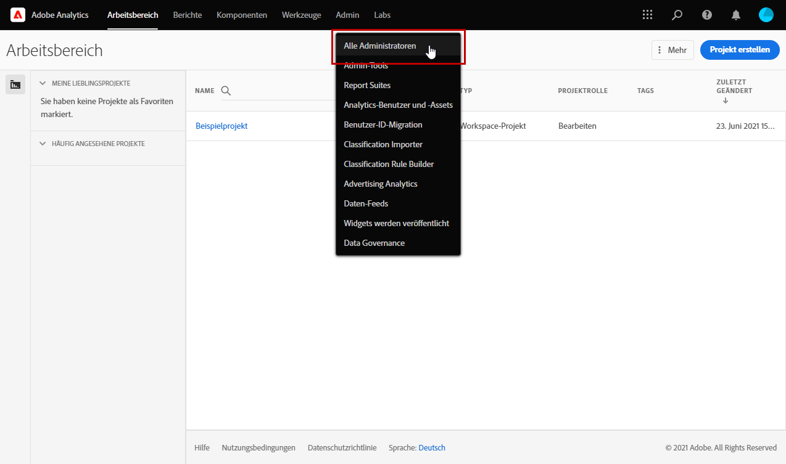
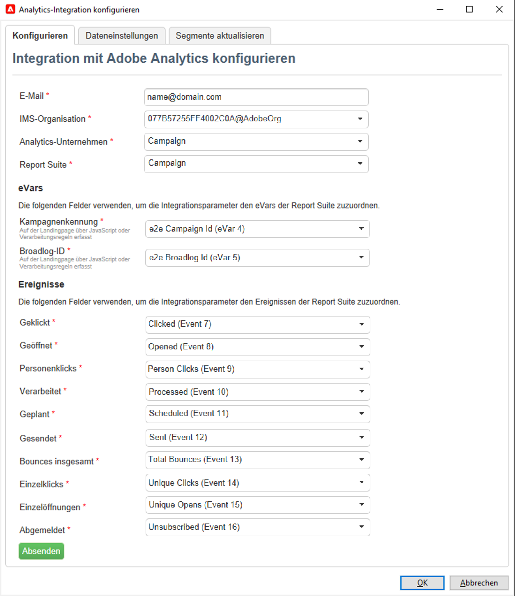

# Mit Campaign und Adobe Analytics arbeiten

Sie können Adobe Analytics zur Integration von Campaign und Analytics konfigurieren.

Durch diese Integration können Adobe Campaign und Adobe Analytics über das Add-on **Web Analytics Connectors** interagieren. Diese Integration sendet Indikatoren und Attribute von E-Mail-Kampagnen, die von Adobe Campaign an Adobe Analytics bereitgestellt werden.

[!DNL :speech_balloon:] Als Managed Cloud Services-Benutzer  [kontaktieren Sie ](../start/campaign-faq.md#support) Adobe, um Campaign mit Adobe Experience Cloud-Diensten und -Lösungen zu verbinden. Adobe Identity Management Service (IMS) muss für Ihre Instanz implementiert sein. [Weitere Infos](../start/connect.md#connect-ims). Das Web Analytics-Connector-Add-on muss über das dedizierte Paket in Ihrer Umgebung installiert werden.

Mit Adobe Analytics Connector kann Adobe Campaign die Internetzielgruppe (Web Analytics) messen. Mit den Webanalysetools kann Adobe Campaign Indikatoren und Kampagnenattribute an Analytics weiterleiten.

Der Aktionsradius der einzelnen Tools lautet wie folgt:

* **Adobe** Analytics markiert die mit Adobe Campaign gestarteten E-Mail-Kampagnen

* **Adobe** Campaign sendet die Kampagnenattribute an den Connector, der sie an das Webanalysetool weiterleitet

>[!CAUTION]
>
>Adobe Analytics Connector ist nicht kompatibel mit Transaktionsnachrichten (Message Center).

Um die Verbindung Campaign-Analytics einzurichten, müssen Sie die folgenden Vorgänge durchführen:

1. [Report Suite in Adobe Analytics erstellen](#report-suite-analytics)
1. [Konversionsvariablen und Erfolgsereignisse konfigurieren](#configure-conversion-success)
1. [Externes Konto in Adobe Campaign konfigurieren](#external-account-ac)

## Erstellen Ihrer Analytics Report Suite {#report-suite-analytics}

Gehen Sie wie folgt vor, um die **[!UICONTROL Report Suite]** in [!DNL Adobe Analytics] zu erstellen:

1. Wählen Sie unter [!DNL Adobe Analytics] die Registerkarte **[!UICONTROL Admin]** und klicken Sie dann auf **[!UICONTROL Alle Administratoren]**.

   

1. Klicken Sie auf **[!UICONTROL Report Suites]**.

   

1. Klicken Sie auf der Seite **[!UICONTROL Report Suite Manager]** auf **[!UICONTROL Neu erstellen]** und dann auf **[!UICONTROL Report Suite]**.

   Eine detaillierte Anleitung zur Erstellung von **[!UICONTROL Report Suites]** finden Sie in diesem Abschnitt [Abschnitt](https://experienceleague.adobe.com/docs/analytics/admin/manage-report-suites/new-report-suite/t-create-a-report-suite.html?lang=en#prerequisites).

   

1. Wählen Sie eine Vorlage aus.

1. Konfigurieren Sie Ihre neue Report Suite mit den folgenden Informationen:

   * **[!UICONTROL Report Suite-ID]**
   * **[!UICONTROL Site-Titel]**
   * **[!UICONTROL Zeitzone]**
   * **[!UICONTROL Aufschaltdatum]**
   * **[!UICONTROL Geschätzte Seitenansichten pro Tag]**

   

1. Klicken Sie nach der Konfiguration auf **[!UICONTROL Report Suite erstellen]**.

## Konfigurieren Sie Ihre Konversionsvariablen und Erfolgsereignisse {#configure-conversion-success}

Nachdem Sie die **[!UICONTROL Report Suite]** erstellt haben, müssen Sie die **[!UICONTROL Konversionsvariablen]** und **[!UICONTROL Erfolgsereignisse]** wie folgt konfigurieren:

1. Wählen Sie Ihre zuvor konfigurierte **[!UICONTROL Report Suite]** aus.

1. Wählen Sie über die Schaltfläche **[!UICONTROL Einstellungen bearbeiten]** **[!UICONTROL Konversion]** > **[!UICONTROL Konversionsvariablen]** aus.

   

1. Klicken Sie auf **[!UICONTROL Neu hinzufügen]** , um die IDs zu erstellen, die zur Messung der Wirkung der E-Mail-Kampagne erforderlich sind, d. h. den internen Kampagnennamen (cid) und die iNmsBroadlog (bid)-Tabellen-ID.

   Weiterführende Informationen zur Bearbeitung von **[!UICONTROL Konversionsvariablen]** finden Sie in diesem [Abschnitt](https://experienceleague.adobe.com/docs/analytics/admin/admin-tools/conversion-variables/t-conversion-variables-admin.html?lang=en#admin-tools).

   

1. Klicken Sie abschließend auf **[!UICONTROL Speichern]** .

1. Um **[!UICONTROL Erfolgsereignisse]** zu erstellen, wählen Sie **[!UICONTROL Konversion]** > **[!UICONTROL Erfolgsereignisse]** aus der Schaltfläche **[!UICONTROL Einstellungen bearbeiten]** aus.

   

1. Klicken Sie auf **[!UICONTROL Fügen Sie new]** hinzu, um die folgenden **[!UICONTROL Erfolgsereignisse]** zu konfigurieren:

   * **[!UICONTROL Haben geklickt]**
   * **[!UICONTROL Haben geöffnet]**
   * **[!UICONTROL Personenklicks]**
   * **[!UICONTROL Verarbeitet]**
   * **[!UICONTROL Geplant]**
   * **[!UICONTROL Gesendet]**
   * **[!UICONTROL Rücksendungen insgesamt]**
   * **[!UICONTROL Einzelklicks]**
   * **[!UICONTROL Einzelöffnungen]**
   * **[!UICONTROL Abgemeldet]**

   Informationen zum Konfigurieren von **[!UICONTROL Erfolgsereignissen]** finden Sie in diesem [Abschnitt](https://experienceleague.adobe.com/docs/analytics/admin/admin-tools/success-events/t-success-events.html?lang=en#admin-tools)

   

1. Klicken Sie abschließend auf **[!UICONTROL Speichern]** .

Wenn Ihre Report Suite konfiguriert ist, müssen Sie die **[!UICONTROL Externen Konten]** in Adobe Campaign konfigurieren.

## Externes Campaign-Konto konfigurieren {#external-account-ac}

Sie müssen jetzt Ihr externes **[!UICONTROL Web Analytics]**-Konto in Adobe Campaign konfigurieren, um die Synchronisierung zwischen den beiden Lösungen zu aktivieren.

Beachten Sie Folgendes: Wenn eine Ihrer **[!UICONTROL Report Suites]**, **[!UICONTROL Konversionsvariablen]** oder **[!UICONTROL Erfolgsereignisse]** beim Konfigurieren Ihres externen Kontos nicht sichtbar ist, fehlt Ihnen eine Berechtigung für diese neu erstellte Komponente im **[!UICONTROL Produktprofil]**, das dem Benutzer zugeordnet ist.

Weitere Informationen hierzu finden Sie auf der Seite [Produktprofile für Adobe Analytics](https://experienceleague.adobe.com/docs/analytics/admin/admin-console/permissions/product-profile.html?lang=en#product-profile-admins) .

1. Gehen Sie zum Ordner **[!UICONTROL Administration]** > **[!UICONTROL Plattform]** > **[!UICONTROL Externe Konten]** des Adobe Campaign-Navigationsbaums und klicken Sie auf **[!UICONTROL Neu]**.

   

1. Verwenden Sie die Dropdownliste, um den Typ **[!UICONTROL Web Analytics]** und **[!UICONTROL Adobe Analytics]** aus der Dropdownliste **[!UICONTROL Integration]** auszuwählen.

   

1. Klicken Sie neben der Dropdown-Liste **[!UICONTROL Integration]** auf **[!UICONTROL Konfigurieren]** .

1. Ordnen Sie im Fenster **[!UICONTROL Analytics-Integration konfigurieren]** Ihr externes Konto Ihrer zuvor erstellten Report Suite zu, indem Sie die folgenden Informationen bereitstellen:

   

   * **[!UICONTROL E-Mail]**
   * **[!UICONTROL IMS Org]**
   * **[!UICONTROL Analytics-Unternehmen]**
   * **[!UICONTROL Report Suite]**

1. Ordnen Sie in der Kategorie **[!UICONTROL eVars]** die beiden **[!UICONTROL Konversionsvariablen]** zu, die in [!DNL Adobe Analytics] konfiguriert sind.

   

1. Ordnen Sie in der Kategorie **[!UICONTROL Ereignisse]** die zehn **[!UICONTROL Erfolgsereignisse]** zu, die in [!DNL Adobe Analytics] konfiguriert sind.

1. Klicken Sie abschließend auf **[!UICONTROL Submit]** . Adobe Campaign erstellt eine **[!UICONTROL Datenquelle]**, **[!UICONTROL Berechnete Metriken]**, **[!UICONTROL Remarketing-Segmente]** und **[!UICONTROL Klassifizierungen]** in der zugeordneten Analytics **[!UICONTROL Report Suite]**.

   Sobald diese Synchronisation zwischen [!DNL Adobe Analytics] und Adobe Campaign abgeschlossen ist, können Sie das Fenster schließen.

1. Die Einstellungen können auf der Registerkarte **[!UICONTROL Dateneinstellungen]** im Fenster **[!UICONTROL Analytics-Integration konfigurieren]** angezeigt werden.

   Mithilfe der Schaltfläche **[!UICONTROL Sync]** synchronisieren [!DNL Adobe Campaign] die Namensänderungen, die in [!DNL Adobe Analytics] vorgenommen wurden. Wenn die Komponente in [!DNL Adobe Analytics] gelöscht wird, wird die Komponente in [!DNL Adobe Campaign] durchgestrichen oder mit der Meldung **Nicht gefunden** angezeigt.

   

1. Bei Bedarf können Sie auf der Registerkarte **[!UICONTROL Segmente aktualisieren]** Segmente hinzufügen oder entfernen.

1. Klicken Sie in Ihrem **[!UICONTROL externen Konto]** auf **[!UICONTROL Formel anreichern...]** Link zur Änderung der URL-Berechnungsformel, um die Integrationsinformationen für das Web-Analytics-Tool (Kampagnen-IDs) und die Domänen der Sites anzugeben, deren Aktivität verfolgt werden muss.

   

1. Geben Sie den oder die Namen der betroffenen Webseitendomains ein.

   

1. Klicken Sie auf **[!UICONTROL Weiter]** und stellen Sie sicher, dass die Domainnamen tatsächlich gespeichert wurden.

   

1. Bei Bedarf können Sie die Berechnungsformel überschreiben. Markieren Sie dazu das Kästchen und bearbeiten Sie die Formel direkt im Fenster.

   >[!IMPORTANT]
   >
   >Dieser Konfigurationsmodus sollte erfahrenen Benutzern vorbehalten bleiben: Fehler in dieser Formel können zu gestoppten E-Mail-Sendungen führen.

1. Im Tab **[!UICONTROL Erweitert]** können Sie fortgeschrittene Parameter ändern.

   * **[!UICONTROL Lebensdauer]**: Ermöglicht nach Ablauf des angegebenen Zeitraums (standardmäßig 180 Tage) die Löschung der Webereignisse, die aus Adobe Campaign mithilfe der technischen Workflows abgerufen wurden.
   * **[!UICONTROL Persistenz]**: Zeitraum (standardmäßig 7 Tage), während dem ein Webereignis (z. B. eine Bestellung) einer Remarketing-Kampagne zugeordnet werden kann.

>[!NOTE]
>
>Bei Verwendung verschiedener Performance-Messtools können Sie bei der Erstellung des externen Kontos in der Dropdown-Liste des Felds **[!UICONTROL Partner]** die Option **[!UICONTROL Sonstige]** auswählen. Da in den Versandeigenschaften jeweils nur ein externes Konto bestimmt werden kann, ist eine Anpassung der Formel für die getrackten URLs notwendig, indem Sie die von Adobe und dem anderen Messtool erwarteten Parameter hinzufügen.

## Technischer Workflow von Webanalyseprozessen {#technical-workflows-of-web-analytics-processes}

Der Datenaustausch zwischen Adobe Campaign und Adobe Analytics erfolgt über einen technischen Workflow, der als Hintergrundaufgabe ausgeführt wird.

Dieser Workflow ist im Campaign Explorer-Navigationsbaum im Ordner **[!UICONTROL Administration]** > **[!UICONTROL Produktion]** > **[!UICONTROL Technische Workflows]** > **[!UICONTROL Web-Analytics-Prozess]** verfügbar.

Mit dem Workflow **[!UICONTROL Übermittlung von Indikatoren und Kampagnenattributen]** können Sie E-Mail-Kampagnenindikatoren über Adobe Campaign mit Adobe Analytics Connector an die Adobe Experience Cloud senden. Dieser Workflow wird jeden Tag um 4 Uhr ausgelöst. Es kann 24 Stunden dauern, bis die Daten an Analytics gesendet werden.

Bitte beachten Sie, dass dieser Workflow nicht neu gestartet werden sollte, da sonst alle vorherigen Daten erneut gesendet werden, was die Analyseergebnisse verfälschen könnte.

Folgende Indikatoren werden übermittelt:

* **[!UICONTROL Zu sendende Nachrichten]** (@toDeliver)
* **[!UICONTROL Verarbeitet]** (@processed)
* **[!UICONTROL Erfolg]** (@success)
* **[!UICONTROL Öffnungen insgesamt]** (@totalRecipientOpen)
* **[!UICONTROL Empfänger, die geöffnet haben]** (@recipientOpen)
* **[!UICONTROL Gesamtzahl der Empfänger, die geklickt haben]** (@totalRecipientClick)
* **[!UICONTROL Personen, die geklickt haben]** (@personClick)
* **[!UICONTROL Unique-Clicks-Anzahl]** (@recipientClick)
* **[!UICONTROL Abmeldung (Opt-out)]** (@optOut)
* **[!UICONTROL Fehler]** (@error)

>[!NOTE]
>
>Die gesendete Daten sind die Differenz zur letzten Übermittlung, was zu einem negativen Wert in den Metrikdaten führen kann.

Folgende Attribute werden übermittelt:

* **[!UICONTROL Interner Name]** (@internalName)
* **[!UICONTROL Titel]** (@label)
* **[!UICONTROL Titel]** (operation/@label): nur bei installiertem **Campaign**-Package
* **[!UICONTROL Art]** (operation/@nature): nur bei installiertem **Campaign**-Package
* **[!UICONTROL Tag 1]** (webAnalytics/@tag1)
* **[!UICONTROL Tag 2]** (webAnalytics/@tag2)
* **[!UICONTROL Tag 3]** (webAnalytics/@tag3)
* **[!UICONTROL Kontaktdatum]** (scheduling/@contactDate)

## Verfolgen von Sendungen {#tracking-deliveries-in-adobe-campaign}

Damit die Adobe Experience Cloud nach Versand der Nachrichten durch Adobe Campaign die Aktivitäten auf den Webseiten verfolgen kann, muss der entsprechende Connector in den Versandeigenschaften angegeben werden. Gehen Sie wie folgt vor:

1. Öffnen Sie den Versand der zu verfolgenden Kampagne.

   

1. Öffnen Sie die Versandeigenschaften.
1. Wählen Sie im Tab **[!UICONTROL Web Analytics]** das zuvor erstellte externe Konto aus. Siehe [Externes Konto in Adobe Campaign konfigurieren](#external-account-ac).

   

1. Jetzt können Sie Ihre Nachrichten senden und auf den entsprechenden Bericht in Adobe Analytics zugreifen.

**Verwandte Themen**

* [Integration von Campaign mit Experience Cloud Trigger](ac-triggers.md)
