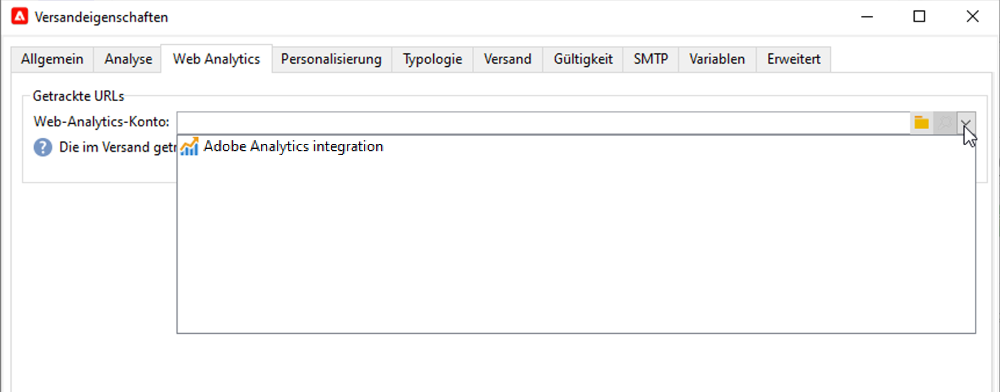

# Arbeiten mit Campaign und Adobe Analytics {#ac-aa}

Sie können Adobe Analytics konfigurieren, um Campaign und Analytics zu integrieren.

Durch diese Integration können Adobe Campaign und Adobe Analytics über das Add-on **Web Analytics Connectors** interagieren. Diese Integration sendet Indikatoren und Attribute von E-Mail-Kampagnen, die von Adobe Campaign bereitgestellt werden, an Adobe Analytics

>[!NOTE]
>
>Als Benutzende von Managed Cloud Services müssen Sie [Adobe kontaktieren](../start/campaign-faq.md#support), wenn Sie Campaign mit Adobe Experience Cloud-Services und -Lösungen verbinden möchten. Das Add-on Web Analytics Connector muss über das dedizierte Paket in Ihrer Umgebung installiert werden.

Mit Adobe Analytics Connector kann Adobe Campaign die Internet-Zielgruppe (Web Analytics) messen. Die Web-Analyse-Tools von Adobe Campaign ermöglichen die Weiterleitung von Indikatoren und Kampagnenattributen an Analytics.

Die Anwendungsbereiche der einzelnen Tools sind folgende:

* **Adobe Analytics** markiert die mit Adobe Campaign ausgeführten E-Mail-Kampagnen

* **Adobe Campaign** sendet die Indikatoren und Attribute der Kampagne an den Connector, der sie an das Web-Analyse-Tool übermittelt

>[!CAUTION]
>
>Adobe Analytics Connector ist nicht kompatibel mit Transaktionsnachrichten (Message Center).

Um die Verbindung zwischen Campaign und Analytics einzurichten, müssen Sie die folgenden Schritte vornehmen:

1. [Report Suite in Adobe Analytics erstellen](#report-suite-analytics)
1. [Konfigurieren von Konversionsvariablen und Erfolgsereignissen](#configure-conversion-success)
1. [Externes Konto in Adobe Campaign konfigurieren](#external-account-ac)

## Erstellen Ihrer Analytics-Report Suite {#report-suite-analytics}

Gehen Sie wie folgt vor, um Ihre **[!UICONTROL Report Suite]** in [!DNL Adobe Analytics] zu erstellen:

1. Wählen Sie in [!DNL Adobe Analytics] die Registerkarte **[!UICONTROL Admin]** und klicken Sie dann auf **[!UICONTROL Alle Admin]**.

   

1. Klicken Sie auf **[!UICONTROL Report Suites]**.

   

1. Klicken Sie auf der Seite **[!UICONTROL Report Suite-Manager]** auf **[!UICONTROL Neu erstellen]** und anschließend auf **[!UICONTROL Report Suite]**.

   Eine detaillierte Anleitung zur Erstellung von **[!UICONTROL Report Suites]** finden Sie in der [Dokumentation zu Adobe Analytics](https://experienceleague.adobe.com/docs/analytics/admin/manage-report-suites/new-report-suite/t-create-a-report-suite.html?lang=de#prerequisites){target="_blank"}.

   

1. Wählen Sie eine Vorlage aus.

1. Konfigurieren Sie Ihre neue Report Suite anhand folgender Informationen:

   * **[!UICONTROL Report Suite-ID]**
   * **[!UICONTROL Site-Titel]**
   * **[!UICONTROL Zeitzone]**
   * **[!UICONTROL Aufschaltdatum]**
   * **[!UICONTROL Geschätzte Seitenansichten pro Tag]**

   

1. Klicken Sie nach Abschluss der Konfiguration auf **[!UICONTROL Report Suite erstellen]**.

## Konfigurieren von Konversionsvariablen und Erfolgsereignissen {#configure-conversion-success}

Im Anschluss an die Erstellung Ihrer **[!UICONTROL Report Suite]** müssen Sie **[!UICONTROL Konversionsvariablen]** und **[!UICONTROL Erfolgsereignisse]** konfigurieren. Gehen Sie dazu wie folgt vor:

1. Wählen Sie Ihre zuvor konfigurierte **[!UICONTROL Report Suite]** aus.

1. Klicken Sie auf die Schaltfläche **[!UICONTROL Einstellungen bearbeiten]** und wählen Sie **[!UICONTROL Konversion]** > **[!UICONTROL Konversionsvariablen]** aus.

   

1. Klicken Sie auf **[!UICONTROL Neu hinzufügen]**, um die für die Messung der Effektivität der E-Mail-Kampagne erforderlichen Kennungen zu erstellen, also den internen Kampagnennamen (cid) und die ID der iNmsBroadlog-Tabelle (bid).

   Weiterführende Informationen zur Bearbeitung von **[!UICONTROL Konversionsvariablen]** finden Sie in der [Dokumentation zu Adobe Analytics](https://experienceleague.adobe.com/docs/analytics/admin/admin-tools/conversion-variables/t-conversion-variables-admin.html?lang=de#admin-tools){target="_blank"}.

   

1. Klicken Sie abschließend auf **[!UICONTROL Speichern]**.

1. Um **[!UICONTROL Erfolgsereignisse]** zu erstellen, wählen Sie **[!UICONTROL Konversion]** > **[!UICONTROL Erfolgsereignisse]** über die Schaltfläche **[!UICONTROL Einstellungen bearbeiten]** aus.

   

1. Klicken Sie auf **[!UICONTROL Neu hinzufügen]**, um die folgenden **[!UICONTROL Erfolgsereignisse]** zu konfigurieren:

   * **[!UICONTROL Haben geklickt]**
   * **[!UICONTROL Haben geöffnet]**
   * **[!UICONTROL Personenklicks]**
   * **[!UICONTROL Verarbeitet]**
   * **[!UICONTROL Geplant]**
   * **[!UICONTROL Gesendet]**
   * **[!UICONTROL Bounces insgesamt]**
   * **[!UICONTROL Einzelklicks]**
   * **[!UICONTROL Einzelöffnungen]**
   * **[!UICONTROL Abgemeldet]**

   Weitere Informationen zum Konfigurieren von **[!UICONTROL Erfolgsereignissen]** finden Sie in der [Dokumentation zu Adobe Analytics](https://experienceleague.adobe.com/docs/analytics/admin/admin-tools/manage-report-suites/edit-report-suite/conversion-variables/success-event.html?lang=de)

   

1. Klicken Sie abschließend auf **[!UICONTROL Speichern]**.

Nachdem Sie Ihre Report Suite konfiguriert haben, müssen Sie die **[!UICONTROL externen Konten]** in Adobe Campaign konfigurieren.

## Konfigurieren Ihres externen Campaign-Kontos {#external-account-ac}

Nun müssen Sie in Adobe Campaign ein externes **[!UICONTROL Web Analytics]**-Konto konfigurieren, um die Synchronisation zwischen den beiden Lösungen zu aktivieren.

Beachten Sie Folgendes: Wenn eine Ihrer **[!UICONTROL Report Suites]**, **[!UICONTROL Konversionsvariablen]** oder eines Ihrer **[!UICONTROL Erfolgsereignisse]** beim Konfigurieren Ihres externen Kontos nicht angezeigt wird, bedeutet dies, dass Sie im **[!UICONTROL Produktprofil]**, das dem Benutzer zugeordnet ist, über keine Berechtigung für diese neu erstellte Komponente verfügen.

Weitere Informationen hierzu finden Sie auf der Seite [Produktprofile für Adobe Analytics](https://experienceleague.adobe.com/docs/analytics/admin/admin-console/permissions/product-profile.html?lang=de#product-profile-admins){target="_blank"}.

1. Navigieren Sie im Navigationsbaum von Adobe Campaign zum Ordner **[!UICONTROL Administration]** > **[!UICONTROL Plattform]** > **[!UICONTROL Externe Konten]** und klicken Sie auf **[!UICONTROL Neu]**.

   

1. Wählen Sie in der Dropdown-Liste &quot;Typ&quot; **[!UICONTROL Web Analytics]** und in der Dropdown-Liste **[!UICONTROL Integration]** **[!UICONTROL Adobe Analytics]** aus.

   

1. Klicken Sie auf den Link **[!UICONTROL Konfigurieren]**, der sich neben der Dropdown-Liste **[!UICONTROL Integration]** befindet.

1. Ordnen Sie das externe Konto Ihrer zuvor erstellten Report Suite zu, indem Sie im Fenster **[!UICONTROL Analytics-Integration konfigurieren]** die folgenden Informationen angeben:

   * **[!UICONTROL E-Mail]**
   * **[!UICONTROL IMS Org]**
   * **[!UICONTROL Analytics-Unternehmen]**
   * **[!UICONTROL Report Suite]**

1. Ordnen Sie unter der Kategorie **[!UICONTROL eVars]** die beiden **[!UICONTROL Konversionsvariablen]** zu, die in [!DNL Adobe Analytics] konfiguriert sind.

   >[!NOTE]
   >
   >Die Felder Kampagnen-ID und Broadload-ID werden über JavaScript auf der Landingpage oder durch Verarbeitungsregeln erfasst. [Weitere Informationen zu Verarbeitungsregeln](https://experienceleague.adobe.com/en/docs/analytics/admin/admin-tools/manage-report-suites/edit-report-suite/report-suite-general/c-processing-rules/processing-rules)

   

1. Ordnen Sie unter der Kategorie **[!UICONTROL Ereignisse]** die zehn **[!UICONTROL Erfolgsereignisse]** zu, die in [!DNL Adobe Analytics] konfiguriert sind.

1. Klicken Sie abschließend auf **[!UICONTROL OK]**. Adobe Campaign erstellt in der in Analytics zugeordneten **[!UICONTROL Report Suite]** eine **[!UICONTROL Datenquelle]**, **[!UICONTROL berechnete Metriken]**, **[!UICONTROL Remarketing-Segmente]** und **[!UICONTROL Klassifizierungen]**.

   Nach Abschluss der Synchronisation zwischen [!DNL Adobe Analytics] und Adobe Campaign können Sie das Fenster schließen.

1. Die Einstellungen können im Tab **[!UICONTROL Dateneinstellungen]** im Fenster **[!UICONTROL Analytics-Integration konfigurieren]** eingesehen werden.

   Durch Klicken auf die Schaltfläche **[!UICONTROL Synchronisieren]** synchronisiert [!DNL Adobe Campaign] die Namensänderungen, die in [!DNL Adobe Analytics] vorgenommen wurden. Wenn die Komponente in [!DNL Adobe Analytics] gelöscht wird, wird die Komponente in [!DNL Adobe Campaign] durchgestrichen oder es wird für sie die Meldung **Nicht gefunden** angezeigt.

   

   >[!NOTE]
   >
   > In dieser Version von Campaign v8 können keine Segmente hinzugefügt oder entfernt werden.

1. Klicken Sie in Ihrem **[!UICONTROL externen Konto]** auf den Link **[!UICONTROL Formel anreichern]**. Damit können Sie die Formel zur URL-Berechnung ändern, anhand derer die Informationen zur Web Analytics-Tool-Integration (d. h. die Kampagnenkennungen) sowie die Domains der Websites spezifiziert werden, deren Aktivität getrackt werden soll.

   

1. Geben Sie den oder die Namen der betroffenen Webseitendomains ein.

   

1. Klicken Sie auf **[!UICONTROL Weiter]** und stellen Sie sicher, dass die Domainnamen tatsächlich gespeichert wurden.

   

1. Bei Bedarf können Sie die Berechnungsformel überschreiben. Aktivieren Sie dazu das Kontrollkästchen und bearbeiten Sie die Formel direkt im Fenster.

   >[!IMPORTANT]
   >
   >Diese Konfigurationsoption sollte erfahrenen Nutzern vorbehalten bleiben, da Fehler in der Formel dazu führen können, dass die Nachrichtensendungen blockiert wird.

1. Auf der Registerkarte **[!UICONTROL Erweitert]** können Sie fortgeschrittene Parameter ändern.

   * **[!UICONTROL Lebensdauer]**: Hier können Sie die Verzögerung (in Tagen) angeben, nach der die Web-Ereignisse in Adobe Campaign durch technische Workflows wiederhergestellt werden. Standardmäßig sind das 180 Tage.
   * **[!UICONTROL Persistenz]**: Zeitraum (standardmäßig 7 Tage), während dem ein Webereignis (z. B. eine Bestellung) einer Remarketing-Kampagne zugeordnet werden kann.

>[!NOTE]
>
>Bei Verwendung verschiedener Zielgruppe-Mess-Tools können Sie bei der Erstellung des externen Kontos in der Dropdown-Liste des Felds **[!UICONTROL Partner]** die Option **[!UICONTROL Sonstige]** auswählen. Da in den Versandeigenschaften jeweils nur ein externes Konto bestimmt werden kann, ist eine Anpassung der Formel für die getrackten URLs notwendig, indem Sie die von Adobe und dem anderen Messtool erwarteten Parameter hinzufügen.

## Technische Workflows der Web-Analyse-Prozesse {#technical-workflows-of-web-analytics-processes}

Der Datenaustausch zwischen Adobe Campaign und Adobe Analytics wird durch einen im Hintergrund ablaufenden technischen Workflow gesteuert.

Dieser Workflow ist im Campaign Explorer-Navigationsbaum im Ordner **[!UICONTROL Administration]** > **[!UICONTROL Produktion]** > **[!UICONTROL Technische Workflows]** > **[!UICONTROL Web-Analytics-Prozess]** verfügbar.

Der Workflow **[!UICONTROL Übermittlung der Kampagnen-Indikatoren und -Attribute]** sendet die in Adobe Campaign enthaltenen Indikatoren aus E-Mail-Kampagnen über den Adobe Analytics-Connector an Adobe Experience Cloud. Dieser Workflow wird jeden Tag um 4 Uhr ausgelöst. Es kann 24 Stunden dauern, bis die Daten an Analytics gesendet werden.

Bitte beachten Sie, dass dieser Workflow nicht neu gestartet werden sollte, da sonst alle vorherigen Daten erneut gesendet werden, was die Analyseergebnisse verfälschen könnte.

Folgende Indikatoren werden übermittelt:

* **[!UICONTROL Zu sendende Nachrichten]** (@toDeliver)
* **[!UICONTROL Verarbeitet]** (@processed)
* **[!UICONTROL Erfolg]** (@success)
* **[!UICONTROL Öffnungen insgesamt]** (@totalRecipientOpen)
* **[!UICONTROL Empfänger, die geöffnet haben]** (@recipientOpen)
* **[!UICONTROL Gesamtzahl der Empfänger, die geklickt haben]** (@totalRecipientClick)
* **[!UICONTROL Personen, die geklickt haben]** (@personClick)
* **[!UICONTROL Unique-Clicks-Anzahl]** (@recipientClick)
* **[!UICONTROL Abmeldung (Opt-out)]** (@optOut)
* **[!UICONTROL Fehler]** (@error)

>[!NOTE]
>
>Die gesendete Daten sind die Differenz zur letzten Übermittlung, was zu einem negativen Wert in den Metrikdaten führen kann.

Folgende Attribute werden übermittelt:

* **[!UICONTROL Interner Name]** (@internalName)
* **[!UICONTROL Titel]** (@label)
* **[!UICONTROL Titel]** (operation/@label): nur bei installiertem **Campaign**-Package
* **[!UICONTROL Art]** (operation/@nature): nur bei installiertem **Campaign**-Package
* **[!UICONTROL Tag 1]** (webAnalytics/@tag1)
* **[!UICONTROL Tag 2]** (webAnalytics/@tag2)
* **[!UICONTROL Tag 3]** (webAnalytics/@tag3)
* **[!UICONTROL Kontaktdatum]** (scheduling/@contactDate)

## Nachverfolgen von Sendungen {#tracking-deliveries-in-adobe-campaign}

Damit die Adobe Experience Cloud nach Versand der Nachrichten durch Adobe Campaign die Aktivitäten auf den Webseiten verfolgen kann, muss der entsprechende Connector in den Versandeigenschaften angegeben werden. Gehen Sie wie folgt vor:

1. Öffnen Sie den Versand der zu verfolgenden Kampagne.

   

1. Öffnen Sie die Versandeigenschaften.
1. Wählen Sie im Tab **[!UICONTROL Web Analytics]** das zuvor erstellte externe Konto aus. Siehe [Konfigurieren Ihres externen Kontos in Adobe Campaign](#external-account-ac).

   

1. Sie können jetzt Ihren Versand durchführen und Ihren Bericht dazu in Adobe Analytics abrufen.

## Erstellen einer Remarketing-Kampagne {#create-a-re-marketing-campaign}

Zur Vorbereitung von Remarketing-Kampagnen ist die Erstellung von spezifischen Versandvorlagen erforderlich. Anschließend ist die Remarketing-Kampagne zu konfigurieren und einem Segment zuzuweisen. Jedem Segment muss eine andere Remarketing-Kampagne entsprechen.

Remarketing-Kampagnen werden automatisch gestartet, sobald Adobe Campaign die Segmente wiederhergestellt hat, mit denen das Verhalten der Zielgruppe der ursprünglichen Kampagne analysiert wurde. Im Falle eines Warenkorbabbruchs oder eines Aufrufs eines Produkts ohne Kauf wird ein Versand an die betroffenen Empfängerinnen und Empfänger gesendet, damit sie ihren Einkauf auf der Website abschließen können.

Adobe Campaign stellt vorkonfigurierte Versandvorlagen zur Verfügung, die Sie verwenden oder als Anregung für Ihre Kampagnen nutzen können.

1. Rufen Sie vom **[!UICONTROL Explorer]** aus den Ordner **[!UICONTROL Ressourcen]** > **[!UICONTROL Vorlagen]** > **[!UICONTROL Versandvorlagen]** im Navigationsbaum von Adobe Campaign auf.
1. Duplizieren Sie die Vorlage **[!UICONTROL E-Mail-Versand (Remarketing)]** oder die von Adobe Campaign vorgeschlagenen Remarketing-Vorlagenbeispiele.
1. Passen Sie die Vorlage Ihren Bedürfnissen an und speichern Sie sie.
1. Erstellen Sie eine neue Kampagne und wählen Sie aus der Dropdown-Liste die Vorlage **[!UICONTROL Remarketing-Kampagne]** aus;
1. Klicken Sie auf den Link **[!UICONTROL Konfigurieren...]**, um das Segment und die der Kampagne entsprechende Versandvorlage anzugeben;
1. Wählen Sie das [externe Analytics-Konto](#external-account-ac) und das betreffende Segment aus.
1. Wählen Sie die für diese Remarketing-Kampagne zu verwendende Versandvorlage aus und klicken Sie auf **[!UICONTROL Beenden]**, um das Konfigurationsfenster zu schließen.
1. Klicken Sie nun auf **[!UICONTROL OK]**, um das Kampagnenfenster zu schließen.

Der Bericht zur **[!UICONTROL Remarketing-Effizienz]** steht in der allgemeinen Berichtübersicht zur Verfügung. Er zeigt die Anzahl konvertierter Kontakte (d. h., die einen Kauf getätigt haben) in Bezug auf die Zahl der Transaktionsabbrüche im Anschluss an die mit Adobe Campaign durchgeführte Remarketing-Kampagne an. Die Konversionsrate wird über die letzten 7 oder 30 Tage bzw. ab der Synchronisation von Adobe Campaign und Adobe Analytics berechnet.

**Verwandte Themen**

* [Campaign – Integration von Experience Cloud Triggers](ac-triggers.md)
