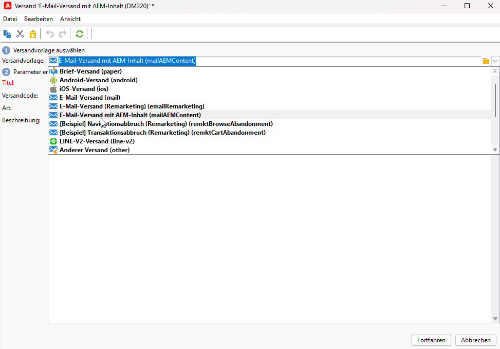
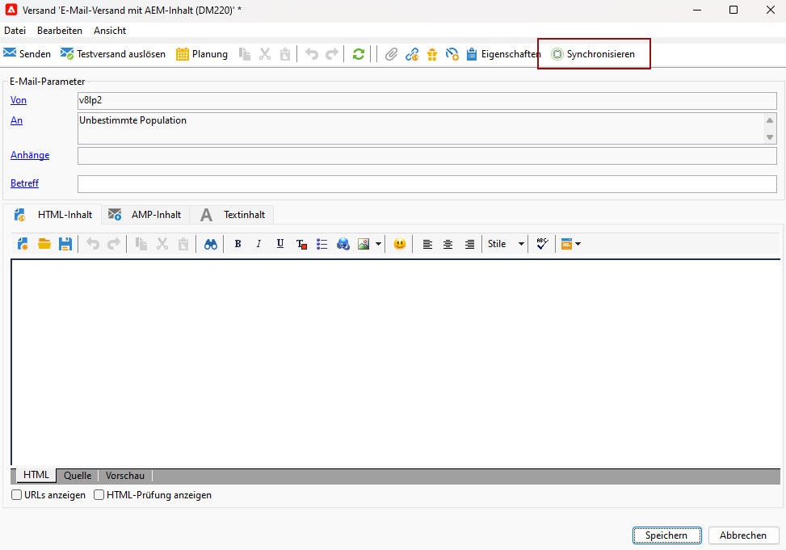
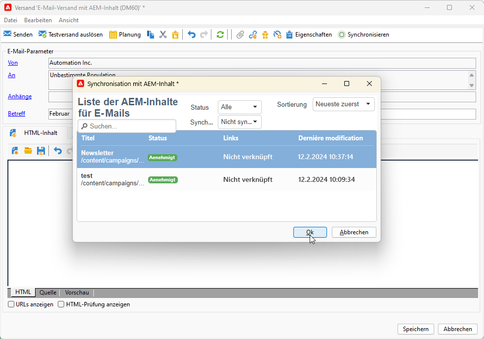
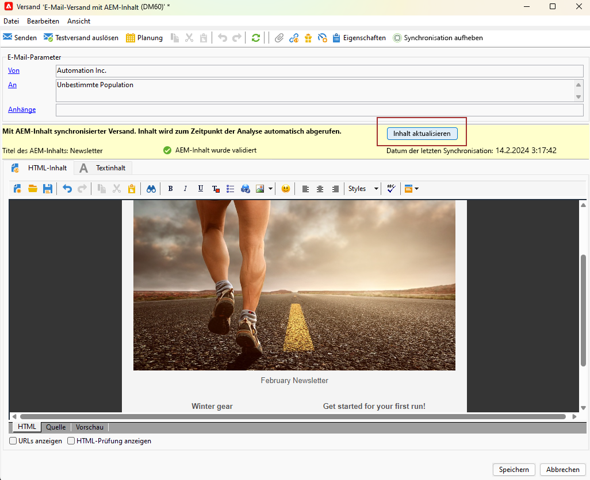
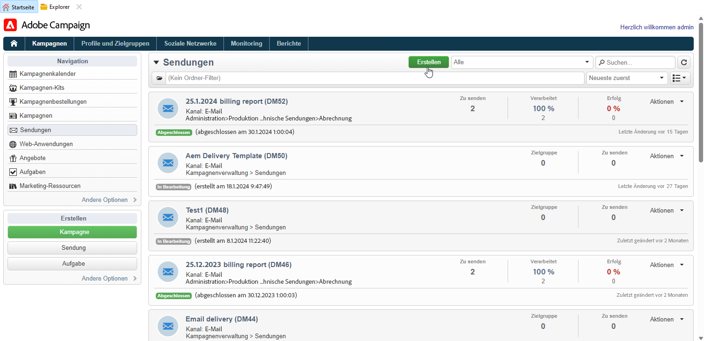
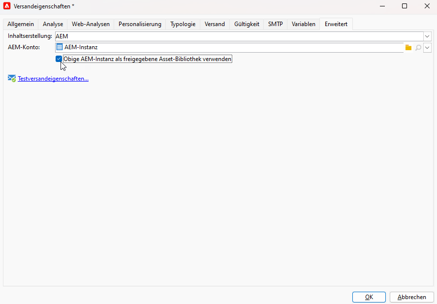
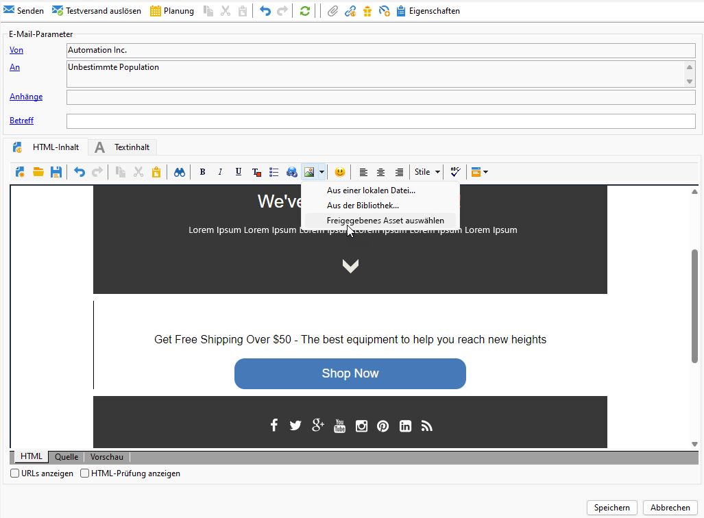

# Arbeiten mit Campaign und Adobe Experience Manager {#ac-aem}

Durch die Integration von Adobe Campaign mit Adobe Experience Manager können Sie den Inhalt Ihrer E-Mail-Sendungen sowie Ihrer Formulare direkt in Adobe Experience Manager verwalten. Sie haben die Möglichkeit, entweder Ihre **Adobe Experience Manager** Inhalte in Campaign einbinden oder eine Verbindung herstellen **Adobe Experience Manager as a Cloud Service** -Konto, über das Sie Inhalte direkt in der Web-Oberfläche bearbeiten können.

 [Erfahren Sie, wie Sie in der Campaign-Weboberfläche Adobe Experience Manager als Cloud Service bearbeiten](https://experienceleague.adobe.com/docs/campaign-web/v8/msg/email/content/integrations/aem-content.html?lang=en)

 [Weitere Informationen zu Adobe Experience Manager finden Sie in diesem Dokument .](https://experienceleague.adobe.com/docs/experience-manager-65/administering/integration/campaignonpremise.html?lang=de#aem-and-adobe-campaign-integration-workflow)

## Inhalt aus Adobe Experience Manager importieren {#integrating-with-aem}

 Als Benutzer von Managed Cloud Services [kontaktieren Sie Adobe](../start/campaign-faq.md#support), um Adobe Experience Manager mit Campaign zu integrieren.

Mit dieser Integration kann beispielsweise ein Newsletter in Adobe Experience Manager erstellt werden, der danach in Adobe Campaign als Teil einer E-Mail-Kampagne verwendet wird.

**In Adobe Experience Manager:**

1. Navigieren Sie zu Ihrer [!DNL Adobe Experience Manager] Autoreninstanz erstellen, und klicken Sie oben links auf der Seite auf Adobe Erlebnis . Auswählen **[!UICONTROL Sites]** aus dem Menü.

   

1. Zugriff **[!UICONTROL Kampagnen > Name Ihrer Marke (hier we.Shopping) > Hauptbereich > E-Mail]**.

1. Klicks **[!UICONTROL Erstellen]** und wählen **[!UICONTROL Seite]** aus dem Dropdown-Menü aus.

   

1. Wählen Sie die **[!UICONTROL Adobe Campaign Email]** und benennen Sie Ihren Newsletter.

1. Rufen Sie nach dem Erstellen Ihrer Seite die **[!UICONTROL Seiteninformationen]** Menü und klicken Sie **[!UICONTROL Eigenschaften öffnen]**.

   

1. Passen Sie Ihren E-Mail-Inhalt an, indem Sie Komponenten wie Personalisierungsfelder aus Adobe Campaign hinzufügen. [Weitere Informationen](https://experienceleague.adobe.com/docs/experience-manager-65/content/sites/authoring/aem-adobe-campaign/campaign.html?lang=en#editing-email-content)

1. Sobald Ihre E-Mail fertig ist, navigieren Sie zur **[!UICONTROL Seiteninformationen]** Menü und klicken Sie **[!UICONTROL Workflow starten]**.

   

1. Wählen Sie aus der ersten Dropdown-Liste **[!UICONTROL Genehmigen von Adobe Campaign]** als Workflow-Modell und klicken Sie auf **[!UICONTROL Workflow starten]**.

   

1. Oben auf Ihrer Seite erscheint ein Haftungsausschluss mit folgenden Angaben: `This page is subject to the workflow Approve for Adobe Campaign`. Klicks **[!UICONTROL Fertig]** neben dem Haftungsausschluss klicken, um die Überprüfung zu bestätigen, und **[!UICONTROL Ok]**.

1. Klicks **[!UICONTROL Fertig]** erneut auswählen **[!UICONTROL Newsletter-Validierung]** im **[!UICONTROL Nächster Schritt]** angezeigt.

   

Ihr Newsletter ist jetzt fertig und in Adobe Campaign synchronisiert.

**In Adobe Campaign:**

1. Wählen Sie im Tab **[!UICONTROL Kampagnen]** die Option **[!UICONTROL Sendungen]** und danach die Schaltfläche **[!UICONTROL Erstellen]** aus.

1. Wählen Sie die **[!UICONTROL E-Mail-Versand mit AEM Inhalt (mailAEMContent)]** Vorlage aus der **[!UICONTROL Versandvorlage]** Dropdown-Menü.

   

1. Fügen Sie zu Ihrem Versand einen **[!UICONTROL Titel]** hinzu und wählen Sie dann **[!UICONTROL Fortfahren]** aus.

1. Klicks **[!UICONTROL Synchronisieren]** , um auf Ihre AEM zuzugreifen.

   Wenn die Schaltfläche in der Benutzeroberfläche nicht sichtbar ist, navigieren Sie zum **[!UICONTROL Eigenschaften]** und greifen Sie auf die **[!UICONTROL Erweitert]** Registerkarte. Stellen Sie sicher, dass **[!UICONTROL Inhaltsbearbeitungsmodus]** -Feld konfiguriert ist, um **[!UICONTROL AEM]** und geben Sie Ihre AEM-Instanzdetails in das **[!UICONTROL AEM]** -Feld.

   

1. Wählen Sie den zuvor in AEM erstellten Versand aus [!DNL Adobe Experience Manager] und bestätigen Sie durch Klicken auf **[!UICONTROL Ok]**.

   

1. Stellen Sie sicher, dass Sie auf die **[!UICONTROL Inhalt aktualisieren]** immer dann, wenn Änderungen an Ihrem AEM vorgenommen werden.

   

1. Um die Verknüpfung zwischen Experience Manager und Campaign zu entfernen, klicken Sie auf **[!UICONTROL Synchronisieren]**.

Ihre E-Mail kann jetzt an Ihre Audience gesendet werden.

## Importieren von Assets aus der Adobe Experience Manager Assets-Bibliothek {#assets-library}

Sie können auch direkt Assets aus Ihrem [!DNL Adobe Experience Manager Assets Library] während der Bearbeitung einer E-Mail oder Landingpage in Adobe Campaign. Diese Funktion wird im Abschnitt [Adobe Experience Manager Assets-Dokumentation](https://experienceleague.adobe.com/docs/experience-manager-65/content/assets/managing/manage-assets.html?lang=en).

**In Adobe Experience Manager:**

1. Navigieren Sie zu Ihrer [!DNL Adobe Experience Manager] Autoreninstanz erstellen, und klicken Sie oben links auf der Seite auf Adobe Erlebnis . Auswählen **[!UICONTROL Assets]** `>` **[!UICONTROL Dateien]** aus dem Menü.

   

1. Klicks **Erstellen** then **Dateien** , um Ihr Asset in Ihre **Adobe Experience Manager Assets-Bibliothek**. [Weitere Informationen](https://experienceleague.adobe.com/docs/experience-manager-65/content/assets/managing/manage-assets.html?lang=en#uploading-assets)

   

1. Benennen Sie Ihr Asset bei Bedarf um und wählen Sie **Hochladen**.

Ihr Asset wurde jetzt in Ihre **Adobe Experience Manager Assets-Bibliothek**.

**In Adobe Campaign:**

1. Erstellen Sie in Adobe Campaign einen neuen Versand, indem Sie zur **Kampagnen** Registerkarte, klicken **Sendungen** und klicken Sie auf **Erstellen** oberhalb der Versandliste.

   

1. Wählen Sie eine **Versandvorlage** und geben Sie Ihrem Versand einen Namen.

1. Definieren und personalisieren Sie den Nachrichteninhalt. [Weitere Informationen](../send/email.md)

1. Verwenden Sie **Adobe Experience Manager Assets-Bibliothek**, greifen Sie auf **[!UICONTROL Eigenschaften]** und wählen Sie die **[!UICONTROL Erweitert]** Registerkarte.

   Wählen Sie **AEM** und aktivieren Sie die **[!UICONTROL Verwenden Sie AEM oben als freigegebene Asset-Bibliothek.]** -Option.

   

1. Aus dem **Bild** aufrufen, können Sie **[!UICONTROL Freigegebene Assets auswählen]** Menü.

   

1. Wählen Sie im Auswahlfenster ein Bild aus Ihrem **Adobe Experience Manager Assets-Bibliothek**, dann **Auswählen**.

   

Ihr Asset wird jetzt in Ihren E-Mail-Versand hochgeladen. Jetzt können Sie die Zielgruppe festlegen, den Versand bestätigen und mit dem Versand fortfahren.
