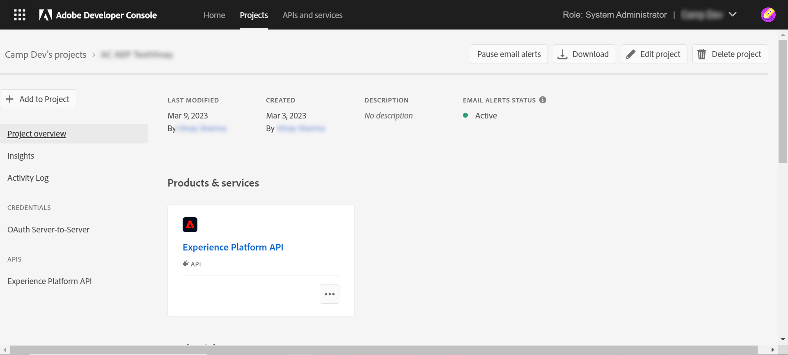
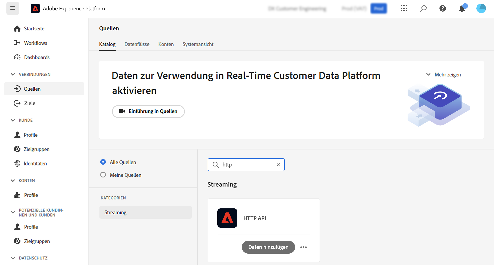
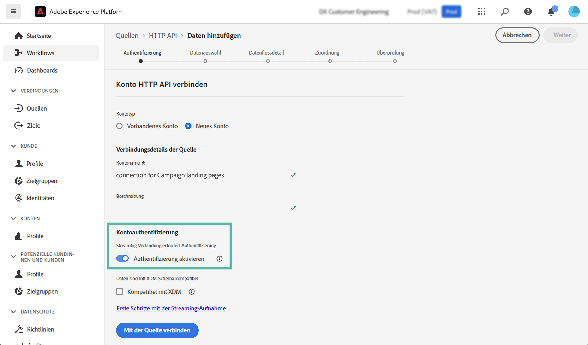
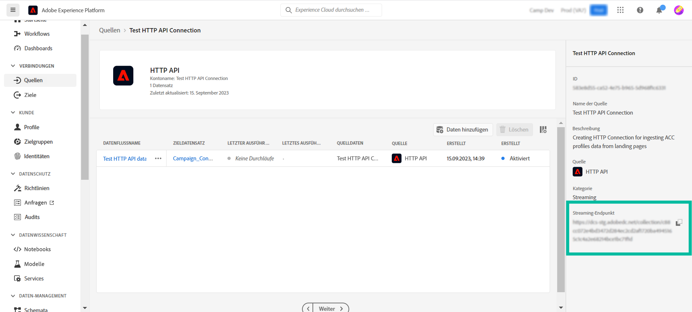
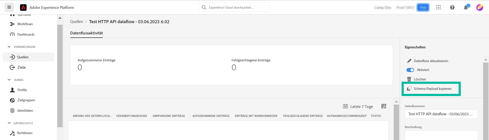
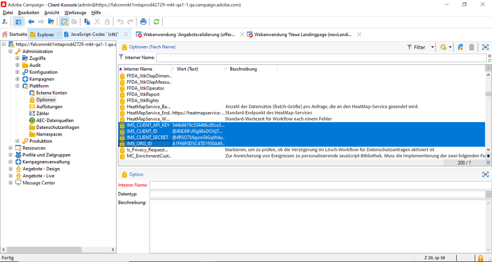
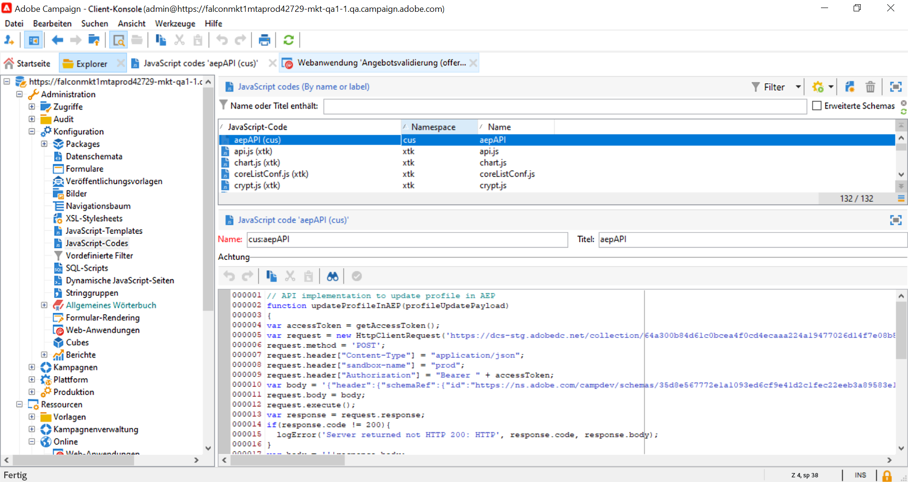
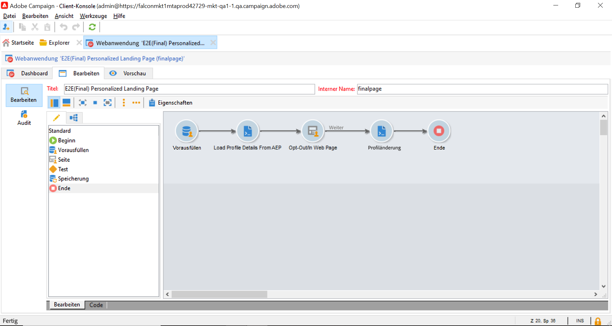
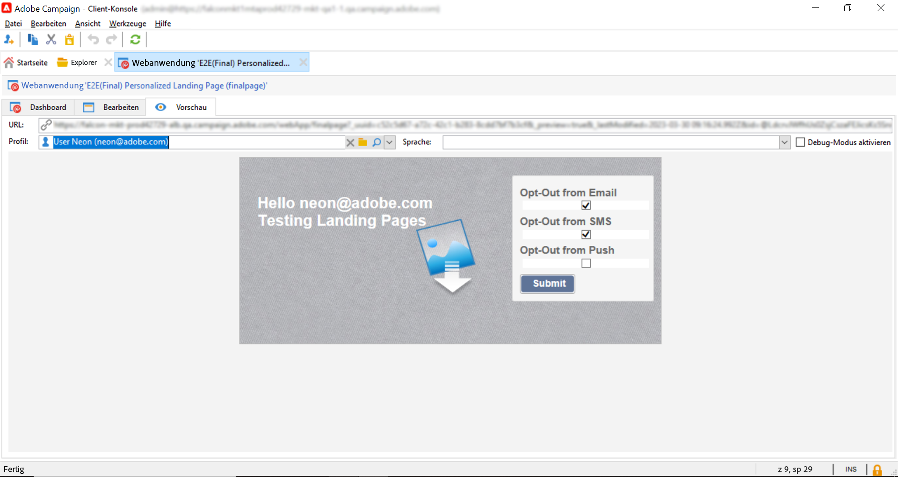
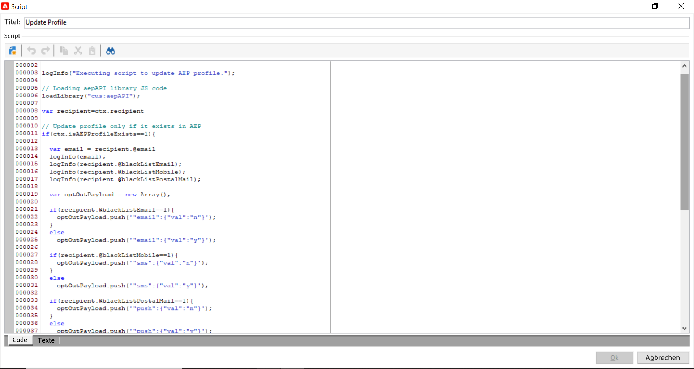

# Adobe Experience Platform-Profile über Adobe Campaign-Landingpages aktualisieren {#ac-aep-lp}

Durch die Integration von Adobe Campaign mit Adobe Experience Platform können Sie Profildaten nahtlos zwischen Ihren Adobe Campaign-Landingpages und Adobe Experience Platform synchronisieren. Diese Integration ermöglicht Ihnen Folgendes:

* Abrufen von Adobe Experience Platform-Profilattributen zur Anzeige aktualisierter Informationen auf Adobe Campaign-Landingpages,
* Senden aktualisierter Profilattribute an Adobe Experience Platform, um die entsprechenden Attribute basierend auf den in den Landingpages ausgefüllten und gesendeten Elementen zu aktualisieren.

Die wichtigsten Schritte zum Einrichten dieser Integration sind:

<table>
<tr>
<td><p><a href="#oauth">Einrichten einer OAuth-Verbindung</a></p></td>
<td><p><a href="#source">Erstellen einer HTTP-API-Quellverbindung</a></p></td>
<td><p><a href="#xtk">Hinzufügen von Authentifizierungsoptionen in Campaign</a></p></td>
<td><p><a href="#javascript">Hinzufügen von JavaScript-Codes in Campaign</a></p></td>
<td><p><a href="#script">Konfigurieren von Landingpage-Workflows</a></p></td>
</table>

## Einrichten einer OAuth-Verbindung {#oauth}

Adobe Cloud Platform-APIs verwenden das OAuth 2.0-Protokoll zur Authentifizierung und Autorisierung. Um über API-Aufrufe eine Verbindung zwischen Adobe Experience Platform und Adobe Campaign herzustellen, müssen Sie mithilfe der in Adobe Developer Console erstellten OAuth-Integration ein Zugriffstoken generieren.

Gehen Sie dazu wie folgt vor:

1. Rufen Sie die Adobe Developer Console auf.
1. Erstellen Sie eine neue API-Verbindung mit dem Adobe Experience Platform-API-Produkt. Ausführliche Anweisungen zum Abrufen eines OAuth 2.0-Zugriffstokens finden Sie in der [Dokumentation zur Adobe Developer Console](https://developer.adobe.com/developer-console/docs/guides/authentication/Tools/OAuthPlayground/).
1. Nachdem die Verbindung erstellt wurde, navigieren Sie zum Menü **[!UICONTROL OAuth Server-zu-Server]** und kopieren Sie die folgenden Details, die für die Authentifizierung in Campaign erforderlich sind:

   * `CLIENT ID`
   * `CLIENT SECRET`
   * `ORGANIZATION ID`

   {width="70%"}

Nachdem Sie Ihre Oauth-Verbindung konfiguriert haben, erstellen und konfigurieren Sie eine neue **[!UICONTROL HTTP-API]**-Quellverbindung zur Verknüpfung von Adobe Campaign mit Adobe Experience Platform.

## Erstellen einer HTTP-API-Quellverbindung {#source}

Mit der vorhandenen OAuth-Verbindung besteht der nächste Schritt darin, eine **[!UICONTROL HTTP-API]**-Quellverbindung in Adobe Experience Platform zu erstellen. Mit dieser Verbindung können Sie Daten mithilfe von APIs an Adobe Experience Platform streamen. Führen Sie folgende Schritte aus:

1. Navigieren Sie zu Adobe Experience Platform-**[!UICONTROL Quellen]**, suchen Sie nach der **[!UICONTROL HTTP-API]**-Quelle und klicken Sie dann auf **[!UICONTROL Daten hinzufügen]**.

   {width="70%"}

1. Konfigurieren Sie die Verbindung entsprechend Ihren Anforderungen. Detaillierte Informationen zum Konfigurieren einer HTTP-API-Verbindung finden Sie in der [Dokumentation zu Adobe Experience Platform-Quellen](https://experienceleague.adobe.com/docs/experience-platform/sources/ui-tutorials/create/streaming/http.html?lang=de).

   Aktivieren Sie im Schritt **[!UICONTROL Authentifizierung]** die Option **[!UICONTROL Authentifizierung aktivieren]**, um sich mit dem zuvor über die OAuth-Integration generierten Zugriffstoken zu authentifizieren.

   {width="70%"}

1. Sobald die Quellverbindung konfiguriert ist, wird der Streaming-Endpunkt angezeigt. Dieser Endpunkt ist erforderlich, um Daten in Adobe Experience Platform aufzunehmen.

   {width="70%"}

   Sie können auch auf ein Beispiel des in Adobe Experience Platform erfassten Datenformats zugreifen, indem Sie den neu erstellten Datenfluss über die Registerkarte **[!UICONTROL Datenflüsse]** aufrufen.

   {width="70%"}

Nachdem jetzt die HTTP-API-Quellverbindung eingerichtet worden ist, müssen Sie bestimmte Optionen zu Adobe Campaign hinzufügen, um die Verbindung zu Adobe Experience Platform zu aktivieren.

## Hinzufügen von Authentifizierungsoptionen in Adobe Campaign {#xtk}

Nachdem die HTTP-API-Quellverbindung konfiguriert worden ist, müssen Sie bestimmte Optionen zu Adobe Campaign hinzufügen, um die Verbindung mit Adobe Experience Platform zu aktivieren. Dies kann entweder im Menü „Kampagnen-Administration“ oder bei der Ausführung des Landingpage-Workflows durch Hinzufügen einer spezifischen **[!UICONTROL JavaScript-Code]**-Aktivität erfolgen.

Auf den nachstehenden Registerkarten finden Sie die beiden Methoden:

>[!BEGINTABS]

>[!TAB Hinzufügen von Optionen über das Menü „Administration“]

1. Navigieren Sie zum Menü **[!UICONTROL Administration]** > **[!UICONTROL Plattform]** > **[!UICONTROL Optionen]**.
1. Fügen Sie die folgenden Optionen mit den entsprechenden Werten aus der Adobe Developer Console hinzu:

   * IMS_CLIENT_ID = cryptString(CLIENT ID)
   * IMS_CLIENT_SECRET = cryptString(CLIENT SECRET)
   * IMS_ORG_ID = ORGANIZATION ID
   * IMS_CLIENT_API_KEY = cryptString(CLIENT ID)

   {width="70%"}

   >[!NOTE]
   >
   >Die Funktion „cryptString()“ wird zum Verschlüsseln Ihrer Authentifizierungsdaten verwendet.

>[!TAB Hinzufügen von Optionen mithilfe einer JavaScript-Code-Aktivität]

Um diese Optionen bei Ausführung des Landingpage-Workflows automatisch zu konfigurieren, fügen Sie eine **[!UICONTROL JavaScript-Code]**-Aktivität zu Ihrem Workflow mit dem unten stehenden Code hinzu. [Erfahren Sie, wie Sie eine JavaScript-Code-Aktivität konfigurieren](https://experienceleague.adobe.com/docs/campaign/automation/workflows/wf-activities/action-activities/sql-code-and-JavaScript-code.html?lang=de#JavaScript-code).

Bei Ausführung des Workflows werden die Optionen automatisch in der Campaign-Konsole mit den angegebenen Werten erstellt.

    &quot;javascript
    loadLibrary(&quot;xtk:shared/nl.js&quot;);
    loadLibrary(&quot;xtk:shared/xtk.js&quot;);
    loadLibrary(&quot;xtk:shared/json2.js&quot;);
    loadLibrary(&quot;xtk:common.js&quot;);
    
    function setAuthCredentials()
    {
    setOption(&quot;IMS_CLIENT_ID&quot;, cryptString(&#39;CLIENT ID&#39;));
    setOption(&quot;IMS_CLIENT_SECRET&quot;, cryptString(&#39;CLIENT SECRET&#39;));
    setOption(&quot;IMS_ORG_ID&quot;, cryptString(&#39;ORGANIZATION ID&#39;));
    setOption(&quot;IMS_CLIENT_API_KEY&quot;, cryptString(&#39;CLIENT ID&#39;));
    }
    &quot;

>[!ENDTABS]

Nachdem nun die Authentifizierungsoptionen in Campaign konfiguriert worden sind, müssen Sie benutzerdefinierte JavaScript-Codes erstellen, um die Datensynchronisation zwischen Campaign und Adobe Experience Platform von Ihrer Landingpage aus zu ermöglichen.

## Hinzufügen von Optionen bei der Workflow-Ausführung {#javacript}

Um die Datensynchronisation zwischen Landingpages und Adobe Experience Platform zu ermöglichen, müssen benutzerdefinierte JavaScript-Codes zu Adobe Campaign hinzugefügt werden.  Führen Sie folgende Schritte aus:

1. Navigieren Sie zum Menü **[!UICONTROL Administration]** > **[!UICONTROL Konfiguration]** > **[!UICONTROL JavaScript-Codes]**.
1. Erstellen Sie neue JavaScript-Codes und fügen Sie die unten stehenden Snippets ein.

   >[!NOTE]
   >
   >Zugriffstoken und Authentifizierungsdaten werden automatisch aus den zuvor eingerichteten Optionen abgerufen.

   {width="70%"}

+++  Skript 1: Laden von Profilattributen von Experience Platform

   Dieser Code prüft, ob das Profil in Adobe Experience Platform vorhanden ist, bevor die Landingpage geladen wird. Er ruft die Profilattribute ab und zeigt sie in den entsprechenden Feldern der Landingpage an.

   ```javascript
   // API implementation to read profile from AEP
   function getProfileInfo(email)
   {
   var accessToken = getAccessToken();
   var request = new HttpClientRequest(('https://platform-stage.adobe.io/data/core/ups/access/entities?schema.name=_xdm.context.profile&entityId=' + email + '&entityIdNS=email&fields=identities,consents.marketing'));
   request.method = 'GET';
   request.header["Content-Type"] = "application/json";
   request.header["sandbox-name"] = "prod";
   request.header["x-gw-ims-org-id"] = getOption('IMS_ORG_ID');
   request.header["x-api-key"] = getOption('IMS_CLIENT_API_KEY');
   request.header["Authorization"] = "Bearer " + accessToken;
   request.execute();
   return request.response;
   }
   ```

+++

+++ Skript 2: Aktualisieren der Profilattribute von Experience Platform

   Dieser Code aktualisiert die Profilattribute in Adobe Experience Platform mit den auf der Landingpage übermittelten Werten.

   ```javascript
   // API implementation to update profile in AEP
   loadLibrary("xtk:shared/nl.js");
   loadLibrary("xtk:shared/xtk.js");
   loadLibrary("xtk:shared/json2.js");
   loadLibrary("xtk:common.js");
   
   function updateProfileInAEP(profileUpdatePayload)
   {
   var accessToken = getAccessToken();
   var request = new HttpClientRequest('https://dcs-stg.adobedc.net/collection/64a300b84d61c0bcea4f0cd4ecaaa224a19477026d14f7e08b5408ffaf5e6162?syncValidation=false');
   request.method = 'POST';
   request.header["Content-Type"] = "application/json";
   request.header["sandbox-name"] = "prod";
   request.header["Authorization"] = "Bearer " + accessToken;
   var body = '{"header":{"schemaRef":{"id":"https://ns.adobe.com/campdev/schemas/35d8e567772e1a1093ed6cf9e41d2c1fec22eeb3a89583e1","contentType":"application/vnd.adobe.xed-full+json;version=1.0"},"imsOrgId":"A1F66F0D5C47D1950A494133@AdobeOrg","datasetId":"63c7fa2a20cce11b98cccb41","source":{"name":"testHTTPSourcesVinay - 03/06/2023 5:43 PM"}},"body":{"xdmMeta":{"schemaRef":{"id":"https://ns.adobe.com/campdev/schemas/35d8e567772e1a1093ed6cf9e41d2c1fec22eeb3a89583e1","contentType":"application/vnd.adobe.xed-full+json;version=1.0"}},"xdmEntity":' + profileUpdatePayload +'}}';
   request.body = body;
   request.execute();
   return request.response;
   }
   
   
   // Get Access token from OAuth-Server-to-server API call
   function getAccessToken() {
   var clientId = decryptString(getOption('IMS_CLIENT_ID'));
   var clientSecret = decryptString(getOption('IMS_CLIENT_SECRET'));
   var request = new HttpClientRequest(('https://ims-na1-stg1.adobelogin.com/ims/token/v2?grant_type=client_credentials' + '&client_id=' + clientId + '&client_secret=' + clientSecret + '&scope=openid,session,AdobeID,read_organizations,additional_info.projectedProductContext'));
   request.method = 'POST';
   request.execute();
   var response = request.response;
   if(response.code != 200){
   logError('GetAccessToken failed,', response.code, response.body);
   return;
   }
   var body = ''+response.body;
   var parsedResponse = JSON.parse(body);
   var accessToken = parsedResponse.access_token;
   logInfo("Access token generated successfully");
   return accessToken;
   }
   ```

+++

Nachdem nun die benutzerdefinierten JavaScript-Codes in Adobe Campaign erstellt worden sind, können Sie den Workflow mit Ihrer Landingpage so konfigurieren, dass diese JavaScript-Codes für die Datensynchronisation verwendet werden.

## Konfigurieren von Landingpage-Workflows {#script}

Mit den zu Adobe Campaign hinzugefügten JavaScript-Codes können Sie diese mit **[!UICONTROL JavaScript-Code]**-Aktivitäten in Ihren Landingpage-Workflow einbinden:

* Um Daten von Experience Platform zu laden, bevor die Landingpage geladen wird, fügen Sie eine **[!UICONTROL JavaScript-Code]**-Aktivität vor der Landingpage-Aktivität hinzu und fügen Sie Skript 1 ein.

+++ Skript 1: Laden von Profilattributen von Experience Platform

  ```javascript
  // Script code to read profile from AEP.
  
  logInfo("Loading profile from AEP");
  loadLibrary("cus:aepAPI");
  var recipient=ctx.recipient;
  var email = recipient.@email;
  var response = getProfileInfo(email);
  ctx.isAEPProfileExists = 1;
  
  if(response.code == 404){
  ctx.isAEPProfileExists = 0
  logInfo("Profile with email" + email + " not found in AEP, ignoring the update activity");
  }
  else if(response.code == 200){
  var body = ''+response.body;
  var parsedResponse = JSON.parse(body);
  for (var key in parsedResponse) {
      var value =  parsedResponse[key];
      var marketing = value.entity.consents.marketing;
      logInfo("User Consent Details : " + JSON.stringify(marketing));   
      if(marketing.hasOwnProperty('email')&&marketing.email.hasOwnProperty('val')&&marketing.email.val=='n'){
      ctx.recipient.@blackListEmail = 1;
      }
      if(marketing.hasOwnProperty('sms')&&marketing.sms.hasOwnProperty('val')&&marketing.sms.val=='n'){
      ctx.recipient.@blackListMobile = 1;
      }
      if(marketing.hasOwnProperty('push')&&marketing.push.hasOwnProperty('val')&&marketing.push.val=='n'){
      ctx.recipient.@blackListPostalMail = 1;
      }
  } 
  }
  ```

+++

* Um die Experience Platform-Profilattribute mit den auf der Landingpage eingegebenen Daten zu aktualisieren, fügen Sie eine **[!UICONTROL JavaScript-Code]**-Aktivität nach der Landingpage-Aktivität hinzu und fügen Sie Skript 2 ein.

+++ Skript 2: Aktualisieren der Profilattribute von Experience Platform

  ```javascript
  // Script code to update profile in AEP and ACC.
  
  logInfo("Executing script to update AEP profile.");
  
  // Loading aepAPI library JS code
  loadLibrary("cus:aepAPI");
  
  var recipient=ctx.recipient
  
  // Update profile only if it exists in AEP
  if(ctx.isAEPProfileExists==1){
  
  var email = recipient.@email
  logInfo(email);
  logInfo(recipient.@blackListEmail);
  logInfo(recipient.@blackListMobile);
  logInfo(recipient.@blackListPostalMail);
  
  var optOutPayload = new Array();
  
  if(recipient.@blackListEmail==1){
      optOutPayload.push('"email":{"val":"n"}');
  }
  else
      optOutPayload.push('"email":{"val":"y"}');
  
  if(recipient.@blackListMobile==1){
      optOutPayload.push('"sms":{"val":"n"}');
  }
  else
      optOutPayload.push('"sms":{"val":"y"}');
  
  if(recipient.@blackListPostalMail==1){
      optOutPayload.push('"push":{"val":"n"}');
  }
  else
      optOutPayload.push('"push":{"val":"y"}');
  
  var profileUpdatePayload = '{'+ '"personalEmail":{"address":' + '\"' + email + '\"' + '},' +'"consents":{"marketing":{' + optOutPayload.toString() + '}}}';
  
  var response = updateProfileInAEP(profileUpdatePayload);
  if(response.code == 200){
  var body = '' + response.body;
  logInfo("AEP Profile Updated successfully, Response " + body);
  // Update ACC profile 
  recipient.@xtkschema = "nms:recipient";
  recipient.@_operation = "update";
  recipient.@_key="@id";
  xtk.session.Write(recipient);
  logInfo("ACC Profile Updated successfully");
  }
  else{
      logError('Server Error: ', response.code, response.body);
  } 
  }
  else {
  logInfo("Ignoring AEP profile update as profile doesn't exists.");
  
  // Update ACC profile   
  recipient.@xtkschema = "nms:recipient";
  recipient.@_operation = "update";
  recipient.@_key="@id";  
  xtk.session.Write(recipient);
  logInfo("ACC Profile Updated successfully");
  }
  ```

+++

>[!CAUTION]
>
>Stellen Sie sicher, dass Sie die Payload in jedem Skript entsprechend Ihren spezifischen Anforderungen anpassen.
>
>Wenn Sie kein Skript vor der Landingpage-Aktivität hinzufügen, wird in Adobe Experience Platform keine Überprüfung der Existenz von Profilen durchgeführt. Wenn die Landingpage übermittelt wird und das Profil nicht existiert, wird es in Adobe Experience Platform mit den Attributen der Landingpage erstellt.

Hier ist ein Beispiel für einen Workflow, der die JavaScript-Code-Aktivitäten vor und nach einer Landingpage verwendet:

{width="70%"}

Im Folgenden finden Sie ein Beispiel für eine Landingpage und eine JavaScript-Code-Aktivität, die zur Aktualisierung von Profilattributen in Adobe Experience Platform konfiguriert wurde:

{width="70%"}

{width="70%" zoomable="yes"}

### Weitere Informationen

* [Konfigurieren einer JavaScript-Code-Aktivität](../../automation/workflow/sql-code-and-javascript-code.md#javascript-code)
* [Landingpage erstellen](https://experienceleague.adobe.com/docs/campaign-classic/using/designing-content/editing-html-content/creating-a-landing-page.html?lang=de)
* [Verwaltung von Abonnements und Abmeldungen](../start/subscriptions.md)
