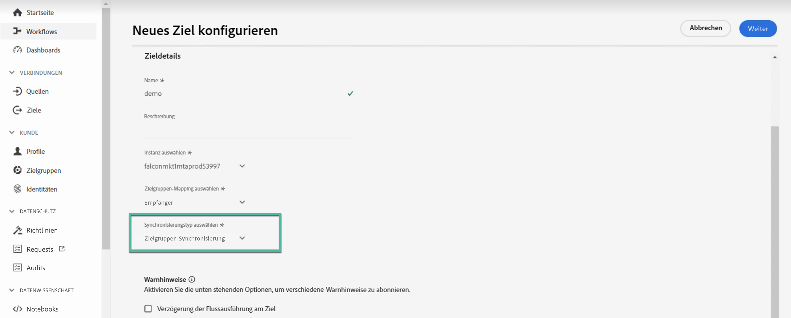

# Verwenden von Campaign und Adobe Experience Platform

Die Ziel- und Quell-Connectoren für Adobe Campaign Managed Cloud Service ermöglichen eine nahtlose Integration zwischen Adobe Campaign und Adobe Experience Platform. Mit dieser Integration können Sie:

* Senden von Adobe Experience Platform-Zielgruppen an Adobe Campaign und Zurücksenden von Versand- und Trackinglogs an Adobe Experience Platform zu Analysezwecken;
* Bringen Sie Adobe Experience Platform-Profilattribute in Adobe Campaign und führen Sie einen Synchronisierungsprozess durch, damit sie regelmäßig aktualisiert werden können.

## Senden von Adobe Experience Platform-Zielgruppen an Campaign {#audiences}

Die wichtigsten Schritte zum Senden von Adobe Experience Platform-Zielgruppen an Adobe Campaign und zum Zurücksenden von Versand- und Trackinglogs sind:

* Verwenden eines Adobe Campaign Managed Cloud Services **Zielverbindung** So senden Sie Experience Platform-Segmente an Adobe Campaign:

   1. Greifen Sie auf den Adobe Experience Platform Destinations-Katalog zu und erstellen Sie eine neue **[!UICONTROL Adobe Campaign Managed Cloud Services]** Verbindung.
   1. Geben Sie Details zur zu verwendenden Campaign-Instanz an und wählen Sie **[!UICONTROL Zielgruppensynchronisierung]** als Synchronisierungstyp.

      {width="800" align="center"}

   1. Wählen Sie die Segmente aus, die an Adobe Campaign gesendet werden sollen.
   1. Konfigurieren Sie die Attribute, die Sie in die Zielgruppe exportieren möchten.
   1. Sobald der Ablauf konfiguriert wurde, stehen die ausgewählten Zielgruppen zur Aktivierung in Adobe Campaign zur Verfügung.

      {width="800" align="center"}

  Detaillierte Informationen zur Konfiguration des Ziels finden Sie unter [Dokumentation zur Verbindung mit Adobe Campaign Managed Cloud Services](https://www.adobe.com/go/destinations-adobe-campaign-managed-cloud-services-en){target="_blank"}

* Verwenden Sie eine **Quellverbindung** von Adobe Campaign Managed Cloud Services, um die Versand- und Trackinglogs von Adobe Campaign an Adobe Experience Platform zu senden:

  Konfigurieren Sie eine neue **Quellverbindung** für Adobe Campaign Managed Cloud Services, um Campaign-Ereignisse in Adobe Experience Platform aufzunehmen. Geben Sie Details zur Campaign-Instanz und zu dem zu verwendenden Schema an, wählen Sie einen Datensatz aus, in den Daten aufgenommen werden sollen, und konfigurieren Sie die abzurufenden Felder. [Erfahren Sie, wie Sie eine Quellverbindung für Adobe Campaign Managed Cloud Services erstellen](https://www.adobe.com/go/sources-campaign-ui-en)

  {width="800" align="center"}

## Profilattribute zwischen Adobe Experience Platform und Adobe Campaign synchronisieren {#profile}

Durch die Verbindung von Adobe Campaign mit Adobe Experience Platform können Sie zusätzliche Profilattribute einbringen, die an ein Profil in Adobe Experience Platform gebunden sind und einen Synchronisierungsprozess durchführen, sodass sie in der Adobe Campaign-Datenbank aktualisiert werden.

Nehmen wir beispielsweise an, Sie erfassen Opt-in- und Opt-out-Werte in Adobe Experience Platform. Mit dieser Verbindung können Sie diese Werte in Adobe Campaign übernehmen und einen Synchronisierungsprozess einrichten, damit sie regelmäßig aktualisiert werden.

>[!NOTE]
>
>Die Synchronisierung von Profilattributen ist für Profile verfügbar, die bereits in der Adobe Campaign-Datenbank vorhanden sind.

Die wichtigsten Schritte zum Synchronisieren von Adobe Experience Platform-Profilattributen mit Adobe Campaign sind:

1. Greifen Sie auf den Adobe Experience Platform Destinations-Katalog zu und erstellen Sie eine neue **[!UICONTROL Adobe Campaign Managed Cloud Services]** Verbindung.
1. Geben Sie Details zur zu verwendenden Campaign-Instanz an und wählen Sie **[!UICONTROL Profilsynchronisierung (nur Aktualisierung)]** als Synchronisierungstyp.

   {width="800" align="center"}

1. Wählen Sie die Segmente aus, die auf die in die Adobe Campaign-Datenbank zu aktualisierenden Profile abzielen.
1. Konfigurieren Sie die Profilattribute, die Sie in Adobe Campaign aktualisieren möchten.
1. Sobald der Ablauf konfiguriert wurde, werden die ausgewählten Profilattribute mit Adobe Campaign synchronisiert und für alle Profile aktualisiert, die auf die im Ziel konfigurierten Segmente ausgerichtet sind.

Detaillierte Informationen zur Konfiguration des Ziels finden Sie unter [Dokumentation zur Verbindung mit Adobe Campaign Managed Cloud Services](https://www.adobe.com/go/destinations-adobe-campaign-managed-cloud-services-en){target="_blank"}