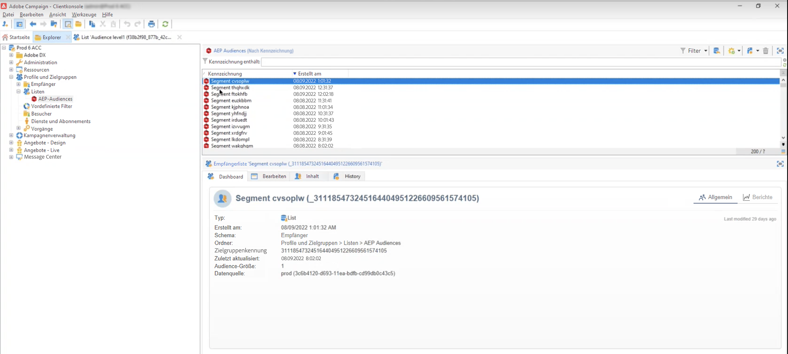

# Verwenden von Campaign und Adobe Experience Platform

Die Ziel- und Quell-Connectoren für Adobe Campaign Managed Cloud Service ermöglichen eine nahtlose Integration zwischen Adobe Campaign und Adobe Experience Platform.

* Verwenden Sie den Ziel-Connector von **Adobe Campaign Managed Cloud Services**, um Experience Platform-Segmente zur Aktivierung an Adobe Campaign zu senden.

   

* Verwenden Sie den Quell-Connector von **Adobe Campaign Managed Cloud Services**, um die Versand- und Trackinglogs von Adobe Campaign an Adobe Experience Platform zu senden.

   

Die Schritte zum Konfigurieren dieser Integration in Adobe Experience Platform lauten wie folgt:

1. Konfigurieren Sie eine neue Zielverbindung für Adobe Campaign Managed Cloud Services, um ein Segment/eine Audience zu aktivieren und diese Daten an Adobe Campaign zu senden.

   Geben Sie Details zu der zu verwendenden Campaign-Instanz an, wählen Sie Segmente aus, die für das Ziel aktiviert werden sollen, und konfigurieren Sie dann die Attribute, die Sie in Campaign exportieren möchten.

   [Erfahren Sie, wie Sie eine Zielverbindung für Adobe Campaign Managed Cloud Services erstellen](https://www.adobe.com/go/destinations-adobe-campaign-managed-cloud-services-en)

1. Konfigurieren Sie eine neuen Quell-Connector für Adobe Campaign Managed Cloud Services, um Campaign-Ereignisse in Adobe Experience Platform aufzunehmen.

   Geben Sie Details zur Campaign-Instanz und zu dem zu verwendenden Schema an, wählen Sie einen Datensatz aus, in den Daten aufgenommen werden sollen, und konfigurieren Sie die abzurufenden Felder.

   [Erfahren Sie, wie Sie eine Quellverbindung für Adobe Campaign Managed Cloud Services erstellen](https://www.adobe.com/go/sources-campaign-ui-en)
