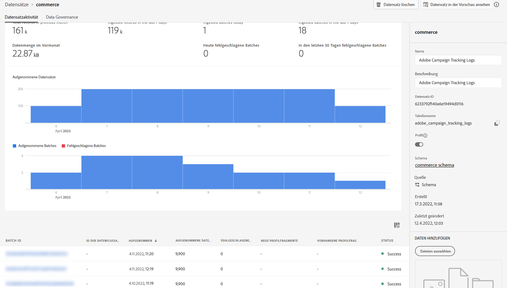

# Campaign und Adobe Experience Platform verwenden

Die Ziel- und Quell-Connectoren für Adobe Campaign Managed Cloud Service ermöglichen eine nahtlose Integration zwischen Adobe Campaign und Adobe Experience Platform:

* Verwendung **Adobe Campaign Managed Cloud Sources-Connector** zum Senden von Experience Platform-Segmenten zur Aktivierung an Adobe Campaign,

   

* Verwendung **Adobe Campaign Managed Cloud Destination Connector** , um Versand- und Trackinglogs von Adobe Campaign an Adobe Experience Platform zu senden.

   

Die Schritte zum Konfigurieren dieser Integration in Adobe Experience Platform lauten wie folgt:

1. Konfigurieren Sie eine neue Adobe Campaign Managed Cloud Services-Zielverbindung, um ein Segment/eine Zielgruppe zu aktivieren und diese Daten an Adobe Campaign zu senden.

   Geben Sie Details zur zu verwendenden Campaign-Instanz an, wählen Sie Segmente aus, die für das Ziel aktiviert werden sollen, und konfigurieren Sie dann die Attribute, die Sie nach Campaign exportieren möchten.

   [Erfahren Sie, wie Sie eine Adobe Campaign Managed Cloud Services-Zielverbindung erstellen](https://www.adobe.com/go/destinations-adobe-campaign-managed-cloud-services-en)

1. Konfigurieren Sie eine neue Adobe Campaign Managed Cloud Services-Quellverbindung, um Campaign-Ereignisse in die Experience Platform von Adobe aufzunehmen.

   Geben Sie Details zur Campaign-Instanz und zum zu verwendenden Schema an, wählen Sie einen Datensatz aus, in den Daten aufgenommen werden sollen, und konfigurieren Sie dann die abzurufenden Felder.

   [Erfahren Sie, wie Sie eine Adobe Campaign Managed Cloud Services-Quellverbindung erstellen](https://www.adobe.com/go/sources-campaign-ui-en)
