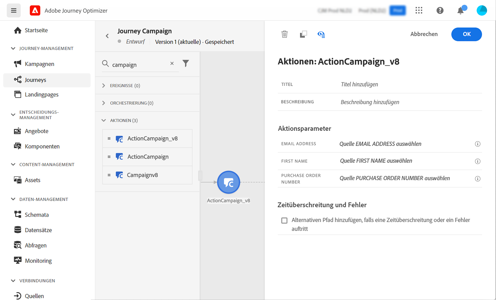

# Arbeiten mit Campaign und Adobe Journey Optimizer

Durch die Integration von Adobe Campaign mit Adobe Journey Optimizer können Sie in Adobe Journey Optimizer Customer Journeys orchestrieren und mithilfe der Transaktionsnachrichten-Funktionen von Adobe Campaign E-Mails, Push-Benachrichtigungen und/oder SMS versenden.

Die wichtigsten Schritte sind die Erstellung einer Transaktionsnachrichtenvorlage in Campaign und die Erstellung des Ereignisses, der Aktion und des Designs der Journey in Adobe Journey Optimizer.

 [Erfahren Sie mehr über diese Integration in diesem End-to-End-Beispiel](https://experienceleague.adobe.com/docs/journey-optimizer/using/orchestrate-journeys/about-journey-building/using-adobe-campaign-classic.html?lang=de){target=&quot;_blank&quot;}.

 [Weitere Informationen finden Sie in der Dokumentation zu Journey Optimizer](https://experienceleague.adobe.com/docs/journey-optimizer/using/orchestrate-journeys/about-journey-building/using-adobe-campaign-classic.html?lang=de){target=&quot;_blank&quot;}.

