# Campaign und Adobe Target verwenden

Verbinden Sie Campaign und Target , um ein Angebot aus Adobe Target in einen Adobe Campaign-E-Mail-Versand aufzunehmen.

Diese Integration hilft Ihnen bei der Implementierung von Anwendungsfällen wie folgt: Wenn ein Empfänger eine über Adobe Campaign gesendete E-Mail öffnet, ermöglicht es Ihnen ein Aufruf an Adobe Target, eine dynamische Version des Inhalts anzuzeigen. Diese dynamische Version wird anhand von bei der E-Mail-Erstellung definierten Regeln berechnet.

>[!NOTE]
>Im Rahmen der Integration werden nur statische Bilder unterstützt. Die anderen Inhaltstypen können nicht personalisiert werden.

:Sprache_Ballon: Als Benutzer von Managed Cloud Services kontaktieren Sie [Adobe](../start/campaign-faq.md#support), um Experience Cloud-Trigger in Campaign zu implementieren.

Die folgenden Datentypen können von Adobe Target verwendet werden:

* Daten aus der Adobe Campaign-Datenbank
* Segmente, die mit der Besucher-ID in Adobe Target verknüpft sind, nur dann, wenn die verwendeten Daten keinen rechtlichen Beschränkungen unterliegen
* Daten aus Adobe Target (user agent, IP address, Daten bezüglich der Geolokalisierung).

## Dynamischen Inhalt einfügen

Im folgenden Beispiel erfahren Sie, wie Sie **ein dynamisches Angebot** aus Adobe Target in eine Adobe Campaign-E-Mail integrieren.

Wir möchten eine Nachricht mit einem Bild erstellen, das sich je nach Land des Empfängers dynamisch ändert. Die Daten werden bei jeder mbox-Abfrage gesendet und sind abhängig von der IP-Adresse des Besuchers.

Wir möchten, dass eines der Bilder in dieser E-Mail entsprechend den folgenden Benutzererlebnissen dynamisch angepasst wird:

* Die E-Mail wird in Frankreich geöffnet.
* Die E-Mail wird in den USA geöffnet.
* Wenn keine dieser Bedingungen zutrifft, wird ein Standardbild angezeigt.

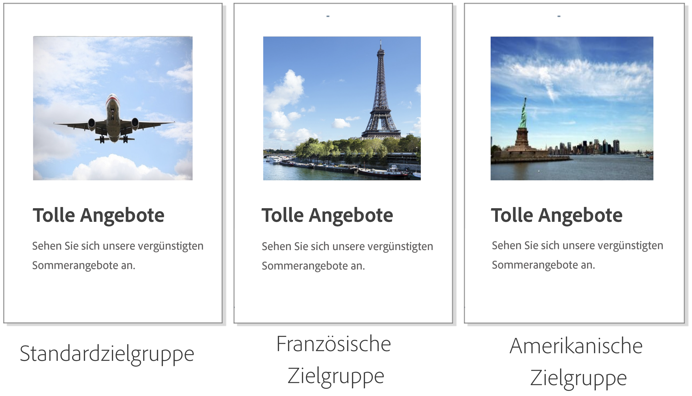

Die folgenden Schritte müssen in Adobe Campaign und Adobe Target durchgeführt werden:

1. [Dynamisches Angebot in eine E-Mail einfügen](#inserting-dynamic-offer)
1. [Erstellen von Umleitungsangeboten](#create-redirect-offers)
1. [Erstellen von Zielgruppen](#audiences-target)
1. [Erstellen einer Erlebnis-Targeting-Aktivität](#creating-targeting-activity)
1. [Vorschau erstellen und Nachricht senden](#preview-send-email)

### Dynamisches Angebot in eine E-Mail einfügen {#inserting-dynamic-offer}

Definieren Sie in Adobe Campaign die Zielgruppe und den Inhalt Ihrer E-Mail. Sie können ein dynamisches Bild aus Adobe Target einfügen.

Geben Sie dazu die URL des Standardbilds, den Standortnamen und die Felder an, die Sie an Adobe Target übertragen möchten.

In Adobe Campaign gibt es zwei Möglichkeiten, ein dynamisches Bild von Target in eine E-Mail einzufügen:

* Wenn Sie den Digital Content Editor verwenden, wählen Sie ein vorhandenes Bild und dann aus der Symbolleiste **[!UICONTROL Einfügen]** > **[!UICONTROL Dynamisches Bild von Adobe Target]**.

   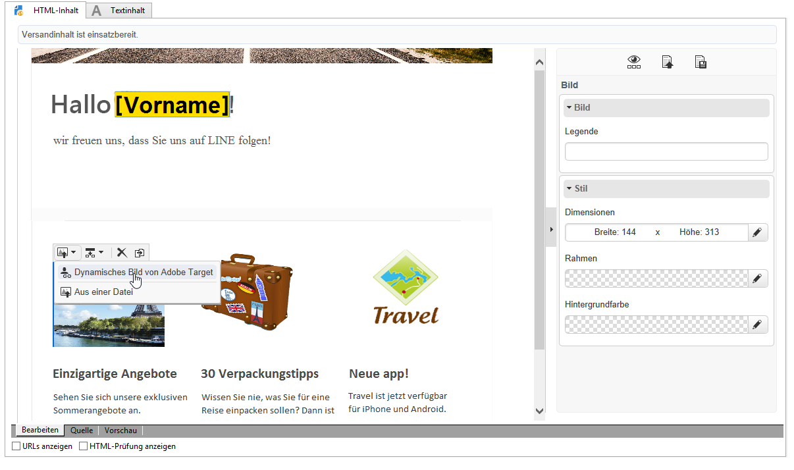

* Wenn Sie den Standardeditor verwenden, platzieren Sie den Cursor an die Stelle, an der das Bild eingefügt werden soll, und wählen Sie aus dem Dropdown-Menü „Personalisierung“ **[!UICONTROL Einfügen]** > **[!UICONTROL Dynamisches Bild von Adobe Target...]**.

   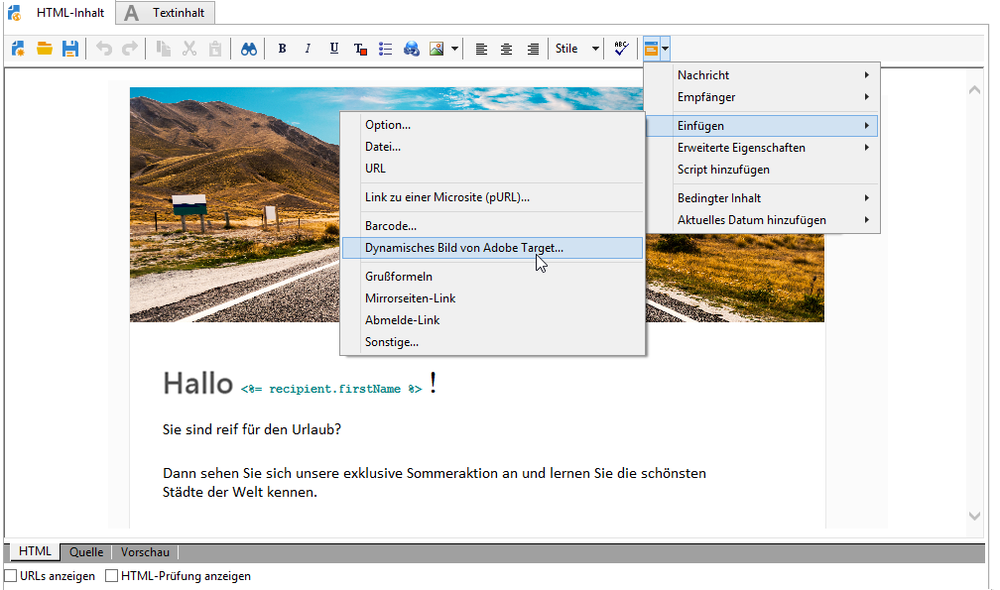

Anschließend können Sie die Bildparameter definieren:

* Die URL von **[!UICONTROL Standardbild]** ist das Bild, das angezeigt wird, wenn keine der Bedingungen erfüllt ist. Sie können auch ein Bild aus Ihrer Assets-Bibliothek verwenden.
* Der **[!UICONTROL Target-Speicherort]** ist der Name des Standorts Ihres dynamischen Angebots. Sie müssen diesen Ort in Ihrer Adobe Target-Aktivität auswählen.
* Mit **[!UICONTROL Landingpage]** können Sie das Standardbild zu einer Standard-Landingpage umleiten. Diese URL gilt nur, wenn das Standardbild in der endgültigen E-Mail angezeigt wird. Dies ist optional.
* Die **[!UICONTROL Zusätzliche Entscheidungsparameter]** definieren die Zuordnung zwischen den in den Adobe Target-Segmenten definierten Feldern und den Feldern in Adobe Campaign. Die in Adobe Campaign verwendeten Felder müssen zuvor in der Rawbox angegeben werden. In unserem Beispiel haben wir das Feld „Country“ (Land) hinzugefügt.

Wenn Sie in Ihren Einstellungen in Adobe Target Unternehmensberechtigungen verwenden, fügen Sie die entsprechende Eigenschaft in dieses Feld ein. Weitere Informationen zu Unternehmensberechtigungen in Target finden Sie auf [dieser Seite](https://experienceleague.adobe.com/docs/target/using/administer/manage-users/enterprise/properties-overview.html?lang=en#administer).

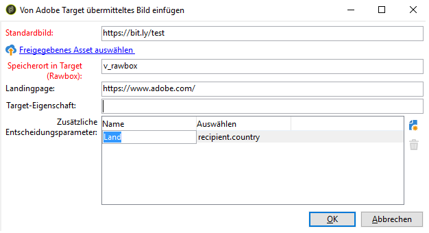

### Erstellen von Umleitungsangeboten {#create-redirect-offers}

In Adobe Target können Sie verschiedene Angebotsversionen erstellen. Für jedes Benutzererlebnis können Sie ein spezifisches Umleitungsangebot definieren und ein anderes Bild wählen.

In unserem Fall benötigen wir zwei Umleitungsangebote. Das dritte (das Standardangebot) wird in Adobe Campaign definiert.

1. Um in Target Standard ein neues Umleitungsangebot zu erstellen, klicken Sie auf dem Tab **[!UICONTROL Inhalt]** auf **[!UICONTROL Code-Angebote]**.

1. Klicken Sie auf **[!UICONTROL Erstellen]** und dann auf **[!UICONTROL Umleitungsangebot]**.

   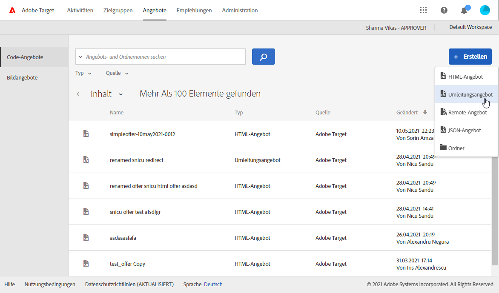

1. Geben Sie einen Namen für das Angebot und die URL Ihres Bildes ein.

   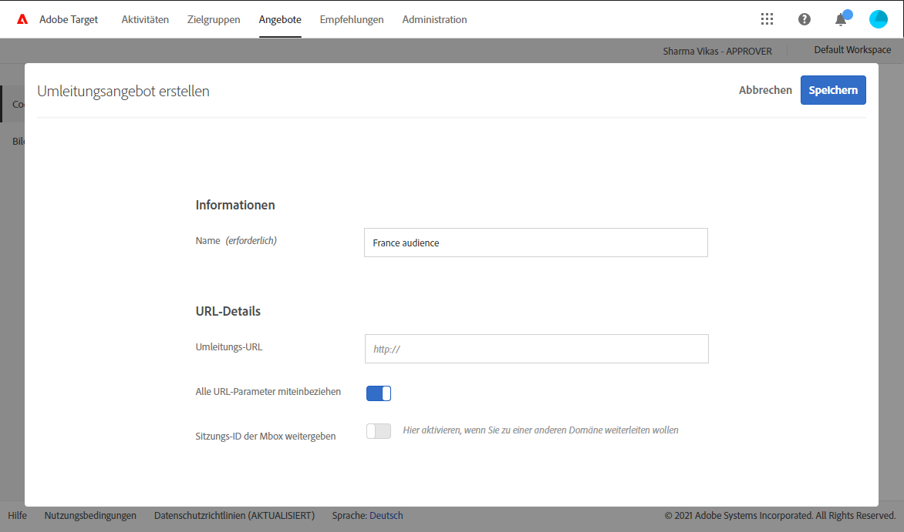

1. Führen Sie dieselben Schritte für das andere Umleitungsangebot durch. Weiterführende Informationen hierzu finden Sie auf dieser [Seite](https://experienceleague.adobe.com/docs/target/using/experiences/offers/offer-redirect.html?lang=en#experiences).

### Erstellen von Zielgruppen {#audiences-target}

In Adobe Target müssen Sie die beiden Zielgruppen erstellen, in die die Besucher Ihres Angebots unterteilt werden und die den unterschiedlichen Inhalten zugeordnet werden. Fügen Sie für jede Zielgruppe eine Regel hinzu, um festzulegen, wer das Angebot sehen kann.

1. Um in Target eine neue Zielgruppe zu erstellen, klicken Sie auf dem Tab **[!UICONTROL Audiences]** auf **[!UICONTROL Zielgruppe erstellen]**.

   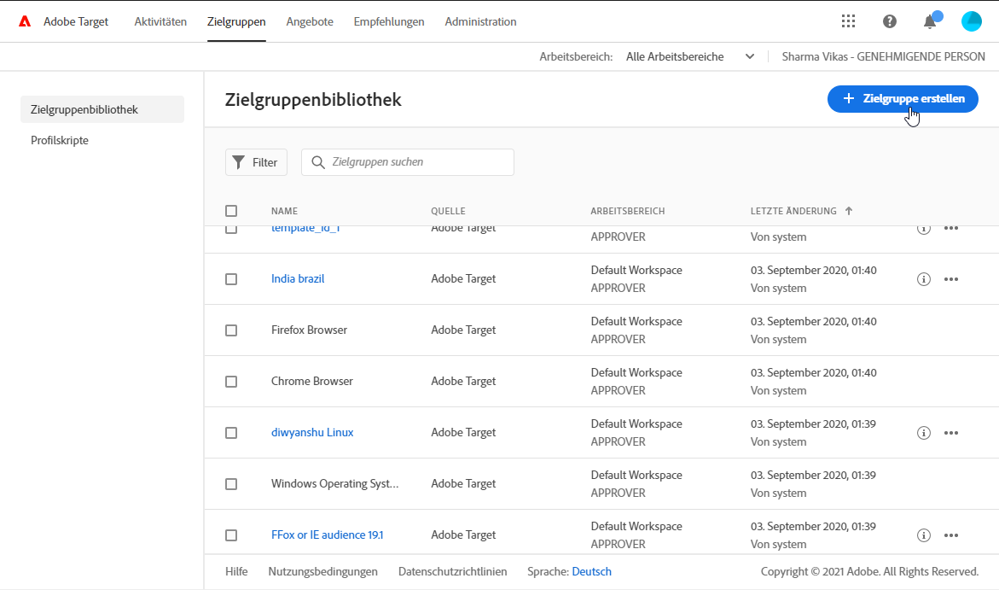

1. Fügen Sie Ihrer Zielgruppe einen Namen hinzu.

   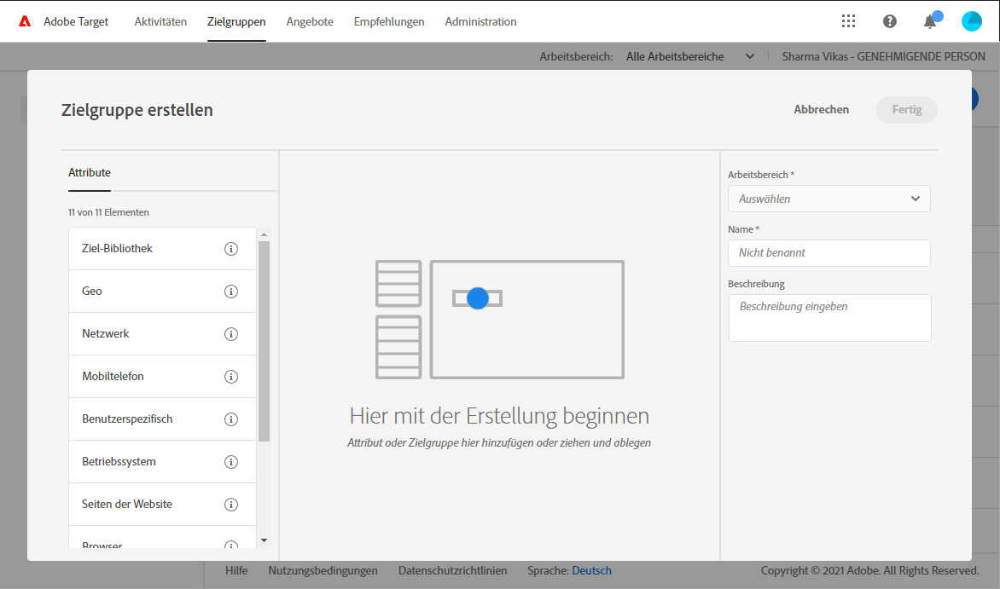

1. Klicken Sie auf **[!UICONTROL Add a rule (Regel hinzufügen)]** und wählen Sie eine Kategorie aus. Die Regel benutzt spezifische Kriterien für die Besucher. Sie können die Regeln verfeinern, indem Sie Bedingungen hinzufügen oder neue Regeln in anderen Kategorien erstellen.

1. Führen Sie dieselben Schritte für die anderen Zielgruppen durch.

### Erstellen einer Erlebnis-Targeting-Aktivität {#creating-targeting-activity}

In Adobe Target müssen wir eine Erlebnis-Targeting-Aktivität erstellen, die verschiedenen Erlebnisse definieren und sie mit den entsprechenden Angeboten verknüpfen.

Definieren Sie zunächst die Zielgruppe:

1. Um eine Erlebnis-Targeting-Aktivität zu erstellen, klicken Sie auf dem Tab **[!UICONTROL Aktivitäten]** auf **[!UICONTROL Aktivität erstellen]** und dann auf **[!UICONTROL Erlebnis-Targeting]**.

   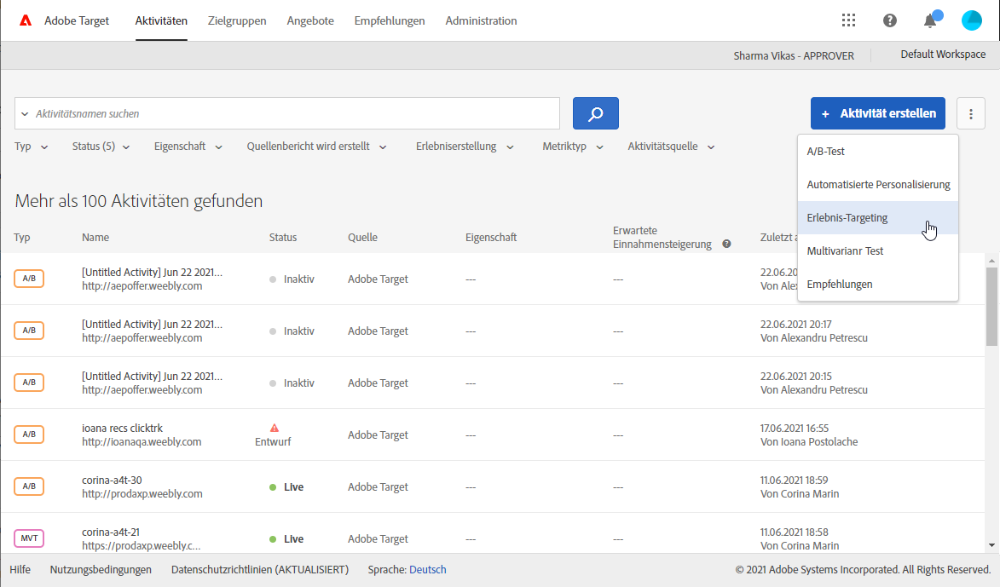

1. Wählen Sie **[!UICONTROL Formular]** als **[!UICONTROL Experience Composer]**.

1. Wählen Sie eine Zielgruppe aus, indem Sie auf die Schaltfläche **[!UICONTROL Audience ändern]** klicken.

   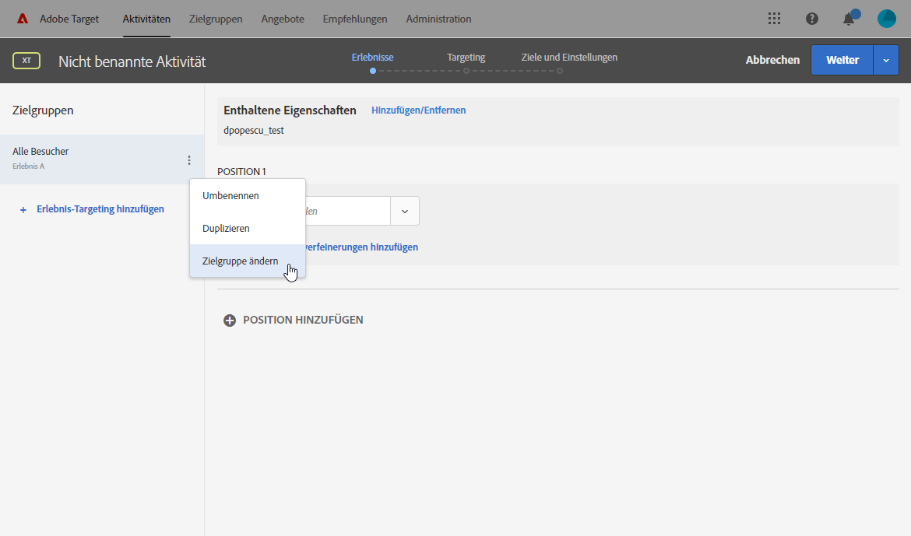

1. Wählen Sie die Zielgruppe aus, die in den vorherigen Schritten erstellt wurde.

   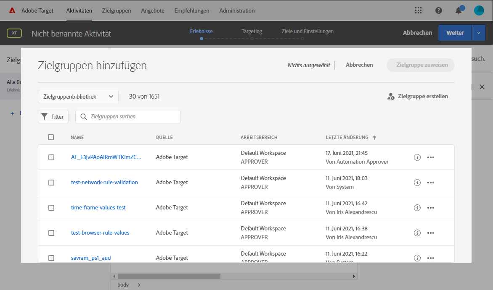

1. Erstellen Sie ein weiteres Erlebnis durch Anklicken von **[!UICONTROL Erlebnis-Targeting hinzufügen]**.

Fügen Sie dann für jede Zielgruppe Inhalt hinzu:

1. Wählen Sie den Namen des Speicherorts, den Sie beim Einfügen des dynamischen Angebots in Adobe Campaign festgelegt haben.

   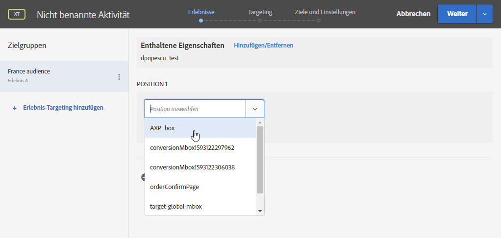

1. Klicken Sie auf die Dropdown-Schaltfläche und wählen Sie **[!UICONTROL Umleitungsangebot ändern]** aus.

   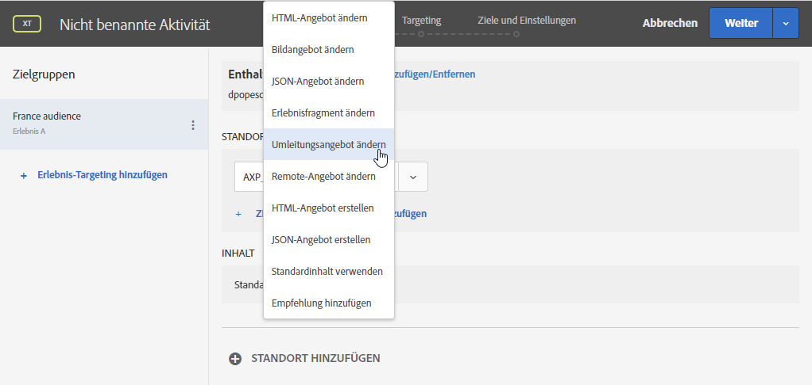

1. Wählen Sie das zuvor erstellte Umleitungsangebot aus.

   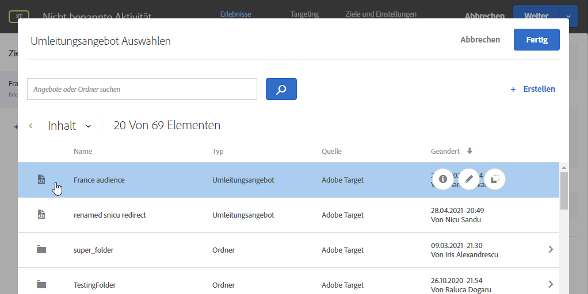

1. Führen Sie dieselben Schritte für das zweite Erlebnis aus.

Im Fenster **[!UICONTROL Target]** finden Sie einen Überblick über Ihre Aktivitäten. Bei Bedarf können Sie weitere Erlebnisse hinzufügen.

Im Fenster **[!UICONTROL Ziele und Einstellungen]** können Sie Ihre Aktivität personalisieren, indem Sie eine Priorität, ein Ziel oder eine Dauer festlegen.

Im Abschnitt **[!UICONTROL Einstellungen für die Berichterstellung]** können Sie eine Aktion auswählen und die Parameter bearbeiten, anhand derer bestimmt wird, wann die Zielvorgabe erreicht ist.

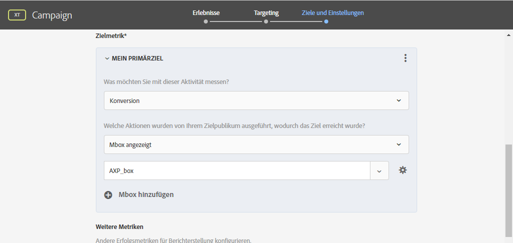

## Vorschau erstellen und Nachricht senden {#preview-send-email}

Sie können nun in Adobe Campaign Ihre E-Mail in der Vorschau ansehen und ihre Darstellung bei verschiedenen Empfängern testen.

Sie werden bemerken, dass sich das Bild entsprechend den unterschiedlichen Erlebnissen ändert.

Jetzt können Sie Ihre E-Mail einschließlich eines dynamischen Angebots von Target versenden.

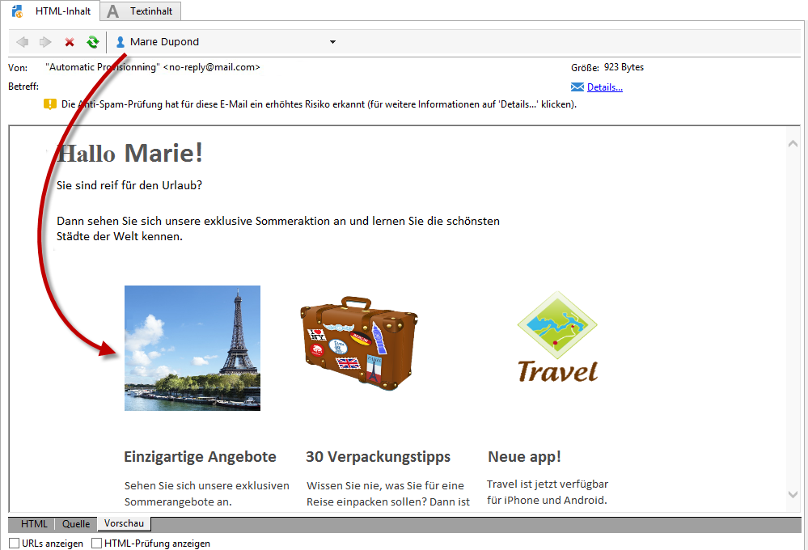
