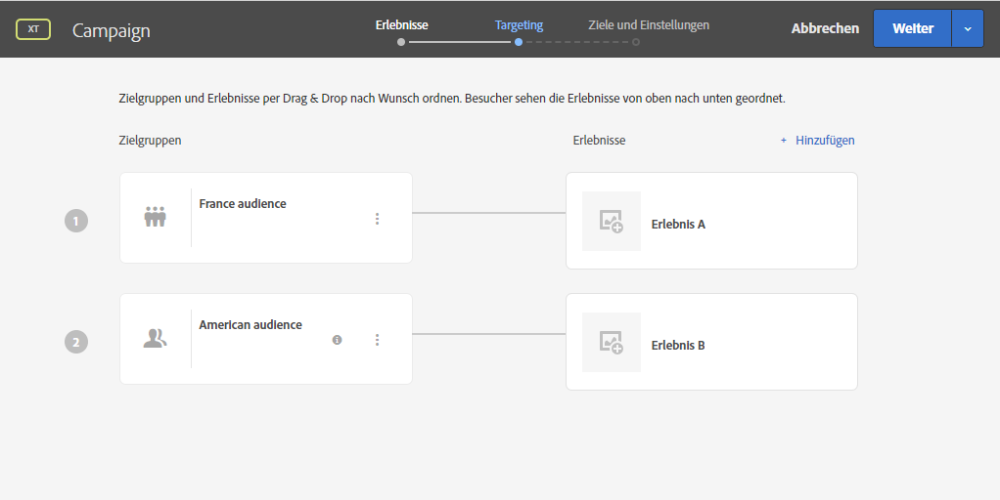

# Campaign und Adobe Target verwenden

Verbinden Sie Campaign und Target, um ein Angebot aus Adobe Target in einen Adobe Campaign-E-Mail-Versand aufzunehmen.

Diese Integration hilft Ihnen wie folgt beim Implementieren von Anwendungsfällen: Wenn ein Empfänger eine per Adobe Campaign gesendete E-Mail öffnet, können Sie mit einem Aufruf an Adobe Target eine dynamische Inhaltsversion anzeigen. Diese dynamische Version wird anhand von bei der E-Mail-Erstellung definierten Regeln berechnet.

>[!NOTE]
>Im Rahmen der Integration werden nur statische Bilder unterstützt. Die anderen Inhaltstypen können nicht personalisiert werden.

  Als Benutzer von Managed Cloud Services [kontaktieren Sie Adobe](../start/campaign-faq.md#support), um Experience Cloud Triggers mit Campaign zu implementieren.

Mit Adobe Target können folgende Datentypen zum Einsatz kommen:

* Daten aus der Adobe Campaign-Datenbank
* Mit der Besucher-ID in Adobe Target gruppierte Segmente, wenn die verwendeten Daten keinen rechtlichen Beschränkungen unterliegen
* Daten aus Adobe Target (Benutzeragent, IP-Adresse, Daten bezüglich der Geolokalisierung).

## Einfügen eines dynamischen Inhalts

Im folgenden Beispiel erfahren Sie, wie Sie **ein dynamisches Angebot** aus Adobe Target in eine Adobe Campaign-E-Mail integrieren können.

Wir möchten eine Nachricht erstellen, die ein Bild enthält, das sich je nach Land des Empfängers dynamisch ändert. Die Daten werden bei jeder mbox-Abfrage gesendet und sind abhängig von der IP-Adresse des Besuchers.

Wir möchten, dass eines der Bilder in dieser E-Mail entsprechend den folgenden Benutzererlebnissen dynamisch angepasst wird:

* Die E-Mail wird in Frankreich geöffnet.
* Die E-Mail wird in den USA geöffnet.
* Wenn keine dieser Bedingungen zutrifft, wird ein Standardbild angezeigt.

In Adobe Campaign und Adobe Target müssen folgende Schritte vorgenommen werden:

1. [Dynamisches Angebot in eine E-Mail einfügen](#inserting-dynamic-offer)
1. [Umleitungsangebote erstellen](#create-redirect-offers)
1. [Audiences erstellen](#audiences-target)
1. [Experience Targeting-Aktivität erstellen](#creating-targeting-activity)
1. [Vorschau anzeigen und Nachricht senden](#preview-send-email)

### Dynamisches Angebot in eine E-Mail einfügen {#inserting-dynamic-offer}

Definieren Sie in Adobe Campaign die Zielgruppe und den Inhalt Ihrer E-Mail. Sie können ein dynamisches Bild aus Adobe Target einfügen.

Geben Sie dazu die URL des Standardbilds an, den Speicherort und die Felder, die an Adobe Target übermittelt werden sollen.

In Adobe Campaign gibt es zwei Möglichkeiten, ein dynamisches Bild von Target in eine E-Mail einzufügen:

* Wenn Sie den Digital Content Editor verwenden, wählen Sie ein vorhandenes Bild und dann aus der Symbolleiste **[!UICONTROL Einfügen]** > **[!UICONTROL Dynamisches Bild von Adobe Target]**.

   

* Wenn Sie den Standardeditor verwenden, platzieren Sie den Cursor an die Stelle, an der das Bild eingefügt werden soll, und wählen Sie aus dem Dropdown-Menü &quot;Personalisierung&quot; **[!UICONTROL Einfügen]** > **[!UICONTROL Dynamisches Bild von Adobe Target...]**.

   

Anschließend können Sie die Bildparameter definieren:

* Die URL des **[!UICONTROL Standardbilds]** ist das Bild, das angezeigt wird, wenn keine der Bedingungen erfüllt ist. Sie können auch ein Bild aus Ihrer Assets-Bibliothek verwenden.
* Der **[!UICONTROL Zielspeicherort]** ist der Name des Speicherorts Ihres dynamischen Angebots. Sie müssen diesen Speicherort später in Ihrer Adobe Target-Aktivität auswählen.
* Mit der **[!UICONTROL Landingpage]** können Sie das Standardbild zu einer standardmäßigen Landingpage weiterleiten. Diese URL gilt nur, wenn in der letzten E-Mail das Standardbild angezeigt wird. Das ist optional.
* Im Bereich **[!UICONTROL Zusätzliche Entscheidungsparameter]** wird das Mapping zwischen den in den Adobe Target-Segmenten definierten Feldern und den Feldern in Adobe Campaign hergestellt. Die in Adobe Campaign verwendeten Felder müssen zuvor in der Rawbox angegeben werden. In unserem Beispiel haben wir das Feld &quot;Country&quot; (Land) hinzugefügt.

Wenn Sie in Ihren Einstellungen in Adobe Target Unternehmensberechtigungen verwenden, fügen Sie die entsprechende Eigenschaft in dieses Feld ein. Weitere Informationen zu Unternehmensberechtigungen in Target finden Sie auf [dieser Seite](https://experienceleague.adobe.com/docs/target/using/administer/manage-users/enterprise/properties-overview.html?lang=de#administer).

### Umleitungsangebote erstellen {#create-redirect-offers}

In Adobe Target können Sie für ein Angebot unterschiedliche Versionen erstellen. Für jedes Benutzererlebnis können Sie ein spezifisches Umleitungsangebot definieren und ein anderes Bild wählen.

In unserem Fall benötigen wir zwei Umleitungsangebote. Das dritte (das Standardangebot) wird in Adobe Campaign definiert.

1. Um in Target Standard ein neues Umleitungsangebot zu erstellen, klicken Sie auf dem Tab **[!UICONTROL Inhalt]** auf **[!UICONTROL Code-Angebote]**.

1. Klicken Sie auf **[!UICONTROL Erstellen]** und dann auf **[!UICONTROL Umleitungsangebot]**.

   

1. Geben Sie einen Namen für das Angebot und die URL Ihres Bildes ein.

   

1. Führen Sie dieselben Schritte für das andere Umleitungsangebot durch. Weiterführende Informationen hierzu finden Sie auf dieser [Seite](https://experienceleague.adobe.com/docs/target/using/experiences/offers/offer-redirect.html?lang=de#experiences).

### Audiences erstellen {#audiences-target}

Erstellen Sie in Adobe Target die zwei Audiences, in die die Besucher Ihres Angebots unterteilt werden und denen die unterschiedlichen Inhalte präsentiert werden. Fügen Sie für jede Audience eine Regel hinzu, um festzulegen, wer das Angebot sehen kann.

1. Um in Target eine neue Audience zu erstellen, klicken Sie auf dem Tab **[!UICONTROL Zielgruppen]** auf **[!UICONTROL Zielgruppe erstellen]**.

   

1. Fügen Sie Ihrer Audience einen Namen hinzu.

   

1. Klicken Sie auf **[!UICONTROL Add a rule (Regel hinzufügen)]** und wählen Sie eine Kategorie aus. Die Regel benutzt spezifische Kriterien für die Besucher. Sie können die Regeln verfeinern, indem Sie Bedingungen hinzufügen oder neue Regeln in anderen Kategorien erstellen.

1. Führen Sie dieselben Schritte für die anderen Audiences durch.

### Experience Targeting-Aktivität erstellen {#creating-targeting-activity}

Wir müssen in Adobe Target eine Experience Targeting-Aktivität erstellen, die diversen Erlebnisse definieren und sie mit den entsprechenden Angeboten verknüpfen.

Zuerst müssen Sie die Audience definieren:

1. Um eine Experience Targeting-Aktivität zu erstellen, klicken Sie auf dem Tab **[!UICONTROL Aktivitäten]** auf **[!UICONTROL Aktivität erstellen]** und dann auf **[!UICONTROL Experience Targeting]**.

   

1. Wählen Sie **[!UICONTROL Formular]** als **[!UICONTROL Experience Composer]**.

1. Wählen Sie eine Audience aus, indem Sie auf die Schaltfläche **[!UICONTROL Zielgruppe ändern]** klicken.

   

1. Wählen Sie die Audience aus, die in den vorherigen Schritten erstellt wurde.

   

1. Erstellen Sie ein weiteres Erlebnis durch Klicken auf **[!UICONTROL Experience Targeting hinzufügen]**.

Fügen Sie dann für jede Audience Inhalt hinzu:

1. Wählen Sie den Namen des Speicherorts, den Sie beim Einfügen des dynamischen Angebots in Adobe Campaign festgelegt haben.

   

1. Klicken Sie auf die Dropdown-Schaltfläche und wählen Sie **[!UICONTROL Umleitungsangebot ändern]** aus.

   

1. Wählen Sie das zuvor erstellte Umleitungsangebot aus.

   

1. Führen Sie dieselben Schritte für das zweite Erlebnis aus.

Im Fenster **[!UICONTROL Target]** finden Sie einen Überblick über Ihre Aktivitäten. Bei Bedarf können Sie weitere Erlebnisse hinzufügen.

Im Fenster **[!UICONTROL Ziele und Einstellungen]** können Sie Ihre Aktivität personalisieren, indem Sie eine Priorität, ein Ziel oder eine Dauer festlegen.

Im Abschnitt **[!UICONTROL Einstellungen für die Berichterstellung]** können Sie eine Aktion auswählen und die Parameter bearbeiten, anhand derer bestimmt wird, wann die Zielvorgabe erreicht ist.

## Vorschau anzeigen und Nachricht senden {#preview-send-email}

Sie können nun in Adobe Campaign Ihre E-Mail in der Vorschau ansehen und ihre Darstellung bei verschiedenen Empfängern testen.

Sie werden bemerken, dass sich das Bild entsprechend den unterschiedlichen Erlebnissen ändert.

Jetzt können Sie Ihre E-Mail einschließlich eines dynamischen Angebots von Target versenden.

