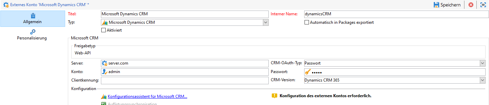

# Arbeiten mit Campaign und Microsoft Dynamics 365{#crm-ms-dynamics}

Aktivieren Sie Ihre CRM-Daten für Cross-Channel-Kommunikation: Erfahren Sie, wie Sie Kontakte von **Microsoft Dynamics 365** an Adobe Campaign übertragen und Kampagnenleistungsdaten (Sendungen, Öffnungen, Klicks und Bounces) von Adobe Campaign in Microsoft Dynamics 365 freigeben können.

Sobald die Konfiguration abgeschlossen ist, wird die Datensynchronisation zwischen den Systemen über eine spezielle Workflow-Aktivität durchgeführt. [Weitere Informationen](crm-data-sync.md).

>[!NOTE]
>
>Unterstützte Microsoft Dynamics-Versionen werden in der [Kompatibilitätsmatrix](../start/compatibility-matrix.md) von Campaign aufgeführt.

Gehen Sie wie folgt vor, um ein dediziertes externes Konto für den Import und Export von Microsoft Dynamics 365-Daten in Adobe Campaign zu konfigurieren.

Für jedes System müssen diese Schritte von einem Administrator ausgeführt werden.

>[!CAUTION]
> Die Schritte in dieser Dokumentation helfen Ihnen beim Erstellen von Integrationen/Registrierungen, die die Zuweisung von Berechtigungen und/oder Administratorzugriff erfordern. Sie müssen vor der Ausführung sicherstellen, dass diese Schritte den Richtlinien Ihres Unternehmens entsprechen, und die Schritte dann sorgfältig durchführen.

## Microsoft Dynamics 365 konfigurieren {#config-crm-microsoft}

Um Microsoft Dynamics 365 mit Adobe Campaign über die **Web-API** zu verbinden, melden Sie sich bei [Microsoft Azure Directory](https://portal.azure.com) mit den Anmeldedaten eines **globalen Administrators** an und führen Sie die folgenden Schritte aus:

1. Rufen Sie Ihre Dynamics 365-Anwendungs-ID (Client) ab. [Weitere Informationen](#get-client-id-microsoft)
1. Generieren Sie die Microsoft Dynamics-Zertifikatschlüsselkennung und Schlüssel-ID. [Weitere Informationen](#config-certificate-key-id)
1. Konfigurieren Sie Berechtigungen. [Weitere Informationen](#config-permissions-microsoft)
1. Erstellen Sie einen Anwender. [Weitere Informationen](#create-app-user-microsoft)
1. Verschlüsseln Sie den privaten Schlüssel. [Weitere Informationen](#configure-acc-for-microsoftt)


### Abrufen der Dynamics 365 Client-ID {#get-client-id-microsoft}

Um die Anwendungs-(Client-) ID abzurufen, müssen Sie eine Anwendung in Azure Active Directory registrieren.

1. Gehen Sie zu **Azure Active Directory > App-Registrierungen** und klicken Sie auf **Neue Registrierung**.
1. Geben Sie einen eindeutigen Namen ein, der zur Identifizierung einer Instanz verwendet werden kann, z. B. **adobeccampaign`<instance identifier>`**.

Nach dem Speichern weist Microsoft Azure Directory Ihrer Anwendung eine eindeutige **Anwendungs-(Client-)-ID** zu. Sie benötigen diese ID später bei der Konfiguration von Dynamics 365 in Adobe Campaign.

Weitere Informationen finden Sie in der [Dokumentation zu Microsoft Dynamics 365](https://docs.microsoft.com/powerapps/developer/common-data-service/walkthrough-register-app-azure-active-directory){target="_blank"}.

### Generieren der Microsoft Dynamics-Zertifikatschlüsselkennung und Schlüssel-ID {#config-certificate-key-id}

Um die **Zertifikatschlüsselkennung (customKeyIdentifier)** und die **Schlüssel-ID (keyId)** abzurufen, müssen Sie ein Zertifikat hochladen. Zertifikate können beim Anfordern eines Tokens als Geheimnisse zum Nachweis der Identität der Anwendung verwendet werden. Sie können auch als öffentliche Schlüssel bezeichnet werden.

Gehen Sie wie folgt vor:

1. Gehen Sie zu **Azure Active Directory > App-Registrierungen** und wählen Sie die zuvor erstellte Anwendung aus.
1. Wählen Sie **Zertifikate und Geheimnis** aus.
1. Klicken Sie auf der Registerkarte **Zertifikate** auf **Zertifikat hochladen**.
1. Laden Sie Ihr öffentliches Zertifikat hoch.
1. Klicken Sie auf den Link **Manifest**, um die **Zertifikatschlüsselkennung (customKeyIdentifier)** und die **Schlüssel-ID (keyId)** abzurufen.

Die **Zertifikatschlüsselkennung (customKeyIdentifier)** und die **Schlüssel-ID (keyId)** werden in Campaign benötigt, um Ihr externes Microsoft Dynamics 365 CRM-Konto mit dem **[!UICONTROL CRM-OAuth-Zertifikat]** zu konfigurieren.

+++ Generieren des öffentlichen Zertifikats

Zum Generieren des Zertifikats können Sie &quot;openssl&quot; verwenden.

Beispiel:

```
- openssl req -x509 -sha256 -nodes -days 365 -newkey rsa:2048 -keyout '<'private key name'>' -out '<'public certificate name'>
```

>[!NOTE]
>
>Sie können die Anzahl der Tage, hier `-days 365`, im Code-Beispiel ändern, sodass der Gültigkeitszeitraum des Zertifikats verlängert wird.

Anschließend müssen Sie das Zertifikat in base64 kodieren. Dazu können Sie einen Base64-Encoder oder die Befehlszeile `base64 -w0 private.key` für Linux verwenden.

+++

### Berechtigungen konfigurieren {#config-permissions-microsoft}

**Schritt 1**: Konfigurieren Sie die **erforderlichen Berechtigungen** für die erstellte Anwendung.

1. Navigieren Sie zu **Azure Active Directory > App-Registrierungen** und wählen Sie die zuvor erstellte Anwendung aus.
1. Klicken Sie oben links auf **Einstellungen**.
1. Klicken Sie unter **Erforderliche Berechtigungen** auf **Hinzufügen** und **wählen Sie eine API > Dynamics CRM Online**.
1. Klicken Sie auf **Auswählen**, aktivieren Sie die Checkbox **Zugriff auf Dynamics 365 als Organisationsbenutzer** und klicken Sie erneut auf **Auswählen**.
1. Wählen Sie dann aus Ihrer Anwendung das **Manifest** unter dem Menü **Verwalten** aus.
1. Ändern Sie im **Manifest**-Editor die Eigenschaft `allowPublicClient` von `null` auf `true` und klicken Sie auf **Speichern**.

**Schritt 2**: Erteilen Sie die Zustimmung durch den Administrator

1. Gehen Sie zu **Azure Active Directory > Enterprise-Anwendungen**.
1. Wählen Sie die Anwendung aus, der Sie eine mandantenweite Administrator-Zustimmung erteilen möchten.
1. Wählen Sie im Menü im linken Fensterbereich unter **Sicherheit** die Option **Berechtigungen** aus.
1. Klicken Sie auf **Administratorzustimmung erteilen**.

Weiterführende Informationen dazu finden Sie in der [Dokumentation zu Azure](https://docs.microsoft.com/azure/active-directory/manage-apps/grant-admin-consent#grant-admin-consent-from-the-azure-portal).

### Anwender erstellen {#create-app-user-microsoft}

>[!NOTE]
>
> Dieser Schritt ist bei der Authentifizierung mit **[!UICONTROL einem Passwort]** optional.

Der Anwendungsbenutzer ist derjenige Benutzer, den die oben registrierte Anwendung verwenden wird. Alle Änderungen, die mit der oben registrierten Anwendung an Microsoft Dynamics vorgenommen werden, erfolgen über diesen Benutzer.

**Schritt 1**: Einen nicht interaktiven Benutzer in Azure Active Directory erstellen

1. Klicken Sie auf **Azure Active Directory > Benutzer** und dann auf **Neuer Benutzer**.
1. Geben Sie einen geeigneten Namen ein, den Sie verwenden möchten; der Benutzername sollte im E-Mail-Format vorliegen.
1. Wählen Sie **Dynamics 365-Administrator** in der **Verzeichnisrolle**.

**Schritt 2**: Dem erstellten Benutzer eine ordnungsgemäße Lizenz zuweisen

1. Klicken Sie in [Microsoft Azure](https://portal.azure.com) auf **Admin-App**.
1. Navigieren Sie zu **Benutzer > Aktive Benutzer** und klicken Sie auf den neu erstellten Benutzer.
1. Klicken Sie auf **Produktlizenzen bearbeiten** und wählen Sie **Dynamics 365 Customer Engagement-Plan**.
1. Klicken Sie auf **Schließen**.

**Schritt 3**: Anwendungsbenutzer in Dynamics CRM erstellen

1. Navigieren Sie von [Microsoft Azure](https://portal.azure.com) zu **Einstellungen > Sicherheit > Benutzer**.
1. Klicken Sie auf die Dropdown-Liste, wählen Sie dann **Anwender** und klicken Sie auf **Neu**.
1. Verwenden Sie denselben Benutzernamen wie für den Benutzer, der oben in Active Directory erstellt wurde.
1. Weisen Sie die **Anwendungs-ID** für [die zuvor erstellte Anwendung zu](#get-client-id-microsoft).
1. Klicken Sie auf **Rollen verwalten** und wählen Sie den Benutzer die Rolle **Systemadministrator** für aus.

## Campaign konfigurieren {#configure-acc-for-microsoft}

### Erstellen der Verbindung{#new-ms-dyn-external-account}

Zunächst müssen Sie das externe Microsoft Dynamics 365-Konto erstellen.

1. Durchsuchen Sie den Knoten **[!UICONTROL Administration > Plattform > Externe Konten]** im Campaign Explorer und erstellen Sie ein externes Konto.
1. Wählen Sie das externe Konto **[!UICONTROL Microsoft Dynamics CRM]** im Abschnitt **Typ** aus.
1. Wählen Sie die Authentifizierungsmethode in der Dropdown-Liste **[!UICONTROL CRM-O-Auth-Typ]** aus.

   

   1. Um das externe Microsoft Dynamics CRM-Konto für die Verbindung mit Adobe Campaign mit **Passwort-Zugangsdaten** zu konfigurieren, geben Sie die folgenden Details an:

      * **Server**: URL Ihres Microsoft CRM-Servers Um Ihre Microsoft CRM-Server-URL zu finden, rufen Sie Ihr Microsoft Dynamics CRM-Konto auf, klicken Sie dann auf Dynamics 365 und wählen Sie Ihre Anwendung aus. Ihre Server-URL finden Sie dann in der Adressleiste Ihres Browsers, z. B. https://myserver.crm.dynamics.com/.
      * **Konto**: Konto, mit dem die Anmeldung bei Microsoft CRM erfolgt.
      * **Passwort**: Passwort, mit dem die Anmeldung bei Microsoft CRM erfolgt.
      * **Client-ID**: Anwendungs-(Client)-ID, die Sie über das Verwaltungsportal von Microsoft Azure in der Kategorie &quot;Code aktualisieren&quot; im Feld &quot;Client-ID&quot; finden.
      * **CRM-Version**: Hier wählen Sie die CRM-Version &quot;Dynamics CRM 365&quot; aus.
   1. Um das externe Microsoft Dynamics CRM-Konto für die Verbindung mit Adobe Campaign mit einem **Zertifikat** zu konfigurieren, geben Sie die folgenden Details an:

      * **Server**: URL Ihres Microsoft CRM-Servers Um Ihre Microsoft CRM-Server-URL zu finden, rufen Sie Ihr Microsoft Dynamics CRM-Konto auf, klicken Sie dann auf Dynamics 365 und wählen Sie Ihre Anwendung aus. Ihre Server-URL finden Sie dann in der Adressleiste Ihres Browsers, z. B. https://myserver.crm.dynamics.com/.
      * **Privater Schlüssel**: Kopieren Sie den base64-kodierten privaten Schlüssel und fügen Sie ihn wie in [diesem Abschnitt](#config-certificate-key-id) beschrieben ein.
      * **Schlüssel-ID**: Schlüssel, der auf der Registerkarte **Manifest** Ihrer Anwendung verfügbar ist, wie in [diesem Abschnitt](#config-certificate-key-id) erläutert.
      * **Benutzerdefinierte Schlüsselkennung**: Kennung, die auf der Registerkarte **Manifest** Ihrer Anwendung verfügbar ist, wie in [diesem Abschnitt](#config-certificate-key-id) erläutert.
      * **Clientkennung**: Anwendungs-ID (Client), die Sie im Verwaltungsportal von Microsoft Azure finden, wie in [diesem Abschnitt](#get-client-id-microsoft) erläutert.
      * **CRM-Version**: Hier wählen Sie die CRM-Version &quot;Dynamics CRM 365&quot; aus.


1. Wählen Sie die Option **Aktivieren** aus, um das Konto in Campaign zu aktivieren.

>[!NOTE]
>
>Zur Genehmigung des Setups müssen Sie sich von der Adobe Campaign-Konsole ab- und wieder anmelden.

### Auswahl der zu synchronisierenden Tabellen{#ms-dyn-create-tables}

Sie können jetzt die Tabellen konfigurieren, die synchronisiert werden sollen.

1. Klicken Sie auf **[!UICONTROL Konfigurationsassistent für Microsoft CRM...]**.
1. Wählen Sie die zu synchronisierenden Tabellen aus und starten Sie den Prozess.
1. Prüfen Sie unter dem Knoten **[!UICONTROL Administration > Konfiguration > Datenschemas]** das in Adobe Campaign erzeugte Schema.

>[!NOTE]
>
>Fügen Sie der Zulassungsliste unbedingt zwei URLs hinzu: die Server-URL und `login.microsoftonline.com`. Wenden Sie sich dazu an Ihren Adobe-Support-Mitarbeiter.

## Synchronisation der Auflistungen{#sfdc-enum-sync}

Sobald das Schema erstellt ist, können Sie Auflistungen in Dynamics 365 automatisch mit Adobe Campaign synchronisieren.

1. Öffnen Sie den Assistenten über den Link **[!UICONTROL Auflistungen synchronisieren...]**.
1. Wählen Sie die Adobe Campaign-Auflistung aus, die der Dynamics 365-Auflistung entspricht.
Sie können alle Werte einer Adobe Campaign-Auflistung durch die des CRM-Systems ersetzen: Wählen Sie hierzu in der Spalte **[!UICONTROL Ersetzen]** die Option **[!UICONTROL Ja]**.
1. Klicken Sie abschließend auf **[!UICONTROL Weiter]** und dann auf **[!UICONTROL Starten]**, um mit dem Import der Auflistungen zu beginnen.
1. Durchsuchen Sie den Knoten **[!UICONTROL Administration > Plattform > Auflistungen]**, um die importierten Werte zu überprüfen.

Adobe Campaign und Microsoft Dynamics 365 sind nun miteinander verbunden. Sie können eine Datensynchronisation zwischen den beiden Systemen einrichten.

Um Daten zwischen Adobe Campaign und Microsoft CRM zu synchronisieren, müssen Sie einen Workflow erstellen und die Aktivität **[!UICONTROL CRM-Connector]** verwenden.

Weitere Informationen zur Datensynchronisation finden Sie [auf dieser Seite](crm-data-sync.md).

### Unterstützte Felddatentypen {#ms-dyn-supported-types}

Bei Microsoft Dynamics 365 werden folgende Attributtypen unterstützt/nicht unterstützt:


| Attributtyp | Unterstützt |
| --------------------------------------------------------------------------------- | --------- |
| Basistypen: Boolesch, Datum + Uhrzeit, Dezimalzahl, Gleitkommazahl, Dublette, Integer, Bigint, Zeichenfolge | Ja |
| Geld (als Dublette) | Ja |
| memo, entityname, primarykey, uniqueidentifier (als Zeichenfolgen) | Ja |
| Status, Auswahlliste (wir speichern die möglichen Werte in Auflistungen), Status (Zeichenfolge) | Ja |
| owner (als Zeichenfolge) | Ja |
| Suche (nur Referenzsuche einzelner Entitäten) | Ja |
| customer | Nein |
| Regarding | Nein |
| PartyList | Nein |
| ManagedProperty | Nein |
