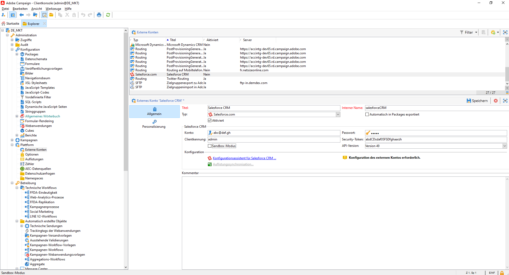
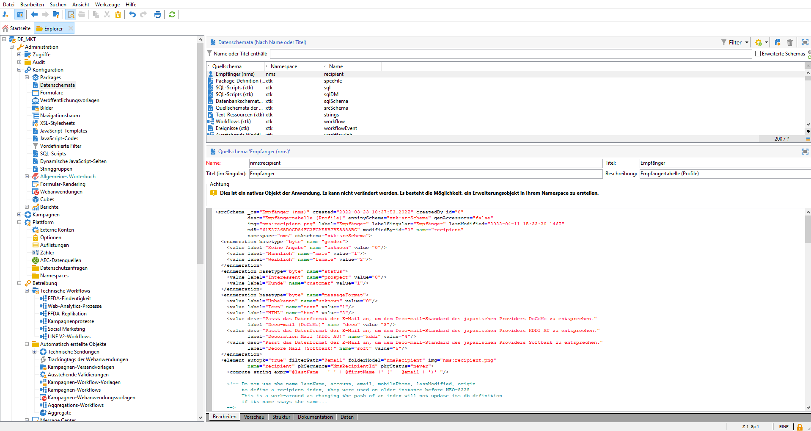
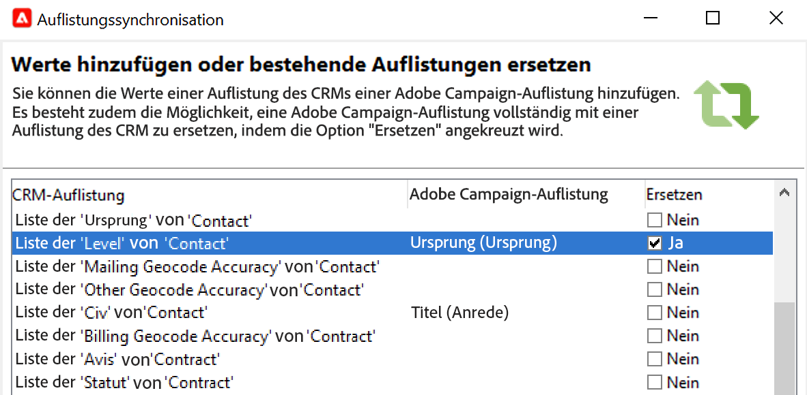

# Arbeiten mit Campaign und SFDC{#crm-sfdc}

Erfahren Sie, wie Sie den Campaign CRM-Connector konfigurieren, um Campaign v8 mit **Salesforce.com** zu verbinden.

Sobald die Konfiguration abgeschlossen ist, wird die Datensynchronisation zwischen den Systemen über eine spezielle Workflow-Aktivität durchgeführt. [Weitere Informationen](crm-data-sync.md).

>[!NOTE]
>
>Unterstützte SFDC-Versionen werden in der [Kompatibilitätsmatrix](../start/compatibility-matrix.md) von Campaign aufgeführt.

Gehen Sie wie folgt vor, um ein dediziertes externes Konto zu konfigurieren, um Salesforce-Daten in Adobe Campaign zu importieren und daraus zu exportieren.

## Erstellen der Verbindung{#new-sfdc-external-account}

Zunächst müssen Sie das externe Salesforce-Konto erstellen.

1. Durchsuchen Sie den Knoten **[!UICONTROL Administration > Plattform > Externe Konten]** im Campaign Explorer und erstellen Sie ein externes Konto.
1. Wählen Sie im Abschnitt **Typ** das externe Konto **[!UICONTROL Salesforce.com]** aus.
1. Geben Sie Einstellungen zum Aktivieren der Verbindung ein.

   

   Um dieses externe Konto für die gemeinsame Verwendung mit Adobe Campaign zu konfigurieren, müssen Sie die folgenden Informationen eingeben:

   * Geben Sie im Feld **[!UICONTROL Konto]** Ihre Salesforce-Anmeldedaten ein.
   * Geben Sie Ihr Salesforce-Passwort ein.
   * Sie können das Feld **[!UICONTROL Client-Kennung]** ignorieren.
   * Kopien Sie Ihr Salesforce-**[!UICONTROL Security-Token]** und fügen Sie es ein.
   * Wählen Sie Ihre **[!UICONTROL API-Version]** aus. Die unterstützten SFDC API-Versionen sind in der [Kompatibilitätsmatrix](../start/compatibility-matrix.md) von Campaign aufgeführt.

1. Wählen Sie die Option **Aktivieren** aus, um das Konto in Campaign zu aktivieren.

>[!NOTE]
>
>Zur Übernahme der Konfiguration müssen Sie sich von der Konsole ab- und wieder anmelden.

## Auswahl der zu synchronisierenden Tabellen{#sfdc-create-tables}

Sie können jetzt die Tabellen konfigurieren, die synchronisiert werden sollen.

1. Klicken Sie auf **[!UICONTROL Konfigurationsassistent für Salesforce CRM...]**.
1. Wählen Sie die zu synchronisierenden Tabellen aus und starten Sie den Prozess.
1. Prüfen Sie unter dem Knoten **[!UICONTROL Administration > Konfiguration > Datenschemas]** das in Adobe Campaign erzeugte Schema.

   Beispiel eines in Campaign importierten **Salesforce**-Schemas:

   

## Synchronisation der Auflistungen{#sfdc-enum-sync}

Sobald das Schema erstellt ist, können Sie Aufzählungen in Salesforce automatisch mit Adobe Campaign synchronisieren.

1. Öffnen Sie den Assistenten über den Link **[!UICONTROL Auflistungen synchronisieren...]**.
1. Wählen Sie die Adobe Campaign-Auflistung aus, die der Salesforce-Auflistung entspricht.
Sie können alle Werte einer Adobe Campaign-Auflistung durch die des CRM-Systems ersetzen: Wählen Sie hierzu in der Spalte **[!UICONTROL Ersetzen]** die Option **[!UICONTROL Ja]**.

   

1. Klicken Sie abschließend auf **[!UICONTROL Weiter]** und dann auf **[!UICONTROL Starten]**, um mit dem Import der Auflistungen zu beginnen.

1. Durchsuchen Sie den Knoten **[!UICONTROL Administration > Plattform > Auflistungen]**, um die importierten Werte zu überprüfen.

Adobe Campaign und Salesforce.com sind jetzt verbunden. Sie können eine Datensynchronisation zwischen den beiden Systemen einrichten.

Um Daten zwischen Adobe Campaign und SFDC zu synchronisieren, müssen Sie einen Workflow erstellen und die Aktivität **[!UICONTROL CRM-Connector]** verwenden.

Weitere Informationen zur Datensynchronisation finden Sie [auf dieser Seite](crm-data-sync.md).
