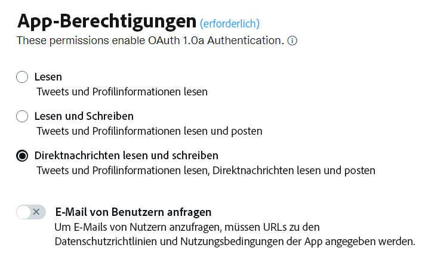
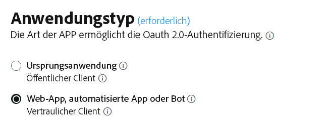
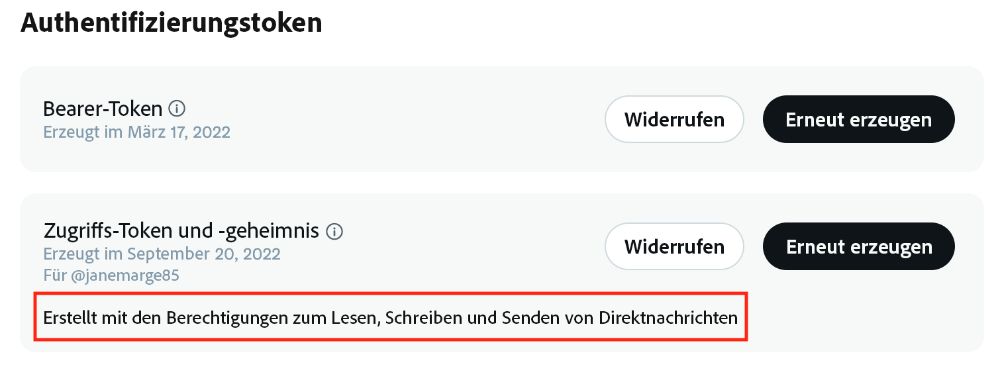
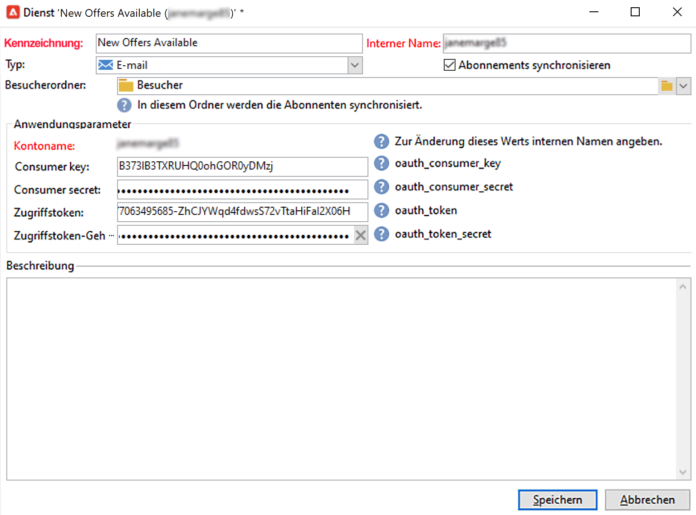
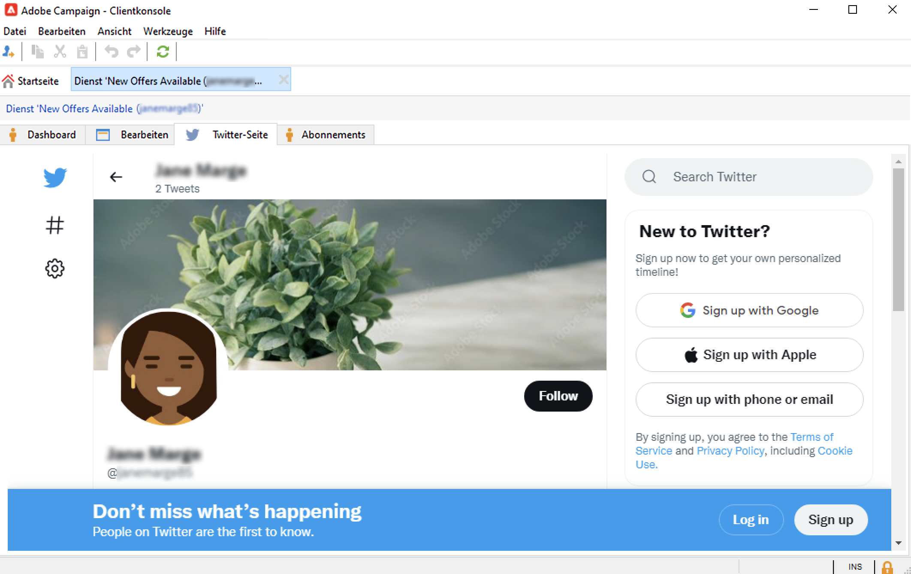

# Campaign und X verwenden (Twitter) {#tw-ac-ovv}

Die **Verwalten sozialer Netzwerke (Social Marketing)** ermöglicht Ihnen die Interaktion mit Ihren Kunden über X (ehemals Twitter). Verwenden Sie diese Funktion, um:

* Nachrichten posten und DMs senden - Mit Adobe Campaign Social Marketing können Sie Nachrichten auf X posten. Sie können auch Direktnachrichten an alle Ihre Follower senden.

* Neue Kontakte zu sammeln – Mit Adobe Campaign Social-Media-Marketing können Sie auch einfach neue Kontakte über Facebook sammeln: Kontaktieren Sie die Benutzer und fragen Sie sie, ob sie ihre Profilinformationen weitergeben möchten. Wenn sie zustimmen, ruft Adobe Campaign die Daten automatisch ab, sodass Sie zielgerichtete Kampagnen durchführen und kanalübergreifende Strategien implementieren können.

 Als Benutzer von Managed Cloud Service [Adobe kontaktieren](../start/campaign-faq.md#support) um Campaign mit X zu verbinden. Die  **Verwalten sozialer Netzwerke (Social Marketing)** -Add-on muss in Ihrer Umgebung über das dedizierte -Package installiert sein und das externe Twitter-Konto muss konfiguriert werden.

Um Adobe Campaign so zu konfigurieren, dass Tweets in Ihren X-Konten gepostet werden, delegieren Sie Schreibzugriff für diese Konten an Adobe Campaign. Gehen Sie dazu folgendermaßen vor:

1. Erstellen Sie ein X-Konto und melden Sie sich für ein Entwicklerkonto an. [Weitere Informationen](#dev-account)
1. (Optional) Erstellen Sie ein Test X-Konto für den Versand von Testsendungen. [Weitere Informationen](#tw-test-account)
1. Erstellen Sie eine X-Anwendung (eine App pro X-Konto). [Weitere Informationen](#create-an-app-on-twitter)
1. Erstellen Sie einen neuen Dienst für **[!UICONTROL Twitter]** (ein Service pro X-Konto). [Weitere Informationen](#create-tw-service)
1. Synchronisieren Sie Ihr X-Konto mit Campaign. [Weitere Informationen](#synchro-tw-accounts)

## X-Entwicklerkonto {#dev-account}

Um mit dieser Integration zu beginnen, müssen Sie sich für eine [X-Entwicklerkonto](https://developer.twitter.com){target="_blank"}.

Campaign verwendet die Version 1.1 der X-API. Um sie verwenden zu können, müssen Sie über das Entwicklerportal einen erweiterten Zugriff beantragen. Erfahren Sie mehr über den erweiterten Zugriff auf X [auf dieser Seite](https://developer.twitter.com/en/portal/products/elevated){target="_blank"}.

## Erstellen einer Anwendung auf X {#create-an-app-on-twitter}

Nachdem Sie mit erhöhtem Zugriff genehmigt wurden, erstellen Sie eine X-Anwendung, um Adobe Campaign zu ermöglichen, Beiträge in Ihrem X-Konto zu erstellen. Gehen Sie dazu wie folgt vor:

1. Melden Sie sich bei Ihrem X-Konto an.
1. Verbinden mit [X-Entwicklerportal](https://developer.twitter.com/en/apps).
1. Wählen Sie **App erstellen** aus.
1. Lassen Sie sich von der X-Assistenzkraft durch den Prozess führen.
1. Damit Adobe Campaign Beiträge in Ihrem Konto erstellen kann, bearbeiten Sie das **App-Genehmigungen** im Abschnitt Benutzerauthentifizierung Ihrer App. Wählen Sie **Lesen, Schreiben und Direktnachrichten**.

   

1. Wählen Sie im Bereich **Anwendungstyp** **Web-Anwendung, automatisierte Anwendung oder Bot**. Sie können das Feld **Callback-URL** leer lassen und Ihre Konfiguration speichern.

   

1. Gehen Sie zurück zu Ihrem Anwendungs-Dashboard, wählen Sie Ihre Anwendung aus und wechseln Sie zur Registerkarte **Schlüssel und Token**. Wenn unter **Zugriffs-Token und Geheimnis** die Berechtigung **Lesen, Schreiben und Direktnachrichten** nicht aufgeführt wird, müssen Sie das Token und das Geheimnis Ihrer Anwendung neu generieren. Beachten Sie, dass alle Schlüssel und Token bei der Erstellung gespeichert werden müssen. Sie benötigen sie, um Ihren Campaign-Twitter-Service zu konfigurieren.

   

>[!NOTE]
>
>Sie benötigen eine Anwendung pro X-Konto. Daher müssen Sie eine weitere Testanwendung erstellen, um Testsendungen an Ihr Testkonto durchzuführen.
>

## Erstellen eines Twitter-Service in Campaign. {#create-tw-service}

Um Ihre Campaign-Instanz mit Ihrem X-Konto zu verknüpfen, erstellen Sie eine **Twitter** Dienst und delegieren Sie Schreibzugriff an Campaign.

>[!CAUTION]
>
>Erstellen einer **Twitter** Service pro X-Konto. Infolgedessen müssen Sie einen weiteren Test-Service erstellen, um Testsendungen an Ihr [Testkonto](#tw-test-account) zu senden.
>
>Jeder **Twitter**-Service muss ebenfalls von Adobe auf Ihrer MID-Instanz erstellt werden. Wenden Sie sich an Ihren Adobe-Support, um Ihre Umgebung konfigurieren zu lassen.
>

Um Einstellungen zu erfassen, müssen Sie sowohl auf Ihre Adobe Campaign Client Console als auch auf Ihre X-App-Berechtigungen zugreifen.

1. Gehen Sie in **Adobe Campaign** zur Registerkarte **[!UICONTROL Profile und Zielgruppen]** und klicken Sie auf den Link **[!UICONTROL Services und Abonnements]**.
1. Erstellen Sie einen neuen Service.
1. Wählen Sie den Typ **[!UICONTROL Twitter]**.
1. Geben Sie den Titel und den internen Namen des Services ein.

   >[!CAUTION]
   >
   >Die **[!UICONTROL Interner Name]** des Dienstes muss genau der gleiche Name Ihres X-Kontos sein.
   >

1. Standardmäßig werden Follower im Ordner **[!UICONTROL Besucher]** gespeichert. Sie können über das Feld **[!UICONTROL Besucherordner]** eine andere Position auswählen. [Weitere Informationen](../send/twitter.md#direct-tw-messages)

   

   >[!NOTE]
   >
   >Die **[!UICONTROL Abonnements synchronisieren]** ist standardmäßig aktiviert: Mit dieser Option wird die Liste Ihrer X-Follower automatisch abgerufen, sodass Sie [Direktnachrichten senden](../send/twitter.md#direct-tw-messages). Die Synchronisation wird von einem [dedizierten technischen Workflow](#synchro-tw-accounts) ausgeführt.

1. Kopieren Sie aus Ihrer X-App den Inhalt der **API-Schlüssel** und **[API-Schlüsselgeheimnis]** und fügen Sie sie in das **[!UICONTROL Consumer key]** und **[!UICONTROL Verbrauchergeheimnis]** Felder Ihrer Kampagne **Twitter** -Dienst.

1. Kopieren Sie aus Ihrer X-App den Inhalt der **Zugriffstoken** und **Geheimer Zugriffstoken** und fügen Sie sie in das **[!UICONTROL Zugriffstoken]** und **[!UICONTROL Zugriffstoken-Geheimnis]** Felder Ihrer Kampagne **Twitter** -Dienst.

1. Klicken Sie in der Client-Konsole von Campaign auf **[!UICONTROL Speichern]**. Sie haben jetzt den Schreibzugriff an Adobe Campaign delegiert.

Um Ihre Einstellungen zu überprüfen, gehen Sie folgendermaßen vor:

* Bearbeiten Sie den **Twitter**-Service, den Sie gerade erstellt haben.
* Öffnen Sie die Registerkarte **[!UICONTROL Twitter-Seite]**: Ihr Twitter-Konto sollte angezeigt werden.
  

## Synchronisieren Ihres X-Kontos {#synchro-tw-accounts}

Die Synchronisation von Campaign und X erfolgt über spezielle technische Workflows. Diese Workflows werden im Ordner **[!UICONTROL Administration > Produktion > Technische Workflows > Social Marketing]** verwaltet.

Sie werden standardmäßig angehalten: Sie müssen sie manuell starten, wenn Sie mit der Verwendung des Moduls **Social Marketing** beginnen.

Die **[!UICONTROL Synchronisation von Twitter-Konten]** Der technische Workflow synchronisiert X Konten in Adobe Campaign. Ruft die Liste der X Follower ab, damit Sie ihnen Direktnachrichten senden können. [Weitere Informationen](../send/twitter.md#direct-tw-messages)

Standardmäßig wird dieser Workflow jeden Donnerstag um 7.30 Uhr ausgelöst. Sie können die Option **[!UICONTROL Ausstehende Aufgabe(n) jetzt ausführen]** verwenden, um den Workflow bei der Implementierung dieser Integration jederzeit zu starten.  Sie können auch die Planung bearbeiten, um die Häufigkeit der Auslösung des Workflows zu ändern. Weitere Informationen finden Sie auf [dieser Seite](../../automation/workflow/scheduler.md).

>[!CAUTION]
>
>Um die Liste der X-Abonnenten abzurufen, muss die **[!UICONTROL Synchronisierung von twitter-Konten]** muss für den mit dem Konto verknüpften Dienst aktiviert sein. [Weitere Informationen](#create-tw-service)

Die Follower werden in einer spezifischen Tabelle gespeichert: der Besuchertabelle. Um die Liste der X-Follower anzuzeigen, navigieren Sie zum **[!UICONTROL Profile und Zielgruppen > Besucher]**.

Für jeden Follower speichert Adobe Campaign die folgenden Informationen:

* **[!UICONTROL Herkunft]**: Twitter
* **[!UICONTROL Externe Kennung]**: Benutzerkennung
* **[!UICONTROL Benutzername]**: Kontoname der/des Benutzenden
* **[!UICONTROL Vollständiger Name]**: Name des/r Benutzenden
* **[!UICONTROL Anzahl Freunde]**: Anzahl der Follower
* **[!UICONTROL Geprüft]**: Dieses Feld gibt an, ob die/der Benutzende über ein bestätigtes Twitter-Konto verfügt

Sobald diese Konfiguration abgeschlossen ist, können Sie Beiträge in Ihren X-Konten erstellen und Direktnachrichten an Ihre Follower senden. [Weitere Informationen](../send/twitter.md)

## Testkonto auf X erstellen {#tw-test-account}

Erstellen Sie zusätzlich zum X-Konto ein privates X-Konto, das zum Senden verwendet werden kann. [Tweet-Testsendungen](../send/twitter.md#send-tw-proofs). Gehen Sie dazu wie folgt vor:

1. Erstellen Sie ein neues X-Konto.
1. Öffnen Sie die **Einstellungen** des Kontos.
1. Navigieren Sie zu **Datenschutz und Sicherheit** und **Zielgruppe und Tagging** und überprüfen Sie die **Protect-Beiträge** -Option. Ihre Beiträge und andere Kontoinformationen sind nur für Personen sichtbar, die Ihnen folgen.

Konfigurieren Sie Ihre X-App und Ihren Campaign-Dienst für die Verwendung mit diesem Testkonto, wie oben beschrieben.
