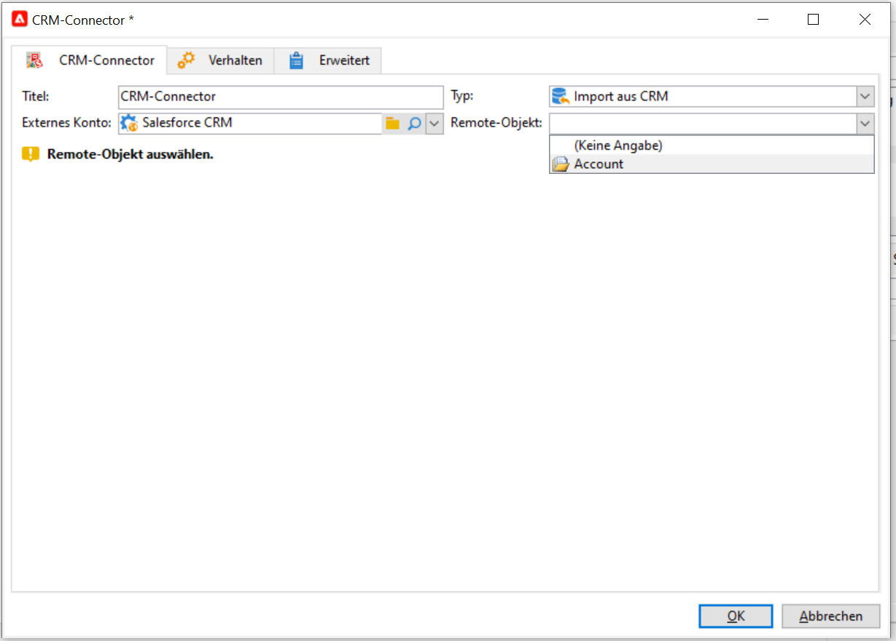
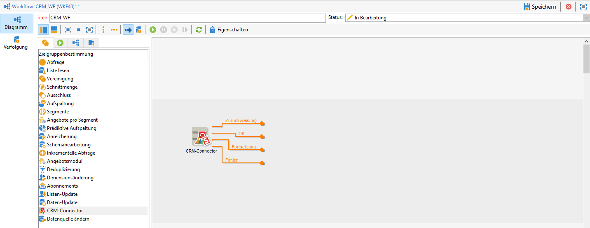

# Daten zwischen Campaign und Ihrem CRM-System synchronisieren {#data-synchronization}

Die Datensynchronisation zwischen Adobe Campaign und Ihrem CRM wird von der Workflow-Aktivität **CRM-Connector** verwaltet.

Erstellen Sie zum Importieren der Daten aus Microsoft Dynamics in Adobe Campaign beispielsweise folgenden Workflow:

Dieser Workflow importiert die Kontakte über Microsoft Dynamics, synchronisiert sie mit den in Adobe Campaign vorhandenen Daten, löscht doppelte Kontakte und aktualisiert die Adobe Campaign-Datenbank.

Die Aktivität **[!UICONTROL CRM-Connector]** muss für die Synchronisation der Daten konfiguriert werden.

Mit dieser Aktivität können Sie:

* Aus dem CRM-System importieren – [Weitere Informationen](#importing-from-the-crm)
* In das CRM-System exportieren – [Weitere Informationen](#exporting-to-the-crm)
* Objekte importieren, die im CRM gelöscht wurden – [Weitere Informationen](#importing-objects-deleted-in-the-crm)
* Objekte im CRM löschen – [Weitere Informationen](#deleting-objects-in-the-crm)

Wählen Sie zunächst das externe Konto aus, das dem CRM-System entspricht, mit dem Sie eine Synchronisation konfigurieren möchten, und anschließend das zu synchronisierende Objekt: Konto, Opportunities, Leads, Kontakte usw.

Die Konfiguration der Aktivität hängt von der gewählten Option ab und wird im Folgenden dargestellt:

## Import aus dem CRM {#importing-from-the-crm}

Zum Import von CRM-Daten in Adobe Campaign ist ein Workflow nach folgendem Muster zu erstellen:

1. Wählen Sie den Vorgang vom Typ **[!UICONTROL Import aus CRM]**.
1. Wählen Sie in der Dropdown-Liste **[!UICONTROL Remote-Objekt]** das zu importierende Objekt aus. Dieses Objekt entspricht einer der Tabellen, die während der Connector-Konfiguration in Adobe Campaign erstellt wurden.
1. Geben Sie im Abschnitt **[!UICONTROL Remote-Felder]** die zu importierenden Felder an.

   Um ein Feld hinzuzufügen, klicken Sie auf die Schaltfläche **[!UICONTROL Hinzufügen]** in der Symbolleiste und anschließend auf **[!UICONTROL Ausdruck bearbeiten]**.

   Falls nötig, kann das Datenformat über die Dropdown-Liste der Spalte **[!UICONTROL Konvertierung]** geändert werden. Mögliche Konvertierungstypen werden in [diesem Abschnitt](#data-format) beschrieben.

   >[!CAUTION]
   >
   >Um die Objekte aus dem CRM-System mit denen in der Adobe-Campaign-Anwendung zu verknüpfen, wird die Kennung des CRM-Datensatzes benötigt. Diese wird automatisch bei Bestätigung des Dialogfensters hinzugefügt.
   >
   >Außerdem ist das Datum der letzten CRM-seitigen Änderung erforderlich, um einen inkrementellen Datenimport zu ermöglichen.

1. Sie können die zu importierenden Daten nach Bedarf filtern. Klicken Sie dazu auf den Link **[!UICONTROL Filter bearbeiten...]**.

   Im folgenden Beispiel importiert Adobe Campaign nur Kontakte, die nach dem 1. November 2021 aktiv waren.

   

   >[!CAUTION]
   >
   >Einschränkungen in Bezug auf Datenfiltermodi werden in [ diesem Abschnitt](#filtering-data) beschrieben.

1. Wählen Sie die Option **[!UICONTROL Automatischen Index verwenden...]** aus, um die inkrementelle Synchronisation der Objekte zwischen dem CRM-System und Adobe Campaign in Abhängigkeit vom letzten Änderungsdatum automatisch zu verwalten.

   Weiterführende Informationen hierzu finden Sie in [diesem Abschnitt](#variable-management).

### Variablen verwalten {#variable-management}

Aktivieren Sie die Option **[!UICONTROL Automatischer Index]**, um nur die seit dem letzten Import geänderten Objekte abzurufen.

Das Datum der letzten Synchronisation wird in einer im Konfigurationsfenster angezeigten Option gespeichert. Standardmäßig ist dies: **LASTIMPORT_&lt;%=instance.internalName%>_&lt;%=activityName%>**.

>[!NOTE]
>
>Dieser Hinweis gilt nur für die allgemeine **[!UICONTROL CRM-Connector]**-Aktivität. Für andere CRM-Aktivitäten läuft der Prozess automatisch ab.
>
>Diese Option muss manuell unter **[!UICONTROL Administration]** > **[!UICONTROL Plattform]** > **[!UICONTROL Optionen]** erstellt und ausgefüllt werden. Es muss sich um eine Textoption handeln, deren Wert dem folgenden Format entspricht: **jjjj/MM/tt hh:mm:ss**.
> 
>Diese Option muss bei jedem weiteren Import manuell aktualisiert werden.

Sie können jedoch auch ein anderes CRM-Remote-Feld angeben, um die letzten Änderungen zu identifizieren.

Unten stehende Felder kommen (in der angegebenen Reihenfolge) zur Anwendung:

* Bei Microsoft Dynamics: **modifiedon**,
* Bei Salesforce.com: **LastModifiedDate**, **SystemModstamp**.

Die Aktivierung der Option **[!UICONTROL Automatischer Index]** erzeugt drei Variablen, die im Synchronisations-Workflow über eine **[!UICONTROL JavaScript]**-Aktivität genutzt werden können. Diese Variablen sind:

* **vars.crmOptionName**: Name der Option, die das Datum des letzten Imports enthält.
* **vars.crmStartImport**: Startdatum (einschließlich) des letzten Datenimports.
* **vars.crmEndDate**: Enddatum (ausschließlich) des letzten Datenimports.

   >[!NOTE]
   >
   >Das Datum wird im Format **jjjj/MM/tt hh:mm:ss** ausgedrückt.

### Daten filtern {#filtering-data}

Um eine effiziente Funktionsweise mit den diversen CRM-Systemen sicherzustellen, sind bei der Filtererstellung folgende Regeln zu beachten:

* Jedes Filterniveau darf nur einen Operatortyp verwenden.
* Der AND-NOT-Operator wird nicht unterstützt.
* Vergleiche dürfen sich nur auf Werte vom Typ &quot;ist leer&quot;/&quot;ist nicht leer&quot; oder auf Zahlen beziehen. Der Wert (rechte Spalte) wird ausgewertet und das Ergebnis muss eine Zahl sein. JOIN-Vergleiche werden nicht unterstützt.
* Der in der rechten Spalte angegebene Wert wird in JavaScript ausgewertet.
* Vergleiche vom Typ JOIN werden nicht unterstützt.
* Der Ausdruck (linke Spalte) muss zwingend ein Feld sein. Er darf weder eine Kombination aus mehreren Ausdrücken, noch eine Ziffer usw. sein.

### Sortierreihenfolge {#order-by}

In Microsoft Dynamics und Salesforce.com haben Sie die Möglichkeit, die zu importierenden Remote-Felder auf- oder absteigend zu sortieren.

Klicken Sie hierfür auf **[!UICONTROL Sortierreihenfolge]** und fügen Sie die Spalten zur Liste hinzu.

Die Spaltenreihenfolge der Liste zeigt die Sortierreihenfolge an:

### Datensatz-Identifizierung {#record-identification}

Statt im CRM-System enthaltene (und u. U. gefilterte) Elemente direkt zu importieren, können Sie eine zuvor im Workflow berechnete Population verwenden.

Kreuzen Sie hierfür die Option **[!UICONTROL Die zuvor berechnete Population verwenden]** an und geben Sie das die Remote-Kennung enthaltende Feld an.

Wählen Sie anschließend die aus der Eingangspopulation zu importierenden Felder wie in unten stehendem Beispiel aus:

## Export in das CRM {#exporting-to-the-crm}

Exportieren Sie Adobe Campaign-Daten in Ihr CRM-System, um die gesamten Inhalte in Ihre CRM-Datenbank zu kopieren.

Um Daten in Ihr CRM zu exportieren, erstellen Sie den folgenden Workflow-Typ:

1. Wählen Sie den Vorgang vom Typ **[!UICONTROL Export in das CRM]** aus.
1. Gehen Sie zur Dropdown-Liste **[!UICONTROL Remote-Objekt]** und wählen Sie das zu exportierende Objekt aus. Dieses Objekt entspricht einer der Tabellen, die bei der Connector-Konfiguration in Adobe Campaign erstellt wurden.

   >[!CAUTION]
   >
   >Die Exportfunktion der Aktivität **[!UICONTROL CRM-Connector]** kann Felder auf der CRM-Seite einfügen oder aktualisieren. Um Feldaktualisierungen im CRM zu aktivieren, müssen Sie den Primärschlüssel der Remote-Tabelle angeben. Wenn der Schlüssel fehlt, werden Daten eingefügt, anstatt dass sie aktualisiert werden.

1. Wenn Sie schnellere Exporte durchführen müssen, markieren Sie die Option **[!UICONTROL In Batches exportieren]**.

   

1. Klicken Sie im Abschnitt **[!UICONTROL Mapping]** auf **[!UICONTROL Neu]**, um die zu exportierenden Felder und ihre Zuordnung im CRM anzugeben.

   Um ein Feld hinzuzufügen, klicken Sie auf die Schaltfläche **[!UICONTROL Hinzufügen]** in der Symbolleiste und anschließend auf **[!UICONTROL Ausdruck bearbeiten]**.

   >[!NOTE]
   >
   >Wenn für ein Feld keine Übereinstimmung definiert ist, können die Werte nicht aktualisiert werden: sie werden direkt in das CRM-System eingefügt.

   Falls nötig, kann das Datenformat über die Dropdown-Liste der Spalte **[!UICONTROL Konvertierung]** geändert werden. Mögliche Konvertierungstypen werden in [diesem Abschnitt](#data-format) beschrieben.

   >[!NOTE]
   >
   >Die Liste der zu exportierenden Einträge und das Ergebnis des Exports werden in einer temporären Datei gespeichert, auf die zugegriffen werden kann, bis der Workflow abgeschlossen oder neu gestartet wurde. Auf diese Weise können Sie den Prozess sicher starten, sollte ein Fehler vorliegen.

## Ergänzende Konfigurationen {#additional-configurations}

### Datenformat {#data-format}

Es besteht die Möglichkeit, das Datenformat beim Import aus dem oder beim Export in das CRM-System direkt zu konvertieren.

Wählen Sie hierzu in der entsprechenden Spalte die anzuwendende Konvertierung aus.

Im **[!UICONTROL Standard]**-Modus entspricht die Konvertierung zumeist einem einfachen Kopieren/Einfügen der Daten. Die verschiedenen Zeitzonen werden in jedem Fall berücksichtigt.

Darüber hinaus sind folgende Konvertierungen möglich:

* **[!UICONTROL Nur Datum]**: löscht Felder vom Typ Datum+Uhrzeit.
* **[!UICONTROL Ohne Zeitverschiebung]**: hebt die im Standardmodus angewendete Zeitzonenverwaltung auf.
* **[!UICONTROL Kopieren/Einfügen]**: verwendet die ursprünglichen Daten als Strings weiter (keine Konvertierung).

### Fehlerverarbeitung {#error-processing}

Im Rahmen von Datenimporten oder -exporten können Sie einen spezifischen Prozess auf Fehler und Zurückweisungen anwenden. Wählen Sie dazu die Optionen **[!UICONTROL Zurückweisungen in einer Datei speichern]** und **[!UICONTROL Fehler verarbeiten]** in der Registerkarte **[!UICONTROL Verhalten]** aus.

Mit diesen Optionen werden die entsprechenden ausgehenden Transitionen hinzugefügt.

Fügen Sie dann die relevanten Aktivitäten ein, um Daten zu verarbeiten. Fügen Sie beispielsweise die Aktivität **Warten** ein und erstellen Sie einen Zeitplan für weitere Versuche aufgrund von Fehlern.

Die ausgehende Transition **[!UICONTROL Zurückweisung]** verleiht Ihnen Zugang zum Ausgabeschema, welches die Spalten für Fehlermeldungen und -Codes und enthält. Bei Salesforce.com lautet die Spalte **errorSymbol** (Fehlersymbol, unterscheidet sich vom Fehler-Code), **errorMessage** (Beschreibung des Fehlerkontexts).

## Import der im CRM gelöschten Objekte {#importing-objects-deleted-in-the-crm}

Sie können im CRM-System gelöschte Objekte in Adobe Campaign importieren.

1. Wählen Sie den Vorgang vom Typ **[!UICONTROL Import der im CRM gelöschten Objekte]** aus.
1. Gehen Sie zur Dropdown-Liste **[!UICONTROL Remote-Objekt]** und wählen Sie das vom Prozess betroffene Objekt aus. Dieses Objekt entspricht einer der Tabellen, die bei der Connector-Konfiguration in Adobe Campaign erstellt wurden.
1. Geben Sie den zu berücksichtigenden Löschzeitraum in den Feldern **[!UICONTROL Startdatum]** und **[!UICONTROL Enddatum]** an (Datumsangaben sind enthalten).

   >[!CAUTION]
   >
   >Der Löschzeitraum muss mit den CRM-spezifischen Einschränkungen übereinstimmen. Bei Salesforce.com können beispielsweise Elemente, die vor mehr als 30 Tagen gelöscht wurden, nicht wiederhergestellt werden.

## Löschung von Objekten im CRM {#deleting-objects-in-the-crm}

Geben Sie zur Löschung von Objekten im CRM den Primärschlüssel der zu löschenden Remote-Elemente an.

Im Tab **[!UICONTROL Verhalten]** kann die Zurückweisungsverarbeitung aktiviert werden. Dies erzeugt eine weitere ausgehende Transition aus der **[!UICONTROL CRM-Connector]**-Aktivität. Konsultieren Sie diesbezüglich die [Fehlerverarbeitung](#error-processing).
