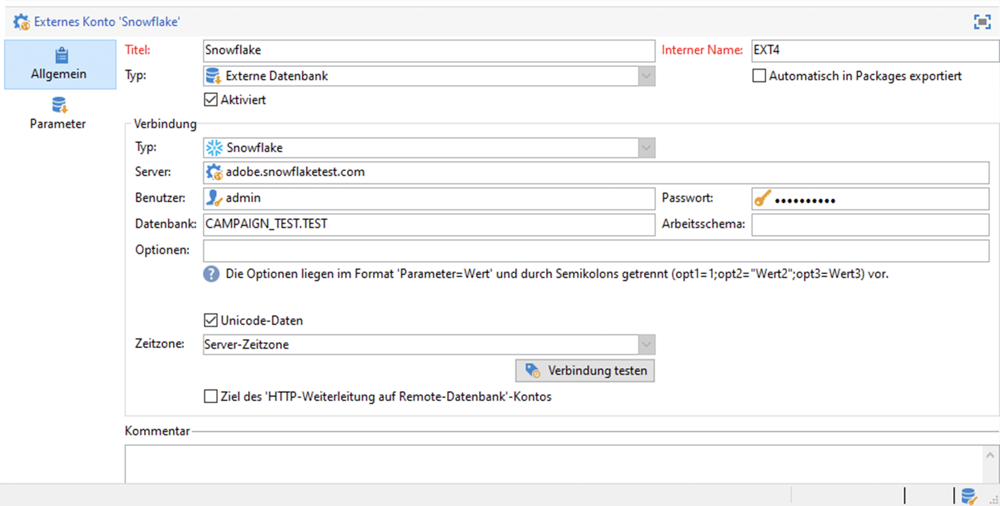
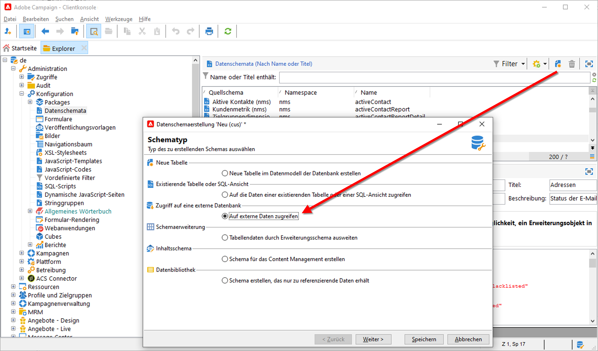
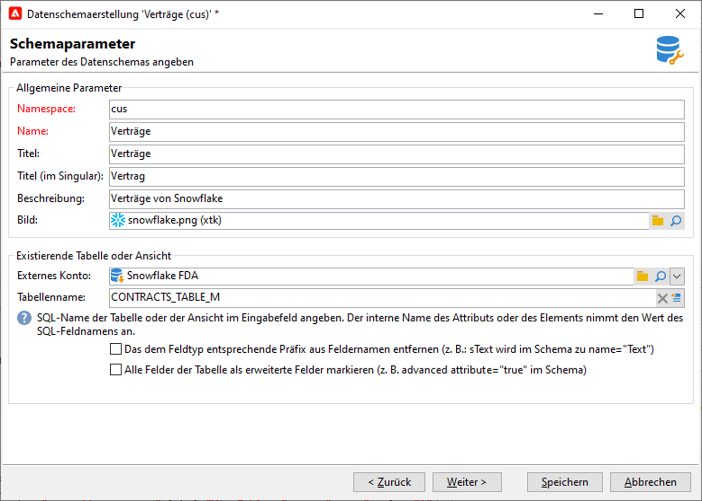
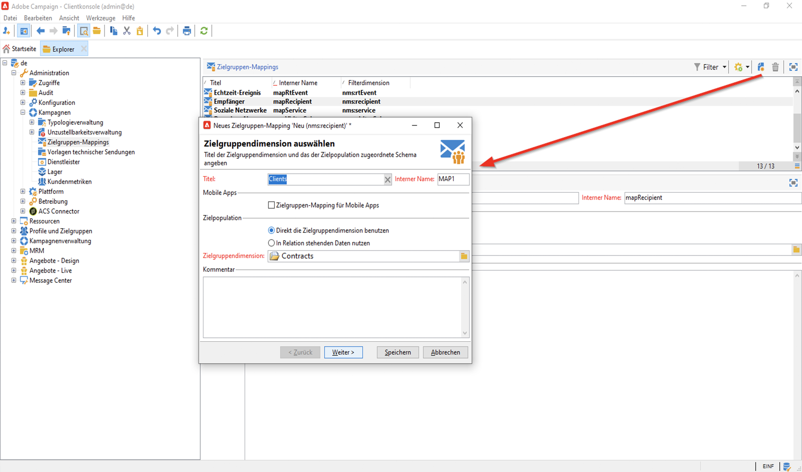
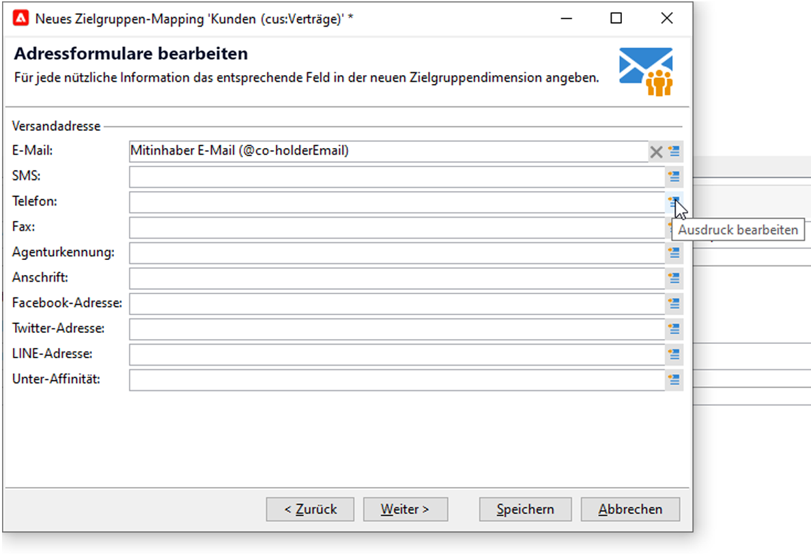
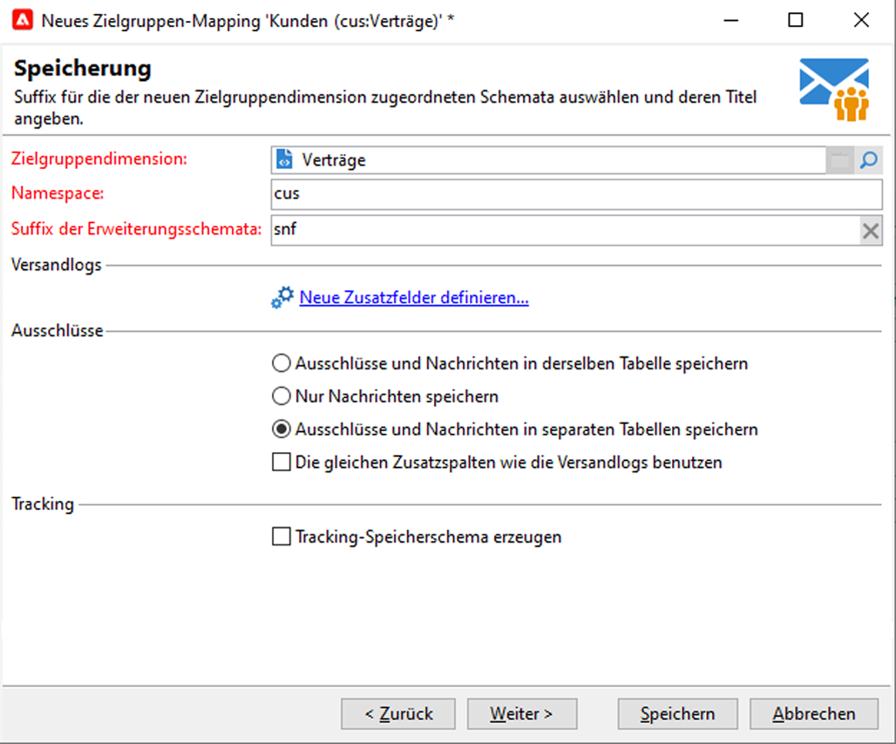
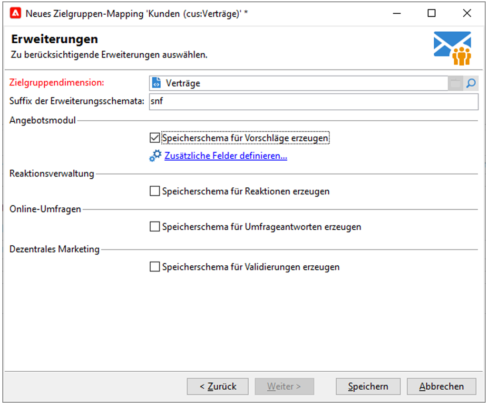

# Federated Data Access (FDA){#gs-fda}

Verwenden Sie den FDA-Connector (Federated Data Access), um Campaign mit einer oder mehreren **externen Datenbanken** zu verbinden und darin gespeicherte Informationen zu verarbeiten, ohne die Daten in Ihrer Campaign Cloud-Datenbank zu beeinflussen. Sie können dann auf externe Daten zugreifen, ohne die Struktur der Adobe Campaign-Daten zu verändern.

>[!NOTE]
>
>Kompatible Datenbanken für FDA sind in der [Kompatibilitätsmatrix](../start/compatibility-matrix.md) aufgeführt.

Mit der Campaign FDA-Option können Sie Ihr Datenmodell in einer Drittanbieterdatenbank erweitern. Sie erkennt automatisch die Struktur der ausgewählten Tabellen und verwendet Daten aus den SQL-Quellen.

Spezifische **Berechtigungen** sind für [!DNL Adobe Campaign] und für die externe Datenbank erforderlich, um miteinander zu interagieren. Weiterführende Informationen finden Sie in diesem [Abschnitt](#fda-permissions).

## Best Practices und Einschränkungen

* **E-Mail-Personalisierung mit externen Daten optimieren**

   Sie können die Nachrichtenpersonalisierung in einem speziellen Workflow vorab verarbeiten. Verwenden Sie dazu die Option **[!UICONTROL Personalisierungsdaten mit einem Workflow vorbereiten]** , die im Tab **[!UICONTROL Analyse]** der Versandeigenschaften verfügbar ist.

   Bei der Versandanalyse wird mit dieser Option automatisch ein Workflow erstellt und ausgeführt, in dem alle mit der Zielgruppe verknüpften Daten in einer temporären Tabelle gespeichert werden, einschließlich der Daten aus Tabellen, die in einer externen Datenbank verknüpft sind.

   Diese Option verbessert die Leistung beim Ausführen des Personalisierungsschritts erheblich.

* **FDA-Beschränkungen**

   Die FDA-Option wird zur Bearbeitung der Daten in externen Datenbanken im Batch-Modus in Workflows verwendet. Um Leistungsprobleme zu vermeiden, wird nicht empfohlen, das FDA-Modul im Kontext von Einzeloperationen zu verwenden, z. B.: Personalisierung, Interaktion, Echtzeit-Messaging usw.

   Vermeiden Sie möglichst Vorgänge, bei denen sowohl Adobe Campaign als auch die externe Datenbank zum Einsatz kommen. Gehen Sie dazu folgendermaßen vor:

   * Exportieren Sie die Adobe-Campaign-Datenbank in die externe Datenbank und führen Sie die Aktionen nur in der externen Datenbank aus. Importieren Sie danach die Ergebnisse wieder in Adobe Campaign.

   * Rufen Sie die Daten aus der externen Adobe-Campaign-Datenbank ab und führen Sie die Aktionen lokal durch.

   Wenn Sie Ihre Sendungen unter Verwendung von Daten aus der externen Datenbank personalisieren möchten, rufen Sie die entsprechenden Daten über einen Workflow ab und stellen Sie sie in einer temporären Tabelle bereit. Personalisieren Sie dann Ihren Versand mit den Daten aus der temporären Tabelle.

   Die FDA-Option unterliegt den Einschränkungen des von Ihnen verwendeten externen Datenbanksystems.

## Konfigurationsschritte{#fda-configuration-steps}

Gehen Sie wie folgt vor, um den Zugriff auf eine externe Datenbank mit FDA einzurichten:

1. Wenden Sie sich als Adobe Managed Services-Benutzer an die Adobe, um die Treiber auf Ihrer Campaign-Instanz zu installieren.
1. Nachdem die Treiber installiert sind, richten Sie das externe Konto ein, das Ihrer Datenbank auf dem Adobe Campaign-Server entspricht, und testen Sie das externe Konto. [Weitere Informationen](#fda-external-account).
1. Erstellen Sie das Schema der externen Datenbank in Adobe Campaign. Auf diese Weise können Sie die Datenstruktur der externen Datenbank identifizieren. [Mehr dazu](#create-data-schema)
1. Erstellen Sie bei Bedarf ein neues Zielgruppen-Mapping aus dem zuvor erstellten Schema. Dies ist erforderlich, wenn die Empfänger Ihrer Sendungen aus der externen Datenbank stammen. Diese Implementierung weist Einschränkungen bei der Nachrichtenpersonalisierung auf. [Mehr dazu](#define-data-mapping)

## Externes Konto für eine externe Datenbank{#fda-external-account}

Sie müssen ein bestimmtes externes Konto erstellen, um Ihre Campaign-Instanz mit Ihrer externen Datenbank zu verbinden.

Gehen Sie dazu wie folgt vor:

1. Navigieren Sie in Campaign **[!UICONTROL Explorer]** zu **[!UICONTROL Administration]** `>` **[!UICONTROL Plattform]** `>` **[!UICONTROL Externe Konten]**.

1. Wählen Sie **[!UICONTROL Neu]** aus.

   >[!NOTE]
   >
   > Um aktiv zu sein, muss die Option **[!UICONTROL Aktiviert]** aktiviert sein. Deaktivieren Sie bei Bedarf diese Option, um den Zugriff auf diese Datenbank zu deaktivieren, ohne die Konfiguration zu löschen.

1. Wählen Sie **[!UICONTROL Externe Datenbank]** als **[!UICONTROL Typ]** Ihres externen Kontos aus.

1. Wählen Sie in der Dropdown-Liste die externe Datenbank aus und konfigurieren Sie das externe Konto. Sie müssen Folgendes angeben:

   * **[!UICONTROL Server]**: URL des -Servers

   * **[!UICONTROL Konto]**: Name des Benutzers

   * **[!UICONTROL Passwort]**: Passwort des Benutzerkontos

   * **[!UICONTROL Datenbank]**: Name der Datenbank

      

1. Klicken Sie auf den Tab **[!UICONTROL Parameter]** und dann auf die Schaltfläche **[!UICONTROL Funktionen freigeben]**, um Funktionen zu erstellen.

1. Klicken Sie nach der Eingabe der Parameter zur Bestätigung auf die Schaltfläche **[!UICONTROL Verbindung testen]**.

1. Um Adobe Campaign Zugriff auf diese Datenbank zu erlauben, müssen Sie die SQL-Funktionen bereitstellen. Klicken Sie dazu auf den Tab **[!UICONTROL Parameter]** und danach auf die Schaltfläche **[!UICONTROL Funktionen freigeben]**.

Im Tab **[!UICONTROL Parameter]** können Sie spezifische Arbeits-Tablespaces für die Tabellen und den Index definieren.

Für [!DNL Snowflake] unterstützt der Connector die folgenden Optionen:

| Option | Beschreibung  |
|---|---|
| workschema | Datenbankschema zur Verwendung mit Arbeitstabellen |
| warehouse | Name des zu verwendenden Standard-Warehouse. Dadurch wird die Standardeinstellung des Benutzers außer Kraft gesetzt. |
| TimeZoneName | Standardmäßig leer, d. h. die Systemzeitzone des Campaign Classic-App-Servers wird verwendet. Mit dieser Option können Sie den Sitzungsparameter TIMEZONE erzwingen.  Weiterführende Informationen hierzu finden Sie auf dieser [Seite](https://docs.snowflake.net/manuals/sql-reference/parameters.html#timezone). |
| WeekStart | Sitzungsparameter WEEK_START. Standardmäßig auf 0 gesetzt  Weiterführende Informationen hierzu finden Sie auf dieser [Seite](https://docs.snowflake.com/de/sql-reference/parameters.html#week-start). |
| UseCachedResult | Sitzungsparameter USE_CACHED_RESULTS. Standardmäßig ist TRUE festgelegt. Diese Option kann verwendet werden, um zwischengespeicherte Ergebnisse von Snowflake zu deaktivieren.  Weiterführende Informationen dazu finden Sie auf [dieser Seite](https://docs.snowflake.net/manuals/user-guide/querying-persisted-results.html). |

## Datenschema erstellen{#create-data-schema}

Gehen Sie wie folgt vor, um das Schema der externen Datenbank in Adobe Campaign zu erstellen:

1. Klicken Sie auf die Schaltfläche **[!UICONTROL Neu]** über der Liste der Datenschemata und wählen Sie **[!UICONTROL Auf externe Daten zugreifen]**.

   

1. Geben Sie für das Schema einen Namen und eine Beschreibung ein und wählen Sie das externe Konto aus, über das die Verbindung mit der Datenbank hergestellt werden soll. Dadurch erhalten Sie Zugriff auf die Liste mit den in der externen Datenbank verfügbaren Tabellen. Wählen Sie die Tabelle aus, die die Daten enthält, die abgerufen werden sollen.

   

1. Klicken Sie zur Bestätigung auf **[!UICONTROL OK]**. Adobe Campaign erkennt die Struktur der ausgewählten Tabelle automatisch und erstellt das logische Schema. Beachten Sie, dass Adobe Campaign keine Verknüpfungen generiert.

1. Klicken Sie auf **[!UICONTROL Speichern]**, um die Erstellung zu bestätigen.

## Zielgruppen-Mapping{#define-data-mapping} definieren

Sie können eine Zuordnung zu den Daten in einer externen Tabelle definieren.

Dazu müssen Sie nach der Erstellung des Schemas der externen Tabelle ein neues Versand-Mapping erstellen, wobei die Daten in dieser Tabelle als Versandzielgruppe verwendet werden.

Gehen Sie dazu wie folgt vor:

1. Navigieren Sie im Adobe Campaign-Explorer zu **[!UICONTROL Administration]** `>` **[!UICONTROL Kampagnenverwaltung]** `>` **[!UICONTROL Zielgruppen-Mappings]** .

1. Erstellen Sie ein neues Zielgruppen-Mapping und wählen Sie das soeben erstellte Schema als Zielgruppendimension aus.

   

1. Geben Sie die Felder an, in denen die Versandinformationen gespeichert sind (Nachname, Vorname, E-Mail-Adresse, Adresse etc.).

   

1. Geben Sie die Parameter für die Speicherung der Informationen an, einschließlich des Suffix der Erweiterungsschemata, damit diese leicht identifiziert werden können.

   

   Wählen Sie aus, ob Ausschlüsse (**excludelog**) mit Nachrichten (**broadlog**) oder in einer separaten Tabelle gespeichert werden sollen.

   Sie können für dieses Versand-Mapping (**trackinglog**) auch auswählen, ob Tracking verwaltet werden soll.

1. Wählen Sie dann die zu berücksichtigenden Erweiterungen. Der Erweiterungstyp hängt von den Parametern und Optionen Ihrer Plattform ab (bitte überprüfen Sie Ihren Lizenzvertrag).

   

   Klicken Sie auf die Schaltfläche **[!UICONTROL Speichern]**, um die Erstellung des Versand-Mappings zu beginnen: Alle verknüpften Tabellen werden automatisch auf der Basis der ausgewählten Parameter erstellt.

## Berechtigungen{#fda-permissions}

Spezifische **Berechtigungen** sind für [!DNL Adobe Campaign] und für die externe Datenbank erforderlich, um miteinander zu interagieren.

Damit der Benutzer über FDA Vorgänge in einer externen Datenbank durchführen kann, muss der Benutzer über eine spezifische Berechtigung in [!DNL Adobe Campaign] verfügen.

1. Wählen Sie im Adobe-Campaing-Explorer über den Knoten **[!UICONTROL Administration > Zugriffe > Spezifische Berechtigungen]** aus.
1. Erstellen Sie eine neue Berechtigung, indem Sie einen Titel eingeben.
1. Geben Sie den Namen der spezifischen Berechtigung im folgenden Format ein: **user:base@server**, wobei:

   * **** useris der Name des Benutzers in der externen Datenbank
   * **** basiert auf dem Namen der externen Datenbank
   * **** serveris der Name des externen Datenbankservers

1. Speichern Sie die spezifische Berechtigung und verknüpfen Sie sie über den Knoten **[!UICONTROL Administration > Zugriffe > Benutzer]** im Adobe Campaign-Explorer mit dem ausgewählten Benutzer.

Um dann die in einer externen Datenbank enthaltenen Daten verarbeiten zu können, muss der Adobe Campaign-Operator mindestens über Schreibberechtigungen für die Datenbank verfügen, damit er Arbeitstabellen erstellen kann. Diese Tabellen werden von Adobe Campaign automatisch gelöscht.

Die folgenden Berechtigungen sind erforderlich:

* **CONNECT**: Verbindung mit der Remote-Datenbank
* **READ Data**: Nur Lesezugriff auf Tabellen, die Kundendaten enthalten
* **READ &#39;MetaData&#39;**: Zugriff auf Serverdatenkataloge zum Abruf der Tabellenstruktur
* **LOAD**: Ladevorgänge für große Datenmengen in Arbeitstabellen (erforderlich bei der Arbeit an Kollektionen und Joins)
* **CREATE/DROP** für **TABLE/INDEX/PROCEDURE/FUNCTION** (nur bei von Adobe Campaign generierten Tabellen)
* **EXPLAIN**  (empfohlen): zur Leistungsüberwachung im Falle eines Problems
* **WRITE Data** (abhängig vom Integrationsszenario)

Der Datenbankadministrator muss sicherstellen, dass diese Berechtigungen mit den spezifischen Berechtigungen für jede Datenbank-Engine übereinstimmen, wie unten beschrieben.

|   | Snowflake | Amazon Redshift |
|:-:|:-:|:-:|
| **Herstellen einer Verbindung zu einer Remote-Datenbank** | Berechtigungen USAGE ON WAREHOUSE, USAGE ON DATABASE und USAGE ON SCHEMA | Erstellen eines mit dem AWS-Konto verknüpften Benutzers |
| **Erstellen von Tabellen** | Berechtigung CREATE TABLE ON SCHEMA | Berechtigung CREATE |
| **Erstellen von Indizes** | K. A. | Berechtigung CREATE |
| **Erstellen von Funktionen** | Berechtigung CREATE FUNCTION ON SCHEMA | Berechtigung USAGE ON LANGUAGE plpythonu, um externe Python-Skripte aufrufen zu können |
| **Erstellen von Verfahren** | K. A. | Berechtigung USAGE ON LANGUAGE Python , um externe Python-Skripte aufrufen zu können |
| **Entfernen von Objekten (Tabellen, Indizes, Funktionen, Verfahren)** | Eigentümer des Objekts | Eigentümer des Objekts oder Superuser |
| **Überwachen von Ausführungen** | Berechtigung MONITOR für das erforderliche Objekt | Keine Berechtigung erforderlich, um den Befehl EXPLAIN zu verwenden |
| **Schreiben von Daten** | Berechtigungen INSERT und/oder UPDATE (je nach Schreibvorgang) | Berechtigungen INSERT und UPDATE |
| **Laden von Daten in Tabellen** | Berechtigungen CREATE STAGE ON SCHEMA, SELECT und INSERT für die Zieltabelle | Berechtigungen SELECT und INSERT |
| **Zugreifen auf Client-Daten** | Berechtigungen SELECT für (FUTURE) TABLE(S) oder VIEW(S) | Berechtigung SELECT |
| **Zugreifen auf Metadaten** | Berechtigung SELECT für INFORMATION_SCHEMA SCHEMA | Berechtigung SELECT |

## Externe Daten in einem Workflow verwenden

Nachdem das Schema erstellt wurde, können Daten in Adobe Campaign-Workflows verarbeitet werden.

Verschiedene Workflow-Aktivitäten bieten die Option, Daten aus einer externen Datenbank zu verwenden:

* **Nach externen Daten filtern**  - Mit der  **** Abfrage-Aktivität können Sie externe Daten hinzufügen und in den definierten Filterkonfigurationen verwenden.

* **Teilmengen erstellen**  - Die  **** Aufspaltung ermöglicht die Erstellung von Teilmengen. Sie können externe Daten verwenden, um die zu verwendenden Filterkriterien zu definieren.

* **Externe Datenbank laden**  - Sie können die externen Daten in der Aktivität  **[!UICONTROL Laden (RDBMS)]**  verwenden.

* **Hinzufügen von Informationen und Links**  - Die Aktivität  **** Anreicherung ermöglicht das Hinzufügen zusätzlicher Daten zur Arbeitstabelle des Workflows sowie von Links zu einer externen Tabelle. In diesem Zusammenhang kann es Daten aus einer externen Datenbank verwenden.

Sie können auch direkt aus diesen Workflow-Aktivitäten eine Verbindung zu einer externen Datenbank für eine temporäre Verwendung definieren. In diesem Fall befindet er sich in einer lokalen externen Datenbank, die für die Verwendung in einem aktuellen Workflow reserviert ist: sie werden nicht in den externen Konten gespeichert.

>[!CAUTION]
>
>Diese Art der Konfiguration darf nur temporär zur Datenerfassung verwendet werden. Die Konfiguration des externen Kontos sollte für jede andere Verwendung bevorzugt werden.

Beispielsweise können Sie in der Aktivität **[!UICONTROL Abfrage]** eine temporäre Verbindung zu einer externen Datenbank wie folgt definieren:

1. Öffnen Sie die Aktivität und klicken Sie auf **[!UICONTROL Daten hinzufügen...]**
1. Wählen Sie die Optionen **[!UICONTROL Externe Daten]** aus.
1. Wählen Sie die Option **[!UICONTROL Datenquelle lokal definieren]**
1. Wählen Sie aus der Dropdown-Liste die Zieldatenbank-Engine aus. Geben Sie den Namen des Servers und die Authentifizierungsparameter ein. Geben Sie auch den Namen der externen Datenbank an.
1. Wählen Sie die Tabelle aus, in der die Daten gespeichert sind. Sie können den Namen der Tabelle direkt in das entsprechende Feld eingeben oder auf das Bearbeiten-Symbol klicken, um eine Liste mit Datenbanktabellen zu öffnen.
1. Klicken Sie auf die Schaltfläche **[!UICONTROL Hinzufügen]**, um ein oder mehrere Abstimmungsfelder zwischen den Daten der externen Datenbank und den Daten in der Adobe-Campaign-Datenbank zu definieren. Über die Symbole **[!UICONTROL Ausdruck bearbeiten]** der Option **[!UICONTROL Remote-Feld]** und **[!UICONTROL Lokales Feld]** erhalten Sie Zugriff auf die Liste mit den Feldern einer jeden Tabelle.
1. Spezifizieren Sie nötigenfalls eine Filterbedingung und den Datensortierungsmodus.
1. Wählen Sie zusätzlich in der externen Datenbank zu sammelnden Daten aus. Doppelklicken Sie dazu auf die Felder, die Sie hinzufügen möchten, damit sie in den **[!UICONTROL Ausgabespalten]** angezeigt werden.
1. Klicken Sie zur Bestätigung der Konfiguration auf **[!UICONTROL Beenden]**.
