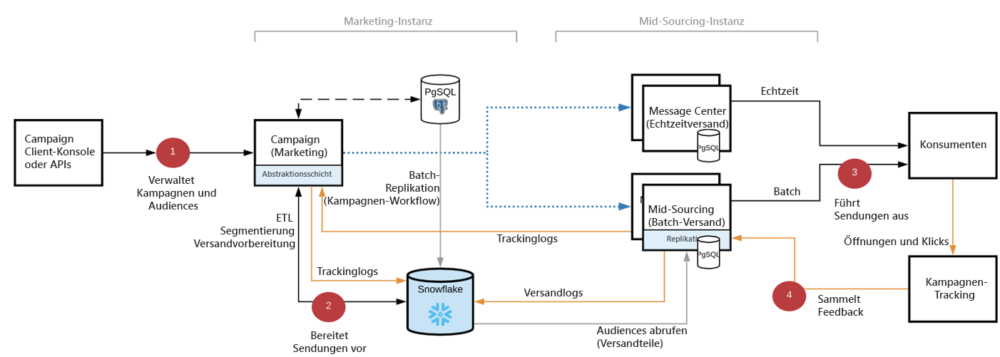
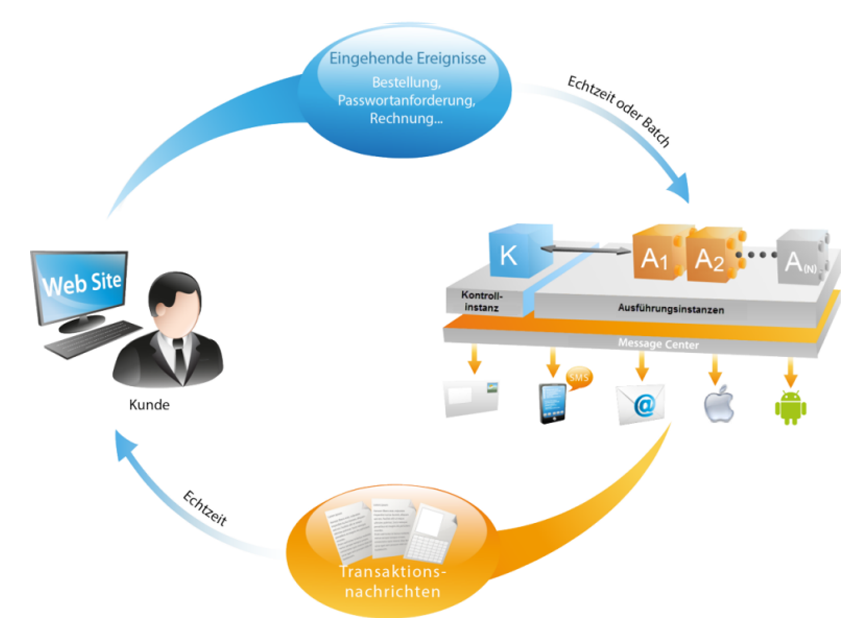

# Erste Schritte mit der Campaign-Architektur{#gs-ac-archi}

## Umgebungen

Campaign wird als einzelne Instanzen bereitgestellt, wobei jede Instanz eine vollständige Campaign-Umgebung darstellt.

Drei in Campaign Cloud Service verfügbare Umgebungstypen:

* **Produktionsumgebung**: hostet die Anwendungen für Geschäftsleute.

* **Staging-Umgebung**: wird für verschiedene Leistungs- und Qualitätstests verwendet, bevor Änderungen an der Anwendung in die Produktionsumgebung übertragen werden.

* **Entwicklungsumgebung**: ermöglicht es Entwicklern, Campaign unter denselben Laufzeitbedingungen wie die Staging- und Produktionsumgebungen zu implementieren.

Sie können Packages von einer Umgebung in eine andere exportieren und importieren.

[!DNL :arrow_upper_right:] Weitere Informationen zu Paketen finden Sie in der Dokumentation zu  [Campaign Classic v7 .](https://experienceleague.adobe.com/docs/campaign-classic/using/getting-started/administration-basics/working-with-data-packages.html)

## Mid-Sourcing-Bereitstellung{#mid-sourcing-deployment}

Die allgemeine Kommunikation zwischen Servern und Prozessen erfolgt nach folgendem Schema:

* Die Ausführungs- und Bounce-Management-Module sind in der Instanz deaktiviert.

* Die Anwendung ist so konfiguriert, dass sie eine Nachrichtenausführung auf einem Remote-Server mit &quot;Mid-Sourcing&quot;-Zugriff durchführt, der mithilfe von SOAP-Aufrufen (über HTTP oder HTTPS) gesteuert wird.

>[!NOTE]
>
> Campaign v8 basiert auf einer Hybridarchitektur. Beachten Sie bei der Umstellung von Campaign Classic v7, dass alle Sendungen über den Mid-Sourcing-Server durchgeführt werden.
> Infolgedessen ist das interne Routing in Campaign v8 **nicht möglich** und das externe Konto wurde entsprechend deaktiviert.

## Message Center-Architektur{#transac-msg-archi}

Transaktionsnachrichten (Message Center) sind das Campaign-Modul zur Verwaltung von Trigger-Nachrichten.

[!DNL :bulb:] In  [diesem Abschnitt](../send/transactional.md) erfahren Sie, wie Sie Transaktionsnachrichten senden.

Als Reaktion auf eine Aktion eines Kunden auf einer Website wird ein Ereignis an Campaign über eine REST-API gesendet. Die Nachrichtenvorlage wird mit den Informationen oder Daten gefüllt, die über den API-Aufruf bereitgestellt werden, und eine Transaktionsnachricht wird in Echtzeit an den Kunden gesendet. Diese Nachrichten können einzeln oder stapelweise per E-Mail, SMS oder Push-Benachrichtigungen gesendet werden.

In dieser spezifischen Architektur wird die Ausführungszelle von der Kontrollinstanz getrennt, um eine hohe Verfügbarkeit und Lastmanagement sicherzustellen.

* Die **Kontrollinstanz** (oder Marketinginstanz) wird von Marketing-Experten und IT-Teams zum Erstellen, Konfigurieren und Veröffentlichen von Nachrichtenvorlagen verwendet. Diese Instanz zentralisiert außerdem die Ereignisüberwachung und den Verlauf.

   [!DNL :bulb:] In  [diesem Abschnitt](../send/transactional.md) erfahren Sie, wie Sie Nachrichtenvorlagen erstellen und veröffentlichen.

* Die **Ausführungsinstanz** ruft eingehende Ereignisse (z. B. Passwortzurücksetzung oder Bestellungen von einer Website) ab und sendet personalisierte Nachrichten. Es kann mehr als eine Ausführungsinstanz geben, um Nachrichten über den Lastenausgleich zu verarbeiten und die Anzahl der Ereignisse zu skalieren, die für eine maximale Verfügbarkeit ausgeführt werden sollen.

>[!CAUTION]
>
>Die Kontroll- und die Ausführungsinstanz(en) müssen auf unterschiedlichen Computern installiert werden. Sie können aber nicht auf derselben Campaign-Instanz ausgeführt werden.

[!DNL :arrow_upper_right:] Die Message-Center-Architektur wird in der Dokumentation zu  [Campaign Classic v7 beschrieben.](https://experienceleague.adobe.com/docs/campaign-classic/using/transactional-messaging/introduction/transactional-messaging-architecture.html?lang=en#transactional-messaging)

### Authentifizierung

Um diese Funktionen zu nutzen, melden sich Adobe Campaign-Benutzer bei der Kontrollinstanz an, um Transaktionsnachrichten-Vorlagen zu erstellen, die Nachrichtenvorschau mithilfe einer Testliste zu generieren, Berichte anzuzeigen und Ausführungsinstanzen zu überwachen.

* Single Execution instance
Bei der Interaktion mit einer von der Adobe gehosteten Ausführungsinstanz kann ein externes System zunächst ein Sitzungstoken abrufen (das standardmäßig nach 24 Stunden abläuft), indem ein API-Aufruf an die Methode zur Sitzungsanmeldung unter Verwendung einer angegebenen Kontoanmeldung und eines Kennworts gesendet wird.
Nachdem die Ausführungsinstanz das sessionToken als Antwort auf den obigen Aufruf bereitgestellt hat, kann die externe Anwendung SOAP-API-Aufrufe (rtEvents oder batchEvents) zum Senden von Nachrichten durchführen, ohne dass in jedem SOAP-Aufruf das Konto-Login und das Kennwort eingeschlossen werden müssen.

* Mehrere Ausführungsinstanzen
In einer Ausführungsarchitektur mit mehreren Zellen, bei der mehrere Ausführungsinstanzen hinter einem Lastenausgleich stehen, durchläuft die von der externen Anwendung aufgerufene Anmeldemethode den Lastenausgleich: Aus diesem Grund kann keine Token-basierte Authentifizierung verwendet werden. Eine Benutzer-/Kennwortbasierte Authentifizierung ist erforderlich.

[!DNL :arrow_upper_right:] Weitere Informationen zu Transaktionsnachrichten-Ereignissen finden Sie in der Dokumentation zu  [Campaign Classic v7 .](https://experienceleague.adobe.com/docs/campaign-classic/using/transactional-messaging/introduction/event-description.html?lang=en#about-transactional-messaging-datamodel)