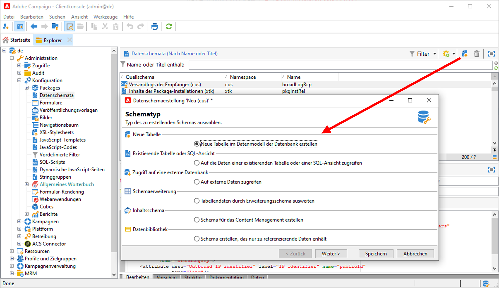
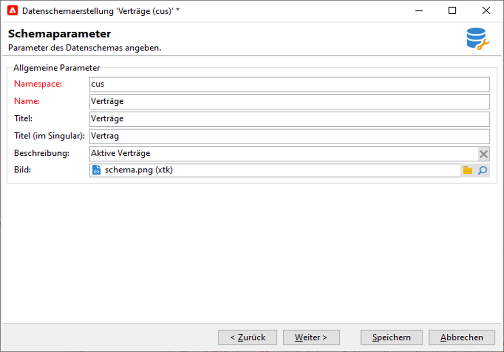

# Neues Schema{#create-new-schema} erstellen

Um die Schema zu bearbeiten, zu erstellen und zu konfigurieren, klicken Sie auf den Knoten **[!UICONTROL Administration > Configuration > Data Schemas]** der Adobe Campaign-Client-Konsole.

>[!NOTE]
>
>Integrierte Schema können nur von einem Administrator Ihrer Adobe Campaign Classic-Konsole gelöscht werden.


Auf der Registerkarte **[!UICONTROL Bearbeiten]** wird der XML-Inhalt eines Schemas angezeigt:


>[!NOTE]
>
>Mit dem Bearbeitungssteuerelement &quot;Name&quot;können Sie den Schema-Schlüssel aus Name und Namensraum eingeben. Die Attribute &quot;name&quot;und &quot;Namensraum&quot;des Stammelements des Schemas werden automatisch im XML-Bearbeitungsbereich des Schemas aktualisiert.

Die Registerkarte **[!UICONTROL Vorschau]** generiert automatisch das erweiterte Schema:


>[!NOTE]
>
>Beim Speichern des Quelldokuments wird die Generierung des erweiterten Schemas automatisch gestartet.

Wenn Sie die vollständige Struktur eines Schemas überprüfen müssen, können Sie die Registerkarte **[!UICONTROL Vorschau]** verwenden. Wenn das Schema erweitert wurde, können Sie dann alle Erweiterungen visualisieren. Als Ergänzung zeigt die Registerkarte **[!UICONTROL Dokumentation]** alle Schema-Attribute und -Elemente sowie deren Eigenschaften (SQL-Feld, Typ/Länge, Beschriftung, Beschreibung) an. Die Registerkarte **[!UICONTROL Dokumentation]** gilt nur für generierte Schema.

## Verwendungsfall: eine Vertragstabelle {#example--creating-a-contract-table} erstellen

Im folgenden Beispiel erstellen Sie eine neue Tabelle für **verträge** in der Datenbank. In dieser Tabelle können Sie für jeden Vertrag Vor- und Nachnamen sowie E-Mail-Adressen von Inhabern und Mitinhabern speichern.

Dazu müssen Sie das Schema der Tabelle erstellen und die Datenbankstruktur aktualisieren, um die entsprechende Tabelle zu erstellen. Die einzelnen Schritte sind unten aufgeführt.

1. Bearbeiten Sie den Knoten **[!UICONTROL Administration > Configuration > Data Schemas]** der Adobe Campaign-Struktur und klicken Sie auf **[!UICONTROL New]**.
1. Wählen Sie die Option **[!UICONTROL Neue Tabelle in der Datenvorlage]** erstellen und klicken Sie auf **[!UICONTROL Weiter]**.

   

1. Geben Sie einen Tabellennamen und einen Namensraum an.

   

   >[!NOTE]
   >
   >Standardmäßig werden von Benutzern erstellte Schema im Namensraum &quot;cus&quot;gespeichert. Weitere Informationen hierzu finden Sie unter [Identifizierung eines Schemas](extend-schema.md#identification-of-a-schema).

1. Erstellen Sie den Inhalt der Tabelle. Es wird empfohlen, den dedizierten Assistenten zu verwenden, um sicherzustellen, dass keine Einstellungen fehlen. Klicken Sie dazu auf die Schaltfläche **[!UICONTROL Einfügen]** und wählen Sie den hinzuzufügenden Einstellungstyp.

   

1. Legen Sie die Einstellungen für die Vertragstabelle fest:

   ```
   <srcSchema created="AA-MM-DD HH:MM:SS.TZ" desc="Active contracts" img="crm:crm/mscrm/mscrm_account_16x16.png"
           label="Contracts" labelSingular="Contract" lastModified="AA-MM-DD HH:MM:SS.TZ"
           mappingType="sql" name="Contracts" namespace="cus" xtkschema="xtk:srcSchema">
      <element dataSource="nms:extAccount:ffda" desc="Active contracts" img="crm:crm/mscrm/mscrm_account_16x16.png"
           label="Contracts" labelSingular="Contract" name="Contracts">
           <attribute name="holderName" label="Holder last name" type="string"/>
           <attribute name="holderFirstName" label="Holder first name" type="string"/>
           <attribute name="holderEmail" label="Holder email" type="string"/>
           <attribute name="co-holderName" label="Co-holder last name" type="string"/>           
           <attribute name="co-holderFirstName" label="Co-holder first name" type="string"/>           
           <attribute name="co-holderEmail" label="Co-holder email" type="string"/>    
           <attribute name="date" label="Subscription date" type="date"/>     
           <attribute name="noContract" label="Contract number" type="long"/> 
      </element>
   </srcSchema>
   ```

   hinzufügen die Art der vertraglichen Auflistung.

   ```
   <srcSchema created="AA-MM-DD HH:MM:SS.TZ" desc="Active contracts" img="crm:crm/mscrm/mscrm_account_16x16.png" label="Contracts" labelSingular="Contract" lastModified="AA-MM-DD HH:MM:SS.TZ"mappingType="sql" name="Contracts" namespace="cus" xtkschema="xtk:srcSchema">
      <enumeration basetype="byte" name="typeContract">
         <value label="Home" name="home" value="0"/>
         <value label="Car" name="car" value="1"/>
         <value label="Health" name="health" value="2"/>
         <value label="Pension fund" name="pension fund" value="2"/>
      </enumeration>
      <element dataSource="nms:extAccount:ffda" desc="Active contracts" img="crm:crm/mscrm/mscrm_account_16x16.png"
           label="Contracts" labelSingular="Contract" name="Contracts">
           <attribute name="holderName" label="Holder last name" type="string"/>
           <attribute name="holderFirstName" label="Holder first name" type="string"/>
           <attribute name="holderEmail" label="Holder email" type="string"/>
           <attribute name="co-holderName" label="Co-holder last name" type="string"/>           
           <attribute name="co-holderFirstName" label="Co-holder first name" type="string"/>           
           <attribute name="co-holderEmail" label="Co-holder email" type="string"/>    
           <attribute name="date" label="Subscription date" type="date"/>     
           <attribute name="noContract" label="Contract number" type="long"/> 
      </element>
   </srcSchema>
   ```

1. Speichern Sie das Schema und klicken Sie auf die Registerkarte **[!UICONTROL Struktur]**, um die Struktur zu erstellen:

   

1. Aktualisieren Sie die Datenbankstruktur, um die Tabelle zu erstellen, mit der das Schema verknüpft werden soll. Weiterführende Informationen hierzu finden Sie in [diesem Abschnitt](update-database-structure.md).

