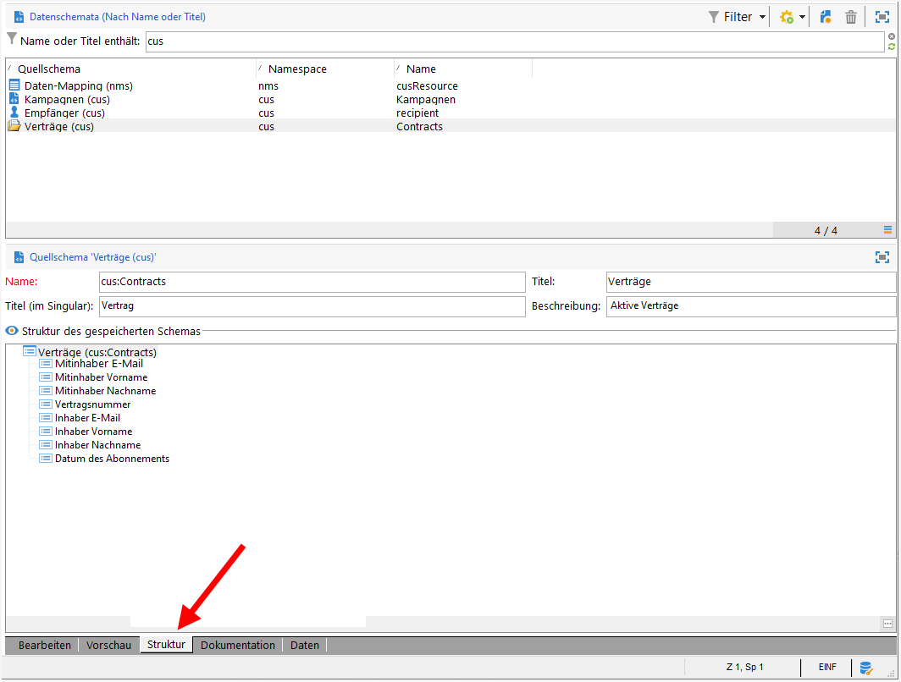

# Erstellen eines neuen Schemas{#create-new-schema}

Um Schemata zu bearbeiten, zu erstellen und zu konfigurieren, klicken Sie in der Client-Konsole von Adobe Campaign auf den Knoten **[!UICONTROL Administration > Konfiguration > Datenschemas]**.

>[!NOTE]
>
>Integrierte Datenschemata können nur von einem Administrator Ihrer Adobe Campaign-Konsole gelöscht werden.


Auf der Registerkarte **[!UICONTROL Bearbeiten]** wird der XML-Inhalt eines Schemas angezeigt:


>[!NOTE]
>
>Mit dem Bearbeitungssteuerelement &quot;Name&quot; können Sie den Schemaschlüssel, bestehend aus Name und Namespace, eingeben. Die Attribute &quot;Name&quot; und &quot;Namespace&quot; des Stammelements des Schemas werden automatisch im XML-Bearbeitungsbereich des Schemas aktualisiert. Beachten Sie, dass einige Namespaces nur zur internen Verwendung verfügbar sind. [Weitere Informationen](schemas.md#reserved-namespaces)

Die Registerkarte **[!UICONTROL Vorschau]** generiert automatisch das erweiterte Schema:


>[!NOTE]
>
>Beim Speichern des Quellschemas wird die Generierung des erweiterten Schemas automatisch gestartet.

Wenn Sie die vollständige Struktur eines Schemas überprüfen müssen, können Sie die Registerkarte **[!UICONTROL Vorschau]** verwenden. Wenn das Schema erweitert wurde, können Sie alle seine Erweiterungen visuell darstellen. Ergänzend zeigt die Registerkarte **[!UICONTROL Dokumentation]** alle Schema-Attribute und -Elemente sowie deren Eigenschaften (SQL-Feld, Typ/Länge, Bezeichnung, Beschreibung) an. Die Registerkarte **[!UICONTROL Dokumentation]** gilt nur für generierte Schemata.

## Anwendungsfall: eine Tabelle für Verträge erstellen {#example--creating-a-contract-table}

Im folgenden Beispiel erstellen Sie eine neue Tabelle für **Verträge** in der Datenbank. In dieser Tabelle können Sie Vor- und Nachnamen sowie E-Mail-Adressen von Inhabern und Mitinhabern für jeden Vertrag speichern.

Dazu müssen Sie das Schema der Tabelle erstellen und die Datenbankstruktur aktualisieren, um die entsprechende Tabelle zu erstellen. Die einzelnen Schritte sind unten aufgeführt.

1. Bearbeiten Sie den Knoten **[!UICONTROL Administration > Konfiguration > Datenschemata]** in der Adobe Campaign-Struktur und klicken Sie auf **[!UICONTROL Neu]**.
1. Wählen Sie die Option **[!UICONTROL Neue Tabelle im Datenmodell der Datenbank erstellen]** und klicken Sie auf **[!UICONTROL Weiter]**.

   

1. Geben Sie einen Tabellennamen und einen Namespace an.

   

   >[!NOTE]
   >
   >Standardmäßig werden von Benutzern erstellte Schemata im Namespace &#39;cus&#39; gespeichert. Weitere Informationen hierzu finden Sie unter [Identifizierung eines Schemas](extend-schema.md#identification-of-a-schema).

1. Erstellen Sie den Inhalt der Tabelle. Es wird empfohlen, den dedizierten Assistenten zu verwenden, um sicherzustellen, dass keine Einstellungen fehlen. Klicken Sie dazu auf **[!UICONTROL Einfügen]** und wählen Sie die Art der Einstellung, die hinzugefügt werden soll.

   

1. Legen Sie die Einstellungen für die Tabelle mit den Verträgen fest.

   Es empfiehlt sich, die Tabelle in der Cloud-Datenbank zu erstellen, indem Sie das Attribut `dataSource="nms:extAccount:ffda"` hinzufügen. Dieses Attribut wird beim Erstellen einer neuen Tabelle standardmäßig hinzugefügt.

   ```
   <srcSchema created="YYYY-MM-DD HH:MM:SS.TZ" desc="Active contracts" img="crm:crm/mscrm/mscrm_account_16x16.png"
           label="Contracts" labelSingular="Contract" lastModified="YYYY-MM-DD HH:MM:SS.TZ"
           mappingType="sql" name="Contracts" namespace="cus" xtkschema="xtk:srcSchema">
      <element dataSource="nms:extAccount:ffda" desc="Active contracts" img="crm:crm/mscrm/mscrm_account_16x16.png"
           label="Contracts" labelSingular="Contract" name="Contracts">
           <attribute name="holderName" label="Holder last name" type="string"/>
           <attribute name="holderFirstName" label="Holder first name" type="string"/>
           <attribute name="holderEmail" label="Holder email" type="string"/>
           <attribute name="co-holderName" label="Co-holder last name" type="string"/>           
           <attribute name="co-holderFirstName" label="Co-holder first name" type="string"/>           
           <attribute name="co-holderEmail" label="Co-holder email" type="string"/>    
           <attribute name="date" label="Subscription date" type="date"/>     
           <attribute name="noContract" label="Contract number" type="long"/> 
      </element>
   </srcSchema>
   ```

   Fügen Sie die in den Verträgen verwendete Art der Aufzählung hinzu.

   ```
   <srcSchema created="AA-MM-DD HH:MM:SS.TZ" desc="Active contracts" img="crm:crm/mscrm/mscrm_account_16x16.png" label="Contracts" labelSingular="Contract" AA-MM-DD HH:MM:SS.TZ"mappingType="sql" name="Contracts" namespace="cus" xtkschema="xtk:srcSchema">
      <enumeration basetype="byte" name="typeContract">
         <value label="Home" name="home" value="0"/>
         <value label="Car" name="car" value="1"/>
         <value label="Health" name="health" value="2"/>
         <value label="Pension fund" name="pension fund" value="2"/>
      </enumeration>
      <element dataSource="nms:extAccount:ffda" desc="Active contracts" img="crm:crm/mscrm/mscrm_account_16x16.png"
           label="Contracts" labelSingular="Contract" name="Contracts">
           <attribute name="holderName" label="Holder last name" type="string"/>
           <attribute name="holderFirstName" label="Holder first name" type="string"/>
           <attribute name="holderEmail" label="Holder email" type="string"/>
           <attribute name="co-holderName" label="Co-holder last name" type="string"/>           
           <attribute name="co-holderFirstName" label="Co-holder first name" type="string"/>           
           <attribute name="co-holderEmail" label="Co-holder email" type="string"/>    
           <attribute name="date" label="Subscription date" type="date"/>     
           <attribute name="noContract" label="Contract number" type="long"/> 
      </element>
   </srcSchema>
   ```

1. Speichern Sie das Schema und klicken Sie auf die Registerkarte **[!UICONTROL Struktur]**, um die Struktur zu erstellen:

   

1. Aktualisieren Sie die Datenbankstruktur, um die Tabelle zu erstellen, mit der das Schema verknüpft werden soll. Weiterführende Informationen hierzu finden Sie in [diesem Abschnitt](update-database-structure.md).

