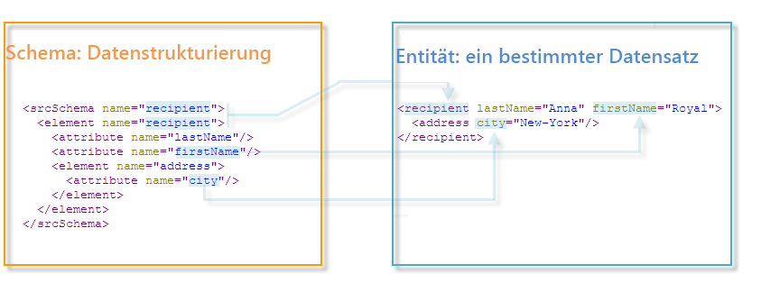

# Erweitern eines Schemas{#extend-schemas}

In diesem Artikel wird beschrieben, wie Sie Erweiterungsschema konfigurieren, um das konzeptionelle Datenmodell der Adobe Campaign-Datenbank zu erweitern.

:bulb: Ein besseres Verständnis der integrierten Kampagnen und ihrer Interaktion finden Sie auf [dieser Seite](datamodel.md).

Die physische und logische Struktur der in der Anwendung übertragenen Daten wird in XML beschrieben. Es folgt einer für Adobe Campaign spezifischen Grammatik, die als **Schema** bezeichnet wird.

Ein Schema ist ein mit einer Datenbanktabelle verknüpftes XML-Dokument. Er definiert die Datenstruktur und beschreibt die SQL-Definition der Tabelle:

* Der Name der Tabelle
* Felder
* Links zu anderen Tabellen

Außerdem wird die XML-Struktur zum Speichern von Daten beschrieben:

* Elemente und Attribute
* Hierarchie der Elemente
* Element- und Attributtypen
* Standardwerte
* Beschriftungen, Beschreibungen und andere Eigenschaften.

Mit Schemas können Sie eine Entität in der Datenbank definieren. Es gibt ein Schema für jede Entität.

## Syntax der Schema {#syntax-of-schemas}

Das Stammelement des Schemas ist **`<srcschema>`**. Es enthält die Unterelemente **`<element>`** und **`<attribute>`**.

Das erste **`<element>`**-Unterelement fällt mit dem Stammelement der Entität zusammen.

```
<srcSchema name="recipient" namespace="cus">
  <element name="recipient">  
    <attribute name="lastName"/>
    <attribute name="email"/>
    <element name="location">
      <attribute name="city"/>
   </element>
  </element>
</srcSchema>
```

>[!NOTE]
>
>Das Stammelement der Entität hat denselben Namen wie das Schema.



Die Tags **`<element>`** definieren die Namen von Entitätselementen. **`<attribute>`** -Tags des Schemas definieren die Namen der Attribute in den  **`<element>`** Tags, mit denen sie verknüpft wurden.

## Identifizierung eines Schemas {#identification-of-a-schema}

Ein Schema wird anhand seines Namens und seines Namensraums identifiziert.

Mit einem Namensraum können Sie eine Reihe von Schemas nach Interessensgebieten gruppieren. Beispielsweise wird der Namensraum **cus** für die kundenspezifische Konfiguration (**Customers**) verwendet.

>[!CAUTION]
>
>Standardmäßig muss der Name des Namensraums knapp sein und darf nur autorisierte Zeichen gemäß den XML-Benennungsregeln enthalten.
>
>Bezeichner dürfen nicht mit numerischen Zeichen beginnen.

Bestimmte Namensräume sind für Beschreibungen der Systementitäten reserviert, die für den Betrieb des Adobe Campaign-Antrags erforderlich sind:

* **xxl**: zu Cloud-Datenbank-Schemas,
* **xtk**: Plattformsystemdaten,
* **nl**: über die Verwendung des Antrags insgesamt,
* **nms**: Versand (Empfänger, Versand, Verfolgung usw.),
* **ncm**: Content-Management,
* **temp**: für vorübergehende Schemas reserviert.

Der Identifizierungsschlüssel eines Schemas ist eine Zeichenfolge, die mithilfe des Namensraums und des durch einen Doppelpunkt getrennten Namens erstellt wird. Beispiel: **nms:Empfänger**.
