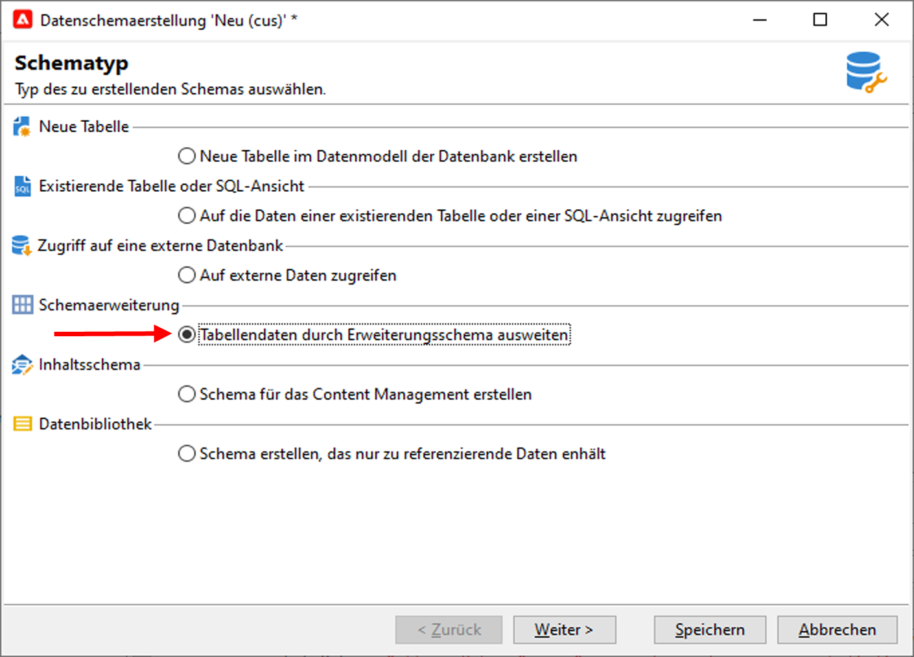
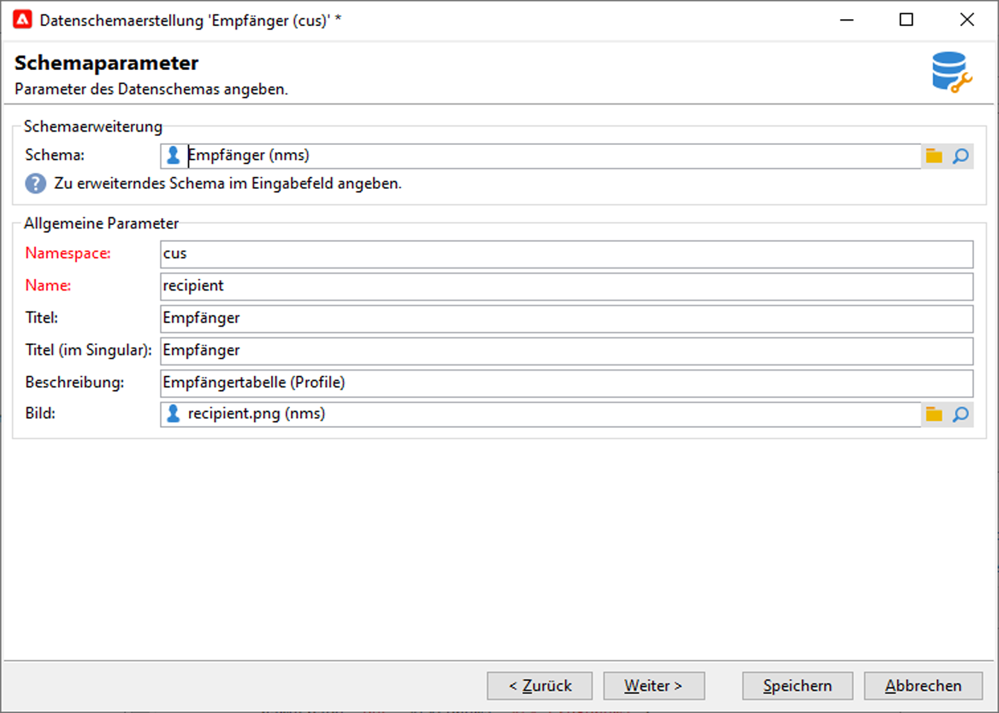

# Schema erweitern{#extend-schemas}

Als technischer Anwender können Sie das Campaign-Datenmodell an die Anforderungen Ihrer Implementierung anpassen: So können Sie Elemente zu einem vorhandenen Schema hinzufügen, ein Element in einem Schema ändern oder Elemente löschen.

Die wichtigsten Schritte zum Anpassen des Campaign-Datenmodells sind:

1. Erweiterungsschema erstellen
1. Campaign-Datenbank aktualisieren
1. Formular aktualisieren

>[!CAUTION]
>Das integrierte Schema darf nicht direkt geändert werden. Wenn Sie ein integriertes Schema anpassen möchten, müssen Sie es erweitern.

?? Genauere Informationen zu den integrierten Campaign-Tabellen und ihrer Interaktion finden Sie auf [dieser Seite](datamodel.md). Siehe auch Empfehlungen zum Erstellen eines neuen Schemas auf [dieser Seite](create-schema.md).

Gehen Sie wie folgt vor, um ein Schema zu erweitern:

1. Navigieren Sie im Explorer zum Ordner **[!UICONTROL Administration > Konfiguration > Datenschemata]**.
1. Klicken Sie auf die Schaltfläche **Neu** und wählen Sie **[!UICONTROL Daten in einer Tabelle mit einem Erweiterungsschema erweitern]**.

   

1. Identifizieren Sie das integrierte Schema, um es zu erweitern und auszuwählen.

   

   Benennen Sie das Erweiterungsschema standardmäßig genauso wie das integrierte Schema und verwenden Sie einen benutzerdefinierten Namespace.  Beachten Sie, dass einige Namespaces nur zur internen Verwendung verfügbar sind. [Weitere Informationen](schemas.md#reserved-namespaces)

   

1. Fügen Sie im Schema-Editor über das Kontextmenü die benötigten Elemente hinzu und speichern Sie sie.

   

   Im untenstehenden Beispiel fügen wir das Attribut **MembershipYear** hinzu, legen eine Längenbegrenzung für den Nachnamen fest (dieser Grenzwert überschreibt den Standardwert) und entfernen das Geburtsdatum aus dem integrierten Schema.

   

   ```
   <srcSchema created="YYYY-MM-DD" desc="Recipient table" extendedSchema="nms:recipient"
           img="nms:recipient.png" label="Recipients" labelSingular="Recipient" lastModified="YYYY-MM-DD"
           mappingType="sql" name="recipient" namespace="cus" xtkschema="xtk:srcSchema">
    <element desc="Recipient table" img="nms:recipient.png" label="Recipients" labelSingular="Recipient" name="recipient">
       <attribute label="Member since" name="MembershipYear" type="long"/>
       <attribute length="50" name="lastName"/>
       <attribute _operation="delete" name="birthDate"/>
   </element>
   </srcSchema>
   ```

1. Trennen Sie die Verbindung zu Campaign und stellen Sie sie wieder her, um die Aktualisierung der Schemastruktur auf der Registerkarte **[!UICONTROL Struktur]** zu überprüfen.

   

1. Aktualisieren Sie die Datenbankstruktur, um Ihre Änderungen anzuwenden. [Weitere Informationen](update-database-structure.md)

1. Nachdem die Änderungen in der Datenbank implementiert wurden, können Sie das Empfängerformular anpassen, um die Änderungen sichtbar zu machen. [Weitere Informationen](forms.md)
