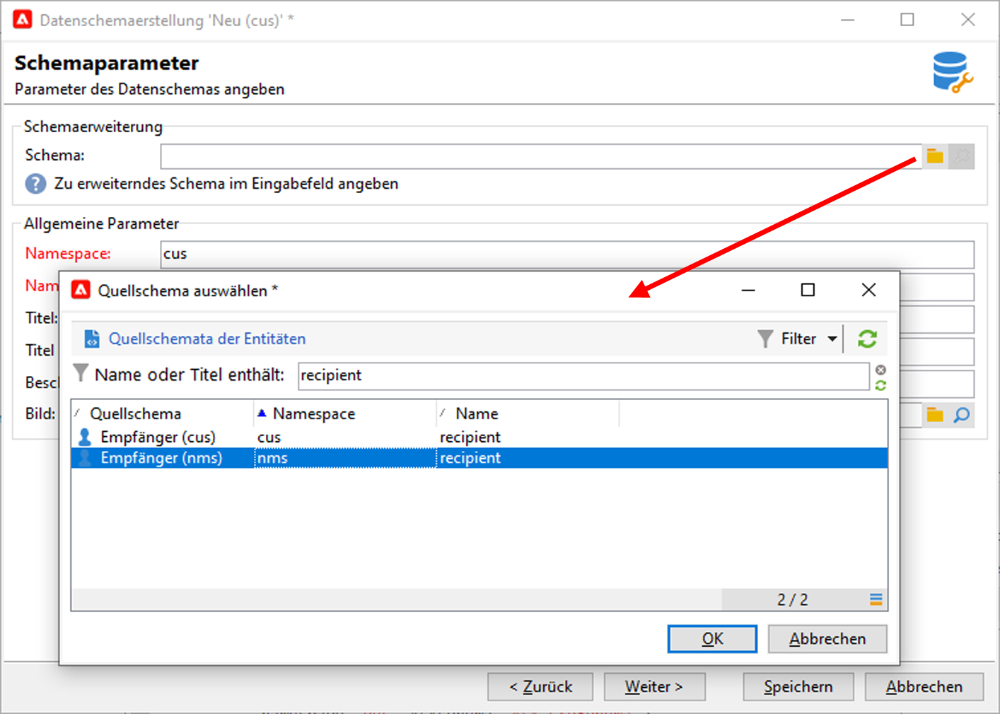
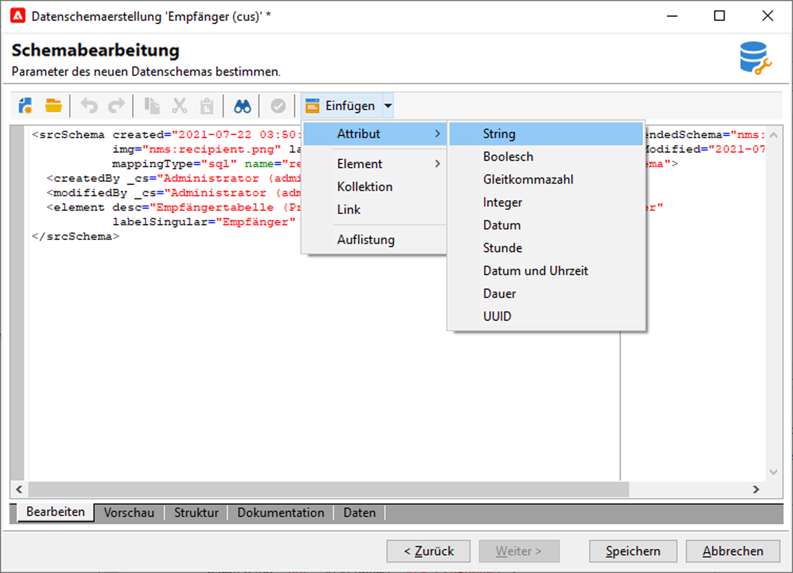

# Erweitern eines Schemas{#extend-schemas}

Als technischer Anwender können Sie das Datenmodell der Kampagne an die Anforderungen Ihrer Implementierung anpassen: Elemente zu einem vorhandenen Schema hinzufügen, ein Element in einem Schema ändern oder Elemente löschen.

Die wichtigsten Schritte zum Anpassen des Datenmodells der Kampagne sind:

1. Erweiterungsschema erstellen
1. Kampagne aktualisieren
1. Anpassen des Eingabefelds

>[!CAUTION]
>Integriertes Schema darf nicht direkt geändert werden. Wenn Sie ein integriertes Schema anpassen müssen, müssen Sie es erweitern.

:bulb: Ein besseres Verständnis der integrierten Kampagnen und ihrer Interaktion finden Sie auf [dieser Seite](datamodel.md).

Gehen Sie wie folgt vor, um ein Schema zu verlängern:

1. Navigieren Sie im Explorer zum Ordner **[!UICONTROL Administration > Configuration > Data Schemas]**.
1. Klicken Sie auf die Schaltfläche **Neu** und wählen Sie **[!UICONTROL Erweitern Sie die Daten in einer Tabelle mit einem Erweiterungsschema]**.

   

1. Identifizieren Sie das integrierte Schema, das erweitert werden soll, und wählen Sie es aus.

   

   Benennen Sie das Erweiterungsschema standardmäßig genauso wie das integrierte Schema und verwenden Sie einen benutzerdefinierten Namensraum.

   

1. Fügen Sie im Schema-Editor die benötigten Elemente über das Kontextmenü hinzu und speichern Sie sie.

   

   Im unten stehenden Beispiel fügen wir das Attribut MitgliedschaftJahr hinzu, legen eine Längenbegrenzung für den Nachnamen fest (dieser Grenzwert überschreibt den Standardwert) und entfernen das Geburtsdatum aus dem integrierten Schema.

   

   ```
   <srcSchema created="YY-MM-DD" desc="Recipient table" extendedSchema="nms:recipient"
           img="nms:recipient.png" label="Recipients" labelSingular="Recipient" lastModified="YY-MM-DD"
           mappingType="sql" name="recipient" namespace="cus" xtkschema="xtk:srcSchema">
    <element desc="Recipient table" img="nms:recipient.png" label="Recipients" labelSingular="Recipient"
          name="recipient">
   <attribute label="Member since" name="MembershipYear" type="long"/>
   <attribute length="50" name="lastName"/>
   <attribute _operation="delete" name="birthDate"/>
   </element>
   </srcSchema>
   ```
1. Trennen Sie die Verbindung zur Kampagne und stellen Sie die Verbindung wieder her, um die Aktualisierung der Schema-Struktur auf der Registerkarte **[!UICONTROL Struktur]** zu überprüfen.

   

1. Aktualisieren Sie die Datenbankstruktur, um Ihre Änderungen anzuwenden. [Mehr dazu](update-database-structure.md)

1. Nachdem die Änderungen in der Datenbank implementiert wurden, können Sie das Eingabedateiformular des Empfängers anpassen, um die Änderungen sichtbar zu machen. [Mehr dazu](forms.md)
