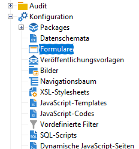
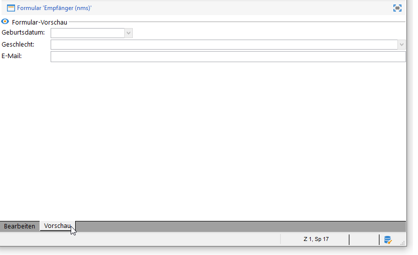

# Erste Schritte mit Formularen{#gs-ac-forms}

Wenn Sie ein Schema erstellen oder erweitern, müssen Sie die zugehörigen Formulare für die Eingabe erstellen oder ändern, um diese Änderungen für die Endbenutzer sichtbar zu machen.

Mit einem Formular können Sie eine Instanz, die mit einem Datenschema verknüpft ist, über die Adobe Campaign-Client-Konsole bearbeiten. Das Formular wird anhand seines Namens und seines Namespace identifiziert.

Der Identifikationsschlüssel eines Formulars ist eine Zeichenfolge, die den Namespace und den Namen enthält, getrennt durch das Zeichen &#39;:&#39; (z. B. &quot;cus:contact&quot;).

## Formulare bearbeiten

Erstellen und konfigurieren Sie Formulare im Ordner **[!UICONTROL Administration] > [!UICONTROL Konfiguration] > [!UICONTROL Formulare]** der Client-Konsole:



Der XML-Code des Formulars wird im Editor erfasst:


Die Vorschau generiert eine Anzeige des Formulars:



## Formularstruktur

Die Beschreibung eines Formulars ist ein strukturiertes XML-Dokument, das die Grammatik des Formularschemas anwendet: **xtk:form**.

Das XML-Dokument eines Formulars muss das `<form>`-Stammelement mit den Attributen **name** und **namespace** zur Befüllung des Formularnamens und des Namespace enthalten.

```
<form name="form_name" namespace="name_space">
...
</form>
```

Standardmäßig ist ein Formular mit dem Datenschema verknüpft, das denselben Namen und denselben Namespace aufweist. Um ein Formular mit einem anderen Namen zu verknüpfen, setzen Sie das Attribut **entity-schema** des Elements `<form>` auf den Namen des Schemaschlüssels. Um die Struktur eines Formulars zu veranschaulichen, beschreiben wir eine Schnittstelle mit dem Beispielschema &quot;cus:recipient&quot;:

```
<srcSchema name="recipient" namespace="cus">
  <enumeration name="gender" basetype="byte">    
    <value name="unknown" label="Not specified" value="0"/>    
    <value name="male" label="Male" value="1"/>   
    <value name="female" label="Female" value="2"/>   
  </enumeration>

  <element name="recipient">
    <attribute name="email" type="string" length="80" label="Email" desc="E-mail address of recipient"/>
    <attribute name="birthDate" type="datetime" label="Date"/>
    <attribute name="gender" type="byte" label="Gender" enum="gender"/>
  </element>
</srcSchema>
```

Das Formular basiert auf dem Beispielschema:


```
<form name="recipient" namespace="cus">
  <input xpath="@gender"/>
  <input xpath="@birthDate"/>
  <input xpath="@email"/>
</form>
```

Die Beschreibung der Eingabefelder beginnt mit dem `<form>`-Stammelement. Ein Eingabefeld wird in einem **`<input>`**-Element mit seinem **xpath**-Attribut notiert, welches den Pfad des Felds in seinem Schema enthält.

Das Eingabefeld passt sich automatisch dem gewählten Datentyp an und verwendet den im Schema angegebenen Titel.

>[!NOTE]
>
>Sie können das in seinem Datenschema definierte Label überschreiben, indem Sie das Attribut **label** zum Element `<input>` hinzufügen:\
>`<input label="E-mail address" xpath="@name" />`

Standardmäßig wird jedes Feld, je nach Datentyp, einzeilig über den gesamten verfügbaren Platz angezeigt.

↗️ In der [Dokumentation zu Campaign Classic v7](https://docs.adobe.com/content/help/de-DE/campaign-classic/technicalresources/api/control-Button.html) sind alle Formularattribute aufgeführt.

## Formatierung {#formatting}

Das Layout der Eingabefelder ähnelt dem in HTML-Tabellen verwendeten Layout, mit der Möglichkeit, ein Eingabefeld in mehrere Spalten zu unterteilen, Elemente zu verschachteln oder die Belegung des verfügbaren Platzes festzulegen. Beachten Sie jedoch, dass Sie bei der Formatierung den Bereich nur nach Proportionen aufteilen können. Sie können keine festen Abmessungen für ein Objekt angeben.

So zeigen Sie die Eingabefelder des obigen Beispiels in zwei Spalten an:


```
<form name="recipient" namespace="cus">
  <container colcount="2">
    <input xpath="@gender"/>
    <input xpath="@birthDate"/>
    <input xpath="@email"/>
  </container>
</form>
```

Mithilfe des Elements **`<container>`** mit dem Attribut **colcount** können Sie die Anzeige von untergeordneten Eingabefeldern auf zwei Spalten erzwingen.

Das Attribut **colspan** eines Eingabefelds erweitert das Eingabefeld um die Anzahl der Spalten, die in seinem Wert eingegeben wurden:


```
<form name="recipient" namespace="cus">
  <container colcount="2">
    <input xpath="@gender"/>
    <input xpath="@birthDate"/>
    <input xpath="@email" colspan="2"/>
  </container>
</form> 
```

Durch das Ausfüllen des Attributs **type=&quot;frame&quot;** fügt der Container einen Rahmen um die untergeordneten Eingabefelder mit der im Attribut **label** enthaltenen Beschriftung hinzu:


```
<form name="recipient" namespace="cus">
  <container colcount="2" type="frame" label="General">
    <input xpath="@gender"/>
    <input xpath="@birthDate"/>
    <input xpath="@email" colspan="2"/>
  </container>
</form>
```

Ein **`<static>`**-Element kann zum Formatieren des Formulars verwendet werden:


```
<form name="recipient" namespace="cus">
  <static type="separator" colspan="2" label="General"/>
  <input xpath="@gender"/>
  <input xpath="@birthDate"/>
  <input xpath="@email" colspan="2"/>
  <static type="help" label="General information about recipient with date of birth, gender, and e-mail address." colspan="2"/>
</form>
```

Mithilfe des **`<static>`**-Tags mit dem Typ **separator** können Sie eine Trennleiste mit einer Beschriftung hinzufügen, die im Attribut **label** enthalten ist.

Mithilfe des `<static>`-Tags vom Typ &quot;Hilfe&quot; wurde ein Hilfetext hinzugefügt. Der Inhalt des Textes wird im Attribut **label** eingegeben.

## Verwenden von Containern {#containers}

Verwenden Sie **Container**, um einen Satz von Eingabefeldern zu gruppieren. Sie werden durch das Element **`<container>`** dargestellt. Sie wurden oben verwendet, um Eingabefelder über mehrere Spalten zu formatieren.

Mit dem **xpath**-Attribut auf einem `<container>` können Sie den Verweis auf untergeordnete Eingabefelder vereinfachen. Die Referenzierung der Eingabefelder erfolgt dann relativ zum übergeordneten `<container>`.

Beispiel eines Containers ohne &quot;xpath&quot;:

```
<container colcount="2">
  <input xpath="location/@zipCode"/>
  <input xpath="location/@city"/>
</container>
```

Beispiel mit dem Zusatz &quot;xpath&quot; zum Element &quot;location&quot;:

```
<container colcount="2" xpath="location">
  <input xpath="@zipCode"/>
  <input xpath="@city"/>
</container>
```

Container werden verwendet, um komplexe Eingabefelder mithilfe eines Satzes von Feldern zu konstruieren, die in Seiten formatiert sind.

### Tabs hinzufügen (Notebook) {#tab-container}

Verwenden Sie den Container **Notebook**, um Daten auf Seiten zu formatieren, auf die über Registerkarten zugegriffen werden kann.


```
<container type="notebook">
  <container colcount="2" label="General">
    <input xpath="@gender"/>
    <input xpath="@birthDate"/>
    <input xpath="@email" colspan="2"/>
  </container>
  <container colcount="2" label="Location">
    ...
  </container>
</container>
```

Der Haupt-Container wird durch das Attribut **type=&quot;Notebook&quot;** definiert. Registerkarten werden in den untergeordneten Containern deklariert und die Beschriftung der Registerkarten wird aus dem Attribut **label** gefüllt.

Fügen Sie das Attribut **style=&quot;down&quot;** hinzu, um die vertikale Ausrichtung der Registerkartenbeschriftungen unter dem Eingabefeld zu erzwingen. Dieses Attribut ist optional. Der Standardwert ist **&quot;up&quot;**.


`<container style="down" type="notebook">  ... </container>`

### Symbole (iconbox) hinzufügen  {#icon-list}

Verwenden Sie diesen Container, um eine vertikale Symbolleiste anzuzeigen, mit der Sie die anzuzeigenden Seiten auswählen können.


```
<container type="iconbox">
  <container colcount="2" label="General" img="xtk:properties.png">
    <input xpath="@gender"/>
    <input xpath="@birthDate"/>
    <input xpath="@email" colspan="2"/>
  </container>
  <container colcount="2" label="Location" img="nms:msgfolder.png">
    ...
  </container>
</container>
```

Der Haupt-Container wird durch das Attribut **type=&quot;iconbox&quot;** definiert. Die mit den Symbolen verknüpften Seiten werden in den untergeordneten Containern deklariert. Die Beschriftung der Symbole wird aus dem Attribut **label** gefüllt.

Das Seitensymbol wird aus dem Attribut `img="<image>"` gefüllt, wobei `<image>` der Bildname ist, der dem zugehörigen Bildschlüssel entspricht, der aus dem Namespace und dem Namen besteht (z. B. &quot;xtk:properties.png&quot;).

Die Bilder sind im Knoten **[!UICONTROL Administration > Konfiguration > Bilder]** verfügbar.

### Container ausblenden (visibleGroup) {#visibility-container}

Sie können einen Satz von Eingabefeldern über eine dynamische Bedingung ausblenden.

Dieses Beispiel veranschaulicht die Sichtbarkeit von Eingabefeldern für den Wert des Feldes &quot;Geschlecht&quot;:

```
<container type="visibleGroup" visibleIf="@gender=1">
  ...
</container>
<container type="visibleGroup" visibleIf="@gender=2">
  ...
</container>
```

Ein Container für die Sichtbarkeit wird durch das Attribut **type=&quot;visibleGroup&quot;** definiert. Das Attribut **visibleIf** enthält die Sichtbarkeitsbedingung.

Beispiele für die Bedingungssyntax:

* **visibleIf=&quot;@email=&#39;peter.martinezATneeolane.net&#39;&quot;**: prüft Gleichheit bei Daten vom Typ Zeichenfolge. Der Vergleichswert muss in Anführungszeichen gesetzt werden.
* **visibleIf=&quot;@gender >= 1 and @gender != 2&quot;**: Bedingung für einen numerischen Wert.
* **visibleIf=&quot;@boolean1=true oder @boolean2=false&quot;**: Testen von booleschen Feldern.

### Bedingte Anzeige (enabledGroup) {#enabling-container}

Mit diesem Container können Sie einen Datensatz aus einer dynamischen Bedingung aktivieren oder deaktivieren. Durch Deaktivieren eines Eingabefeldes wird dessen Bearbeitung verhindert. Das folgende Beispiel veranschaulicht die Aktivierung von Eingabefeldern über den Wert des Feldes &quot;Geschlecht&quot;:

```
<container type="enabledGroup" enabledIf="@gender=1">
  ...
</container>
<container type="enabledGroup" enabledIf="@gender=2">
  ...
</container>
```

Ein aktivierender Container wird durch das Attribut **type=&quot;enabledGroup&quot;** definiert. Das Attribut **enabledIf** enthält die Bedingung für die Aktivierung.

## Link bearbeiten {#editing-a-link}

Eine Inhaltsrelation wird auf folgende Weise im Datenschema deklariert:

```
<element label="Company" name="company" target="cus:company" type="link"/>
```

Die Bearbeitungssteuerung der Relation in ihrem Formular sieht folgendermaßen aus:


```
<input xpath="company"/>
```

Die Auswahl des Ziels ist über das Bearbeitungsfeld verfügbar. Die Eingabe wird durch &quot;type-ahead&quot; unterstützt, sodass ein Zielelement schon mit den ersten eingegebenen Zeichen leicht gefunden werden kann. Die Suche basiert dann auf dem **Compute string**, der im Zielschema definiert ist. Wenn das Schema nach der Validierung im Eingabefeld nicht vorhanden ist, wird eine Bestätigungsmeldung der Zielerstellung im laufenden Betrieb angezeigt. Die Bestätigung erstellt einen neuen Eintrag in der Zieltabelle und verknüpft ihn mit der Relation.

Eine Dropdown-Liste wird verwendet, um ein Zielelement aus der Liste der bereits erstellten Einträge auszuwählen.

Mit dem Symbol **[!UICONTROL Relation ändern]** (Ordner) wird ein Auswahlformular mit der Liste der Zielelemente und einem Filterbereich gestartet.

Das Symbol **[!UICONTROL Relation bearbeiten]** (Vergrößerung) startet das Bearbeitungsformular des verknüpften Elements. Das verwendete Formular wird standardmäßig vom Schlüssel des Zielschemas abgeleitet. Mit dem Attribut **form** können Sie den Namen des Bearbeitungsformulars erzwingen (z. B. &quot;cus:company2&quot;).

Es besteht außerdem die Möglichkeit, die Auswahl von Zielelementen durch Hinzufügen des Elements **`<sysfilter>`** aus der Definition der Relation in das Formular einzuschränken:

```
<input xpath="company">
  <sysFilter>
    <condition expr="[location/@city] =  'Newton"/>
  </sysFilter>
</input>
```

Mit dem Element **`<orderby>`** können Sie die Liste auch sortieren:

```
<input xpath="company">
  <orderBy>
    <node expr="[location/@zipCode]"/>
  </orderBy>
</input>
```

## Eingabefeld-Eigenschaften {#control-properties}

* **noAutoComplete**: Deaktiviert &quot;type-ahead&quot; (mit dem Wert &quot;true&quot;)
* **createMode**: erstellt die Relation im laufenden Betrieb, wenn sie noch nicht vorhanden ist. Mögliche Werte:

   * **none**: Deaktiviert die Erstellung. Wenn die Relation nicht vorhanden ist, wird eine Fehlermeldung angezeigt.
   * **inline**: Erstellt die Relation mit dem Inhalt im Bearbeitungsfeld.
   * **edition**: Zeigt das Bearbeitungsformular für die Relation an. Beim Validieren des Formulars werden die Daten gespeichert (Standardmodus).

* **noZoom**: Kein Bearbeitungsformular für die Relation (mit dem Wert &quot;true&quot;)
* **form**: Überschreibt das Bearbeitungsformular des Zielelements

## Relationsliste hinzufügen (unbound) {#list-of-links}

Eine Relation, die im Datenschema als Sammlungselement (unbound=&quot;true&quot;) eingetragen ist, muss eine Liste durchlaufen, um alle mit ihr verbundenen Elemente anzuzeigen.

Das Prinzip besteht darin, die Liste der verknüpften Elemente mit optimierter Datenladung anzuzeigen (Daten per Batch herunterladen, Ausführung der Liste nur, wenn sie sichtbar ist).

Beispiel einer Sammlungsrelation in einem Schema:

```
<element label="Events" name="rcpEvent" target="cus:event" type="link" unbound="true">
...
</element>
```

Die Liste in ihrem Formular:

```
 <input xpath="rcpEvent" type="linklist">
  <input xpath="@label"/>
  <input xpath="@date"/>
</input>
```

Die Steuerung der Liste wird durch das Attribut **type=&quot;linklist&quot;** definiert. Der Pfad der Liste muss auf die Sammlungsrelation verweisen.

Die Spalten werden über die **`<input>`**-Elemente der Liste definiert. Das Attribut **xpath** bezieht sich auf den Pfad des Feldes im Zielschema.

Eine Symbolleiste mit einer Beschriftung (definiert bei der Relation im Schema) wird automatisch über der Liste platziert.

Die Liste kann über die Schaltfläche **[!UICONTROL Filter]** gefiltert und so konfiguriert werden, dass die Spalten hinzugefügt und sortiert werden.

Mit den Schaltflächen **[!UICONTROL Hinzufügen]** und **[!UICONTROL Löschen]** können Sie Sammlungselemente zur Relation hinzufügen und löschen. Beim Hinzufügen eines Elements wird standardmäßig das Bearbeitungsformular des Zielschemas gestartet.

Die Schaltfläche **[!UICONTROL Detail]** wird automatisch hinzugefügt, wenn das Attribut **zoom=&quot;true&quot;** am **`<input>`**-Tag der Liste ausgefüllt ist: Dadurch können Sie das Bearbeitungsformular der ausgewählten Zeile starten.

Filtern und Sortieren können beim Laden der Liste angewendet werden:

```
 <input xpath="rcpEvent" type="linklist">
  <input xpath="@label"/>
  <input xpath="@date"/>
  <sysFilter>
    <condition expr="@type = 1"/>
  </sysFilter>
  <orderBy>
    <node expr="@date" sortDesc="true"/>
  </orderBy>
</input>
```

## Definieren einer Beziehungstabelle {#relationship-table}

Mit einer Beziehungstabelle können Sie zwei Tabellen mit N-N-Kardinalität verknüpfen. Die Beziehungstabelle enthält nur die Verknüpfungen zu den beiden Tabellen.

Das Hinzufügen eines Elements zur Liste sollte es Ihnen also ermöglichen, eine Liste aus einer der beiden Verknüpfungen in der Beziehungstabelle zu vervollständigen.

Beispiel einer Beziehungstabelle in einem Schema:

```
<srcSchema name="subscription" namespace="cus">
  <element name="recipient" type="link" target="cus:recipient" label="Recipient"/>
  <element name="service" type="link" target="cus:service" label="Subscription service"/>
</srcSchema>
```

Für unser Beispiel beginnen wir mit dem Formular des Schemas &quot;cus:recipient&quot;. Die Liste muss die Verbindungen mit Abonnements von Services anzeigen und Sie müssen das Hinzufügen eines Abonnements durch Auswahl eines vorhandenen Services ermöglichen.


```
<input type="linklist" xpath="subscription" xpathChoiceTarget="service" xpathEditTarget="service" zoom="true">
  <input xpath="recipient"/>
  <input xpath="service"/>
</input>
```

Mit dem Attribut **xpathChoiceTarget** können Sie ein Auswahlformular aus der eingegebenen Relation starten. Durch Erstellen des Eintrags in der Beziehungstabelle wird die Relation zum aktuellen Empfänger und zum ausgewählten Service automatisch aktualisiert.

>[!NOTE]
>
>Mit dem Attribut **xpathEditTarget** können Sie die Bearbeitung der ausgewählten Zeile für die eingegebene Relation erzwingen.

### Eigenschaften der Liste {#list-properties}

* **noToolbar**: Blendet die Symbolleiste aus (mit dem Wert &quot;true&quot;)
* **toolbarCaption**: Überschreibt die Symbolleistenbeschriftung
* **toolbarAlign**: Ändert die vertikale oder horizontale Geometrie der Symbolleiste (mögliche Werte: &quot;vertical&quot;|&quot;horizontal&quot;)
* **img**: Zeigt das Bild an, das der Liste zugeordnet ist
* **form**: Überschreibt das Bearbeitungsformular des Zielelements
* **zoom**: Fügt die Schaltfläche **[!UICONTROL Zoom]** hinzu, um das Zielelement zu bearbeiten
* **xpathEditTarget**: Legt die Bearbeitung für die eingegebene Relation fest
* **xpathChoiceTarget**: Startet beim Hinzufügen das Auswahlformular für die eingegebene Relation

## Eingabefeld mit Liste von gespeicherten Elementen hinzufügen {#memory-list-controls}

Mithilfe von Listen von gespeicherten Elementen können Sie die Sammlungselemente bearbeiten, indem Sie Listen-Daten vorausfüllen. Diese Liste kann nicht gefiltert oder konfiguriert werden.

Diese Listen werden für XML-zugeordnete Sammlungselemente oder für Relationen mit niedrigem Volumen verwendet.

## Liste mit Spalten hinzufügen {#column-list}

Dieses Steuerelement zeigt eine Liste mit editierbaren Spalten und einer Symbolleiste mit den Schaltflächen &quot;Hinzufügen&quot; und &quot;Löschen&quot; an.

```
<input xpath="rcpEvent" type="list">
  <input xpath="@label"/>
  <input xpath="@date"/>
</input>
```

Das Steuerelement Liste muss vom Attribut **type=&quot;list&quot;** begleitet werden, der Listenpfad muss auf das Kollektionselement verweisen.

Die Spalten werden als untergeordnete **`<input>`**-Tags der Liste definiert. Spaltenbeschriftung und -größe können mit den Attributen **label** und **colSize** erzwungen werden.

>[!NOTE]
>
>Pfeile nach Sortierreihenfolge werden automatisch hinzugefügt, wenn dem Sammlungselement im Datenschema das Attribut **ordered=&quot;true&quot;** hinzugefügt wird.

Die Schaltflächen der Symbolleiste können horizontal ausgerichtet werden:

```
<input nolabel="true" toolbarCaption="List of events" type="list" xpath="rcpEvent" zoom="true">
  <input xpath="@label"/>
  <input xpath="@date"/>
</input>
```

Das Attribut **toolbarCaption** sorgt für die horizontale Ausrichtung der Symbolleiste und die Anzeige des Titels über der Liste.

### Zoom in einer Liste aktivieren {#zoom-in-a-list}

Das Einfügen und Bearbeiten der Daten in einer Liste kann in einem separaten Bearbeitungsformular eingegeben werden.

```
<input nolabel="true" toolbarCaption="List of events" type="list" xpath="rcpEvent" zoom="true" zoomOnAdd="true">
  <input xpath="@label"/>
  <input xpath="@date"/>

  <form colcount="2" label="Event">
    <input xpath="@label"/>
    <input xpath="@date"/>
  </form>
</input>
```

Das Bearbeitungsformular wird aus dem Element `<form>` unter &quot;Listendefinition&quot; heraus ausgefüllt. Seine Struktur ist identisch mit der Struktur eines Eingabeformulars. Die Schaltfläche **[!UICONTROL Detail]** wird automatisch hinzugefügt, wenn das Attribut **zoom=&quot;true&quot;** im **`<input>`**-Tag der Liste ausgefüllt ist. Mit diesem Attribut können Sie das Bearbeitungsformular der ausgewählten Zeile starten.

>[!NOTE]
>
>Durch Hinzufügen des Attributs **zoomOnAdd=&quot;true&quot;** wird das Bearbeitungsformular aufgerufen, wenn ein Listenelement eingefügt wird.

### Eigenschaften der Liste {#list-properties-1}

* **noToolbar**: Blendet die Symbolleiste aus (mit dem Wert &quot;true&quot;)
* **toolbarCaption**: Überschreibt die Symbolleistenbeschriftung
* **toolbarAlign**: Ändert die Ausrichtung der Symbolleiste (mögliche Werte: &quot;vertical&quot;|&quot;horizontal&quot;)
* **img**: Zeigt das Bild an, das der Liste zugeordnet ist
* **form**: Überschreibt das Bearbeitungsformular des Zielelements
* **zoom**: Fügt die Schaltfläche **[!UICONTROL Zoom]** hinzu, um das Zielelement zu bearbeiten
* **zoomOnAdd**: Startet das Bearbeitungsformular beim Hinzufügen
* **xpathChoiceTarget**: Startet beim Hinzufügen das Auswahlformular für die eingegebene Relation

## Nicht bearbeitbare Felder hinzufügen {#non-editable-fields}

Um ein Feld anzuzeigen und zu verhindern, dass es bearbeitet wird, verwenden Sie das **`<value>`**-Tag oder füllen Sie das Attribut **readOnly=&quot;true&quot;** im **`<input>`**-Tag aus.

Beispiel für das Feld &quot;Geschlecht&quot;:


```
<value value="@gender"/>
<input xpath="@gender" readOnly="true"/>
```

## Optionsfeld hinzufügen {#radio-button}

Mit einem Optionsfeld können Sie aus verschiedenen Optionen wählen. Die **`<input>`**-Tags werden verwendet, um die möglichen Optionen aufzulisten, und das Attribut **checkedValue** gibt den Wert an, der mit der Auswahl verbunden ist.

Beispiel für das Feld &quot;Geschlecht&quot;:

```
<input type="RadioButton" xpath="@gender" checkedValue="0" label="Choice 1"/>
<input type="RadioButton" xpath="@gender" checkedValue="1" label="Choice 2"/>
<input type="RadioButton" xpath="@gender" checkedValue="2" label="Choice 3"/>
```


## Hinzufügen einer Checkbox {#checkbox}

Eine Checkbox gibt den booleschen Status an (ausgewählt oder nicht). Standardmäßig wird dieses Eingabefeld von &quot;booleschen&quot; (wahr/falsch) Feldern verwendet. Eine Variable, die den Standardwert 0 oder 1 hat, kann mit dieser Schaltfläche verknüpft werden. Dieser Wert kann über das Attribut **checkValue** überladen werden.

```
<input xpath="@boolean1"/>
<input xpath="@field1" type="checkbox" checkedValue="Y"/>
```


## Navigationsbaum bearbeiten {#navigation-hierarchy-edit}

Dieses Eingabefeld erstellt einen Baum für einen Satz zu bearbeitender Felder.

Die zu bearbeitenden Eingabefelder sind in einem **`<container>`** gruppiert, das unter dem **`<input>`**-Tag des Baum-Steuerelements eingegeben wird:

```
<input nolabel="true" type="treeEdit">
  <container label="Text fields">
    <input xpath="@text1"/>
    <input xpath="@text2"/>
  </container>
  <container label="Boolean fields">
    <input xpath="@boolean1"/>
    <input xpath="@boolean2"/>
  </container>
</input>
```


## Ausdrucksfeld hinzufügen {#expression-field}

Ein Ausdrucksfeld aktualisiert ein Feld dynamisch von einem Ausdruck aus. Das **`<input>`**-Tag wird mit dem Attribut **xpath** verwendet, um den Pfad des zu aktualisierenden Felds und das Attribut **expr**, das den Aktualisierungsausdruck enthält, einzugeben.

```
<!-- Example: updating the boolean1 field from the value contained in the field with path /tmp/@flag -->
<input expr="Iif([/tmp/@flag]=='On', true, false)" type="expr" xpath="@boolean1"/>
<input expr="[/ignored/@action] == 'FCP'" type="expr" xpath="@launchFCP"/>
```

## Kontext von Formularen {#context-of-forms}

Die Ausführung eines Formulars initialisiert ein XML-Dokument, das die Daten der Entität enthält, die bearbeitet wird. Dieses Dokument stellt den Kontext des Formulars dar und kann als Arbeitsbereich verwendet werden.

### Kontext aktualisieren {#updating-the-context}

Um den Kontext des Formulars zu ändern, verwenden Sie das `<set expr="<value>" xpath="<field>"/>`-Tag, wobei `<field>` das Zielfeld und `<value>` der Ausdruck oder Wert für die Aktualisierung ist.

Beispiele für die Verwendung des `<set>`-Tags:

* **`<set expr="'Test'" xpath="/tmp/@test" />`**: Positioniert den Wert &quot;Test&quot; am temporären Ort /tmp/@test1
* **`<set expr="'Test'" xpath="@lastName" />`**: Aktualisiert die Entität des Attributs &quot;lastName&quot; mit dem Wert &quot;Test&quot;
* **`<set expr="true" xpath="@boolean1" />`**: Setzt den Wert des Felds &quot;boolean1&quot; auf &quot;true&quot;
* **`<set expr="@lastName" xpath="/tmp/@test" />`**: Aktualisiert mit dem Inhalt des Attributs &quot;lastName&quot;

Der Kontext des Formulars kann beim Initialisieren und Schließen des Formulars über die Tags **`<enter>`** und **`<leave>`** aktualisiert werden.

```
<form name="recipient" namespace="cus">
  <enter>
    <set...
  </enter>
  ...
  <leave>
    <set...
  </leave>
</form>
```

>[!NOTE]
>
>Die Tags `<enter>` und `<leave>` können auf den `<container>`-Seiten (vom Typ &quot;notebook&quot; und &quot;iconbox&quot;) verwendet werden.

### Sprache von Ausdrücken {#expression-language-}

In der Formulardefinition kann eine Makrosprache verwendet werden, um bedingte Tests durchzuführen.

Das **`<if expr="<expression>" />`**-Tag führt die unter dem Tag angegebenen Anweisungen aus, wenn der Ausdruck überprüft wird:

```
<if expr="([/tmp/@test] == 'Test' or @lastName != 'Doe') and @boolean2 == true">
  <set xpath="@boolean1" expr="true"/>
</if>
```

Das **`<check expr="<condition>" />`**-Tag in Kombination mit dem **`<error>`**-Tag verhindert die Validierung des Formulars und zeigt eine Fehlermeldung an, wenn die Bedingung nicht erfüllt ist:

```
<leave>
  <check expr="/tmp/@test != ''">
    <error>You must populate the 'Test' field!</error> 
  </check>
</leave>
```

## Assistent  {#wizards}

Ein Assistent führt Sie in Form von Seiten durch eine Reihe von Schritten zur Dateneingabe. Die eingegebenen Daten werden bei der Validierung des Formulars gespeichert.

Um einen Assistenten hinzuzufügen, verwenden Sie den folgenden Strukturtyp:

```
<form type="wizard" name="example" namespace="cus" img="nms:rcpgroup32.png" label="Wizard example" entity-schema="nms:recipient">
  <container title="Title of page 1" desc="Long description of page 1">
    <input xpath="@lastName"/>
    <input xpath="comment"/>
  </container>
  <container title="Title of page 2" desc="Long description of page 2">
    ...
  </container>
  ...
</form>
```

Durch das Vorhandensein des Attributs **type=&quot;wizard&quot;** im Element `<form>` können Sie den Assistentenmodus beim Aufbau des Formulars definieren. Die Seiten werden aus `<container>`-Elementen ausgefüllt, die dem Element `<form>` untergeordnet sind. Das `<container>`-Element einer Seite wird mit den Titelattributen für den Titel und &quot;desc&quot; gefüllt, um die Beschreibung unter dem Seitentitel anzuzeigen. Die Schaltflächen **[!UICONTROL Zurück]** und **[!UICONTROL Weiter]** werden automatisch hinzugefügt, um das Blättern zwischen Seiten zu ermöglichen.

Mit der Schaltfläche **[!UICONTROL Beenden]** speichern Sie die eingegebenen Daten und schließen das Formular.

### SOAP-Methoden {#soap-methods}

Die Ausführung der SOAP-Methode kann von einem ausgefüllten **`<leave>`**-Tag am Ende einer Seite gestartet werden.

Das **`<soapcall>`**-Tag enthält den Aufruf der Methode mit den folgenden Eingabeparametern:

```
<soapCall name="<name>" service="<schema>">
  <param type="<type>" exprIn="<xpath>"/>  
  ...
</soapCall>
```

Der Name des Service und sein Implementierungsschema werden über die Attribute **name** und **service** des **`<soapcall>`**-Tags eingegeben.

Die Eingabeparameter werden in den **`<param>`**-Elementen unter dem **`<soapcall>`**-Tag beschrieben.

Der Parametertyp muss über das Attribut **type** angegeben werden. Folgende Typen sind möglich:

* **string**: Zeichenfolge
* **boolean**: Boolesch
* **byte**: 8-Bit-Ganzzahl
* **short**: 16-Bit-Ganzzahl
* **long**: 32-Bit-Ganzzahl
* **short**: 16-Bit-Ganzzahl
* **double**: Gleitkommazahl mit doppelter Genauigkeit
* **DOMElement**: Knoten vom Typ Element

Das Attribut **exprIn** enthält den Speicherort der Daten, die als Parameter übergeben werden sollen.

**Beispiel**:

```
<leave>
  <soapCall name="RegisterGroup" service="nms:recipient">         
    <param type="DOMElement" exprIn="/tmp/entityList"/>         
    <param type="DOMElement" exprIn="/tmp/choiceList"/>         
    <param type="boolean"    exprIn="true"/>       
  </soapCall>
</leave>
```

