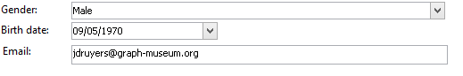

# Erste Schritte mit Eingabefeldern{#gs-ac-forms}

Wenn Sie ein Schema erstellen oder erweitern, müssen Sie die zugehörigen Eingabefelder erstellen oder ändern, um diese Änderungen für Endbenutzer sichtbar zu machen.

Mit einem Eingabefeld können Sie eine Instanz bearbeiten, die mit einem Data Schema in der Adobe Campaign-Client-Konsole verknüpft ist. Das Formular wird anhand seines Namens und seines Namensraums identifiziert.

Der Identifizierungsschlüssel eines Formulars ist eine Zeichenfolge, die aus dem Namensraum und dem durch einen Doppelpunkt getrennten Namen besteht. Beispiel: &quot;cus:contact&quot;.

## Eingabefelder bearbeiten

Erstellen und konfigurieren Sie Eingabforms im Ordner **[!UICONTROL Administration] > [!UICONTROL Configuration] > [!UICONTROL Eingabforms]** der Client-Konsole:


Der XML-Code des Formulars wird im Editor erfasst:


Die Vorschau generiert eine Anzeige des Eingabefelds:


## Formularstruktur

Die Beschreibung eines Formulars ist ein strukturiertes XML-Dokument, das die Grammatik des Schemas **xtk:form** beachtet.

Das XML-Dokument des Eingabefelds muss das `<form>`-Stammelement mit den Attributen **name** und **Namensraum** enthalten, um den Formularnamen und den Namensraum auszufüllen.

```
<form name="form_name" namespace="name_space">
...
</form>
```

Standardmäßig ist ein Formular mit dem Schema data mit demselben Namen und demselben Namensraum verknüpft. Um ein Formular mit einem anderen Namen zu verknüpfen, setzen Sie das **entity-Schema**-Attribut des `<form>`-Elements auf den Namen des Schema-Schlüssels. Um die Struktur eines Eingabefformulars zu veranschaulichen, beschreiben wir eine Schnittstelle mit dem Schema &quot;cus:Empfänger&quot;:

```
<srcSchema name="recipient" namespace="cus">
  <enumeration name="gender" basetype="byte">    
    <value name="unknown" label="Not specified" value="0"/>    
    <value name="male" label="Male" value="1"/>   
    <value name="female" label="Female" value="2"/>   
  </enumeration>

  <element name="recipient">
    <attribute name="email" type="string" length="80" label="Email" desc="E-mail address of recipient"/>
    <attribute name="birthDate" type="datetime" label="Date"/>
    <attribute name="gender" type="byte" label="Gender" enum="gender"/>
  </element>
</srcSchema>
```

Das Eingabedatum basiert auf dem Schema example:



```
<form name="recipient" namespace="cus">
  <input xpath="@gender"/>
  <input xpath="@birthDate"/>
  <input xpath="@email"/>
</form>
```

Die Beschreibung der Bearbeitungssteuerelemente enthält Beginn aus dem Stammelement `<form>`. Ein Eingabefeld wird in einem **`<input>`**-Element mit seinem **xpath**-Attribut notiert, welches den Pfad des Felds in seinem Schema enthält.

Das Eingabefeld passt sich automatisch dem gewählten Datentyp an und verwendet den im Schema angegebenen Titel.

>[!NOTE]
>
>Sie können die im Datenelement definierte Beschriftung überschreiben, indem Sie das Schema **label** zum Element `<input>` hinzufügen:\
>`<input label="E-mail address" xpath="@name" />`

Standardmäßig wird jedes Feld in einer einzelnen Zeile angezeigt und nimmt je nach Datentyp den gesamten verfügbaren Platz ein.

:arrow_upper_right: Alle Formularattribute sind in der [Campaign Classic-Dokumentation](https://docs.adobe.com/content/help/en/campaign-classic/technicalresources/api/control-Button.html) aufgeführt.

## Layout {#formatting}

Das Layout der Steuerelemente ähnelt dem Layout, das in HTML-Tabellen verwendet wird. Es besteht die Möglichkeit, ein Steuerelement in mehrere Spalten zu unterteilen, Elemente zu überschneiden oder die Belegung des verfügbaren Raums anzugeben. Beachten Sie jedoch, dass Sie bei der Formatierung den Bereich nur nach Proportionen aufteilen können. Sie können keine festen Abmessungen für ein Objekt angeben.

So zeigen Sie die Steuerelemente des obigen Beispiels in zwei Spalten an:


```
<form name="recipient" namespace="cus">
  <container colcount="2">
    <input xpath="@gender"/>
    <input xpath="@birthDate"/>
    <input xpath="@email"/>
  </container>
</form>
```

Mit dem **`<container>`**-Element mit dem Attribut **colcount** können Sie die Anzeige von untergeordneten Steuerelementen auf zwei Spalten erzwingen.

Das **colspan**-Attribut eines Steuerelements erweitert das Steuerelement um die Anzahl der Spalten, die in seinem Wert eingegeben werden:


```
<form name="recipient" namespace="cus">
  <container colcount="2">
    <input xpath="@gender"/>
    <input xpath="@birthDate"/>
    <input xpath="@email" colspan="2"/>
  </container>
</form> 
```

Durch das Füllen des Attributs **type=&quot;frame&quot;** fügt der Container ein Bild um die untergeordneten Steuerelemente mit der Beschriftung im Attribut **label** hinzu:


```
<form name="recipient" namespace="cus">
  <container colcount="2" type="frame" label="General">
    <input xpath="@gender"/>
    <input xpath="@birthDate"/>
    <input xpath="@email" colspan="2"/>
  </container>
</form>
```

Ein **`<static>`**-Element kann zum Formatieren des Eingabefelds verwendet werden:


```
<form name="recipient" namespace="cus">
  <static type="separator" colspan="2" label="General"/>
  <input xpath="@gender"/>
  <input xpath="@birthDate"/>
  <input xpath="@email" colspan="2"/>
  <static type="help" label="General information about recipient with date of birth, gender, and e-mail address." colspan="2"/>
</form>
```

Mit dem **`<static>`**-Tag mit dem Typ **separator** können Sie eine Trennleiste mit einer Beschriftung hinzufügen, die im Attribut **label** enthalten ist.

Mithilfe des Tags `<static>` mit dem Hilfetyp wurde ein Hilfetext hinzugefügt. Der Inhalt des Textes wird im Attribut **label** eingegeben.

## Container {#containers} verwenden

Verwenden Sie **Container**, um einen Satz von Steuerelementen zu gruppieren. Sie werden durch das **`<container>`**-Element dargestellt. Sie wurden oben verwendet, um Steuerelemente über mehrere Spalten zu formatieren.

Mit dem **xpath**-Attribut auf einem `<container>` können Sie den Verweis auf untergeordnete Steuerelemente vereinfachen. Die Referenzierung von Steuerelementen ist dann relativ zum übergeordneten Element `<container>`.

Beispiel eines Containers ohne &quot;xpath&quot;:

```
<container colcount="2">
  <input xpath="location/@zipCode"/>
  <input xpath="location/@city"/>
</container>
```

Beispiel mit dem Zusatz &quot;xpath&quot;zum Element &quot;location&quot;:

```
<container colcount="2" xpath="location">
  <input xpath="@zipCode"/>
  <input xpath="@city"/>
</container>
```

Container werden zum Erstellen komplexer Steuerelemente mit einem Satz von Feldern verwendet, die in Seiten formatiert sind.

### hinzufügen Tabs (Notebook) {#tab-container}

Verwenden Sie den Container **Notebook**, um Daten auf Seiten zu formatieren, auf die über Registerkarten zugegriffen werden kann.


```
<container type="notebook">
  <container colcount="2" label="General">
    <input xpath="@gender"/>
    <input xpath="@birthDate"/>
    <input xpath="@email" colspan="2"/>
  </container>
  <container colcount="2" label="Location">
    ...
  </container>
</container>
```

Der Hauptattribut wird durch das Attribut **type=&quot;Notebook&quot;** definiert. Tabs werden in den untergeordneten Containern deklariert und die Beschriftung der Registerkarten wird aus dem **label**-Attribut gefüllt.

hinzufügen Sie das Attribut **style=&quot;down&quot;**, um die vertikale Positionierung der Registerkartenbeschriftungen unter dem Steuerelement zu erzwingen. Dieses Attribut ist optional. Der Standardwert ist **&quot;up&quot;**.


`<container style="down" type="notebook">  ... </container>`

### hinzufügen Symbole (iconbox) {#icon-list}

Verwenden Sie diesen Container, um eine vertikale Symbolleiste anzuzeigen, mit der Sie die anzuzeigenden Seiten auswählen können.


```
<container type="iconbox">
  <container colcount="2" label="General" img="xtk:properties.png">
    <input xpath="@gender"/>
    <input xpath="@birthDate"/>
    <input xpath="@email" colspan="2"/>
  </container>
  <container colcount="2" label="Location" img="nms:msgfolder.png">
    ...
  </container>
</container>
```

Der Hauptattribut wird durch das Attribut **type=&quot;iconbox&quot;** definiert. Die mit den Symbolen verknüpften Seiten werden in den untergeordneten Containern deklariert. Die Beschriftung der Symbole wird aus dem **label**-Attribut gefüllt.

Das Seitensymbol wird aus dem Attribut `img="<image>"` gefüllt, wobei `<image>` der Bildname ist, der dem zugehörigen Bildschlüssel entspricht, der aus dem Namensraum und dem Namen besteht (z. B. &quot;xtk:properties.png&quot;).

Die Bilder sind im Knoten **[!UICONTROL Administration > Konfiguration > Bilder]** verfügbar.

### Container ausblenden (visibleGroup) {#visibility-container}

Sie können einen Satz von Steuerelementen über eine dynamische Bedingung ausblenden.

Dieses Beispiel veranschaulicht die Sichtbarkeit der Steuerelemente für den Wert des Felds &quot;Geschlecht&quot;:

```
<container type="visibleGroup" visibleIf="@gender=1">
  ...
</container>
<container type="visibleGroup" visibleIf="@gender=2">
  ...
</container>
```

Ein Container für die Sichtbarkeit wird durch das Attribut **type=&quot;visibleGroup&quot;** definiert. Das Attribut **visibleIf** enthält die Sichtbarkeitsbedingung.

Beispiele für Bedingungssyntax:

* **visibleIf=&quot;@email=&#39;peter.martinezATneeolane.net&#39;&quot;**: prüft Gleichheit bei Zeichenfolgendaten. Der Vergleichswert muss in Anführungszeichen gesetzt werden.
* **visibleIf=&quot;@gender >= 1 und @gender != 2&quot;**: -Bedingung auf einen numerischen Wert.
* **visibleIf=&quot;@boolean1=true oder @boolean2=false&quot;**: Testen von booleschen Feldern.

### Bedingte Anzeige (enabledGroup) {#enabling-container}

Mit diesem Container können Sie einen Datensatz aus einer dynamischen Bedingung aktivieren oder deaktivieren. Durch Deaktivieren eines Steuerelements wird dessen Bearbeitung verhindert. Das folgende Beispiel veranschaulicht die Aktivierung von Steuerelementen aus dem Wert des Felds &quot;Geschlecht&quot;:

```
<container type="enabledGroup" enabledIf="@gender=1">
  ...
</container>
<container type="enabledGroup" enabledIf="@gender=2">
  ...
</container>
```

Ein aktivierender Container wird durch das Attribut **type=&quot;enabledGroup&quot;** definiert. Das **enabledIf**-Attribut enthält die Bedingung für die Aktivierung.

## Link {#editing-a-link} bearbeiten

Beachten Sie, dass ein Link wie folgt im Schema data deklariert wird:

```
<element label="Company" name="company" target="cus:company" type="link"/>
```

Das Bearbeiten-Steuerelement des Links im Eingabedateiformular lautet wie folgt:


```
<input xpath="company"/>
```

Die Auswahl der Zielgruppe ist über das Bearbeitungsfeld verfügbar. Die Eingabe wird durch type-ahead unterstützt, damit ein Zielgruppe-Element aus den ersten eingegebenen Zeichen leicht zu finden ist. Die Suche basiert dann auf der **Berechnen Sie die Zeichenfolge**, die im Targeting-Schema definiert ist. Wenn das Schema nach der Überprüfung im Steuerelement nicht vorhanden ist, wird eine Bestätigungsmeldung über die Erstellung der Zielgruppe im Handumdrehen angezeigt. Mit der Bestätigung wird ein neuer Datensatz in der Tabelle &quot;Zielgruppe&quot;erstellt und mit dem Link verknüpft.

Eine Dropdown-Liste wird verwendet, um ein Element der Zielgruppe aus der Liste der bereits erstellten Datensätze auszuwählen.

Mit dem Symbol **[!UICONTROL Link]** ändern (Ordnersymbol) wird ein Auswahlformular mit der Liste der Zielelemente und einer Filterzone gestartet.

Das Symbol **[!UICONTROL Link bearbeiten]** (Vergrößerung) startet das Bearbeitungsformular des verknüpften Elements. Das verwendete Formular wird standardmäßig auf den Schlüssel des zielgerichteten Schemas abgezogen. Mit dem Attribut **form** können Sie den Namen des Bearbeitungsformulars erzwingen (z.B. &quot;cus:Firma2&quot;).

Sie können die Auswahl der Zielgruppen einschränken, indem Sie das **`<sysfilter>`**-Element aus der Linkdefinition im Eingabefeld hinzufügen:

```
<input xpath="company">
  <sysFilter>
    <condition expr="[location/@city] =  'Newton"/>
  </sysFilter>
</input>
```

Sie können die Liste auch mit dem Element **`<orderby>`** sortieren:

```
<input xpath="company">
  <orderBy>
    <node expr="[location/@zipCode]"/>
  </orderBy>
</input>
```

## Steuerungseigenschaften {#control-properties}

* **noAutoComplete**: Deaktiviert type-ahead (mit dem Wert &quot;true&quot;)
* **createMode**: erstellt den Link im Handumdrehen, wenn er nicht vorhanden ist. Mögliche Werte:

   * **none**: Deaktiviert die Erstellung. Wenn der Link nicht vorhanden ist, wird eine Fehlermeldung angezeigt
   * **inline**: erstellt die Verknüpfung mit dem Inhalt im Bearbeitungsfeld
   * **Edition**: zeigt das Bearbeitungsformular auf dem Link an. Beim Validieren des Formulars werden die Daten gespeichert (Standardmodus)

* **noZoom**: kein Bearbeitungsformular auf dem Link (mit dem Wert &quot;true&quot;)
* **form**: überschreibt das Bearbeitungsformular des Zielelements

## hinzufügen einer Liste von Links (ungebunden) {#list-of-links}

Ein Link, der als Sammlungselement in das Schema eingegeben wird (unbound=&quot;true&quot;), muss eine Liste durchlaufen, um alle zugehörigen Elemente Ansicht.

Das Prinzip besteht darin, die Liste der verknüpften Elemente mit optimierter Datenladung anzuzeigen (Herunterladen per Datenstapel, Ausführung der Liste nur, wenn sie sichtbar ist).

Beispiel eines Sammlungslinks in einem Schema:

```
<element label="Events" name="rcpEvent" target="cus:event" type="link" unbound="true">
...
</element>
```

Die Liste in ihrem Eingabeformular:


```
 <input xpath="rcpEvent" type="linklist">
  <input xpath="@label"/>
  <input xpath="@date"/>
</input>
```

Die Steuerung der Liste wird durch das Attribut **type=&quot;linklist&quot;** definiert. Der Pfad der Liste muss auf den Link der Sammlung verweisen.

Die Spalten werden über die **`<input>`**-Elemente der Liste deklariert. Das Attribut **xpath** bezieht sich auf den Feldpfad im Schema &quot;Zielgruppe&quot;.

Eine Symbolleiste mit einer Beschriftung (definiert auf dem Link im Schema) wird automatisch über der Liste platziert.

Die Liste kann über die Schaltfläche **[!UICONTROL Filter]** gefiltert und so konfiguriert werden, dass die Spalten hinzugefügt und sortiert werden.

Mit den Schaltflächen **[!UICONTROL Hinzufügen]** und **[!UICONTROL Löschen]** können Sie Sammlungselemente zum Link hinzufügen und löschen. Beim Hinzufügen eines Elements wird standardmäßig das Bearbeitungsformular des Zielgruppe-Schemas gestartet.

Die Schaltfläche **[!UICONTROL Detail]** wird automatisch hinzugefügt, wenn das Attribut **zoom=&quot;true&quot;** am **`<input>`**-Tag der Liste abgeschlossen ist: Dadurch können Sie das Bearbeitungsformular der ausgewählten Zeile starten.

Filtern und Sortieren können beim Laden der Liste angewendet werden:

```
 <input xpath="rcpEvent" type="linklist">
  <input xpath="@label"/>
  <input xpath="@date"/>
  <sysFilter>
    <condition expr="@type = 1"/>
  </sysFilter>
  <orderBy>
    <node expr="@date" sortDesc="true"/>
  </orderBy>
</input>
```

## Definieren einer Beziehungstabelle {#relationship-table}

Mit einer Beziehungstabelle können Sie zwei Tabellen mit N-N-Kardinalität verknüpfen. Die Beziehungstabelle enthält nur die Links zu den beiden Tabellen.

Wenn Sie ein Element zur Liste hinzufügen, können Sie daher eine Liste aus einem der beiden Links in der Beziehungstabelle erstellen.

Beispiel einer Beziehungstabelle in einem Schema:

```
<srcSchema name="subscription" namespace="cus">
  <element name="recipient" type="link" target="cus:recipient" label="Recipient"/>
  <element name="service" type="link" target="cus:service" label="Subscription service"/>
</srcSchema>
```

In unserem Beispiel wird mit dem Eingabedatum des Schemas &quot;cus:Empfänger&quot;Beginn. Die Liste muss die Verbindungen mit Abonnements zu Diensten anzeigen und Sie müssen das Hinzufügen eines Abonnements durch Auswahl eines vorhandenen Dienstes ermöglichen.


```
<input type="linklist" xpath="subscription" xpathChoiceTarget="service" xpathEditTarget="service" zoom="true">
  <input xpath="recipient"/>
  <input xpath="service"/>
</input>
```

Mit dem Attribut **xpathChoiceTarget** können Sie ein Auswahlformular aus dem eingegebenen Link starten. Durch Erstellen des Beziehungstabellendatensatzes wird der Link zum aktuellen Empfänger und zum ausgewählten Dienst automatisch aktualisiert.

>[!NOTE]
>
>Mit dem Attribut **xpathEditTarget** können Sie die Bearbeitung der ausgewählten Zeile des eingegebenen Links erzwingen.

### Eigenschaften der Liste {#list-properties}

* **noToolbar**: Blendet die Symbolleiste aus (mit dem Wert &quot;true&quot;)
* **toolbarCaption**: überschreibt die Symbolleistenbeschriftung
* **toolbarAlign**: ändert die vertikale oder horizontale Geometrie der Symbolleiste (mögliche Werte: &quot;vertical&quot;|&quot;horizontal&quot;)
* **img**: zeigt das Bild an, das der Liste zugeordnet ist
* **form**: überschreibt das Bearbeitungsformular des Zielelements
* **zoom**: fügt die  **** Zoomschaltfläche hinzu, um das zielgerichtete Element zu bearbeiten
* **xpathEditTarget**: legt die Bearbeitung auf dem eingegebenen Link fest
* **xpathChoiceTarget**: startet außerdem das Auswahlformular auf dem eingegebenen Link

## hinzufügen einer Speicher-Liste {#memory-list-controls}

Mithilfe von Listen im Arbeitsspeicher können Sie die Sammlungselemente mithilfe der Listen-Daten im Voraus bearbeiten. Diese Liste kann nicht gefiltert oder konfiguriert werden.

Diese Listen werden für XML-zugeordnete Sammlungselemente oder für Links mit niedrigem Volumen verwendet.

## hinzufügen einer Liste für eine Spalte {#column-list}

Dieses Steuerelement zeigt eine Liste mit editierbaren Spalten und einer Symbolleiste mit den Schaltflächen &quot;Hinzufügen&quot; und &quot;Löschen&quot; an.

```
<input xpath="rcpEvent" type="list">
  <input xpath="@label"/>
  <input xpath="@date"/>
</input>
```

Das Steuerelement Liste muss vom Attribut **type=&quot;list&quot;** begleitet werden, der Listenpfad muss auf das Kollektionselement verweisen.

Die Spalten werden im untergeordneten **`<input>`**-Tag der Liste deklariert. Spaltenbeschriftung und -größe können mit den Attributen **label** und **colSize** erzwungen werden.

>[!NOTE]
>
>Pfeile nach Sortierreihenfolge werden automatisch hinzugefügt, wenn dem Collection-Element im Schema data das Attribut **ordered=&quot;true&quot;** hinzugefügt wird.

Die Symbolleistenschaltflächen können horizontal ausgerichtet werden:

```
<input nolabel="true" toolbarCaption="List of events" type="list" xpath="rcpEvent" zoom="true">
  <input xpath="@label"/>
  <input xpath="@date"/>
</input>
```

Das Attribut **toolbarCaption** erzwingt die horizontale Ausrichtung der Symbolleiste und gibt den Titel über der Liste ein.

### Zoomen in einer Liste {#zoom-in-a-list} aktivieren

Das Einfügen und Bearbeiten der Daten in einer Liste kann in einem separaten Bearbeitungsformular eingegeben werden.

```
<input nolabel="true" toolbarCaption="List of events" type="list" xpath="rcpEvent" zoom="true" zoomOnAdd="true">
  <input xpath="@label"/>
  <input xpath="@date"/>

  <form colcount="2" label="Event">
    <input xpath="@label"/>
    <input xpath="@date"/>
  </form>
</input>
```

Das Bearbeitungsformular wird aus dem Element `<form>` unter &quot;Liste Definition&quot;ausgefüllt. Die Struktur des Formulars ist identisch mit der eines Eingabefelds. Die Schaltfläche **[!UICONTROL Detail]** wird automatisch hinzugefügt, wenn das Attribut **zoom=&quot;true&quot;** im **`<input>`**-Tag der Liste abgeschlossen ist. Mit diesem Attribut können Sie das Bearbeitungsformular der ausgewählten Zeile starten.

>[!NOTE]
>
>Durch Hinzufügen des Attributs **zoomOnAdd=&quot;true&quot;** wird das Bearbeitungsformular aufgerufen, wenn ein Liste-Element eingefügt wird.

### Eigenschaften der Liste {#list-properties-1}

* **noToolbar**: Blendet die Symbolleiste aus (mit dem Wert &quot;true&quot;)
* **toolbarCaption**: überschreibt die Symbolleistenbeschriftung
* **toolbarAlign**: ändert die Positionierung der Symbolleiste (mögliche Werte: &quot;vertical&quot;|&quot;horizontal&quot;)
* **img**: zeigt das Bild an, das der Liste zugeordnet ist
* **form**: überschreibt das Bearbeitungsformular des Zielelements
* **zoom**: fügt die  **** Zoomschaltfläche hinzu, um das zielgerichtete Element zu bearbeiten
* **zoomOnAdd**: startet das Bearbeitungsformular auf dem Zusatz
* **xpathChoiceTarget**: startet außerdem das Auswahlformular auf dem eingegebenen Link

## hinzufügen nicht bearbeitbare Felder {#non-editable-fields}

Um ein Feld anzuzeigen und zu verhindern, dass es bearbeitet wird, verwenden Sie das **`<value>`**-Tag oder füllen Sie das **readOnly=&quot;true&quot;**-Attribut im **`<input>`**-Tag aus.

Beispiel für das Feld &quot;Geschlecht&quot;:


```
<value value="@gender"/>
<input xpath="@gender" readOnly="true"/>
```

## hinzufügen Optionsfeld {#radio-button}

Mit einem Optionsfeld können Sie aus verschiedenen Optionen wählen. Die **`<input>`**-Tags werden zur Liste der möglichen Optionen verwendet, und das **checkValue**-Attribut gibt den Wert an, der der Auswahl zugeordnet ist.

Beispiel für das Feld &quot;Geschlecht&quot;:

```
<input type="RadioButton" xpath="@gender" checkedValue="0" label="Choice 1"/>
<input type="RadioButton" xpath="@gender" checkedValue="1" label="Choice 2"/>
<input type="RadioButton" xpath="@gender" checkedValue="2" label="Choice 3"/>
```


## hinzufügen eines Kontrollkästchens {#checkbox}

Ein Kontrollkästchen gibt den booleschen Status an (ausgewählt oder nicht). Standardmäßig wird dieses Steuerelement von den Feldern &quot;Boolescher Wert&quot;(true/false) verwendet. Eine Variable, die den Standardwert 0 oder 1 hat, kann mit dieser Schaltfläche verknüpft werden. Dieser Wert kann über die Attribute **checkValue** überladen werden.

```
<input xpath="@boolean1"/>
<input xpath="@field1" type="checkbox" checkedValue="Y"/>
```


## Navigationshierarchie {#navigation-hierarchy-edit} bearbeiten

Dieses Steuerelement erstellt eine Struktur auf einem Satz zu bearbeitender Felder.

Die zu bearbeitenden Steuerelemente sind in einem **`<container>`** gruppiert, das unter dem **`<input>`**-Tag des Tree-Steuerelements eingegeben wird:

```
<input nolabel="true" type="treeEdit">
  <container label="Text fields">
    <input xpath="@text1"/>
    <input xpath="@text2"/>
  </container>
  <container label="Boolean fields">
    <input xpath="@boolean1"/>
    <input xpath="@boolean2"/>
  </container>
</input>
```


## hinzufügen eines Ausdrucks {#expression-field}

Ein Feld &quot;Ausdruck&quot;aktualisiert ein Feld dynamisch von einem Ausdruck aus. Das **`<input>`**-Tag wird mit dem Attribut **xpath** verwendet, um den Pfad des zu aktualisierenden Felds und ein **expr**-Attribut mit dem Ausdruck update einzugeben.

```
<!-- Example: updating the boolean1 field from the value contained in the field with path /tmp/@flag -->
<input expr="Iif([/tmp/@flag]=='On', true, false)" type="expr" xpath="@boolean1"/>
<input expr="[/ignored/@action] == 'FCP'" type="expr" xpath="@launchFCP"/>
```

## Kontext der Formulare {#context-of-forms}

Die Ausführung eines Eingabefelds initialisiert ein XML-Dokument, das die Daten der Entität enthält, die bearbeitet wird. Dieses Dokument stellt den Kontext des Formulars dar und kann als Arbeitsbereich verwendet werden.

### Aktualisieren Sie den Kontext {#updating-the-context}

Um den Kontext des Formulars zu ändern, verwenden Sie das Tag `<set expr="<value>" xpath="<field>"/>`, wobei `<field>` das Zielfeld und `<value>` der Ausdruck oder Wert für die Aktualisierung ist.

Beispiele für die Verwendung des Tags `<set>`:

* **`<set expr="'Test'" xpath="/tmp/@test" />`**: positioniert den Wert &#39;Test&#39; an der temporären Position /tmp/@test1
* **`<set expr="'Test'" xpath="@lastName" />`**: aktualisiert die Entität des Attributs &quot;lastName&quot;mit dem Wert &quot;Test&quot;
* **`<set expr="true" xpath="@boolean1" />`**: setzt den Wert des Felds &quot;boolean1&quot;auf &quot;true&quot;
* **`<set expr="@lastName" xpath="/tmp/@test" />`**: Aktualisierungen mit dem Inhalt des Attributs &quot;lastName&quot;

Der Kontext des Formulars kann beim Initialisieren und Schließen des Formulars über die Tags **`<enter>`** und **`<leave>`** aktualisiert werden.

```
<form name="recipient" namespace="cus">
  <enter>
    <set...
  </enter>
  ...
  <leave>
    <set...
  </leave>
</form>
```

>[!NOTE]
>
>`<enter>` und `<leave>`   -Tags können auf den `<container>`-Seiten (&quot;Notebook&quot;- und &quot;iconbox&quot;-Typen) verwendet werden.

### Ausdruck-Sprache {#expression-language-}

In der Formulardefinition kann eine Makrosprache verwendet werden, um bedingte Tests durchzuführen.

Das **`<if expr="<expression>" />`**-Tag führt die unter dem Tag angegebenen Anweisungen aus, wenn der Ausdruck überprüft wird:

```
<if expr="([/tmp/@test] == 'Test' or @lastName != 'Doe') and @boolean2 == true">
  <set xpath="@boolean1" expr="true"/>
</if>
```

Das **`<check expr="<condition>" />`**-Tag in Kombination mit dem **`<error>`**-Tag verhindert die Überprüfung des Formulars und zeigt eine Fehlermeldung an, wenn die Bedingung nicht erfüllt ist:

```
<leave>
  <check expr="/tmp/@test != ''">
    <error>You must populate the 'Test' field!</error> 
  </check>
</leave>
```

## Assistent (Assistent) {#wizards}

Ein Assistent führt Sie durch eine Reihe von Schritten zur Dateneingabe in Form von Seiten. Die eingegebenen Daten werden bei der Überprüfung des Formulars gespeichert.

Um eine Assistenzkraft hinzuzufügen, verwenden Sie die folgende Struktur:

```
<form type="wizard" name="example" namespace="cus" img="nms:rcpgroup32.png" label="Wizard example" entity-schema="nms:recipient">
  <container title="Title of page 1" desc="Long description of page 1">
    <input xpath="@lastName"/>
    <input xpath="comment"/>
  </container>
  <container title="Title of page 2" desc="Long description of page 2">
    ...
  </container>
  ...
</form>
```

Durch das Vorhandensein des Attributs **type=&quot;wizard&quot;** im Element `<form>` können Sie den Assistentenmodus beim Aufbau des Formulars definieren. Die Seiten werden aus `<container>`-Elementen abgeschlossen, die dem `<form>`-Element untergeordnet sind. Das `<container>`-Element einer Seite wird mit den Titelattributen für den Titel und desc gefüllt, um die Beschreibung unter dem Seitentitel anzuzeigen. Die Schaltflächen **[!UICONTROL Previous]** und **[!UICONTROL Next]** werden automatisch hinzugefügt, um das Durchsuchen zwischen Seiten zu ermöglichen.

Mit der Schaltfläche **[!UICONTROL Fertig]** speichern Sie die eingegebenen Daten und schließen das Formular.

### SOAP-Methoden {#soap-methods}

Die Ausführung der SOAP-Methode kann von einem ausgefüllten **`<leave>`**-Tag am Ende einer Seite gestartet werden.

Das **`<soapcall>`**-Tag enthält den Aufruf der Methode mit den folgenden Eingabeparametern:

```
<soapCall name="<name>" service="<schema>">
  <param type="<type>" exprIn="<xpath>"/>  
  ...
</soapCall>
```

Der Name des Dienstes und sein Implementierungsattribut werden über die Attribute **name** und **service** des **`<soapcall>`**-Tags eingegeben.

Die Eingabeparameter werden in den **`<param>`**-Elementen unter dem **`<soapcall>`**-Tag beschrieben.

Der Parametertyp muss über das Attribut **type** angegeben werden. Folgende Typen sind möglich:

* **Zeichenfolge**: Zeichenfolge
* **boolean**: Boolesch
* **byte**: 8-Bit-Ganzzahl
* **short**: 16-Bit-Ganzzahl
* **long**: 32-Bit-Ganzzahl
* **short**: 16-Bit-Ganzzahl
* **Dublette**: Gleitkommazahl mit Dublette
* **DOMElement**: element-type-Knoten

Das Attribut **exprIn** enthält den Speicherort der Daten, die als Parameter übergeben werden sollen.

**Beispiel**:

```
<leave>
  <soapCall name="RegisterGroup" service="nms:recipient">         
    <param type="DOMElement" exprIn="/tmp/entityList"/>         
    <param type="DOMElement" exprIn="/tmp/choiceList"/>         
    <param type="boolean"    exprIn="true"/>       
  </soapCall>
</leave>
```

