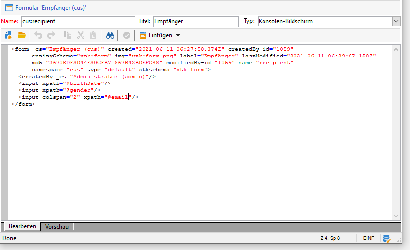

# Erste Schritte mit Eingabeformularen{#gs-ac-forms}

Wenn Sie ein Schema erstellen oder erweitern, müssen Sie die zugehörigen Eingabeformulare erstellen oder ändern, damit diese Änderungen für Endbenutzer sichtbar sind.

Mit einem Formular können Sie eine mit einem Datenschema verknüpfte Instanz in der Adobe Campaign-Clientkonsole bearbeiten. Das Formular wird anhand seines Namens und Namespace identifiziert.

Der Identifikationsschlüssel eines Formulars ist eine Zeichenfolge, die aus dem Namespace und dem Namen besteht, getrennt durch einen Doppelpunkt, z. B.: &quot;cus:contact&quot;.

## Bearbeiten von Eingabeformularen

Erstellen und konfigurieren Sie Eingabeformulare aus dem Ordner **[!UICONTROL Administration] > [!UICONTROL Konfiguration] > [!UICONTROL Eingabeformulare]** der Clientkonsole:


Der XML-Code des Formulars wird im Editor erfasst:



Die Vorschau erzeugt eine Anzeige des Formulars:


## Formularstruktur

Die Beschreibung eines Formulars ist ein strukturiertes XML-Dokument, das die Grammatik des Formularschemas **xtk:form** einhält.

Das XML-Dokument des Formulars muss das Stammelement `<form>` mit den Attributen **name** und **namespace** enthalten, um den Formularnamen und den Namespace auszufüllen.

```
<form name="form_name" namespace="name_space">
...
</form>
```

Standardmäßig ist ein Formular mit dem Datenschema mit demselben Namen und Namespace verknüpft. Um ein Formular mit einem anderen Namen zu verknüpfen, setzen Sie das Attribut **entity-schema** des Elements `<form>` auf den Namen des Schemaschlüssels. Um die Struktur eines Formulars zu veranschaulichen, beschreiben wir eine Schnittstelle anhand des Beispielschemas &quot;cus:recipient&quot;:

```
<srcSchema name="recipient" namespace="cus">
  <enumeration name="gender" basetype="byte">    
    <value name="unknown" label="Not specified" value="0"/>    
    <value name="male" label="Male" value="1"/>   
    <value name="female" label="Female" value="2"/>   
  </enumeration>

  <element name="recipient">
    <attribute name="email" type="string" length="80" label="Email" desc="E-mail address of recipient"/>
    <attribute name="birthDate" type="datetime" label="Date"/>
    <attribute name="gender" type="byte" label="Gender" enum="gender"/>
  </element>
</srcSchema>
```

Das auf dem Beispielschema basierende Formular:


```
<form name="recipient" namespace="cus">
  <input xpath="@gender"/>
  <input xpath="@birthDate"/>
  <input xpath="@email"/>
</form>
```

Die Beschreibung der Steuerelemente zum Bearbeiten beginnt beim Wurzelelement `<form>` . Ein Eingabefeld wird in einem **`<input>`**-Element mit seinem **xpath**-Attribut notiert, welches den Pfad des Felds in seinem Schema enthält.

Das Eingabefeld passt sich automatisch dem gewählten Datentyp an und verwendet den im Schema angegebenen Titel.

>[!NOTE]
>
>Sie können die im Datenschema definierte Bezeichnung überschreiben, indem Sie das Attribut **label** zum Element `<input>` hinzufügen:\
>`<input label="E-mail address" xpath="@name" />`

Standardmäßig wird jedes Feld in einer einzigen Zeile angezeigt und nimmt je nach Datentyp den gesamten verfügbaren Platz ein.

[!DNL :arrow_upper_right:] Alle Formularattribute sind in der  [Campaign Classic v7-Dokumentation](https://docs.adobe.com/content/help/en/campaign-classic/technicalresources/api/control-Button.html) aufgeführt.

## Layout {#formatting}

Das Layout der Steuerelemente ähnelt dem Layout, das in HTML-Tabellen verwendet wird, mit der Möglichkeit, ein Steuerelement in mehrere Spalten zu unterteilen, Elemente zu überschneiden oder die Verwendung des verfügbaren Bereichs anzugeben. Beachten Sie jedoch, dass Sie durch die Formatierung den Bereich nur in Proportionen aufteilen können. Sie können keine festen Dimensionen für ein Objekt angeben.

So zeigen Sie die Steuerelemente des obigen Beispiels in zwei Spalten an:


```
<form name="recipient" namespace="cus">
  <container colcount="2">
    <input xpath="@gender"/>
    <input xpath="@birthDate"/>
    <input xpath="@email"/>
  </container>
</form>
```

Mit dem Element **`<container>`** mit dem Attribut **colcount** können Sie die Anzeige von untergeordneten Steuerelementen auf zwei Spalten erzwingen.

Das Attribut **colspan** eines Steuerelements erweitert die Steuerung um die Anzahl der in seinem Wert eingegebenen Spalten:


```
<form name="recipient" namespace="cus">
  <container colcount="2">
    <input xpath="@gender"/>
    <input xpath="@birthDate"/>
    <input xpath="@email" colspan="2"/>
  </container>
</form> 
```

Durch Füllen des Attributs **type=&quot;frame&quot;** fügt der Container einen Rahmen um die untergeordneten Steuerelemente mit der Beschriftung hinzu, die im Attribut **label** enthalten ist:


```
<form name="recipient" namespace="cus">
  <container colcount="2" type="frame" label="General">
    <input xpath="@gender"/>
    <input xpath="@birthDate"/>
    <input xpath="@email" colspan="2"/>
  </container>
</form>
```

Ein **`<static>`** -Element kann zum Formatieren des Formulars verwendet werden:


```
<form name="recipient" namespace="cus">
  <static type="separator" colspan="2" label="General"/>
  <input xpath="@gender"/>
  <input xpath="@birthDate"/>
  <input xpath="@email" colspan="2"/>
  <static type="help" label="General information about recipient with date of birth, gender, and e-mail address." colspan="2"/>
</form>
```

Mit dem Tag **`<static>`** mit dem Typ **separator** können Sie eine Trennleiste mit einer Bezeichnung hinzufügen, die im Attribut **label** enthalten ist.

Mithilfe des Tags `<static>` wurde ein Hilfetext mit dem Hilfetyp hinzugefügt. Der Inhalt des Textes wird im Attribut **label** eingegeben.

## Verwenden von Containern {#containers}

Verwenden Sie **container**, um eine Gruppe von Steuerelementen zu gruppieren. Sie werden durch das Element **`<container>`** repräsentiert. Sie wurden oben verwendet, um Steuerelemente über mehrere Spalten zu formatieren.

Mit dem Attribut **xpath** auf einem `<container>` können Sie die Referenzierung von untergeordneten Steuerelementen vereinfachen. Die Referenzierung von Steuerelementen ist dann relativ zum übergeordneten Element `<container>` .

Beispiel eines Containers ohne &quot;xpath&quot;:

```
<container colcount="2">
  <input xpath="location/@zipCode"/>
  <input xpath="location/@city"/>
</container>
```

Beispiel mit dem Zusatz &quot;xpath&quot;zum Element &quot;location&quot;:

```
<container colcount="2" xpath="location">
  <input xpath="@zipCode"/>
  <input xpath="@city"/>
</container>
```

Container werden verwendet, um komplexe Steuerelemente mithilfe eines Satzes von Feldern zu erstellen, die in Seiten formatiert sind.

### Hinzufügen von Registerkarten (Notebook) {#tab-container}

Verwenden Sie einen **Notebook**-Container, um Daten in Seiten zu formatieren, auf die über Registerkarten zugegriffen werden kann.


```
<container type="notebook">
  <container colcount="2" label="General">
    <input xpath="@gender"/>
    <input xpath="@birthDate"/>
    <input xpath="@email" colspan="2"/>
  </container>
  <container colcount="2" label="Location">
    ...
  </container>
</container>
```

Der Hauptcontainer wird durch das Attribut **type=&quot;notebook&quot;** definiert. Registerkarten werden in den untergeordneten Containern deklariert und die Beschriftung der Registerkarten wird aus dem Attribut **label** gefüllt.

Fügen Sie das Attribut **style=&quot;down&quot;** hinzu, um die vertikale Positionierung von Registerkartenbeschriftungen unter dem Steuerelement zu erzwingen. Dieses Attribut ist optional. Der Standardwert ist **&quot;up&quot;**.


`<container style="down" type="notebook">  ... </container>`

### Symbole hinzufügen (iconbox) {#icon-list}

Verwenden Sie diesen Container, um eine vertikale Symbolleiste anzuzeigen, mit der Sie die anzuzeigenden Seiten auswählen können.


```
<container type="iconbox">
  <container colcount="2" label="General" img="xtk:properties.png">
    <input xpath="@gender"/>
    <input xpath="@birthDate"/>
    <input xpath="@email" colspan="2"/>
  </container>
  <container colcount="2" label="Location" img="nms:msgfolder.png">
    ...
  </container>
</container>
```

Der Hauptcontainer wird durch das Attribut **type=&quot;iconbox&quot;** definiert. Die mit den Symbolen verknüpften Seiten werden in den untergeordneten Containern deklariert. Die Beschriftung der Symbole wird aus dem Attribut **label** übernommen.

Das Symbol einer Seite wird aus dem Attribut `img="<image>"` gefüllt, wobei `<image>` der Name des Bildes ist, das dem Schlüssel des Namens und Namespace entspricht (z. B. &quot;xtk:properties.png&quot;).

Die Bilder sind im Knoten **[!UICONTROL Administration > Konfiguration > Bilder]** verfügbar.

### Ausblenden von Containern (visibleGroup) {#visibility-container}

Sie können eine Gruppe von Steuerelementen über eine dynamische Bedingung ausblenden.

Dieses Beispiel zeigt die Sichtbarkeit der Steuerelemente für den Wert des Felds &quot;Geschlecht&quot;:

```
<container type="visibleGroup" visibleIf="@gender=1">
  ...
</container>
<container type="visibleGroup" visibleIf="@gender=2">
  ...
</container>
```

Ein Sichtbarkeits-Container wird durch das Attribut **type=&quot;visibleGroup&quot;** definiert. Das Attribut **visibleIf** enthält die Sichtbarkeitsbedingung.

Beispiele für Bedingungssyntax:

* **visibleIf=&quot;@email=&#39;peter.martinezATneeolane.net&#39;&quot;**: testet Gleichheit bei Zeichenfolgendaten. Der Vergleichswert muss in Anführungszeichen gesetzt werden.
* **visibleIf=&quot;@gender >= 1 und @gender != 2&quot;**: -Bedingung für einen numerischen Wert.
* **visibleIf=&quot;@boolean1=true oder @boolean2=false&quot;**: auf boolesche Felder testen.

### Bedingte Anzeige (enabledGroup) {#enabling-container}

Mit diesem Container können Sie einen Datensatz aus einer dynamischen Bedingung aktivieren oder deaktivieren. Das Deaktivieren eines Steuerelements verhindert dessen Bearbeitung. Das folgende Beispiel zeigt die Aktivierung von Steuerelementen aus dem Wert des Felds &quot;Geschlecht&quot;:

```
<container type="enabledGroup" enabledIf="@gender=1">
  ...
</container>
<container type="enabledGroup" enabledIf="@gender=2">
  ...
</container>
```

Ein aktivierender Container wird durch das Attribut **type=&quot;enabledGroup&quot;** definiert. Das Attribut **enabledIf** enthält die Aktivierungsbedingung.

## Link bearbeiten {#editing-a-link}

Beachten Sie, dass eine Relation im Datenschema wie folgt deklariert wird:

```
<element label="Company" name="company" target="cus:company" type="link"/>
```

Das Eingabefeld des Links im Formular sieht wie folgt aus:


```
<input xpath="company"/>
```

Auf die Zielauswahl kann über das Bearbeitungsfeld zugegriffen werden. Die Eingabe wird durch type-ahead unterstützt, sodass ein Zielelement aus den ersten eingegebenen Zeichen leicht zu finden ist. Die Suche basiert dann auf der **Compute string**, die im Zielschema definiert ist. Wenn das Schema nach der Validierung im Steuerelement nicht vorhanden ist, wird eine Bestätigungsmeldung zur spontanen Zielerstellung angezeigt. Durch die Bestätigung wird ein neuer Datensatz in der Zieltabelle erstellt und mit dem Link verknüpft.

Über eine Dropdown-Liste wird ein Zielelement aus der Liste der bereits erstellten Datensätze ausgewählt.

Über das Symbol **[!UICONTROL Link]** ändern (Ordner) wird ein Auswahlformular mit der Liste der Zielelemente und einem Filterbereich gestartet.

Mit dem Symbol **[!UICONTROL Link bearbeiten]** (Lupe) wird das Bearbeitungsformular des verknüpften Elements gestartet. Das verwendete Formular wird standardmäßig auf den Schlüssel des Zielschemas abgezogen. Mit dem Attribut **form** können Sie den Namen des Bearbeitungsformulars erzwingen (z. B. &quot;cus:company2&quot;).

Sie können die Auswahl der Zielelemente einschränken, indem Sie das Element **`<sysfilter>`** aus der Link-Definition im Formular hinzufügen:

```
<input xpath="company">
  <sysFilter>
    <condition expr="[location/@city] =  'Newton"/>
  </sysFilter>
</input>
```

Sie können die Liste auch mit dem Element **`<orderby>`** sortieren:

```
<input xpath="company">
  <orderBy>
    <node expr="[location/@zipCode]"/>
  </orderBy>
</input>
```

## Kontrolleigenschaften {#control-properties}

* **noAutoComplete**: deaktiviert type-ahead (mit dem Wert &quot;true&quot;)
* **createMode**: erstellt den Link direkt, falls er nicht vorhanden ist. Mögliche Werte:

   * **none**: Deaktiviert die Erstellung. Wenn der Link nicht vorhanden ist, wird eine Fehlermeldung angezeigt
   * **inline**: erstellt die Verknüpfung mit dem Inhalt im Bearbeitungsfeld
   * **Edition**: zeigt das Bearbeitungsformular auf dem Link an. Wenn das Formular validiert wird, werden die Daten gespeichert (Standardmodus)

* **noZoom**: kein Bearbeitungsformular für den Link (mit dem Wert &quot;true&quot;)
* **form**: überschreibt das Bearbeitungsformular des betroffenen Elements

## Liste von Links hinzufügen (ungebunden) {#list-of-links}

Eine im Datenschema als Kollektionselement eingegebene Relation (unbound=&quot;true&quot;) muss eine Liste durchlaufen, um alle damit verbundenen Elemente anzuzeigen.

Das Prinzip besteht darin, die Liste der verknüpften Elemente mit optimiertem Laden der Daten anzuzeigen (Herunterladen per Datenstapel, Ausführung der Liste nur, wenn sie sichtbar ist).

Beispiel eines Kollektionslinks in einem Schema:

```
<element label="Events" name="rcpEvent" target="cus:event" type="link" unbound="true">
...
</element>
```

Die Liste in ihrem Formular:

```
 <input xpath="rcpEvent" type="linklist">
  <input xpath="@label"/>
  <input xpath="@date"/>
</input>
```

Listensteuerung wird durch das Attribut **type=&quot;linklist&quot;** definiert. Der Listenpfad muss auf den Kollektions-Link verweisen.

Die Spalten werden über die Elemente **`<input>`** der Liste deklariert. Das Attribut **xpath** bezieht sich auf den Pfad des Felds im Zielschema.

Eine Symbolleiste mit einem Titel (definiert über den Link im Schema) wird automatisch über der Liste platziert.

Die Liste kann über die Schaltfläche **[!UICONTROL Filter]** gefiltert und so konfiguriert werden, dass die Spalten hinzugefügt und sortiert werden.

Mit den Schaltflächen **[!UICONTROL Hinzufügen]** und **[!UICONTROL Löschen]** können Sie Kollektionselemente zum Link hinzufügen und löschen. Durch Hinzufügen eines Elements wird standardmäßig das Bearbeitungsformular des Zielschemas gestartet.

Die Schaltfläche **[!UICONTROL Detail]** wird automatisch hinzugefügt, wenn das Attribut **zoom=&quot;true&quot;** im Tag **`<input>`** der Liste ausgefüllt ist: Dadurch können Sie das Bearbeitungsformular der ausgewählten Zeile starten.

Filter und Sortierung können angewendet werden, wenn die Liste geladen wird:

```
 <input xpath="rcpEvent" type="linklist">
  <input xpath="@label"/>
  <input xpath="@date"/>
  <sysFilter>
    <condition expr="@type = 1"/>
  </sysFilter>
  <orderBy>
    <node expr="@date" sortDesc="true"/>
  </orderBy>
</input>
```

## Beziehungstabelle {#relationship-table} definieren

Mit einer Beziehungstabelle können Sie zwei Tabellen mit Kardinalität N und N verknüpfen. Die Beziehungstabelle enthält nur die Links zu den beiden Tabellen.

Wenn Sie ein Element zur Liste hinzufügen, sollten Sie daher eine Liste aus einem der beiden Links in der Beziehungstabelle ausfüllen können.

Beispiel einer Beziehungstabelle in einem Schema:

```
<srcSchema name="subscription" namespace="cus">
  <element name="recipient" type="link" target="cus:recipient" label="Recipient"/>
  <element name="service" type="link" target="cus:service" label="Subscription service"/>
</srcSchema>
```

Für unser Beispiel beginnen wir mit dem Formular des Schemas &quot;cus:recipient&quot;. In der Liste müssen die Zuordnungen mit Abonnements für Dienste angezeigt werden. Sie müssen die Möglichkeit haben, durch Auswahl eines vorhandenen Dienstes ein Abonnement hinzuzufügen.


```
<input type="linklist" xpath="subscription" xpathChoiceTarget="service" xpathEditTarget="service" zoom="true">
  <input xpath="recipient"/>
  <input xpath="service"/>
</input>
```

Mit dem Attribut **xpathChoiceTarget** können Sie ein Auswahlformular aus dem eingegebenen Link starten. Durch die Erstellung des Datensatzes der Beziehungstabelle wird der Link zum aktuellen Empfänger und zum ausgewählten Dienst automatisch aktualisiert.

>[!NOTE]
>
>Mit dem Attribut **xpathEditTarget** können Sie die Bearbeitung der ausgewählten Zeile für den eingegebenen Link erzwingen.

### Listeneigenschaften {#list-properties}

* **noToolbar**: blendet die Symbolleiste aus (mit dem Wert &quot;true&quot;)
* **toolbarCaption**: überschreibt die Symbolleistenbeschriftung
* **toolbarAlign**: ändert die vertikale oder horizontale Geometrie der Symbolleiste (mögliche Werte: &quot;vertical&quot;|&quot;horizontal&quot;)
* **img**: zeigt das mit der Liste verknüpfte Bild an
* **form**: überschreibt das Bearbeitungsformular des betroffenen Elements
* **Zoom**: fügt die  **** Zoomschaltfläche hinzu, um das Targeting-Element zu bearbeiten
* **xpathEditTarget**: Sets zur Bearbeitung des eingegebenen Links
* **xpathChoiceTarget**: Startet außerdem das Auswahlformular für den eingegebenen Link.

## Hinzufügen von Steuerelementen der Speicherliste {#memory-list-controls}

Mit Speicherlisten können Sie die Kollektionselemente mithilfe des Vorausladens von Listendaten bearbeiten. Diese Liste kann nicht gefiltert oder konfiguriert werden.

Diese Listen werden für XML-zugeordnete Sammlungselemente oder für Links mit geringem Volumen verwendet.

## Spaltenliste {#column-list} hinzufügen

Dieses Steuerelement zeigt eine Liste mit editierbaren Spalten und einer Symbolleiste mit den Schaltflächen &quot;Hinzufügen&quot; und &quot;Löschen&quot; an.

```
<input xpath="rcpEvent" type="list">
  <input xpath="@label"/>
  <input xpath="@date"/>
</input>
```

Das Steuerelement Liste muss vom Attribut **type=&quot;list&quot;** begleitet werden, der Listenpfad muss auf das Kollektionselement verweisen.

Die Spalten werden in den untergeordneten **`<input>`** -Tags der Liste deklariert. Spaltenbezeichnung und -größe können mit den Attributen **label** und **colSize** erzwungen werden.

>[!NOTE]
>
>Pfeile der Sortierreihenfolge werden automatisch hinzugefügt, wenn das Attribut **ordered=&quot;true&quot;** zum Kollektionselement im Datenschema hinzugefügt wird.

Die Schaltflächen der Symbolleiste können horizontal ausgerichtet werden:

```
<input nolabel="true" toolbarCaption="List of events" type="list" xpath="rcpEvent" zoom="true">
  <input xpath="@label"/>
  <input xpath="@date"/>
</input>
```

Das Attribut **toolbarCaption** erzwingt die horizontale Ausrichtung der Symbolleiste und gibt den Titel über der Liste ein.

### Zoom in Liste aktivieren {#zoom-in-a-list}

Das Einfügen und Bearbeiten der Daten in eine Liste kann in einem separaten Bearbeitungsformular eingegeben werden.

```
<input nolabel="true" toolbarCaption="List of events" type="list" xpath="rcpEvent" zoom="true" zoomOnAdd="true">
  <input xpath="@label"/>
  <input xpath="@date"/>

  <form colcount="2" label="Event">
    <input xpath="@label"/>
    <input xpath="@date"/>
  </form>
</input>
```

Das Bearbeitungsformular wird aus dem Element `<form>` unter Listendefinition ausgefüllt. Die Struktur entspricht der eines Formulars. Die Schaltfläche **[!UICONTROL Detail]** wird automatisch hinzugefügt, wenn das Attribut **zoom=&quot;true&quot;** im Tag **`<input>`** der Liste ausgefüllt ist. Mit diesem Attribut können Sie das Bearbeitungsformular der ausgewählten Zeile starten.

>[!NOTE]
>
>Durch Hinzufügen des Attributs **zoomOnAdd=&quot;true&quot;** wird das Bearbeitungsformular beim Einfügen eines Listenelements abgerufen.

### Listeneigenschaften {#list-properties-1}

* **noToolbar**: blendet die Symbolleiste aus (mit dem Wert &quot;true&quot;)
* **toolbarCaption**: überschreibt die Symbolleistenbeschriftung
* **toolbarAlign**: ändert die Positionierung der Symbolleiste (mögliche Werte: &quot;vertical&quot;|&quot;horizontal&quot;)
* **img**: zeigt das mit der Liste verknüpfte Bild an
* **form**: überschreibt das Bearbeitungsformular des betroffenen Elements
* **Zoom**: fügt die  **** Zoomschaltfläche hinzu, um das Targeting-Element zu bearbeiten
* **zoomOnAdd**: startet das Bearbeitungsformular auf dem Zusatz
* **xpathChoiceTarget**: Startet außerdem das Auswahlformular für den eingegebenen Link.

## Nicht bearbeitbare Felder {#non-editable-fields} hinzufügen

Um ein Feld anzuzeigen und zu verhindern, dass es bearbeitet wird, verwenden Sie das Tag **`<value>`** oder ergänzen Sie das Attribut **readOnly=&quot;true&quot;** im Tag **`<input>`** .

Beispiel für das Feld &quot;Geschlecht&quot;:


```
<value value="@gender"/>
<input xpath="@gender" readOnly="true"/>
```

## Radiobutton {#radio-button} hinzufügen

Ein Optionsfeld ermöglicht die Auswahl aus verschiedenen Optionen. Die Tags **`<input>`** werden verwendet, um die möglichen Optionen aufzulisten, und das Attribut **checkValue** gibt den Wert an, der mit der Auswahl verknüpft ist.

Beispiel für das Feld &quot;Geschlecht&quot;:

```
<input type="RadioButton" xpath="@gender" checkedValue="0" label="Choice 1"/>
<input type="RadioButton" xpath="@gender" checkedValue="1" label="Choice 2"/>
<input type="RadioButton" xpath="@gender" checkedValue="2" label="Choice 3"/>
```


## Kontrollkästchen hinzufügen {#checkbox}

Ein Kontrollkästchen spiegelt einen booleschen Status wider (ausgewählt oder nicht). Standardmäßig wird dieses Steuerelement von den Feldern &quot;Boolesch&quot;(true/false) verwendet. Mit dieser Schaltfläche kann eine Variable verknüpft werden, die den Standardwert 0 oder 1 hat. Dieser Wert kann über die Attribute **checkValue** überschrieben werden.

```
<input xpath="@boolean1"/>
<input xpath="@field1" type="checkbox" checkedValue="Y"/>
```


## Navigationshierarchie bearbeiten {#navigation-hierarchy-edit}

Dieses Steuerelement erstellt einen Baum auf einem Satz von Feldern, die bearbeitet werden sollen.

Die zu bearbeitenden Steuerelemente werden in einem **`<container>`** gruppiert, der unter dem **`<input>`**-Tag des Baumstruktursteuerelements eingegeben wird:

```
<input nolabel="true" type="treeEdit">
  <container label="Text fields">
    <input xpath="@text1"/>
    <input xpath="@text2"/>
  </container>
  <container label="Boolean fields">
    <input xpath="@boolean1"/>
    <input xpath="@boolean2"/>
  </container>
</input>
```


## Ausdrucksfeld {#expression-field} hinzufügen

Ein Ausdrucksfeld aktualisiert ein Feld dynamisch von einem Ausdruck. Das Tag **`<input>`** wird mit dem Attribut **xpath** verwendet, um den Pfad des zu aktualisierenden Felds und das Attribut **expr** mit dem Aktualisierungsausdruck anzugeben.

```
<!-- Example: updating the boolean1 field from the value contained in the field with path /tmp/@flag -->
<input expr="Iif([/tmp/@flag]=='On', true, false)" type="expr" xpath="@boolean1"/>
<input expr="[/ignored/@action] == 'FCP'" type="expr" xpath="@launchFCP"/>
```

## Kontext von Formularen {#context-of-forms}

Die Ausführung eines Formulars initialisiert ein XML-Dokument, das die Daten der bearbeiteten Entität enthält. Dieses Dokument stellt den Kontext des Formulars dar und kann als Arbeitsbereich verwendet werden.

### Kontext {#updating-the-context} aktualisieren

Um den Kontext des Formulars zu ändern, verwenden Sie das Tag `<set expr="<value>" xpath="<field>"/>` , wobei `<field>` das Zielfeld und `<value>` der Aktualisierungsausdruck oder -wert ist.

Beispiele für die Verwendung des Tags `<set>`:

* **`<set expr="'Test'" xpath="/tmp/@test" />`**: Positioniert den Wert &quot;Test&quot;am temporären Speicherort /tmp/@test1
* **`<set expr="'Test'" xpath="@lastName" />`**: aktualisiert die Entität im Attribut &quot;lastName&quot;mit dem Wert &quot;Test&quot;.
* **`<set expr="true" xpath="@boolean1" />`**: setzt den Wert des Felds &quot;boolean1&quot;auf &quot;true&quot;
* **`<set expr="@lastName" xpath="/tmp/@test" />`**: aktualisiert den Inhalt des Attributs &quot;lastName&quot;

Der Kontext des Formulars kann beim Initialisieren und Schließen des Formulars über die Tags **`<enter>`** und **`<leave>`** aktualisiert werden.

```
<form name="recipient" namespace="cus">
  <enter>
    <set...
  </enter>
  ...
  <leave>
    <set...
  </leave>
</form>
```

>[!NOTE]
>
>Die `<enter>` und `<leave>`   -Tags können auf den `<container>` -Seiten (&quot;Notebook&quot;- und &quot;Iconbox&quot;-Typen) verwendet werden.

### Ausdruckssprache {#expression-language-}

In der Formulardefinition kann eine Makrosprache verwendet werden, um bedingte Tests durchzuführen.

Das Tag **`<if expr="<expression>" />`** führt die unter dem Tag angegebenen Anweisungen aus, wenn der Ausdruck überprüft wird:

```
<if expr="([/tmp/@test] == 'Test' or @lastName != 'Doe') and @boolean2 == true">
  <set xpath="@boolean1" expr="true"/>
</if>
```

Das Tag **`<check expr="<condition>" />`** in Kombination mit dem Tag **`<error>`** verhindert die Validierung des Formulars und zeigt eine Fehlermeldung an, wenn die Bedingung nicht erfüllt ist:

```
<leave>
  <check expr="/tmp/@test != ''">
    <error>You must populate the 'Test' field!</error> 
  </check>
</leave>
```

## Assistent (Assistent) {#wizards}

Ein Assistent führt Sie durch eine Reihe von Schritten zur Dateneingabe in Form von Seiten. Die eingegebenen Daten werden bei der Validierung des Formulars gespeichert.

Um einen Assistenten hinzuzufügen, verwenden Sie die folgende Struktur:

```
<form type="wizard" name="example" namespace="cus" img="nms:rcpgroup32.png" label="Wizard example" entity-schema="nms:recipient">
  <container title="Title of page 1" desc="Long description of page 1">
    <input xpath="@lastName"/>
    <input xpath="comment"/>
  </container>
  <container title="Title of page 2" desc="Long description of page 2">
    ...
  </container>
  ...
</form>
```

Durch das Vorhandensein des Attributs **type=&quot;wizard&quot;** im Element `<form>` können Sie den Assistentenmodus beim Aufbau des Formulars definieren. Die Seiten werden aus `<container>` -Elementen ergänzt, die untergeordnete Elemente des Elements `<form>` sind. Das Element `<container>` einer Seite wird mit den Titelattributen für den Titel und desc gefüllt, um die Beschreibung unter dem Seitentitel anzuzeigen. Die Schaltflächen **[!UICONTROL Zurück]** und **[!UICONTROL Weiter]** werden automatisch hinzugefügt, um das Durchsuchen zwischen Seiten zu ermöglichen.

Die Schaltfläche **[!UICONTROL Beenden]** speichert die eingegebenen Daten und schließt das Formular.

### SOAP-Methoden {#soap-methods}

Die Ausführung der SOAP-Methode kann von einem ausgefüllten **`<leave>`**-Tag am Ende einer Seite aus gestartet werden.

Das Tag **`<soapcall>`** enthält den Aufruf für die Methode mit den folgenden Eingabeparametern:

```
<soapCall name="<name>" service="<schema>">
  <param type="<type>" exprIn="<xpath>"/>  
  ...
</soapCall>
```

Der Name des Dienstes und sein Implementierungsschema werden über die Attribute **name** und **service** des Tags **`<soapcall>`** eingegeben.

Die Eingabeparameter werden in den **`<param>`** -Elementen unter dem Tag **`<soapcall>`** beschrieben.

Der Parametertyp muss über das Attribut **type** angegeben werden. Folgende Typen sind möglich:

* **string**: Zeichenzeichenfolge
* **boolean**: Boolesch
* **byte**: 8-Bit-Ganzzahl
* **short**: 16-Bit-Ganzzahl
* **long**: 32-Bit-Ganzzahl
* **short**: 16-Bit-Ganzzahl
* **double**: Gleitkommazahl mit doppelter Genauigkeit
* **DOMElement**: Knoten element-type

Das Attribut **exprIn** enthält den Speicherort der Daten, die als Parameter übergeben werden sollen.

**Beispiel**:

```
<leave>
  <soapCall name="RegisterGroup" service="nms:recipient">         
    <param type="DOMElement" exprIn="/tmp/entityList"/>         
    <param type="DOMElement" exprIn="/tmp/choiceList"/>         
    <param type="boolean"    exprIn="true"/>       
  </soapCall>
</leave>
```

