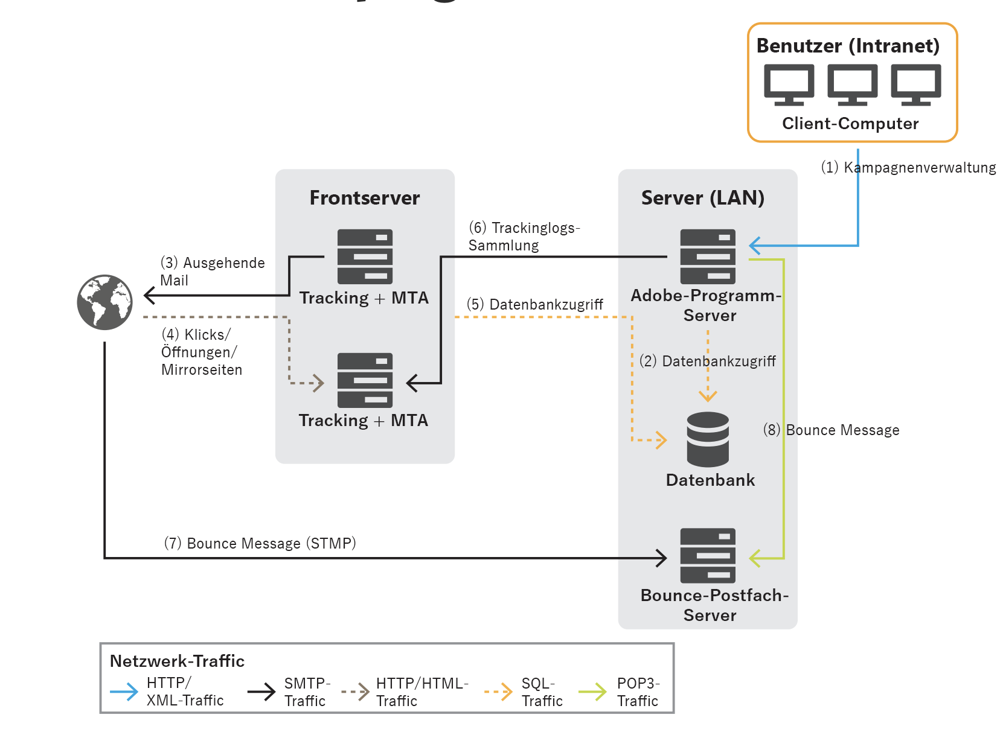

# Allgemeine Architektur{#general-architecture}

Die typische Adobe Campaign-Lösungsbereitstellung besteht aus den folgenden Komponenten:

* **Personalisierte Client-Umgebung**

   Intuitive grafische Benutzeroberfläche, in der Benutzer Marketing-Angebot kommunizieren und verfolgen können, Kampagnen erstellen, alle Marketing-Aktivitäten, Programme und Pläne - einschließlich E-Mails, Workflows und Landingpages - überprüfen und verwalten, kundenspezifische Profil erstellen und verwalten sowie Audiencen erstellen können.

* **Entwicklungs-Umgebung**

   Serverseitige Software, die die Marketing-Kampagnen über ausgewählte Kommunikationsserver ausführt, einschließlich E-Mails, SMS, Push-Benachrichtigungen, Direktwerbung, Web- oder Social-Kanal, basierend auf den in der Benutzeroberfläche festgelegten Regeln und Workflows.

* **Datenbank-Container**

   Basierend auf relationaler Datenbanktechnologie speichert die Adobe Campaign Cloud-Datenbank alle Kundeninformationen, Kampagnen, Angebot und Workflows sowie die Kampagne in Containern der Kundendatenbank.

## Personalisierte Client-Umgebung {#client-env}

Der Zugriff auf die Anwendung erfolgt auf unterschiedliche Weise: Rich Client-, Thin Client- oder API-Integration.

* **Client-Konsole**: Die Hauptbenutzeroberfläche der Applikation ist ein Rich-Client, d. h. eine native Applikation (Windows), die ausschließlich mit Standard-Internetprotokollen (SOAP, HTTP usw.) mit dem Adobe Campaign-Anwendungsserver kommuniziert. Die Adobe Campaign Client Console bietet hohe Benutzerfreundlichkeit für Produktivität, nutzt sehr wenig Bandbreite (über einen lokalen Cache) und ist für eine einfache Bereitstellung ausgelegt. Diese Konsole kann über einen Internetbrowser bereitgestellt werden, kann automatisch aktualisiert werden und erfordert keine spezielle Netzwerkkonfiguration, da nur HTTP(S)-Traffic generiert wird.

   :bulb: [Erfahren Sie mehr über Kampagne Client Console](../start/connect.md).

* **Webzugriff**: Bestimmte Anwendungsbereiche können über einen einfachen Webbrowser über eine HTML-Benutzeroberfläche aufgerufen werden, z. B. das Berichte-Modul, die Genehmigungsphasen des Versands, die Instanzüberwachung usw.

   :bulb: [Erfahren Sie mehr über die Kampagne Web Access](../start/connect.md).

* **Kampagnen-APIs**: In bestimmten Fällen kann das System über die Web-Services-APIs, die über das SOAP-Protokoll bereitgestellt werden, von einer externen Anwendung aus aufgerufen werden.

   :bulb: [Erfahren Sie mehr über Kampagne-APIs](../dev/api.md).

## Entwicklungs-Umgebung {#dev-env}

Adobe Campaign ist eine Plattform mit verschiedenen Anwendungen, die zu einer offenen und skalierbaren Architektur kombiniert werden. Die Adobe Campaign-Plattform ist auf einer flexiblen Anwendungsschicht geschrieben und lässt sich einfach an Ihre geschäftlichen Anforderungen anpassen. Die verteilte Architektur gewährleistet eine lineare Skalierbarkeit des Systems von Tausenden von Nachrichten auf Millionen von Nachrichten.

Einige Kampagnen werden kontinuierlich ausgeführt, während andere gelegentlich gestartet werden, um administrative Aufgaben (z. B. zum Konfigurieren der Datenbankverbindung) oder um eine wiederkehrende Aufgabe auszuführen (z. B. zum Konsolidieren von Verfolgungsinformationen).

Es gibt drei Typen von Adobe Campaign-Modulen:

* Module mit mehreren Instanzen: für alle Instanzen wird ein einzelner Prozess ausgeführt. Dies gilt für die folgenden Module: web, syslogd, trackinglogd und watchdog.
* Instanzmodule: pro Instanz ein Prozess ausgeführt wird. Dies gilt für die folgenden Module: mta, wfserver, inMail, sms und stat.
* Dienstprogrammmodule: Hierbei handelt es sich um Module, die gelegentlich ausgeführt werden, um gelegentliche oder wiederkehrende Vorgänge durchzuführen (Bereinigung, Konfiguration, Herunterladen von Trackinglogs usw.).

Die wichtigsten Prozesse sind:

**Anwendungsserver**  (nlserver-Web)

Dieser Vorgang stellt die gesamte Bandbreite der Adobe Campaign-Funktionalität über Web-Services-APIs (SOAP - HTTP + XML) zur Verfügung. Darüber hinaus kann es dynamisch die Webseiten generieren, die für den HTML-basierten Zugriff verwendet werden (Berichte, Webformulare usw.). Dazu gehört ein Apache Tomcat JSP-Server. Dies ist der Prozess, mit dem die Konsole verbunden wird.

**Workflow-Engine** (nlserver wfserver)

Es führt die in der Anwendung definierten Workflow-Prozesse aus.

Außerdem werden periodisch ausgeführte Technischen Workflows verarbeitet, darunter:

* Verfolgung: Wiederherstellen und Konsolidieren von Trackinglogs. Dadurch können Sie die Protokolle vom Umleitungsserver abrufen und die vom Berichte-Modul verwendeten Aggregat-Indikatoren erstellen.
* Bereinigung: Datenbankreinigung. Dient zum Bereinigen alter Datensätze und zur Vermeidung eines exponentiellen Wachstums der Datenbank.
* Rechnungsstellung: Automatisches Senden eines Plattformberichts (Datenbankgröße, Anzahl der Marketingaktionen usw.) für die Aktivität.

**Versand-Server** (nlserver-Metadaten)

Adobe Campaign verfügt über eine native Funktion zum Senden von E-Mails. Dieser Prozess fungiert als SMTP Mail Transfer Agent (MTA). Es führt eine persönliche Personalisierung von Nachrichten durch und verarbeitet deren physischen Versand. Es funktioniert mit Versand-Aufträgen und verarbeitet automatische weitere Zustellversuche. Wenn die Verfolgung aktiviert ist, werden die URLs automatisch ersetzt, sodass sie auf den Umleitungsserver zeigen.

Dieser Prozess kann die Anpassung und automatische Versendung an einen Drittanbieter für SMS, Fax und Direktwerbung durchführen.

**Umleitungsserver** (nlserver webmdl)

Für E-Mails verarbeitet Adobe Campaign automatisch die Verfolgung von &quot;open&quot;und &quot;click&quot;(Transaktionserfassung auf Website-Ebene ist eine weitere Möglichkeit). Zu diesem Zweck werden die in den E-Mail-Nachrichten enthaltenen URLs umgeschrieben, um auf dieses Modul zu verweisen, das die Weitergabe des Internetbenutzers registriert, bevor sie an die erforderliche URL weitergeleitet werden.

Um eine maximale Verfügbarkeit zu gewährleisten, ist dieser Prozess völlig unabhängig von der Datenbank: die anderen Serverprozesse kommunizieren mit ihnen nur über SOAP-Aufrufe (HTTP, HTTP(S) und XML). Technisch gesehen ist diese Funktion in einem Erweiterungsmodul eines HTTP-Servers implementiert (ISAPI-Erweiterung in IIS, oder ein DSO Apache-Modul usw.) und ist nur unter Windows verfügbar.

Weitere technische Verfahren sind ebenfalls verfügbar:

**Verwalten von Absprung-E-Mails** (nlserver inMail)

Auf diese Weise können Sie automatisch E-Mails von Postfächern abrufen, die für den Empfang von Nachrichten mit Absprungfunktion konfiguriert sind, die bei einem Versand-Fehler zurückgegeben werden. Diese Meldungen werden dann regelbasiert verarbeitet, um die Gründe für den Nichtbesuch (unbekannter Empfänger, Überschreitung der Quote usw.) zu ermitteln. und den Datenbankstatus des Versands zu aktualisieren.

Alle diese Vorgänge sind vollautomatisch und vorkonfiguriert.

**Status**  des SMS-Versands (nlserver sms)

Dieser Prozess fragt den SMS-Router ab, um den Statusstatus zu erfassen und die Datenbank zu aktualisieren.

**Schreiben von Protokollmeldungen**  (nlserver-syslogd)

Dieser technische Prozess erfasst Protokollmeldungen und -spuren, die von den anderen Prozessen erzeugt wurden, und schreibt sie auf die Festplatte. Dadurch stehen im Falle von Problemen reichlich Informationen zur Diagnose zur Verfügung.

**Schreiben von Trackinglogs**  (nlserver trackinglogd)

Dieser Vorgang speichert die Trackinglogs, die durch die Weiterleitung generiert wurden.

**Schreiben von Inbound-Ereignissen**  (nlserver-Interaktion)

Dieser Vorgang gewährleistet die Aufzeichnung von eingehenden Ereignissen auf der Festplatte im Rahmen der Interaktion.

**Überwachungsmodule**  (nlserver watchdog)

Dieser technische Prozess dient als ein primäres Verfahren, das die anderen hervorbringt. Außerdem überwacht es sie und startet sie bei Vorfällen automatisch neu, sodass maximale Systemlaufzeit erhalten bleibt.

**Statistischer Server**  (nlserver stat)

Dieser Prozess unterhält Statistiken über die Anzahl der Verbindungen, die Nachrichten, die für jeden Mail-Server gesendet werden, an den Nachrichten gesendet werden, sowie deren Einschränkungen (die höchste Anzahl gleichzeitiger Verbindungen, Nachrichten pro Stunde/ und Verbindung). Sie können auch mehrere Instanzen oder Computer zusammenführen, wenn diese dieselben öffentlichen IP-Adressen haben.

## Database Containers {#db-containers}

Die Adobe Campaign Cloud-Datenbank basiert auf [!DNL Snowflake], die die Funktionsdaten (Profile, Abonnements, Inhalte usw.), die technischen Daten (Versand, Aufträge und Protokolle, Trackinglogs usw.) enthält. und die Arbeitsdaten (Einkäufe, Interessenten) für die Projektmappe und alle Adobe Campaign-Komponenten kommunizieren mit der Datenbank, um ihre spezifischen Aufgaben auszuführen.

Kunden können Adobe Campaign mithilfe des vordefinierten Datendiagramms und der vordefinierten Schema bereitstellen und auch erweitern. Alle Daten im Datenverkehr werden von Adobe Campaign über SQL-Aufrufe aufgerufen. Adobe Campaign bietet außerdem eine vollständige Ergänzung der Tools für das Extrahieren von Transformationen und Laden (ETL), um Daten in das und aus dem System zu importieren und zu exportieren.

