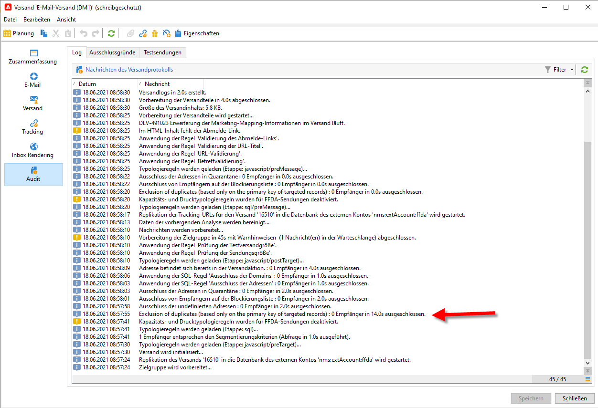
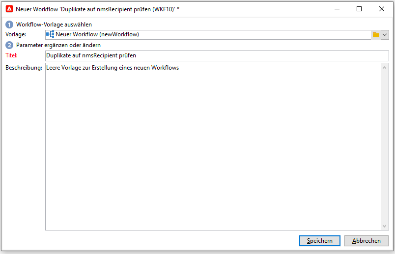
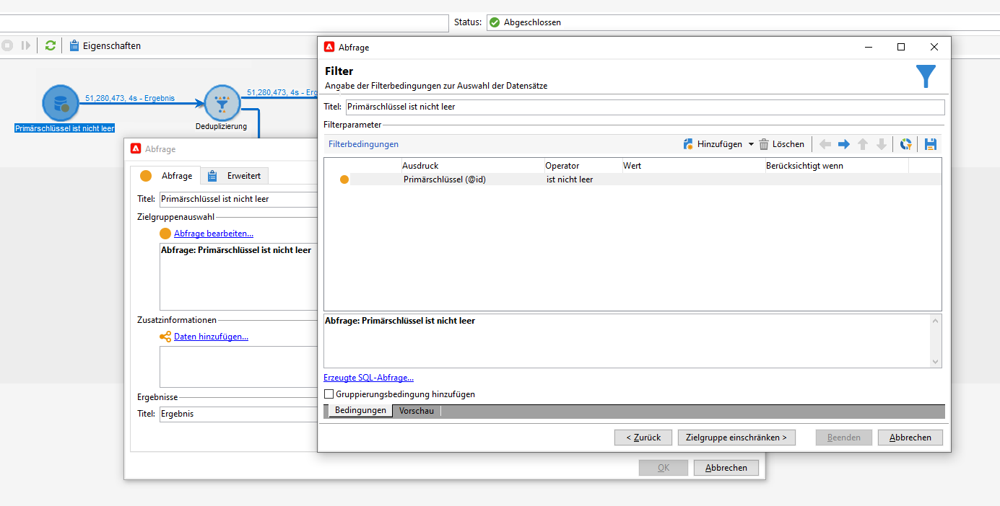
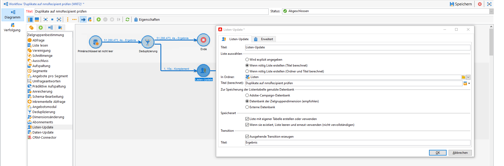
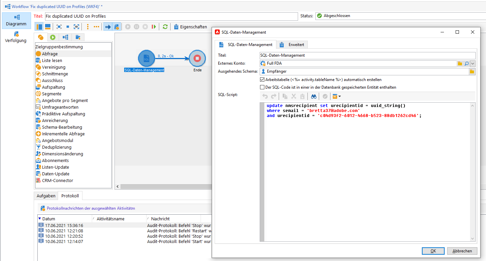

# Schlüsselverwaltung und Eindeutigkeit {#key-management}

In Campaign v8 ist der Primärschlüssel eine Universally Unique IDentifier (UUID) – eine Zeichenfolge. Um diese UUID zu erstellen, muss das Hauptelement des Schemas die Attribute **autouid** und **autopk** enthalten, die auf **true** gesetzt sind.

Adobe Campaign v8 wird mit Snowflake als Hauptdatenbank bereitgestellt. Die verteilte Architektur der Snowflake-Datenbank bietet keine Mechanismen zur Gewährleistung der Eindeutigkeit eines Schlüssels in einer Tabelle. Die Endbenutzer sind dafür verantwortlich, die Konsistenz der Schlüssel in der Adobe Campaign-Datenbank sicherzustellen.

Die Vermeidung von Duplikaten bei Schlüsseln, insbesondere bei Primärschlüsseln, ist zur Wahrung der relationalen Datenbankkonsistenz unverzichtbar. Duplikate bei Primärschlüsseln führen zu Problemen mit Workflow-Aktivitäten für die Datenverwaltung, wie **Abfrage**, **Abstimmung**, **Daten-Update** und anderen.

Als Best Practice empfiehlt Adobe die Anwendung einer [Detect](#detect-duplicates)-and-[Correct](#correct-duplicates)-Strategie im Rahmen des gesamten Daten-Management-Prozesses, falls duplizierte Schlüssel in die Datenbank geladen wurden.

## Erkennen von Duplikaten{#detect-duplicates}

Campaign verfügt über eine neue Schutzfunktion, die während der Sendungsvorbereitung automatisch duplizierte UUIDs aus einer Audience entfernt. Dieser neue Mechanismus verhindert, dass beim Vorbereiten von Sendungen Fehler auftreten.

>[!CAUTION]
>
>Duplizierte Schlüssel sind nicht auf UUIDs beschränkt. Duplikate können bei IDs auftreten, einschließlich benutzerdefinierter Schlüssel, die in benutzerdefinierten Tabellen erstellt werden.

Als Endbenutzer können Sie diese Informationen in den Versand-Logs überprüfen. Manche Empfänger können wegen eines duplizierten Schlüssels aus der Hauptzielgruppe ausgeschlossen werden. In diesem Fall wird folgender Warnhinweis angezeigt: `Exclusion of duplicates (based on the primary key or targeted records)`.



Sie können dann einen Workflow erstellen, um die Schlüsselduplikate zu identifizieren und diese Schlüssel zu korrigieren. Gehen Sie dazu wie folgt vor:

1. Erstellen Sie einen neuen Workflow.

   

1. Fügen Sie eine Aktivität des Typs **Abfrage** hinzu.
1. Wählen Sie die Tabelle **Empfänger** aus.

   

1. Fügen Sie eine Aktivität des Typs **Deduplizierung** hinzu und deduplizieren Sie sie den Primärschlüssel (UUID). Behalten Sie nur ein Duplikat und aktivieren Sie die Option **Komplement erzeugen**, um eine ausgehende Transition für die Duplikate zu erstellen.

   

1. Speichern Sie die Duplikate mithilfe der Aktivität &quot;Listen-Update&quot; in einer Liste.

   

Nun können Sie direkt aus der Liste auf die duplizierten Empfänger zugreifen. Selbst wenn die Transition nur eine der duplizierten Zeilen enthält, werden alle Duplikate in der Liste protokolliert.


## Korrigieren von Duplikaten{#correct-duplicates}

Dasmit Duplikate korrigiert werden können, müssen die Campaign-Daten aktualisiert werden. Der Aktionstyp ist eng an die Art der Duplikate und die Implementierung gebunden. Wir können mit mehreren Fällen konfrontiert sein, die jeweils unterschiedliche Korrekturstrategien erfordern (Entfernen, Fusionieren oder Aktualisieren).

>[!IMPORTANT]
>
>Duplizierte Primärschlüssel verhindern die Verwendung integrierter Workflow-Aktivitäten zur Auswahl oder Aktualisierung einer bestimmten Zeile. Aufgrund der duplizierten UUID schlägt die Deduplizierung der Daten fehl und kann die Integrität der Datenbank beeinträchtigen. Daher wird dringend empfohlen, Duplikate zu korrigieren.

Beispiel:

* **Fall 1** – Duplizierte Empfänger mit derselben UUID und denselben Profilinformationen (E-Mail, Vorname usw.) : Die Empfänger sehen wie &quot;echte&quot; Duplikate aus und die Problembehebung könnte darin bestehen, nur eines der Duplikate zu entfernen.
Ein alternativer Ansatz wäre, Informationen eines Empfängers mit denen eines anderen zu fusionieren.

* **Fall 2** – Duplizierte Empfänger mit derselben UUID, aber unterschiedlichen Profilinformationen (unterschiedliche E-Mail-Adresse, Vorname usw.):
Diesmal scheinen verschiedene Profile zu existieren und Sie möchten beide in der Campaign-Datenbank behalten. Deshalb sollte nur eines der Duplikate aktualisiert werden, sodass eine neue UUID generiert wird. [Mehr dazu in diesem Beispiel](#deduplicate-sample)

Je nach Problembehebungsstrategie können Sie die Liste jederzeit aus einem anderen Workflow abfragen und dann die Aktualisierung entsprechend Ihren Anforderungen durchführen. Für weitere Informationen wenden Sie sich an Adobe.

### Beispiel für eine Deduplizierung{#deduplicate-sample}

Im Fall von duplizierten Empfängern können Sie beide Datensätze in der Campaign-Datenbank behalten. Sie müssen dann einen der Datensätze mit einer neuen UUID aktualisieren.

Um eine SQL-Aktualisierungs-Abfrage in der Cloud-Datenbank auszuführen, können Sie die Workflow-Aktivität **SQL-Daten-Management** verwenden und folgende SQL-Aktualisierung ausführen:

```sql
update nmsrecipient set urecipientid = uuid_string()
where semail = 'bretta37@adobe.com'
and urecipientid = 'c04d93f2-6012-4668-b523-88db1262cd46';
```



Sobald die ausgewählte Zeile mit einer neuen UUID aktualisiert wurde, können Sie die aktualisierte Zeile in der Benutzeroberfläche überprüfen und feststellen, dass die UUID erwartungsgemäß aktualisiert wurde. Alternativ können Sie Duplikate in der Datenbank identifizieren, indem Sie den Workflow **Duplikate erkennen** ausführen, [wie hier beschrieben](#detect-duplicates).
