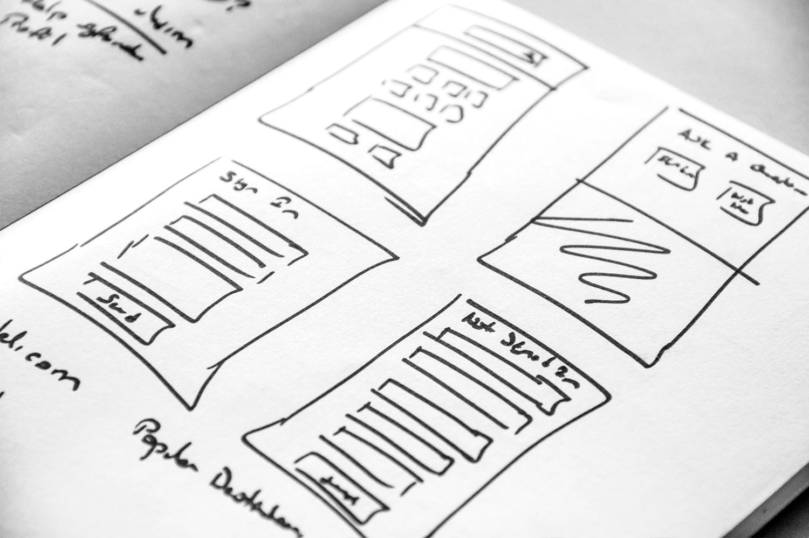

# Erstellen und Verwalten von Landingpages {#ac-gs-lp}

Eine Landingpage ist eine dedizierte Web-Seite, die mit einem bestimmten Marketing-Ziel entwickelt wurde. Besuchende gelangen normalerweise zu einer Landingpage, nachdem sie auf einen Link in einer E-Mail, einem Social Media-Post oder einem Suchmaschinenergebnis geklickt haben. Im Gegensatz zu allgemeinen Seiten einer Website konzentrieren sich Landingpages auf die Steuerung einer einzelnen, klar definierten Aktion, z. B. das Tätigen eines Kaufs, das Abonnieren/Abmelden eines Dienstes oder das Herunterladen einer Ressource. Erstellen Sie mit Adobe Campaign Landingpages, um Benutzende zu Online-Formularen zu leiten, auf denen sie ihre Daten aktualisieren, sich für den Erhalt Ihrer Nachrichten anmelden bzw. davon abmelden oder einen bestimmten Dienst wie etwa einen Newsletter abonnieren können.

Navigieren Sie zum Erstellen von Landingpages zur [Web-Benutzeroberfläche](../start/campaign-ui.md#campaign-web-user-interface-ac-web-ui). Adobe Campaign verfügt über ein überarbeitetes Anwendererlebnis für Landingpages, das nur in der Web-Benutzeroberfläche verfügbar ist.

>[!AVAILABILITY]
>
>* Die Campaign Web-Benutzeroberfläche steht nur Benutzenden zur Verfügung, die über ihre Adobe ID eine Verbindung zu Adobe Campaign herstellen. Erfahren Sie mehr über das [Identitäts-Management-System (IMS)](https://helpx.adobe.com/de/enterprise/using/identity.html){target="_blank"} von Adobe.
>
>* Landingpages, die Sie in der Campaign Web-Benutzeroberfläche erstellen, können in der Campaign-Client-Konsole nicht angezeigt oder bearbeitet werden.
>

Mit Landingpages haben Sie folgende Möglichkeiten:

* Schnelles Erstellen, Entwerfen und Freigeben von Landingpages mithilfe von einsatzbereiten vorausgefüllten Vorlagen, die verschiedenen Anwendungsszenarien entsprechen.
* Verwenden Sie Adobe Campaign-Funktionen zur Inhaltserstellung, um mühelos responsive Landingpages zu erstellen.
* Richten Sie schnell und nahtlos Opt-in- und Opt-out-Flüsse ein.
* Erstellen Sie Anmeldedienste, damit sich Benutzende für einen Dienst anmelden können. Weitere Informationen
* Bieten Sie Ihren Empfängerinnen und Empfängern die Möglichkeit, sich vom Empfang Ihrer Nachrichten abzumelden.

Mehr über Landingpages erfahren Sie in der [Dokumentation zur Campaign Web-Benutzeroberfläche](https://experienceleague.adobe.com/de/docs/campaign-web/v8/landing-pages/get-started-lp){target="_blank"}.

Sie können auch die folgenden Abschnitte durchsuchen:

<table style="table-layout:fixed"><tr style="border: 0;">
<td>

<a href="https://experienceleague.adobe.com/de/docs/campaign-web/v8/landing-pages/create-lp"><strong>Erstellen von Landingpages</strong>

</td>
<td>

<a href="https://experienceleague.adobe.com/de/docs/campaign-web/v8/landing-pages/lp-content"><strong>Entwerfen von Landingpages</strong></a>

</td>
<td>

<a href="https://experienceleague.adobe.com/de/docs/campaign-web/v8/landing-pages/lp-templates"><strong>Arbeiten mit Landingpage-Vorlagen</strong></a>

</td>
</tr></table>
