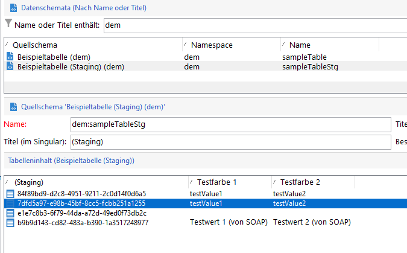
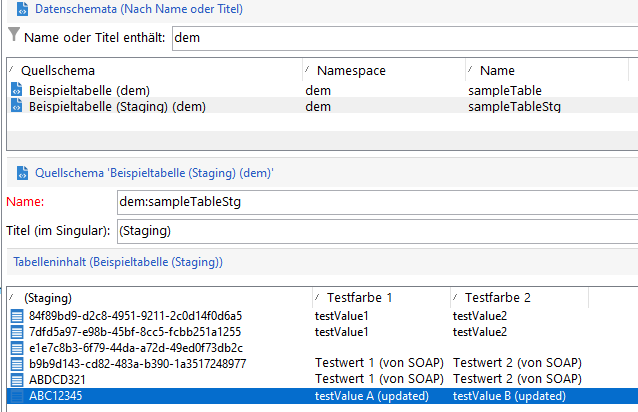
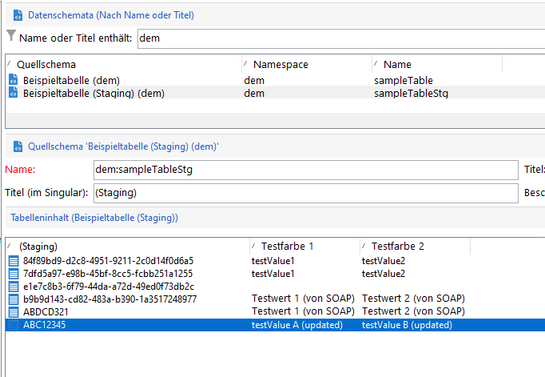

# Neue Campaign-APIs{#gs-new-api}

Campaign v8 verfügt über zwei neue APIs zum Verwalten von Daten zwischen der lokalen Campaign-Datenbank und der Cloud-Datenbank. Voraussetzungen für ihre Verwendung sind die Aktivierung des Staging-Mechanismus im Schema. [Weitere Informationen](staging.md).

* Aufnahme-API: **xtk.session.ingest**

   Diese API ist nur für die Dateneingabe vorgesehen. [Mehr dazu](#data-insert-api)

* Data Update/Delete API: **xtk.session.ingestExt**

   Mit dieser API können Daten aktualisiert oder gelöscht werden. [Mehr dazu](#data-update-api)

Ein spezieller integrierter Workflow synchronisiert die Daten in der Cloud-Datenbank.

## Daten einfügen{#data-insert-api}

Die API **xtk.session.ingest** ist nur für die Dateneingabe vorgesehen. Keine Aktualisierung/Löschung.

### Ohne Abstimmung einfügen

**In einem Workflow**

Verwenden Sie den folgenden Code in einer **JavaScript-Code**-Aktivität, um Daten ohne Abstimmung in die Cloud-Datenbank einzufügen:

```
var xmlStagingSampleTable = <sampleTableStg
                                testcol1="testValue1"
                                testcol2="testValue2"
                                xtkschema="dem:sampleTableStg">
                            </sampleTableStg>;
strUuid = xtk.session.Ingest(xmlStagingSampleTable);
logInfo(strUuid);
```

Nach Ausführung des Workflows wird die Staging-Tabelle erwartungsgemäß gefüttert.

**Aus einem SOAP-Aufruf**

1. Abrufen des Authentifizierungstokens.
1. Trigger der API. Die Payload lautet:

   ```
   <soapenv:Envelope xmlns:soapenv="http://schemas.xmlsoap.org/soap/envelope/" xmlns:urn="urn:xtk:session">
   <soapenv:Header/>
   <soapenv:Body>
       <urn:Ingest>
           <urn:sessiontoken>___xxxxxxx-xxxx-xxx-xxx-xxxxxxxxxxx</urn:sessiontoken>
           <urn:domDoc>
               <sampleTableStg
                   testcol1="Test Value 1 (from SOAP)"
                   testcol2="Test Value 2 (from SOAP)"
                   xtkschema="dem:sampleTableStg">
               </sampleTableStg>
           </urn:domDoc>
       </urn:Ingest>
   </soapenv:Body>
   </soapenv:Envelope>
   ```

1. UUID wird an die SOAP-Antwort zurückgesendet:

   ```
   <SOAP-ENV:Envelope xmlns:xsd="http://www.w3.org/2001/XMLSchema" xmlns:xsi="http://www.w3.org/2001/XMLSchema-instance" xmlns:ns="urn:wpp:default" xmlns:SOAP-ENV="http://schemas.xmlsoap.org/soap/envelope/">
   <SOAP-ENV:Body>
       <IngestResponse SOAP-ENV:encodingStyle="http://schemas.xmlsoap.org/soap/encoding/" xmlns="urn:wpp:default">
           <pstrSUuids xsi:type="xsd:string">e1e7c8b3-6f79-44da-a72d-49ed0f73db2c</pstrSUuids>
       </IngestResponse>
   </SOAP-ENV:Body>
   </SOAP-ENV:Envelope>
   ```

Daher wird die Staging-Tabelle erwartungsgemäß gefüttert.



### Einfügen mit Abstimmung

**In einem Workflow**

Verwenden Sie den folgenden Code in einer **JavaScript-Code**-Aktivität, um Daten mit Abstimmung in die Cloud-Datenbank einzufügen:

```
var xmlStagingSampleTable = <sampleTableStg  _key="@id" id="ABC12345"
                              testcol1="testValue1"
                              testcol2="testValue2"
                              xtkschema="dem:sampleTableStg">
                            </sampleTableStg>;         
strUuid = xtk.session.Ingest(xmlStagingSampleTable);
logInfo(strUuid);
```

Nach Ausführung des Workflows wird die Staging-Tabelle erwartungsgemäß gefüttert.




**Aus einem SOAP-Aufruf**

1. Abrufen des Authentifizierungstokens.
1. Trigger der API. Die Payload lautet:

   ```
   <soapenv:Envelope xmlns:soapenv="http://schemas.xmlsoap.org/soap/envelope/" xmlns:urn="urn:xtk:session">
   <soapenv:Header/>
   <soapenv:Body>
     <urn:Ingest>
        <urn:sessiontoken>___5e71f4bf-d38a-4ba8-ac15-35a958f7f138</urn:sessiontoken>
        <urn:domDoc>
           <sampleTableStg  _key="@id" id="ABDCD321"
                testcol1="Test Value 1 (from SOAP)"
                testcol2="Test Value 2 (from SOAP)"
                xtkschema="dem:sampleTableStg">
            </sampleTableStg>
        </urn:domDoc>
     </urn:Ingest>
    </soapenv:Body>
   </soapenv:Envelope>
   ```

1. In diesem Fall wird die UUID nicht an die Antwort zurückgegeben, da sie in der Payload bereitgestellt wurde. Die Antwort lautet:

   ```
   <SOAP-ENV:Envelope xmlns:xsd="http://www.w3.org/2001/XMLSchema" xmlns:xsi="http://www.w3.org/2001/XMLSchema-instance" xmlns:ns="urn:wpp:default" xmlns:SOAP-ENV="http://schemas.xmlsoap.org/soap/envelope/">
   <SOAP-ENV:Body>
       <IngestResponse SOAP-ENV:encodingStyle="http://schemas.xmlsoap.org/soap/encoding/" xmlns="urn:wpp:default">
           <pstrSUuids xsi:type="xsd:string"/>
       </IngestResponse>
   </SOAP-ENV:Body>
   </SOAP-ENV:Envelope>
   ```

Daher wird die Staging-Tabelle erwartungsgemäß gefüttert.

## Daten aktualisieren oder löschen{#data-update-api}

Die **xtk.session.IngestExt**-API wird für die Aktualisierung/Löschung von Daten optimiert. Verwenden Sie **xtk.session.ingest** nur zum Einfügen. &quot;Einfügen&quot;funktioniert unabhängig davon, ob der Datensatz-Schlüssel nicht in der Staging-Tabelle enthalten ist.

### Einfügen/Aktualisieren

**In einem Workflow**

Verwenden Sie den folgenden Code in einer **JavaScript-Code**-Aktivität, um Daten in der Cloud-Datenbank zu aktualisieren:

```
var xmlStagingRecipient = <sampleTableStg  _key="@id" id="ABC12345"
                              testcol1="testValue A (updated)"
                              testcol2="testValue B (updated)"
                              xtkschema="dem:sampleTableStg">
                            </sampleTableStg>;
xtk.session.IngestExt(xmlStagingRecipient);
```

Sobald der Workflow ausgeführt wird, wird die Staging-Tabelle erwartungsgemäß aktualisiert.



**Aus einem SOAP-Aufruf**


1. Abrufen des Authentifizierungstokens.
1. Trigger der API. Die Payload lautet:

   ```
   <soapenv:Envelope xmlns:soapenv="http://schemas.xmlsoap.org/soap/envelope/" xmlns:urn="urn:xtk:session">
   <soapenv:Header/>
   <soapenv:Body>
       <urn:IngestExt>
           <urn:sessiontoken>___444cd168-a1e2-4fb6-a2a8-73be9f133489</urn:sessiontoken>
           <urn:domDoc>
           <sampleTableStg  _key="@id" id="ABDCD321"
                   testcol1="Test Value E (from SOAP)"
                   testcol2="Test Value F (from SOAP)"
                   xtkschema="dem:sampleTableStg">
               </sampleTableStg>
           </urn:domDoc>
       </urn:IngestExt>
   </soapenv:Body>
   </soapenv:Envelope>
   ```

1. Die SOAP-Antwort lautet:

   ```
   <SOAP-ENV:Envelope xmlns:xsd="http://www.w3.org/2001/XMLSchema" xmlns:xsi="http://www.w3.org/2001/XMLSchema-instance" xmlns:ns="urn:wpp:default" xmlns:SOAP-ENV="http://schemas.xmlsoap.org/soap/envelope/">
   <SOAP-ENV:Body>
       <IngestExtResponse SOAP-ENV:encodingStyle="http://schemas.xmlsoap.org/soap/encoding/" xmlns="urn:wpp:default"/>
   </SOAP-ENV:Body>
   </SOAP-ENV:Envelope>
   ```

Daher wird die Staging-Tabelle erwartungsgemäß aktualisiert.

## Abonnementverwaltung {#sub-apis}

Die Abonnementverwaltung in Campaign wird auf [dieser Seite](../start/subscriptions.md) beschrieben.

Die Eingabe von An- und Abmeldedaten beruht auf dem [Staging-Mechanismus](staging.md) in der lokalen Campaign-Datenbank. Abonnenteninformationen werden temporär in Staging-Tabellen in der lokalen Datenbank gespeichert. Der Synchronisations-Workflow sendet diese Daten aus der lokalen Datenbank an die Cloud-Datenbank. Daher sind die An- und Abmeldevorgänge **asynchron**. Opt-in- und Opt-out-Anfragen werden stündlich über einen bestimmten technischen Workflow verarbeitet. [Mehr dazu](../config/replication.md#tech-wf)


**Verwandte Themen**

* [Campaign Classic v7 JSAPI](https://docs.adobe.com/content/help/en/campaign-classic/technicalresources/api/p-1.html)
