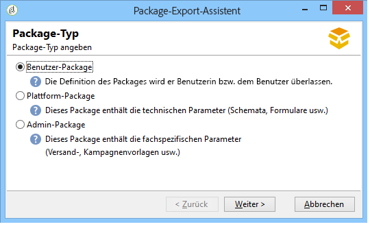
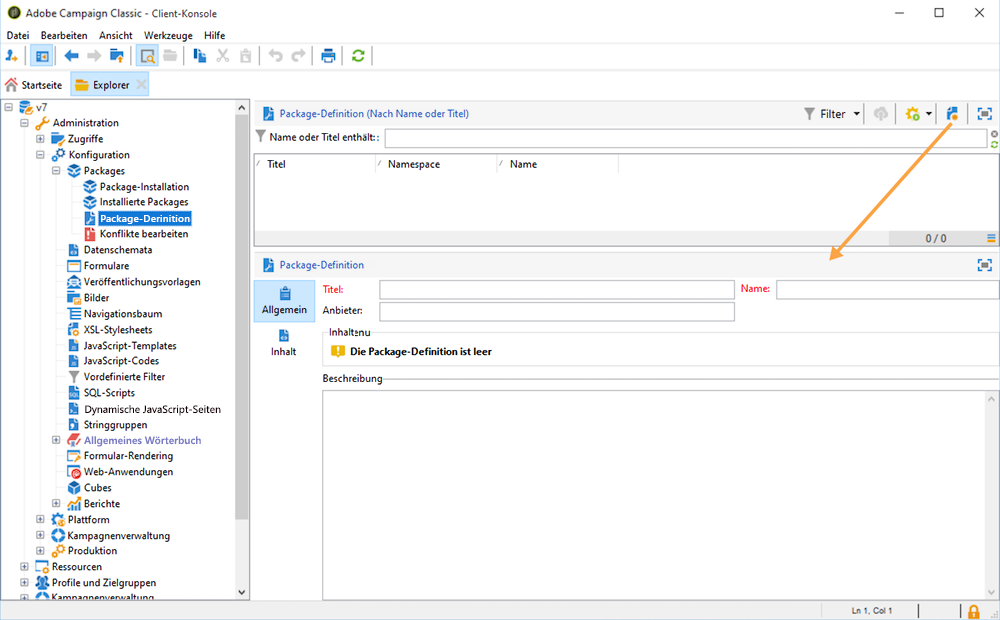
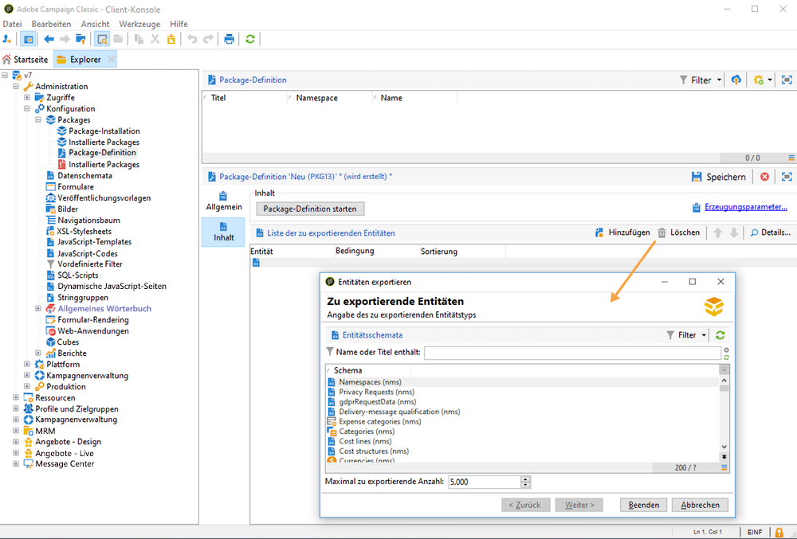
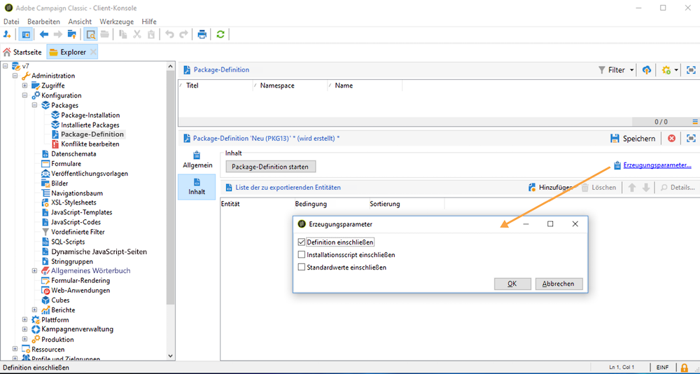

# Arbeiten mit Daten-Packages {#data-packages}

## Erste Schritte mit Daten-Packages {#gs-data-packages}

Sie können Daten-Packages verwenden, um benutzerdefinierte Plattformeinstellungen und -daten zu exportieren und zu importieren. Daten-Packages können verschiedene Arten von Konfigurationen und Komponenten enthalten, gefiltert oder ungefiltert.

In Campaign-Daten-Packages werden Entitäten der Adobe Campaign-Datenbank in XML-Dateien angezeigt. In einem Daten-Package wird jede Entität mit allen Daten dargestellt.

Das Prinzip der **Daten-Packages** besteht darin, eine Datenkonfiguration zu exportieren und in eine andere Adobe Campaign-Umgebung zu integrieren. In diesem [Abschnitt](#data-package-best-practices) erfahren Sie, wie Sie einen konsistenten Satz von Daten-Packages aufrechterhalten.

### Typen von Packages {#types-of-packages}

Sie können in Adobe Campaign mit drei Package-Typen arbeiten: Benutzer-Packages, Plattform-Packages und Admin-Packages.

* Ein **Benutzer-Package** ermöglicht Ihnen, die Liste der zu exportierenden Entitäten auszuwählen. Dieser Package-Typ verwaltet Abhängigkeiten und überprüft Fehler.
* Ein **Plattform-Package** enthält alle hinzugefügten (nicht standardmäßigen) technischen Ressourcen: Schemata, JavaScript-Code usw.
* Ein **Admin-Package** enthält alle hinzugefügten (nicht standardmäßige) Vorlagen und Business Objects: Vorlagen, Bibliotheken usw.

>[!CAUTION]
>
>Die **Plattform**- und **Admin**-Packages enthalten eine vordefinierte Liste von zu exportierenden Entitäten. Jeder exportierbaren Entität sind Filterbedingungen zugeordnet, die es ermöglichen, die Standard-Ressourcen aus dem erstellten Package auszuschließen.

## Datenstruktur {#data-structure}

Die Beschreibung eines Daten-Packages ist ein strukturiertes XML-Dokument, das der Grammatik des **xrk:navtree**-Datenschemas entspricht, wie im folgenden Beispiel gezeigt:

```xml
<package>
  <entities schema="nms:recipient">
    <recipient email="john.smith@adobe.com" lastName="Smith" firstName="John">      
      <folder _operation="none" name="nmsRootFolder"/>      
      <company _operation="none" name="Adobe"/>
    </recipient>
  </entities>
  <entities schema="sfa:company">
    <company name="Adobe">
      <location city="London" zipCode="W11 2BQ"/>
    </company>
  </entities>
</package>
```

Das XML-Dokument muss mit dem `<package>`-Element beginnen und enden. Alle nachfolgenden `<entities>`-Elemente verteilen die Daten nach Dokumenttyp. Ein `<entities>`-Element enthält die Daten des Packages in einem Format, das dem im Attribut **schema** angegebenen Datenschemas entspricht. Die Daten eines Packages dürfen keine internen Schlüssel enthalten, die nicht zwischen Datenbanken kompatibel sind, wie beispielsweise automatisch erstellte Schlüssel (Option **autopk**).

In unserem Beispiel wurden die Joins der `folder`- und `company`-Relationen durch sogenannte „High Level“-Schlüssel in den Zieltabellen ersetzt:

```xml
<recipient>
  <folder _operation="none" name="nmsRootFolder"/>
  <company _operation="none" name="Adobe"/>
</recipient>
```

Das Attribut `operation` mit dem Wert `none` definiert eine Abstimmrelation.

Ein Daten-Package kann manuell über einen beliebigen Texteditor erstellt werden. Sie müssen sicherstellen, dass die Struktur des XML-Dokuments mit dem Datenschema `xtk:navtree` übereinstimmt. Die Client-Konsole ist mit einem Modul zum Import und Export von Daten-Packages ausgestattet.

## Exportieren von Packages {#export-packages}

Es gibt drei Möglichkeiten, um Packages zu exportieren:

* Verwenden Sie den **[!UICONTROL Package-Export-Assistenten]**, um mehrere Objekte in ein einzelnes Package zu exportieren. [Weitere Informationen](#export-a-set-of-objects-in-a-package)
* Um ein **einzelnes Objekt** zu exportieren, klicken Sie mit der rechten Maustaste darauf und wählen Sie **[!UICONTROL Aktionen > In ein Package exportieren]** aus.
* Verwenden Sie die **Package-Definitionen**, um eine Package-Struktur zu erstellen, in der Sie Objekte hinzufügen, die später in ein Package exportiert werden sollen. [Weitere Informationen](#manage-package-definitions)

Nachdem ein Package exportiert wurde, können Sie das Package und alle hinzugefügten Entitäten in eine andere Campaign-Instanz importieren.

### Exportieren mehrerer Objekte in ein Package {#export-a-set-of-objects-in-a-package}

Gehen Sie wie folgt vor, um mehrere Objekte in ein Daten-Package zu exportieren:

1. Navigieren Sie über den Explorer-Menübefehl **[!UICONTROL Werkzeuge > Erweitert > Package-Export]** zum Package-Export-Assistenten.
1. Wählen Sie den [Package-Typ](#types-of-packages) aus.

   

1. Klicken Sie auf die Schaltfläche **Hinzufügen**, um die Entitäten auszuwählen, die als Package exportiert werden sollen.

   >[!CAUTION]
   >
   >Beim Export eines Ordners vom Typ **[!UICONTROL Angebotskategorie]**, **[!UICONTROL Angebotsumgebung]**, **[!UICONTROL Programm]** oder **[!UICONTROL Plan]** darf unter keinen Umständen die Entität **xtk:folder** ausgewählt werden, da dies einen Datenverlust verursachen kann. Wählen Sie stattdessen die jeweils dem Ordner entsprechende Entität aus: **nms:offerCategory** für Angebotskategorien, **nms:offerEnv** für Angebotsumgebungen, **nms:program** für Programme und **nms:plan** für Pläne.

   Der Abhängigkeitsmechanismus steuert die Exportsequenz der Entitäten. Weitere Informationen hierzu finden Sie unter [Abhängigkeitsverwaltung](#manage-dependencies).

1. Klicken Sie auf **[!UICONTROL Weiter]** und definieren Sie die Filterabfrage nach dem Typ des zu extrahierenden Dokuments. Hier muss die Filterbedingung der Datenextraktion angegeben werden.

   >[!NOTE]
   >
   >Der Abfrageeditor wird in [diesem Abschnitt](../../automation/workflow/query.md) beschrieben.

1. Klicken Sie auf **[!UICONTROL Weiter]** und legen Sie die Sortierreihenfolge für die exportierten Daten fest.

1. Sehen Sie sich die zu extrahierenden Daten in einer Vorschau an, um Ihre Konfiguration zu überprüfen.

1. Im letzten Schritt des Package-Export-Assistenten wird der Export gestartet. Die Daten werden in der im Feld **[!UICONTROL Datei]** angegebenen Datei gespeichert.

### Verwalten von Abhängigkeiten {#manage-dependencies}

Der Exportvorgang verfolgt die Relationen zwischen den verschiedenen exportierten Elementen. Der Mechanismus wird durch zwei Regeln bestimmt:

* Die über eine Relation mit dem Integritätstyp `own` oder `owncopy` verknüpften Objekte werden in dasselbe Package exportiert wie das exportierte Objekt.
* Die über eine Relation mit dem Integritätstyp `neutral` oder `define` (definierte Relation) verknüpften Objekte müssen separat exportiert werden.

>[!NOTE]
>
>Mit Schemaelementen verknüpfte Integritätstypen werden auf [dieser Seite](database-links.md) definiert.

#### Exportieren von Kampagnen {#export-a-campaign}

Im Folgenden finden Sie ein Beispiel für den Export einer Kampagne. Die zu exportierende Marketing-Kampagne enthält:
* eine `MyTask`-Aufgabe
* einen `campaignWorkflow`-Workflow im folgenden Ordner: **[!UICONTROL Administration > Produktion > Technische Workflows > Kampagnenprozesse > MyWorkflow]**.

Die Aufgabe und der Workflow werden in dasselbe Package wie die Kampagne exportiert, da die entsprechenden Schemata über Relationen vom Integritätstyp `own` verbunden sind.

Der Package-Inhalt stellt sich wie folgt dar:

```xml
<?xml version='1.0'?>
<package author="Administrator (admin)" buildNumber="7974" buildVersion="7.1" img=""
label="" name="" namespace="" vendor="">
 <desc></desc>
 <version buildDate="2013-01-09 10:30:18.954Z"/>
 <entities schema="nms:operation">
  <operation duration="432000" end="2013-01-14" internalName="OP1" label="MyCampaign"
  modelName="opEmpty" start="2013-01-09">
   <controlGroup>
    <where filteringSchema=""/>
   </controlGroup>
   <seedList>
    <where filteringSchema="nms:seedMember"></where>
    <seedMember internalName="SDM1"></seedMember>
   </seedList>
   <parameter useAsset="1" useBudget="1" useControlGroup="1" useDeliveryOutline="1"
   useDocument="1" useFCPValidation="0" useSeedMember="1" useTask="1"
   useValidation="1" useWorkflow="1"></parameter>
   <fcpSeed>
    <where filteringSchema="nms:seedMember"></where>
   </fcpSeed>
   <owner _operation="none" name="admin" type="0"/>
   <program _operation="none" name="nmsOperations"/>
   <task end="2013-01-17 10:07:51.000Z" label="MyTask" name="TSK2" start="2013-01-16 10:07:51.000Z"
   status="1">
    <owner _operation="none" name="admin" type="0"/>
    <operation _operation="none" internalName="OP1"/>
    <folder _operation="none" name="nmsTask"/>
   </task>
   <workflow internalName="WKF12" label="CampaignWorkflow" modelName="newOpEmpty"
   order="8982" scenario-cs="Notification of the workflow supervisor (notifySupervisor)"
   schema="nms:recipient">
    <scenario internalName="notifySupervisor"/>
    <desc></desc>
    <folder _operation="none" name="Folder4"/>
    <operation _operation="none" internalName="OP1"/>
   </workflow>
  </operation>
 </entities>
</package>   
```

Die Zugehörigkeit zu einem Package-Typ wird in einem Schema mit dem Attribut `@pkgAdmin and @pkgPlatform` bestimmt. Diese beiden Attribute erhalten einen XTK-Ausdruck, der die Bedingungen der Zugehörigkeit zum Package festlegt.

```xml
<element name="offerEnv" img="nms:offerEnv.png" 
template="xtk:folder" pkgAdmin="@id != 0">
```

Schließlich können über das Attribut `@pkgStatus` die Exportregeln für diese Elemente oder Attribute bestimmt werden. Abhängig vom Wert des Attributs wird das Element oder das Attribut im exportierten Package vorhanden sein. Die drei für dieses Attribut möglichen Werte sind:

* `never`: Exportiert das Feld/die Relation nicht.
* `always`: Erzwingt den Export dieses Felds.
* `preCreate`: Lässt die Erstellung der verknüpften Entität zu.

>[!NOTE]
>
>Der Wert `preCreate` ist nur für Elemente vom Typ Relation zugelassen. Er lässt die Erstellung oder den Verweis auf eine Entität zu, die noch nicht in das exportierte Package geladen wurde.

## Package-Definitionen verwalten {#manage-package-definitions}

Mithilfe von Package-Definitionen können Sie eine Package-Struktur erstellen, in der Sie Entitäten hinzufügen, die später als einzelnes Package exportiert werden. Sie können dann dieses Package und alle hinzugefügten Entitäten in eine andere Campaign-Instanz importieren.

### Package-Definitionen erstellen {#create-a-package-definition}

Auf Package-Definitionen können Sie über das Menü **[!UICONTROL Administration > Konfiguration > Packageverwaltung > Package-Definition]** zugreifen.

Um eine Package-Definition zu erstellen, klicken Sie auf die Schaltfläche **[!UICONTROL Neu]** und geben Sie die allgemeinen Informationen für die Package-Definition ein.



Anschließend können Sie Entitäten zur Package-Definition hinzufügen und diese in ein XML-Datei-Package exportieren.

**Verwandte Themen:**

* [Entitäten zu einer Package-Definition hinzufügen](#add-entities-to-a-package-definition)
* [Erzeugung von Package-Definitionen konfigurieren](#configure-package-definitions-generation)
* [Packages über eine Package-Definition exportieren](#export-packages-from-a-package-definition)

### Entitäten zu einer Package-Definition hinzufügen {#add-entities-to-a-package-definition}

Klicken Sie auf der Registerkarte **[!UICONTROL Inhalt]** auf die Schaltfläche **[!UICONTROL Hinzufügen]**, um die Entitäten auszuwählen, die mit dem Package exportiert werden sollen. Best Practices bei der Auswahl von Entitäten werden in [diesem Abschnitt](#export-a-set-of-objects-in-a-package) vorgestellt.



Entitäten können direkt über ihren Speicherort in der Instanz zu einer Package-Definition hinzugefügt werden. Gehen Sie dazu wie folgt vor:

1. Klicken Sie mit der rechten Maustaste auf die gewünschte Entität und wählen Sie dann **[!UICONTROL Aktionen > In ein Package exportieren]** aus.

1. Wählen Sie **[!UICONTROL Einer Package-Definition hinzufügen]** und anschließend die Package-Definition, zu der Sie die Entität hinzufügen möchten.

1. Die Entität wird zur Package-Definition hinzugefügt und mit dem Package exportiert (siehe [diesen Abschnitt](#export-packages-from-a-package-definition)).

### Erzeugung von Package-Definitionen konfigurieren {#configure-package-definitions-generation}

Die Package-Erzeugung kann über den Tab **[!UICONTROL Inhalt]** der Package-Definition konfiguriert werden. Klicken Sie dazu auf den Link **[!UICONTROL Erzeugungsparameter]**.



* Verwenden Sie die Option **[!UICONTROL Definition einschließen]**, um die aktuell verwendete Definition in die Package-Definition einzuschließen.
* Verwenden Sie die Option **[!UICONTROL Installationsscript einschließen]**, um ein JavaScript-Skript hinzuzufügen, das beim Package-Import ausgeführt werden soll. Bei Auswahl dieser Option wird die Registerkarte **[!UICONTROL Script]** auf dem Bildschirm mit der Package-Definition hinzugefügt.
* Verwenden Sie die Option **[!UICONTROL Standardwerte einschließen]**, um dem Package die Werte der Attribute aller Entitäten hinzuzufügen.

  Diese Option ist standardmäßig nicht ausgewählt, um lange Exporte zu vermeiden. Das bedeutet, dass Attribute mit Standardwerten („empty“, „0“ und „false“, sofern im Schema nichts anderes definiert ist) von Entitäten nicht zum Package hinzugefügt und deshalb nicht exportiert werden.

  >[!CAUTION]
  >
  >Wenn die Instanz, in die das Package importiert wird, Entitäten enthält, die mit denen des Packages identisch sind (beispielsweise mit derselben externen ID), werden deren Attribute nicht aktualisiert. Dies kann passieren, wenn die Attribute der vorherigen Instanz Standardwerte aufweisen, da sie nicht im Package enthalten sind. In einem solchen Fall wird durch Auswählen der Option **[!UICONTROL Standardwerte einschließen]** die Versionszusammenführung verhindert, da alle Attribute der vorherigen Instanz mit dem Package exportiert werden.

### Packages über eine Package-Definition exportieren {#export-packages-from-a-package-definition}

Gehen Sie wie folgt vor, um ein Package über eine Package-Definition zu exportieren:

1. Wählen Sie die zu exportierende Package-Definition aus. Klicken Sie dann auf die Schaltfläche **[!UICONTROL Aktionen]** und wählen Sie **[!UICONTROL Package exportieren]** aus.
1. Überprüfen Sie den Namen und den Speicherort der exportierten Datei.
1. Klicken Sie auf die Schaltfläche **[!UICONTROL Starten]**, um mit dem Export zu beginnen.

## Importieren von Packages {#import-packages}

Der Package-Import-Assistent wird im Hauptmenü der Client-Konsole über **[!UICONTROL Werkzeuge > Erweitert > Package importieren]** aufgerufen.

### Installieren eines Packages von einer Datei aus {#install-a-package-from-a-file}

Gehen Sie wie folgt vor, um ein vorhandenes Daten-Package zu importieren:

1. Rufen Sie den Import-Assistenten im Hauptmenü der Client-Konsole über **[!UICONTROL Werkzeuge > Erweitert > Package importieren]** auf.
1. Wählen Sie die XML-Datei aus und klicken Sie auf **[!UICONTROL Öffnen]**.

Der Inhalt des zu importierenden Packages wird daraufhin im mittleren Bereich des Assistenten angezeigt.

Klicken Sie auf **[!UICONTROL Weiter]** und **[!UICONTROL Starten]**, um den Import zu beginnen.

### Native Packages installieren {#install-a-standard-package}

Native Packages (auch bezeichnet als Standard-Packages) werden bei der Konfiguration von Adobe Campaign installiert. Abhängig von Ihren Berechtigungen, Ihrem Bereitstellungsmodell und Ihrem Produktangebot können Sie neue Standard-Packages importieren.

Welche Packages Sie installieren können, steht in Ihrem Lizenzvertrag.

## Best Practices für Daten-Packages {#data-package-best-practices}

In diesem Abschnitt wird beschrieben, wie Sie Daten-Packages während der gesamten Projektlaufzeit einheitlich organisieren können.


### Versionen

Sie müssen Importe immer innerhalb derselben Plattformversion durchführen. Sie müssen Ihre Packages zwischen zwei Instanzen bereitstellen, die denselben Build aufweisen. Erzwingen Sie den Import niemals und aktualisieren Sie immer zuerst die Plattform (wenn der Build abweicht).

>[!IMPORTANT]
>
>Das Importieren zwischen verschiedenen Versionen wird von Adobe nicht unterstützt.

Achten Sie auf das Schema und die Datenbankstruktur. Nachdem Packages mit einem Schema importiert wurden, muss ein Schema generiert werden.

### Package-Typen {#package-types}

Definieren Sie zunächst verschiedene Package-Typen. Es werden nur vier Typen verwendet:

**Entitäten**

* Alle „xtk“- und „nms“-spezifischen Elemente in Adobe Campaign wie Schemata, Formulare, Ordner, Versandvorlagen usw.
* Sie können eine Entität sowohl als „Admin“- als auch als „Plattform“-Element betrachten.
* Sie sollten in ein Package, das Sie in eine Campaign-Instanz hochladen möchten, nicht mehr als eine Entität einschließen.

Wenn Sie Ihre Konfiguration in einer neuen Instanz bereitstellen müssen, können Sie alle Ihre Entitäts-Packages importieren.

**Funktionen**

Dieser Package-Typ:
* Ist eine Reaktion auf eine Kundenanfrage/Spezifikation.
* Enthält eine oder mehrere Funktionen.
* Sollte alle Abhängigkeiten enthalten, um die Funktionen ohne weitere Packages ausführen zu können.

**Kampagnen**

Dieses Package ist nicht obligatorisch. Manchmal ist es sinnvoll, einen bestimmten Typ für alle Kampagnen zu erstellen, selbst wenn eine Kampagne als Funktion betrachtet werden kann.

**Aktualisierungen**

Nach der Konfiguration kann eine Funktion in eine andere Umgebung exportiert werden. Beispielsweise kann das Package aus einer Entwicklungsumgebung in eine Testumgebung exportiert werden. Bei diesem Test wurde ein Fehler festgestellt. Zunächst muss er in der Entwicklungsumgebung behoben werden. Dann muss der Patch auf die Testplattform angewendet werden.

Die erste Lösung bestünde darin, die gesamte Funktion erneut zu exportieren. Um jedoch jegliches Risiko zu vermeiden (d. h. Aktualisieren unerwünschter Elemente), ist es sicherer, ein Package zu nutzen, das nur die Korrektur enthält.

Daher empfehlen wir, ein „Aktualisierungs“-Package zu erstellen, das nur einen Entitätstyp der Funktion enthält.

Eine Aktualisierung kann nicht nur aus einer Fehlerbehebung, sondern auch aus einem neuen Element Ihrer Entität/Funktion bzw. Ihres Kampagnen-Packages bestehen. Um eine Bereitstellung des gesamten Packages zu vermeiden, können Sie ein Aktualisierungs-Package exportieren.

### Namenskonventionen {#data-package-naming}

Da die Typen jetzt definiert sind, sollte nun eine Namenskonvention festgelegt werden. Adobe Campaign erlaubt keine Erstellung von Unterordnern für Package-Spezifikationen, d. h. Zahlen sind die beste Lösung, um eine übersichtliche Struktur beizubehalten. Zahlen werden Package-Namen als Präfix vorangestellt.

Sie können beispielsweise die folgende Konvention verwenden:

* Entität: 1 bis 99
* Funktion: 100 bis 199
* Kampagne: von 200 bis 299
* Aktualisierung: 5000 bis 5999

#### Reihenfolge von Entitäts-Packages {#entity-packages-order}

Um den Import zu erleichtern, sollten Entitäts-Packages beim Importieren geordnet werden. 

Beispiel:

* 001 – Schema
* 002 – Formular
* 003 – Bilder
* etc.

>[!NOTE]
>
>Formulare sollten erst **nach** Schemaaktualisierungen importiert werden.


#### Package-Dokumentation {#package-documentation}

Wenn Sie ein Package aktualisieren, sollten Sie stets einen Kommentar in das Beschreibungsfeld eingeben, um sämtliche Änderungen und Gründe (z. B. „Hinzufügen eines neuen Schemas“ oder „Beheben eines Fehlers“) genau zu dokumentieren.

Best Practice ist, auch das Datum der Aktualisierung anzugeben.

>[!IMPORTANT]
>
>Das Beschreibungsfeld darf maximal 2.000 Zeichen enthalten.
