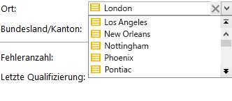

# Schemastruktur{#schema-structure}

Die Grundstruktur eines `<srcschema>` lautet wie folgt:

```
<srcSchema>
    <enumeration>
        ...          //definition of enumerations
    </enumeration>
   
    <element>         //definition of the root <element>    (mandatory)

        <compute-string/>  //definition of a compute-string
        <key>
            ...        //definition of keys
        </key>
        <sysFilter>
            ...           //definition of filters
        </sysFilter>
        <attribute>
            ...             //definition of fields
        </attribute>
    
            <element>           //definition of sub-<element> 
                  <attribute>           //(collection, links or XML)
                  ...                         //and additional fields
                  </attribute>
                ...
            </element>
      
    </element> 

        <methods>                 //definition of SOAP methods
            <method>
                ...
            </method>
            ...
    </methods>  
          
</srcSchema>
```

Das XML-Dokument eines Datenschemas muss die Wurzel **`<srcschema>`** mit den Attributen **name** und **namespace** zur Angabe des Schemanamens und des Namensraums enthalten.

```
<srcSchema name="schema_name" namespace="namespace">
...
</srcSchema>
```

Lassen Sie uns den folgenden XML-Inhalt verwenden, um die Struktur eines Schemas zu illustrieren:

```
<recipient email="John.doe@aol.com" created="AAAA/DD/MM" gender="1"> 
  <location city="London"/>
</recipient>
```

Mit dem zugehörigen Schema data:

```
<srcSchema name="recipient" namespace="cus">
  <element name="recipient">
    <attribute name="email"/>
    <attribute name="created"/>
    <attribute name="gender"/>
    <element name="location">
      <attribute name="city"/>
   </element>
  </element>
</srcSchema>
```

## Beschreibung {#description}

Der Startpunkt des Schemas ist sein Hauptelement. Es ist leicht identifizierbar, da sein Name mit dem des Schemas identisch ist. Außerdem handelt es sich um das direkte untergeordnete Element der Wurzel. Ausgehend von diesem Element beginnt die Inhaltsbeschreibung.

In unserem Beispiel wird das Hauptelement durch die folgende Zeile dargestellt:

```
<element name="recipient">
```

Die Elemente **`<attribute>`** und **`<element>`**, die dem Hauptelement folgen, ermöglichen es Ihnen, die Speicherorte und Namen der Datenelemente in der XML-Struktur zu definieren.

In unserem Beispiel-Schema sind dies:

```
<attribute name="email"/>
<attribute name="created"/>
<attribute name="gender"/>
<element name="location">
  <attribute name="city"/>
</element>
```

Folgende Regeln müssen eingehalten werden:

* Jedes **`<element>`** und **`<attribute>`** müssen mit dem Namen über das **name**-Attribut identifiziert werden.

   >[!CAUTION]
   >
   >Der Name des Elements sollte kurz sein, vorzugsweise in Englisch, und nur autorisierte Zeichen gemäß den XML-Benennungsregeln einschließen.

* Nur **`<element>`**-Elemente können **`<attribute>`**-Elemente und **`<element>`**-Elemente in der XML-Struktur enthalten.
* Ein **`<attribute>`**-Element muss einen eindeutigen Namen innerhalb eines **`<element>`** haben.
* Die Verwendung von **`<elements>`** in mehrzeiligen Datenzeichenfolgen wird empfohlen.

## Datentypen {#data-types}

Der Datentyp wird über das Attribut **type** in den Elementen **`<attribute>`** und **`<element>`** eingegeben.

Eine detaillierte Liste finden Sie in der [Campaign Classic-Dokumentation](https://experienceleague.adobe.com/docs/campaign-classic/using/configuring-campaign-classic/schema-reference/elements-attributes/schema-introduction.html?lang=en#configuring-campaign-classic).

Wenn dieses Attribut nicht gefüllt wird, ist **string** der Standarddatentyp, es sei denn, das Element enthält untergeordnete Elemente. Ist dies der Fall, wird es nur zur hierarchischen Struktur der Elemente verwendet (**`<location>`** Element in unserem Beispiel).

Die folgenden Datentypen werden in Schemas unterstützt:

* **Zeichenfolge**: Zeichenfolge. Beispiele: einen Vornamen, eine Stadt usw.

   Die Größe kann über das Attribut **length** (optional, Standardwert &quot;255&quot;) angegeben werden.

* **boolean**: Boolesches Feld. Beispiel für mögliche Werte: true/false, 0/1, ja/nein usw.
* **byte**,  **short**,  **long**: ganze Zahlen (1 Byte, 2 Byte, 4 Byte). Beispiele: Alter, Kontonummer, Anzahl der Punkte usw.
* **Dublette**: Gleitkommazahl mit Dublette-Präzision. Beispiele: Preis, Preis usw.
* **Datum**,  **Uhrzeit**: Daten und Daten + Uhrzeiten. Beispiele: Geburtsdatum, Kaufdatum usw.
* **datetimenotz**: Datum + Uhrzeit ohne Zeitzonendaten.
* **timespan**: Dauer. Beispiel: Ranghöhe.
* **memo**: Lange Textfelder (mehrere Zeilen). Beispiele: eine Beschreibung, einen Kommentar usw.
* **uuid**: Felder &quot;uniqueidentifier&quot;

   >[!NOTE]
   >
   >Um ein **uuid**-Feld zu enthalten, muss die Funktion &quot;newuid()&quot;hinzugefügt und mit ihrem Standardwert ausgefüllt werden.

Im Folgenden finden Sie unser Schema mit den eingegebenen Typen:

```
<srcSchema name="recipient" namespace="cus">
  <element name="recipient">
    <attribute name="email" type="string" length="80"/>
    <attribute name="created" type="datetime"/>
    <attribute name="gender" type="byte"/>
    <element name="location">
      <attribute name="city" type="string" length="50"/>
   </element>
  </element>
</srcSchema>
```

## Eigenschaften {#properties}

Die Elemente **`<elements>`** und **`<attributes>`** des data-Schemas können mit verschiedenen Eigenschaften bereichert werden. Sie können eine Beschriftung ausfüllen, um das aktuelle Element zu beschreiben.

### Beschriftungen und Beschreibungen {#labels-and-descriptions}

* Mit der Eigenschaft **label** können Sie eine kurze Beschreibung eingeben.

   >[!NOTE]
   >
   >Die Beschriftung ist mit der aktuellen Sprache der Instanz verknüpft.

   **Beispiel**:

   ```
   <attribute name="email" type="string" length="80" label="Email"/>
   ```

   Die Beschriftung wird über das Eingabeformular für die Adobe Campaign-Client-Konsole angezeigt:

   

* Mit der Eigenschaft **desc** können Sie eine lange Beschreibung eingeben.

   Die Beschreibung ist im Eingabefeld in der Statusleiste des Hauptfensters der Adobe Campaign-Client-Konsole zu finden.

   >[!NOTE]
   >
   >Die Beschreibung ist mit der aktuellen Sprache der Instanz verknüpft.

   **Beispiel**:

   ```
   <attribute name="email" type="string" length="80" label="Email" desc="Email of recipient"/>
   ```

### Standardwerte {#default-values}

Mit der Eigenschaft **default** können Sie einen Ausdruck definieren, der bei der Inhaltserstellung einen Standardwert zurückgibt.

Der Wert muss ein mit XPath kompatibler Ausdruck sein. Weiterführende Informationen hierzu finden Sie in [diesem Abschnitt](#reference-with-xpath).

**Beispiel**:

* Aktuelles Datum: **default=&quot;GetDate()&quot;**
* Zähler: **default=&quot;&#39;FRM&#39;+CounterValue(&#39;myCounter&#39;)&quot;**

   In diesem Beispiel wird der Standardwert mithilfe der Verkettung einer Zeichenfolge und des Aufrufs der Funktion **CounterValue** mit einem freien Zählernamen erstellt. Die zurückgegebene Zahl wird bei jeder Einfügung um 1 inkrementiert.

   >[!NOTE]
   >
   >In der Adobe Campaign-Client-Konsole wird der Knoten **[!UICONTROL Administration>Zähler]** verwendet, um Zähler zu verwalten.

Um einen Standardwert mit einem Feld zu verknüpfen, können Sie die Variable `<default>  or  <sqldefault>   field.  </sqldefault> </default>`

`<default>` : ermöglicht es Ihnen, das Feld beim Erstellen von Entitäten mit einem Standardwert vorauszufüllen. Der Wert ist kein SQL-Standardwert.

`<sqldefault>` : ermöglicht Ihnen, beim Erstellen eines Felds einen Mehrwert zu erzielen. Dieser Wert wird als SQL-Ergebnis angezeigt. Während einer Aktualisierung des Schemas wirkt sich dieser Wert nur auf die neuen Datensätze aus.

### Auflistungen {#enumerations}

#### Kostenlose Auflistung {#free-enumeration}

Mit der Eigenschaft **userEnum** können Sie eine kostenlose Auflistung definieren, um die in diesem Feld eingegebenen Werte zu speichern und anzuzeigen. Die Syntax sieht folgendermaßen aus:

**userEnum=&quot;Name der Auflistung&quot;**

Der Name der Auflistung kann frei gewählt und für andere Felder freigegeben werden.

Diese Werte werden in einer Dropdown-Liste aus dem Eingabefeld angezeigt:



>[!NOTE]
>
>In der Adobe Campaign-Client-Konsole wird der Knoten **[!UICONTROL Administration > Auflistungen]** zum Verwalten von Auflistungen verwendet.

#### Auflistung einstellen {#set-enumeration}

Mit der Eigenschaft **enum** können Sie eine feste Auflistung definieren, die verwendet wird, wenn die Liste der möglichen Werte im Voraus bekannt ist.

Das **enum**-Attribut bezieht sich auf die Definition einer Auflistung-Klasse, die im Schema außerhalb des Hauptelements gefüllt wird.

Auflistungen ermöglichen es dem Benutzer, einen Wert aus einer Dropdown-Liste auszuwählen, anstatt ihn in ein reguläres Eingabefeld einzugeben:


Beispiel für eine Deklaration einer Auflistung im Schema data:

```
<enumeration name="gender" basetype="byte" default="0">    
  <value name="unknown" label="Not specified" value="0"/>    
  <value name="male" label="male" value="1"/>   
  <value name="female" label="female" value="2"/>   
</enumeration>
```

Eine Auflistung wird über das **`<enumeration>`**-Element außerhalb des Hauptelements deklariert.

Die Eigenschaften der Auflistung lauten wie folgt:

* **baseType**: Datentyp, der mit den Werten verknüpft ist,
* **label**: Beschreibung der Auflistung,
* **name**: Name der Auflistung,
* **Standard**: Standardwert der Auflistung.

Die Werte für die Auflistung werden im Element **`<value>`** mit den folgenden Attributen deklariert:

* **name**: Name des intern gespeicherten Werts,
* **label**: über die grafische Oberfläche angezeigt.

#### dbenum Auflistung {#dbenum-enumeration}

* Mit der Eigenschaft **dbenum** können Sie eine Auflistung definieren, deren Eigenschaften denen der Eigenschaft **enum** ähnlich sind.

   Das Attribut **name** speichert den Wert jedoch nicht intern, sondern speichert einen Code, mit dem Sie die betreffenden Tabellen erweitern können, ohne ihr Schema zu ändern.

   Die Werte werden über den Knoten **[!UICONTROL Administration>Auflistungen]** definiert.

   Diese Auflistung dient beispielsweise zur Angabe der Art von Kampagnen.

   

### Beispiel {#example}

Beispiel des um diese Eigenschaften ergänzten Schemas:

```
<srcSchema name="recipient" namespace="cus">
  <enumeration name="gender" basetype="byte">    
    <value name="unknown" label="Not specified" value="0"/>    
    <value name="male" label="male" value="1"/>   
    <value name="female" label="female" value="2"/>   
  </enumeration>

  <element name="recipient">
    <attribute name="email" type="string" length="80" label="Email" desc="Email of recipient"/>
    <attribute name="created" type="datetime" label="Date of creation" default="GetDate()"/>
    <attribute name="gender" type="byte" label="gender" enum="gender"/>
    <element name="location" label="Location">
      <attribute name="city" type="string" length="50" label="City" userEnum="city"/>
   </element>
  </element>
</srcSchema>
```

## Kollektionen {#collections}

Eine Kollektion ist eine Liste von Elementen mit gleichem Namen und auf gleicher Hierarchieebene.

Mit dem Attribut **unbound** mit dem Wert &quot;true&quot;können Sie ein Collection-Element füllen.

**Beispiel**: Definition des  **`<group>`** Collection-Elements im Schema.

```
<element name="group" unbound="true" label="List of groups">
  <attribute name="label" type="string" label="Label"/>
</element>
```

Mit Projektion des XML-Inhalts:

```
<group label="Group1"/>
<group label="Group2"/>
```

## Referenz mit XPath {#reference-with-xpath}

Die XPath-Sprache wird in Adobe Campaign verwendet, um ein zu einem Datenschema gehörendes Element oder Attribut zu adressieren.

XPath ist eine Syntax, die es ermöglicht, einen Knoten in der Baumstruktur eines XML-Dokuments zu lokalisieren.

Elemente werden mit ihren Namen bezeichnet, während den Namen von Attributen ein &quot;@&quot;-Zeichen vorangestellt wird.

**Beispiel**:

* **@email**: wählt die E-Mail aus,
* **location/@city**: wählt das Attribut &quot;city&quot;unter dem  **`<location>`** Element aus
* **../@email**: wählt die E-Mail-Adresse aus dem übergeordneten Element des aktuellen Elements aus
* **Gruppe`[1]/@label`**: wählt das Attribut &quot;label&quot;aus, das dem ersten  **`<group>`** Collection-Element untergeordnet ist
* **Gruppe`[@label='test1']`**: wählt das Attribut &quot;label&quot;aus, das dem  **`<group>`** Element untergeordnet ist und den Wert &quot;test1&quot;enthält

>[!NOTE]
>
>Eine zusätzliche Einschränkung wird hinzugefügt, wenn der Pfad ein Unterelement passiert. In diesem Fall muss der folgende Ausdruck zwischen Klammern stehen:
>
>* **location/@** city ist nicht gültig; verwenden  **`[location/@city]`**
>* **`[@email]`** und  **@** emailare-Entsprechung

>


Es ist auch möglich, komplexe Ausdruck wie die folgenden arithmetischen Vorgänge zu definieren:

* **@gender+1**: 1 zum Inhalt des  **** genderattribute hinzufügt,
* **@email + &#39;(&#39;+@created+&#39;)&#39;**: erstellt eine Zeichenfolge unter Verwendung des Werts der E-Mail-Adresse, die zum Erstellungsdatum zwischen Klammern hinzugefügt wird (für den Zeichenfolgentyp muss die Konstante in Anführungszeichen gesetzt werden).

Die Ausdrücke wurden um Funktionen auf hoher Ebene erweitert, um das Potenzial dieser Sprache zu erweitern.

Sie können über einen beliebigen Ausdruck-Editor in der Adobe Campaign-Client-Konsole auf die Liste der verfügbaren Funktionen zugreifen:


**Beispiel**:

* **GetDate()**: gibt das aktuelle Datum zurück
* **Jahr(@erstellt)**: gibt das Jahr des Datums zurück, das im Attribut &quot;erstellt&quot;enthalten ist.
* **GetEmailDomain(@email)**: gibt die Domäne der E-Mail-Adresse zurück.

## Erstellen einer Zeichenfolge über die Zeichenfolge {#building-a-string-via-the-compute-string}

Ein **Compute string** ist ein XPath-Ausdruck, mit dem eine Zeichenfolge erstellt wird, die einen Datensatz in einer mit dem Schema verknüpften Tabelle darstellt. **Die** Datenzeichenfolge wird hauptsächlich in der grafischen Oberfläche verwendet, um die Beschriftung eines ausgewählten Datensatzes anzuzeigen.

Die **Compute string** wird über das **`<compute-string>`**-Element unter dem Hauptelement des data-Schemas definiert. Ein **expr**-Attribut enthält einen XPath-Ausdruck zur Berechnung der Anzeige.

**Beispiel**: die Zeichenfolge der Empfänger-Tabelle berechnen.

```
<srcSchema name="recipient" namespace="nms">  
  <element name="recipient">
    <compute-string expr="@lastName + ' ' + @firstName +' (' + @email + ')' "/>
    ...
  </element>
</srcSchema>
```

Ergebnis der berechneten Zeichenfolge für einen Empfänger: **Doe John (john.doe@aol.com)**

>[!NOTE]
>
>Wenn das Schema keine Rechenzeichenfolge enthält, wird standardmäßig eine Rechenzeichenfolge mit den Werten des Primärschlüssels des Schemas gefüllt.
