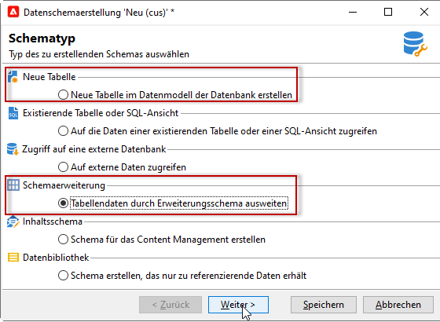
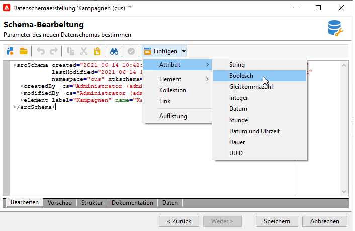
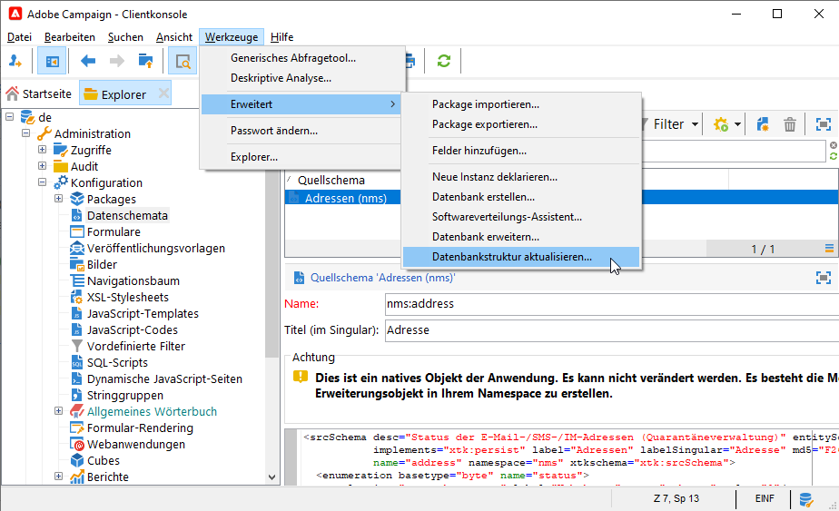

# Arbeiten mit Schemas{#gs-ac-schemas}

Adobe Campaign verwendet Data Schemas für:

* Definieren der Verknüpfung zwischen den Datenobjekten in der Anwendung mit den zugrunde liegenden Datenbanktabellen
* Definieren von Beziehungen zwischen den unterschiedlichen Datenobjekten in der Campaign-Anwendung
* Definieren und Beschreiben der einzelnen Felder eines jeden Objekts

Ein besseres Verständnis der integrierten Kampagnen und ihrer Interaktion finden Sie in [diesem Abschnitt](datamodel.md).

## Kampagne-Schema {#create-or-extend-schemas} erstellen oder erweitern

Um einem der Kerndatenelemente in der Kampagne ein Feld oder ein anderes Schema hinzuzufügen, z. B. die Empfänger-Tabelle (nms:Empfänger), müssen Sie dieses Schema erweitern.

:bulb: Weitere Informationen finden Sie unter [Erweitern eines Schemas](extend-schema.md).

Um einen völlig neuen Datentyp hinzuzufügen, der in Adobe Campaign nicht vorhanden ist (z. B. eine Vertragstabelle), können Sie direkt ein benutzerdefiniertes Schema erstellen.

:bulb: Weitere Informationen finden Sie unter [Neues Schema erstellen](create-schema.md).



Nachdem Sie ein Schema für die Verwendung erstellt oder erweitert haben, sollten Sie dessen XML-Inhaltselemente in der Reihenfolge definieren, in der sie unten aufgeführt sind.

## Auflistungen {#enumerations}

Auflistungen werden zuerst definiert, bevor das Hauptelement des Schemas liegt. Sie ermöglichen es Ihnen, Werte in einer Liste anzuzeigen, um die Auswahl zu beschränken, die der Benutzer für ein bestimmtes Feld hat.

Beispiel:

```
<enumeration basetype="byte" name="exTransactionTypeEnum" default="store">
<value label="Website" name="web" value="0"/>
<value label="Call Center" name="phone" value="1"/>
<value label="In Store" name="store" value="2"/>
</enumeration>
```

Beim Definieren von Feldern können Sie diese Auflistung wie folgt verwenden:

```
<attribute desc="Type of Transaction" label="Transaction Type" name="transactionType" 
type="string" enum="exTransactionTypeEnum"/>
```

>[!NOTE]
>
>Sie können auch benutzerverwaltete Auflistungen verwenden (normalerweise unter **[!UICONTROL Administration]** > **[!UICONTROL Platform]**), um die Werte für ein bestimmtes Feld anzugeben. Dabei handelt es sich um globale Auflistungen und eine bessere Wahl, wenn Ihre Auflistung außerhalb des Schemas, in dem Sie arbeiten, verwendet werden kann.

## Schlüssel {#keys}

Jede Tabelle muss mindestens einen Schlüssel haben. Oft wird sie automatisch im Hauptelement des Schemas mit dem Attribut **@autouid=true** erstellt, das auf &quot;true&quot;gesetzt ist.

Der Primärschlüssel kann auch mit dem Attribut **internal** definiert werden.

Beispiel:

```
<key name="householdId" internal="true">
  <keyfield xpath="@householdId"/>
</key>
```

In diesem Beispiel geben wir anstelle des Attributs **@autouid** einen standardmäßigen primären Schlüssel mit dem Namen &quot;id&quot;unseren eigenen primären Schlüssel &quot;budgetId&quot;an.

>[!CAUTION]
>
>Beim Anlegen eines neuen Schemas oder bei einer Schema-Erweiterung müssen Sie für das gesamte Schema den gleichen Wert für die Primärschlüsselfolge (@pkSequence) beibehalten.

:bulb: Weitere Informationen zu Schlüsseln finden Sie in [diesem Abschnitt](database-mapping.md#management-of-keys).

## Attribute (Felder) {#attributes--fields-}

Mit Attributen können Sie die Felder definieren, aus denen Ihr Datenobjekt besteht. Sie können die Schaltfläche **[!UICONTROL Einfügen]** in der Symbolleiste &quot;Schema-Edition&quot;verwenden, um leere Attributvorlagen an der Stelle in Ihrer XML abzulegen, an der sich Ihr Cursor befindet. Weiterführende Informationen finden Sie in diesem [Abschnitt](create-schema.md).



Die vollständige Liste der Attribute finden Sie im Abschnitt `<attribute>` im Campaign Classic [Dokumentation](https://experienceleague.adobe.com/docs/campaign-classic/using/configuring-campaign-classic/schema-reference/elements-attributes/attribute.html?lang=en#content-model). Im Folgenden finden Sie einige der gebräuchlichsten Attribute: **@advanced**, **@dataPolicy**, **@default**, **@desc**, **@enum**, **@expr**, **@label a13/>,**@length **,**@name **,**@notNull **,**@required **,**@ref&lt;a2 3/>, **@xml**, **@type**.****

:arrow_upper_right: Weitere Informationen zu den einzelnen Attributen finden Sie in der Attributbeschreibung in der [Campaign Classic-Dokumentation](https://experienceleague.adobe.com/docs/campaign-classic/using/configuring-campaign-classic/schema-reference/elements-attributes/schema-introduction.html?lang=en#configuring-campaign-classic).

### Beispiele {#examples}

Beispiel für die Definition eines Standardwert:

```
<attribute name="transactionDate" label="Transaction Date" type="datetime" default="GetDate()"/>
```

Beispiel für die Verwendung eines allgemeinen Attributs als Vorlage für ein Feld, das ebenfalls als obligatorisch gekennzeichnet ist:

```
<attribute name="mobile" label="Mobile" template="nms:common:phone" required="true" />
```

Beispiel eines berechneten Felds, das mit dem Attribut **@advanced** ausgeblendet wird:

```
<attribute name="domain" label="Email domain" desc="Domain of recipient email address" expr="GetEmailDomain([@email])" advanced="true" />
```

Beispiel für ein XML-Feld, das auch in einem SQL-Feld gespeichert ist und das ein **@dataPolicy**-Attribut hat.

```
<attribute name="secondaryEmail" label="Secondary email address" length="100" xml="true" sql="true" dataPolicy="email" />
```

>[!CAUTION]
>
>Obwohl die meisten Attribute gemäß einer 1-1-Kardinalität mit einem physischen Feld der Datenbank verknüpft sind, ist dies bei den XML-Feldern oder den berechneten Feldern nicht der Fall.\
>Ein XML-Feld wird in einem Memofeld (&quot;mData&quot;) der Tabelle gespeichert.\
>Ein berechnetes Feld wird jedoch bei jedem Starten einer Abfrage dynamisch erstellt und ist daher nur in der Anwendungsebene vorhanden.

## Relationen {#links}

Links sind einige der letzten Elemente im Hauptelement Ihres Schemas. Sie definieren, wie alle verschiedenen Schema in Ihrer Instanz miteinander in Beziehung stehen.

Links werden in dem Schema deklariert, das den **Fremdschlüssel** der Tabelle enthält, mit der sie verknüpft sind.

Es gibt drei Arten von Kardinalität: 1-1, 1-N und N-N. Es ist der 1-N-Typ, der standardmäßig verwendet wird.

### Beispiele {#examples-1}

Beispiel für eine 1-N-Verknüpfung zwischen der Tabelle &quot;Empfänger&quot;(vordefiniertes Schema) und einer Tabelle mit benutzerdefinierten Transaktionen:

```
<element label="Recipient" name="lnkRecipient" revLink="lnkTransactions" target="nms:recipient" type="link"/>
```

Ein Beispiel für eine Verknüpfung zwischen einem benutzerspezifischen Schema &quot;Auto&quot;(im Namensraum &quot;cus&quot;) und der Tabelle &quot;Empfänger&quot;:

```
<element label="Car" name="lnkCar" revCardinality="single" revLink="recipient" target="cus:car" type="link"/>
```

Beispiel für eine externe Verknüpfung zwischen der Tabelle &quot;Empfänger&quot;und einer Tabelle mit Adressen, die auf der E-Mail-Adresse und nicht dem Primärschlüssel basiert:

```
<element name="emailInfo" label="Email Info" revLink="recipient" target="nms:address" type="link" externalJoin="true">
  <join xpath-dst="@address" xpath-src="@email"/>
</element>
```

Hier entspricht &quot;xpath-dst&quot;dem primären Schlüssel im Zielgruppe-Schema und &quot;xpath-src&quot;dem Fremdschlüssel im source-Schema.

## Audit-Protokoll {#audit-trail}

Ein nützliches Element, das Sie am Ende Ihres Schemas einbeziehen möchten, ist ein Verfolgungselement (Audit-Protokoll).

Verwenden Sie das unten stehende Beispiel, um Felder mit Bezug auf das Erstellungsdatum, den Benutzer, der die Daten erstellt hat, das Datum und den Autor der letzten Änderung für alle Daten in Ihrer Tabelle einzuschließen:

```
<element aggregate="xtk:common:auditTrail" name="auditTrail"/>
```

## Datenbankstruktur aktualisieren {#updating-the-database-structure}

Sobald Ihre Änderungen abgeschlossen und gespeichert sind, müssen alle Änderungen, die sich auf die SQL-Struktur auswirken können, auf die Datenbank angewendet werden. Verwenden Sie dazu den Datenbankupdate-Assistenten.



Weiterführende Informationen hierzu finden Sie in [diesem Abschnitt](update-database-structure.md).

>[!NOTE]
>
>Wenn Änderungen sich nicht auf die Datenbankstruktur auswirken, müssen Sie nur Schema neu generieren. Wählen Sie dazu die zu aktualisierenden Schema aus, klicken Sie mit der rechten Maustaste und wählen Sie **[!UICONTROL Aktionen > Ausgewählte Schema neu generieren...]** .

