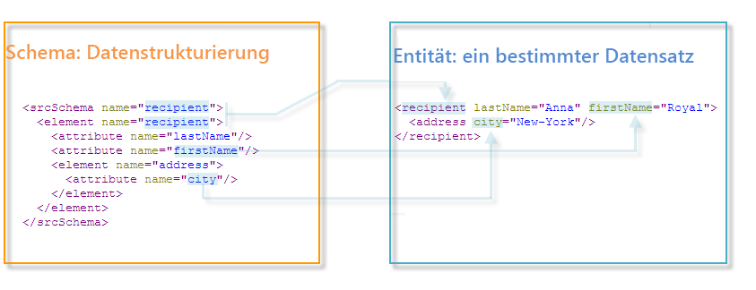

# Arbeiten mit Schemata{#gs-ac-schemas}

Die physische und logische Struktur der im Programm übertragenen Daten wird in XML beschrieben. Sie folgt einer Adobe Campaign-spezifischen Grammatik namens **Schema**.

Ein Schema ist ein mit einer Datenbanktabelle verknüpftes XML-Dokument. Es definiert die Datenstruktur und beschreibt die SQL-Definition der Tabelle:

* Der Name der Tabelle
* Felder
* Relationen zu anderen Tabellen

Außerdem wird die XML-Struktur zum Speichern von Daten beschrieben:

* Elemente und Attribute
* Hierarchie der Elemente
* Element- und Attributtypen
* Standardwerte
* Titel, Beschreibungen und andere Eigenschaften.

Mit Schemata können Sie eine Entität in der Datenbank definieren. Es gibt ein Schema für jede Entität.

Adobe Campaign verwendet Datenschemata zum:

* Definieren der Relation zwischen den Datenobjekten im Programm mit den zugrunde liegenden Datenbanktabellen
* Definieren von Beziehungen zwischen den unterschiedlichen Datenobjekten in der Campaign-Anwendung
* Definieren und Beschreiben der einzelnen Felder eines jeden Objekts

Nähere Erläuterungen zu den in Campaign integrierten Tabellen und ihrer Interaktion finden Sie in [diesem Abschnitt](datamodel.md).

>[!CAUTION]
>
>Einige in Campaign integrierte Schemata sind mit einem Schema in der Cloud-Datenbank verbunden. Diese Schemata werden durch den Namespace **Xxl** identifiziert und dürfen nicht geändert oder erweitert werden.

## Syntax von Schemata {#syntax-of-schemas}

Das Stammelement des Schemas ist **`<srcschema>`**. Es enthält die Unterelemente **`<element>`** und **`<attribute>`**.

Das erste **`<element>`**-Unterelement fällt mit dem Stammelement der Entität zusammen.

```
<srcSchema name="recipient" namespace="cus">
  <element name="recipient">  
    <attribute name="lastName"/>
    <attribute name="email"/>
    <element name="location">
      <attribute name="city"/>
   </element>
  </element>
</srcSchema>
```

>[!NOTE]
>
>Das Stammelement der Entität hat denselben Namen wie das Schema.



Die **`<element>`**-Tags definieren die Namen von Entitätselementen. **`<attribute>`**-Tags des Schemas definieren die Namen der Attribute in den **`<element>`**-Tags, mit denen sie verknüpft wurden.

## Identifizierung eines Schemas {#identification-of-a-schema}

Ein Schema wird anhand seines Namens und seines Namespace identifiziert.

Mit einem Namespace können Sie eine Reihe von Schemas nach Interessensgebieten gruppieren. Beispielsweise wird der Namespace **cus** für die kundenspezifische Konfiguration (**customers**) verwendet.

>[!CAUTION]
>
>Generell sollte der Name des Namespace kurz gehalten sein. Zudem darf er nur autorisierte Zeichen gemäß den XML-Benennungsregeln enthalten.
>
>Kennungen dürfen nicht mit numerischen Zeichen beginnen.

## Reservierte Namespaces {#reserved-namespaces}

Bestimmte Namespaces sind für Beschreibungen der Systementitäten reserviert, die für den Betrieb von Adobe Campaign erforderlich sind. Der folgende Namespace **darf keinesfalls** zur Identifizierung eines neuen Schemas verwendet werden, unabhängig von der Kombination von Groß-/Kleinbuchstaben:

* **xxl**: für Cloud-Datenbank-Schemata reserviert
* **xtk**: für Systemdaten der Plattform reserviert
* **nl**: für allgemeine Operationen des Programms reserviert
* **nms**: für Sendungen reserviert (Empfänger, Versand, Tracking usw.)
* **ncm**: für das Content-Management reserviert
* **temp**: für temporäre Schemata reserviert
* **crm**: für CRM-Connector-Integration reserviert

Der Identifizierungsschlüssel eines Stylesheets ist eine Zeichenfolge, die den Namespace und den Namen enthält, getrennt durch einen Doppelpunkt (z. B. **nms:recipient**).

## Campaign-Schemata erstellen und erweitern {#create-or-extend-schemas}

Um einem der Standard-Datenschemata in Campaign ein Feld oder ein anderes Element hinzuzufügen, z. B. die Empfängertabelle (nms:recipient), müssen Sie dieses Schema erweitern.

 Weiterführende Informationen hierzu finden Sie unter [Schema erweitern](extend-schema.md).

Um einen völlig neuen Datentyp hinzuzufügen, der in Adobe Campaign nicht vorhanden ist (z. B. eine Tabelle zu Verträgen), können Sie direkt ein benutzerdefiniertes Schema erstellen.

 Weiterführende Informationen hierzu finden Sie unter [Erstellen eines neuen Schemas](create-schema.md).


Im Anschluss an die Erstellung oder Erweiterung eines Schemas für Ihre Arbeit sollten Sie dessen XML-Inhaltselemente in der im Folgenden aufgeführten Reihenfolge definieren.

## Auflistungen {#enumerations}

Auflistungen werden als Erstes definiert, noch vor dem Hauptelement des Schemas. Über sie können Sie Werte in einer Liste anzeigen, um die Auswahl einzuschränken, die der Benutzer für ein bestimmtes Feld hat.

Beispiel:

```
<enumeration basetype="byte" name="exTransactionTypeEnum" default="store">
<value label="Website" name="web" value="0"/>
<value label="Call Center" name="phone" value="1"/>
<value label="In Store" name="store" value="2"/>
</enumeration>
```

Beim Definieren von Feldern können Sie diese Auflistung wie folgt verwenden:

```
<attribute desc="Type of Transaction" label="Transaction Type" name="transactionType" 
type="string" enum="exTransactionTypeEnum"/>
```

>[!NOTE]
>
>Sie können auch benutzerseitig verwaltete Auflistungen verwenden (in der Regel unter **[!UICONTROL Administration]** > **[!UICONTROL Platform]**), um die Werte für ein bestimmtes Feld anzugeben. Dabei handelt es sich um globale Auflistungen. Sie sind besser geeignet, wenn Ihre Auflistung außerhalb des von Ihnen eingesetzten Schemas verwendet werden kann.

## Schlüssel {#keys}

Jede Tabelle muss über mindestens einen Schlüssel verfügen. Dessen Erstellung erfolgt häufig automatisch im Hauptelement des Schemas. Hierzu müssen die Attribute **@autouuid** und **autopk** auf **true** gesetzt sein.

Der Primärschlüssel kann auch mit dem Attribut **internal** definiert werden.

Beispiel:

```
<key name="householdId" internal="true">
  <keyfield xpath="@householdId"/>
</key>
```

In diesem Beispiel erstellen wir nicht anhand des Attributs **@autouuid** einen standardmäßigen Primärschlüssel namens &quot;id&quot;, sondern einen eigenen Primärschlüssel mit dem Namen &quot;householdId&quot;.

>[!CAUTION]
>
>Beim Anlegen eines neuen Schemas oder bei einer Schema-Erweiterung müssen Sie für das gesamte Schema den gleichen Wert für die Primärschlüsselfolge (@pkSequence) beibehalten.

 Weiterführende Informationen zu Schlüsseln finden Sie in [diesem Abschnitt](database-mapping.md#management-of-keys).

## Attribute (Felder) {#attributes--fields-}

Mit Attributen können Sie die Felder definieren, aus denen Ihr Datenobjekt besteht. Klicken Sie in der Symbolleiste zur Schemabearbeitung auf **[!UICONTROL Einfügen]**, um leere Attributvorlagen an der Stelle in Ihrer XML abzulegen, an der sich Ihr Cursor befindet. Weiterführende Informationen finden Sie in diesem [Abschnitt](create-schema.md).


Eine vollständige Liste der Attribute finden Sie im Abschnitt `<attribute>`-Element in der [Dokumentation zu Campaign Classic v7](https://experienceleague.adobe.com/docs/campaign-classic/using/configuring-campaign-classic/schema-reference/elements-attributes/attribute.html?lang=de#content-model). Im Folgenden finden Sie einige der gebräuchlichsten Attribute: **@advanced**, **@dataPolicy**, **@default**, **@desc**, **@enum**, **@expr**, **@label**, **@length**, **@name**, **@notNull**, **@required**, **@ref**, **@xml**, **@type**.

 Weitere Informationen zu den einzelnen Attributen finden Sie in der entsprechenden Erläuterung der [Dokumentation zu Campaign Classic v7](https://experienceleague.adobe.com/docs/campaign-classic/using/configuring-campaign-classic/schema-reference/elements-attributes/schema-introduction.html?lang=de#configuring-campaign-classic).

### Beispiele {#examples}

Beispiel für die Definition eines Standardwerts:

```
<attribute name="transactionDate" label="Transaction Date" type="datetime" default="GetDate()"/>
```

Beispiel für die Verwendung eines allgemeinen Attributs als Vorlage für ein Feld, das ebenfalls als obligatorisch gekennzeichnet ist:

```
<attribute name="mobile" label="Mobile" template="nms:common:phone" required="true" />
```

Beispiel eines berechneten Felds, das mit dem Attribut **@advanced** ausgeblendet wird:

```
<attribute name="domain" label="Email domain" desc="Domain of recipient email address" expr="GetEmailDomain([@email])" advanced="true" />
```

Beispiel für ein XML-Feld, das ebenfalls in einem SQL-Feld gespeichert ist und ein **@dataPolicy**-Attribut aufweist.

```
<attribute name="secondaryEmail" label="Secondary email address" length="100" xml="true" sql="true" dataPolicy="email" />
```

>[!CAUTION]
>
>Die meisten Attribute sind zwar mittels 1-1-Kardinalität mit einem physischen Feld der Datenbank verknüpft. Bei den XML-Feldern oder den berechneten Feldern ist dies jedoch nicht der Fall.\
>Ein XML-Feld wird in einem Memo-Feld (&quot;mData&quot;) der Tabelle gespeichert.\
>Es wird jedoch beim Start jeder Abfrage dynamisch ein berechnetes Feld erstellt, sodass dieses auf Anwendungsebene vorhanden ist.

## Relationen {#links}

Relationen gehören zu den letzten Elementen im Hauptelement Ihres Schemas. Sie definieren, wie die verschiedenen Schemata in Ihrer Instanz miteinander in Beziehung stehen.

Relationen werden in dem Schema deklariert, das den **Fremdschlüssel** der Tabelle enthält, mit der sie verknüpft sind.

Es gibt drei Arten von Kardinalität: 1-1, 1-N und N-N. Standardmäßig wird der Typ 1-N verwendet.

### Beispiele {#examples-1}

Beispiel für eine 1-N-Relation zwischen der Empfängertabelle (vordefiniertes Schema) und einer Tabelle mit benutzerdefinierten Transaktionen:

```
<element label="Recipient" name="lnkRecipient" revLink="lnkTransactions" target="nms:recipient" type="link"/>
```

Beispiel für eine 1-1-Relation zwischen einem benutzerspezifischen Schema &quot;Car&quot; (im Namespace &quot;cus&quot;) und der Empfängertabelle:

```
<element label="Car" name="lnkCar" revCardinality="single" revLink="recipient" target="cus:car" type="link"/>
```

Beispiel für eine externe Relation zwischen der Empfängertabelle und einer Tabelle mit Adressen, die auf der E-Mail-Adresse anstatt auf dem Primärschlüssel basiert:

```
<element name="emailInfo" label="Email Info" revLink="recipient" target="nms:address" type="link" externalJoin="true">
  <join xpath-dst="@address" xpath-src="@email"/>
</element>
```

Hier entspricht &quot;xpath-dst&quot; dem Primärschlüssel im Zielgruppenschema und &quot;xpath-src&quot; dem Fremdschlüssel im Quellschema.

## Audit-Protokoll {#audit-trail}

Es kann sich als nützlich erweisen, am Ende Ihres Schemas ein Tracking-Element hinzuzufügen (für das Audit-Protokoll).

Gehen Sie wie im nachfolgenden Beispiel vor, um Felder mit Bezug auf das Erstellungsdatum, den Benutzer, der die Daten erstellt hat, das Datum und den Autor der letzten Änderung für alle Daten in Ihrer Tabelle einzubeziehen:

```
<element aggregate="xtk:common:auditTrail" name="auditTrail"/>
```

## Datenbankstruktur aktualisieren {#updating-the-database-structure}

Sobald Ihre Änderungen abgeschlossen und gespeichert sind, müssen alle Änderungen, die sich auf die SQL-Struktur auswirken können, auf die Datenbank angewendet werden. Verwenden Sie dazu den Assistenten für das Datenbank-Update.


Weiterführende Informationen hierzu finden Sie in [diesem Abschnitt](update-database-structure.md).

>[!NOTE]
>
>Wenn Änderungen sich nicht auf die Datenbankstruktur auswirken, müssen Sie nur die Schemata neu erstellen. Wählen Sie dazu die zu aktualisierenden Schemata aus, klicken Sie mit der rechten Maustaste und wählen Sie **[!UICONTROL Aktionen > Ausgewählte Schemata wiederherstellen...]**.
