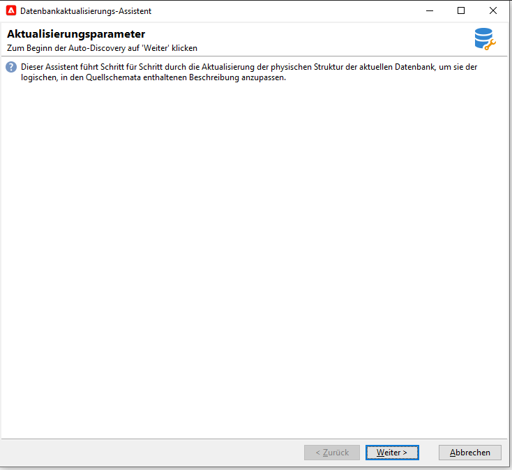
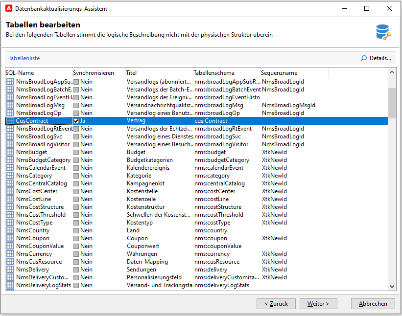
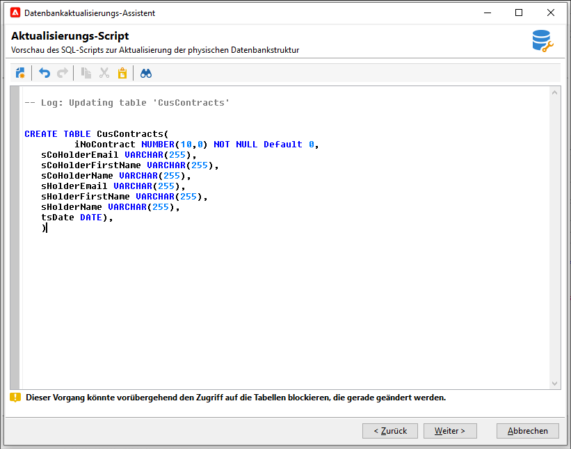
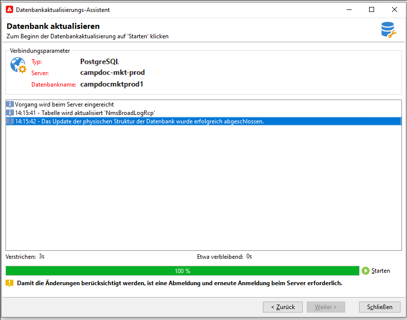

# Datenbankstruktur aktualisieren{#updating-the-database-structure}

Um die vorgenommenen Änderungen auf die Schema anzuwenden, starten Sie den Datenbankaktualisierungsassistenten. Auf diese Assistenzkraft kann über **[!UICONTROL Tools > Erweitert > Datenbankstruktur aktualisieren]** zugegriffen werden. Es prüft, ob die physische Struktur der Datenbank mit der logischen Beschreibung übereinstimmt, und führt die SQL-Aktualisierungsskripte aus.

Die Module in der Datenbank werden automatisch ausgefüllt und aktiviert.

Führen Sie die Schritte aus und führen Sie die Ansicht des SQL-Datenbankupdates durch:

>[!NOTE]
>
>Dies befindet sich in einem Bearbeitungsfeld und kann geändert werden, um SQL-Code zu löschen oder hinzuzufügen.

Starten Sie anschließend die Datenbankaktualisierung:

