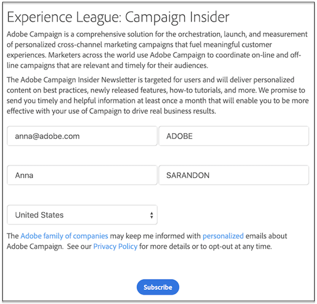

# Erste Schritte mit Web-Anwendungen und Web-Formularen{#gs-ac-web}

Adobe Campaign verfügt über ein Grafikmodul zur Definition und Veröffentlichung von **Web-Formularen**, um Seiten mit Eingabe- und Auswahlfeldern zu erstellen, die Daten aus der Datenbank enthalten können. Auf diese Weise können Sie Web-Seiten entwerfen und posten, auf die Benutzer zugreifen können, um Informationen anzuzeigen oder einzugeben.

Wie Sie Web-Formulare erstellen und veröffentlichen, erfahren Sie in der Dokumentation zu [Campaign Classic v7](https://experienceleague.adobe.com/docs/campaign-classic/using/designing-content/web-forms/about-web-forms.html?lang=de#designing-content){target="_blank"}

Adobe Campaign ermöglicht es Ihnen, mit Daten aus der Datenbank dynamische und interaktive **Web-Anwendungen** zu erstellen und zu veröffentlichen, wobei die Inhalte auf die jeweiligen Benutzerrechte abgestimmt sind.

Sie können Seiten erstellen, z. B. ein Bearbeitungsformular für ein Extranet oder Benachrichtigungsformulare, die Daten aus der Datenbank mit Tabellen, Diagrammen, Eingabeformularen usw. enthalten. Mit dieser Funktion können Sie Web-Seiten entwerfen und posten, auf denen Benutzer Informationen suchen oder eingeben können.

Wie Sie Web-Anwendungen erstellen und veröffentlichen, erfahren Sie in der Dokumentation zu [Campaign Classic v7](https://experienceleague.adobe.com/docs/campaign-classic/using/designing-content/web-applications/about-web-applications.html?lang=de#designing-content){target="_blank"}
