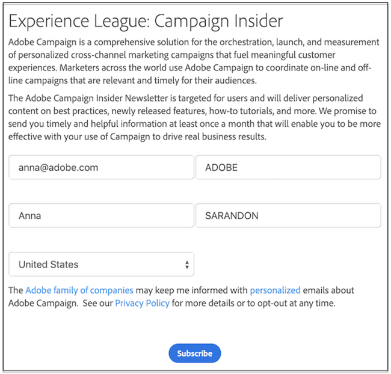

# Erste Schritte mit Web-Anwendungen und Web-Formularen{#gs-ac-web}

Adobe Campaign verfügt über ein grafisches Modul zur Definition und Veröffentlichung von **Web-Formularen**. Damit können Sie Seiten erstellen, die Eingabe- und Auswahlfelder sowie Daten aus der Datenbank enthalten. Daraus lassen sich wiederum Web-Seiten zusammenstellen und veröffentlichen, in denen Benutzer Informationen anzeigen oder eingeben können.

 In der [Dokumentation zu Campaign Classic v7](https://experienceleague.adobe.com/docs/campaign-classic/using/designing-content/web-forms/about-web-forms.html?lang=de#designing-content) erfahren Sie, wie Sie Web-Formulare erstellen und veröffentlichen.

Adobe Campaign ermöglicht es Ihnen, mit Daten aus der Datenbank dynamische und interaktive **Web-Anwendungen** zu erstellen und zu veröffentlichen, wobei die Inhalte auf die jeweiligen Benutzerrechte abgestimmt sind.

Sie können Seiten erstellen (z. B. ein Bearbeitungsformular in einem Extranet oder Benachrichtigungsformulare, die Daten aus der Datenbank mit Tabellen, Diagrammen, Formularen usw. beinhalten). Mit dieser Funktion können Sie Webseiten entwerfen und posten, auf denen Benutzer Daten suchen oder eingeben können.

 In der [Dokumentation zu Campaign Classic v7](https://experienceleague.adobe.com/docs/campaign-classic/using/designing-content/web-applications/about-web-applications.html?lang=de#designing-content) erfahren Sie, wie Sie Web-Anwendungen erstellen und veröffentlichen.
