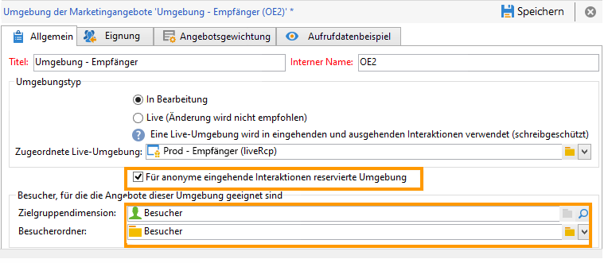
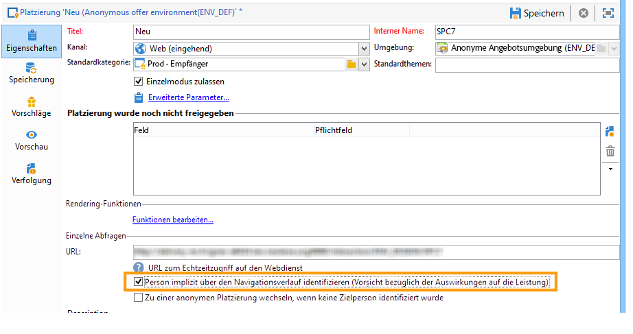
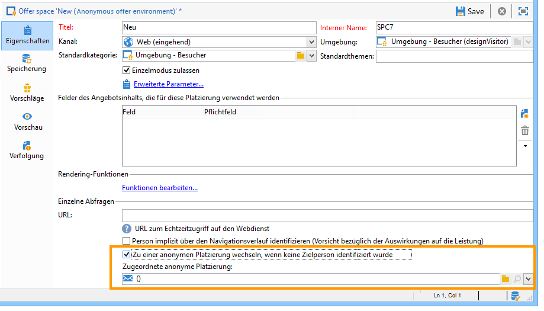

# Anonyme Interaktionen {#anonymous-interactions}

## Umgebung für anonyme Interaktionen {#environment-for-anonymous-interactions}

Das Campaign **Interaction**-Modul verfügt standardmäßig über eine integrierte Umgebung, in der die Empfängertabelle (identifizierte Angebote) ausgewählt werden kann. Wenn Sie beispielsweise eine andere Tabelle, eine Besuchertabelle für anonyme Angebote oder eine benutzerdefinierte Empfängertabelle als Ziel auswählen möchten, müssen Sie den Assistenten für das Zielgruppen-Mapping verwenden, um die Umgebung zu erstellen. [Weitere Informationen zu Umgebungen](interaction-env.md).

Bei der Erstellung einer anonymen Umgebung mithilfe des Assistenten ist im Tab **[!UICONTROL Allgemein]** das Feld **[!UICONTROL Für anonyme eingehende Interaktionen reservierte Umgebung]** bereits angekreuzt.

Die **[!UICONTROL Zielgruppendimension]** wird automatisch abgeschlossen. Standardmäßig ist sie mit der Besuchertabelle verknüpft.

Das Feld **[!UICONTROL Besucherordner]** erscheint. Es enthält bereits den Link zum Ordner **[!UICONTROL Besucher]**. In diesem Feld können Sie auswählen, wo Besucherprofile gespeichert werden sollen.

>[!NOTE]
>
>Wenn Sie verschiedene Besuchertypen unterscheiden möchten, beispielsweise im Fall von anonymen Angeboten verschiedener Marken, müssen Sie für jede Marke eine Umgebung und einen zugeordneten **[!UICONTROL Besucher]**-Ordner erstellen.

## Angebotskataloge für anonyme Interaktionen {#offer-catalog-for-anonymous-interactions}

Genau wie die ausgehenden Interaktionen werden die eingehenden Interaktionen in einem Angebotskatalog organisiert, der aus Kategorien und Angeboten besteht.

Die Erstellung von Kategorien und Platzierungen folgt dem gleichen Muster wie bei identifizierten Kontakten. Siehe [Angebotskategorie erstellen](interaction-offer-catalog.md#creating-offer-categories) und [Angebotsumgebung erstellen](interaction-env.md#creating-an-offer-environment)).

## Anonyme Besucher {#anonymous-visitors}

Anonyme Besucher können einem Cookie-Identifizierungsprozess unterzogen werden, wenn sie eine Verbindung herstellen. Diese implizite Erkennung basiert auf dem Browser-Verlauf des Besuchers.

In diesem Schritt werden die von den Cookies abgerufenen Daten mit denen in Ihrer Datenbank verglichen. In einigen Fällen werden Besucher erkannt (sie werden dann implizit identifiziert), in anderen Fällen werden sie nicht erkannt (und bleiben daher anonym).

Kreuzen Sie in der Platzierung das Feld **[!UICONTROL Person implizit über den Navigationsverlauf identifizieren]** an, wenn Sie diese Möglichkeit nutzen wollen.

## Umgang mit anonymen, nicht identifizierten Besuchern {#processing-unidentified-anonymous-visitors}

Wenn nach der Analyse kein anonymer Besucher identifiziert wird, können Sie seine Daten in einem bestimmten Bereich speichern. Auf diese Weise können Sie Angebote vorschlagen, die speziell für diesen Besuchertyp geeignet sind und den angegebenen Typologieregeln entsprechen.

Für nicht identifizierte Kontakte oder solche, die zwar implizit identifiziert werden können, denen Sie aber keine für bekannte Kontakte erstellten Angebote unterbreiten möchten, haben Sie die Möglichkeit, in eine anonyme Umgebung wechseln.

Kreuzen Sie hierfür das Feld **[!UICONTROL Zu einer anonymen Platzierung wechseln, wenn keine Zielperson identifiziert wurde]** an und geben Sie im Feld **[!UICONTROL Zugeordnete anonyme Platzierung]** die den nicht identifizierten Besuchern vorbehaltene Umgebung an.

