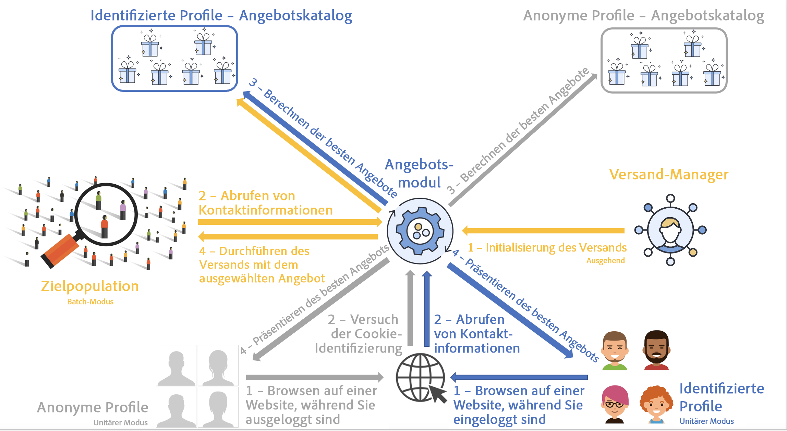
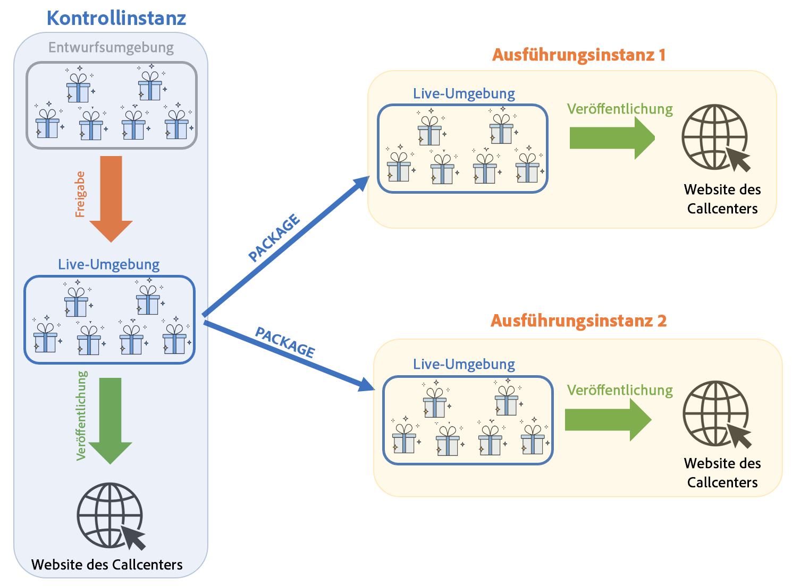
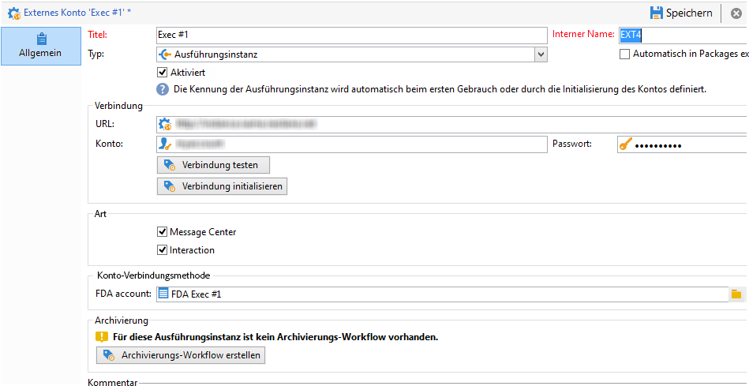
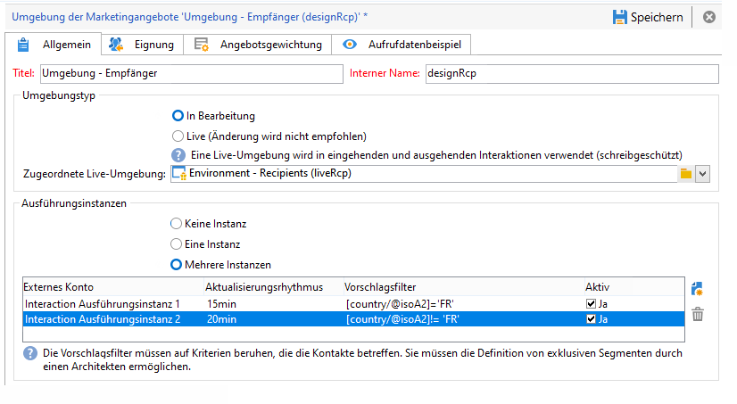

# Umgebungen und Architektur von Campaign Interaction

## Umgebungen {#environments}

Für jede im Zusammenhang mit der Angebotsverwaltung verwendete Zieldimension existiert ein Umgebungspaar:

* Eine **Design**-Umgebung, in der der Angebotsverantwortliche sich darum kümmert, Angebote zu erstellen, zu ändern und zu kategorisieren sowie ihren Validierungsprozess auszulösen, damit sie zum Einsatz kommen können. In jeder Umgebung werden die für eine Kategorie geltenden Regeln, die Platzierungen, in denen die Angebote unterbreitet werden können, und die für die Eignungsprüfung zu verwendenden Filter definiert.

   Kategorien können auch manuell in der Online-Umgebung veröffentlicht werden.

   Der Prozess zur Genehmigung von Angeboten wird [in diesem Abschnitt](interaction-offer.md#approve-offers) beschrieben.

* Eine **Live**-Umgebung, in der die in der Design-Umgebung genehmigten Angebote sowie die verschiedenen Platzierungen, Filter, Kategorien und Regeln zur Verfügung stehen. Bei einer Abfrage des Angebotsmoduls greift dieses ausschließlich auf die Angebote der Live-Umgebung zu.

Ein Angebot wird nur für die bei der Genehmigung ausgewählten Platzierungen freigegeben. Dies bedeutet, dass ein Angebot u. U. live sein kann, aber trotzdem nicht in einer Platzierung verwendet werden kann, selbst wenn diese ebenfalls live ist.

## Eingehende und ausgehende Interaktionen {#interaction-types}

Das Adobe Campaign Interaction-Modul bietet zwei Arten von Interaktionen:

* **eingehende** Interaktionen, initiiert durch einen Kontakt. [Weitere Informationen](interaction-present-offers.md)
* **ausgehende** Interaktionen, die von einem versandverantwortlichen Benutzer für die Kampagne initiiert werden. [Weitere Informationen](interaction-send-offers.md)

Beide Interaktionstypen können entweder im **Einzelmodus** (das Angebot wird für einen einzelnen Kontakt berechnet) oder im **Batch-Modus** (das Angebot wird für mehrere Kontakte gleichzeitig berechnet) verarbeitet werden. In der Regel werden eingehende Interaktionen im Einzelmodus und ausgehende Interaktionen im Batch-Modus verarbeitet. Ausnahmen von dieser Regel bilden z. B. [Transaktionsnachrichten](../send/transactional.md), bei denen die ausgehende Interaktion im Einzelmodus geschieht.

Wenn ein Angebot unterbreitet werden kann oder soll (je nach Konfiguration), spielt das Angebotsmodul eine zentrale Rolle: Es ermittelt automatisch aus einer Reihe von möglichen Angeboten das für den Kontakt am besten geeignete Angebot, indem es die für ihn vorliegenden Daten und die in der Anwendung definierten Regeln kombiniert und abgleicht.



## Verteilte Architektur

Um die Skalierbarkeit zu unterstützen und rund um die Uhr Service für den eingehenden Kanal zu bieten, wird das **Interaction**-Modul in einer verteilten Architektur implementiert. Diese Art von Architektur wird bereits mit [Message Center](../architecture/architecture.md#transac-msg-archi) verwendet und besteht aus mehreren Instanzen:

* einer oder mehrerer Kontrollinstanzen für den ausgehenden Kanal, welche die Marketing-Datenbank und die Design-Umgebung beherbergen;
* einer oder mehrerer Ausführungsinstanzen für den eingehenden Kanal.



Kontrollinstanzen sind dem eingehenden Kanal vorbehalten und enthalten die Online-Version des Katalogs. Jede Ausführungsinstanz ist unabhängig und einem Kontaktsegment gewidmet (z. B. eine Ausführungsinstanz pro Land). Aufrufe des Angebotsmoduls müssen direkt an der Ausführung erfolgen (eine spezifische URL pro Ausführungsinstanz). Da die Synchronisation zwischen Instanzen nicht automatisch erfolgt, müssen Interaktionen desselben Kontakts über dieselbe Instanz gesendet werden.

### Synchronisation {#synchronization}

Die Synchronisation von Vorschlägen erfolgt über Packages. In den Ausführungsinstanzen werden alle Katalogobjekte durch Voranstellung des Namens des externen Kontos gekennzeichnet. Dies ermöglicht die Unterstützung mehrerer Kontrollinstanzen (z. B. Entwicklungs- und Produktionsinstanz ) auf derselben Ausführungsinstanz.

>[!CAUTION]
>
>Verwenden Sie kurze und explizite interne Namen.

Die Freigabe und Veröffentlichung der Angebote in den Ausführungs- und Kontrollinstanzen erfolgt automatisch.

In der Design-Umgebung gelöschte Angebote werden in allen Live-Instanzen deaktiviert. Obsolete Vorschläge und Angebote werden nach Ablauf der durch die Bereinigungsparameter im Softwareverteilungs-Assistenten aller Instanzen definierten Frist und des in den Typologieregeln definierten beweglichen Zeitraums automatisch gelöscht.


Für jedes externe Konto und jede Umgebung wird ein Synchronisations-Workflow erstellt. Die Synchronisationshäufigkeit kann individuell angepasst werden.

Beachten Sie die folgenden Synchronisierungsmechanismen:

* Wenn Sie die Funktion zum Wechsel von einer anonymen in eine identifizierte Umgebung (fall back) nutzen möchten, müssen sich die beiden betroffenen Umgebungen in derselben Ausführungsinstanz befinden.
* Die Synchronisation von verschiedenen Ausführungsinstanzen erfolgt nicht in Echtzeit. Alle Interaktionen eines spezifischen Kontakts müssen immer an dieselbe Instanz gesendet werden. Die Kontrollinstanz ist dem ausgehenden Kanal vorbehalten (keine Echtzeit-Verarbeitung).
* Die Marketing-Datenbank wird nicht automatisch synchronisiert. Aus diesem Grund müssen die im Zusammenhang mit den Eignungsregeln und Gewichtungen verwendeten Marketingdaten in die Ausführungsinstanzen dupliziert werden. Dieser Prozess ist im Verlauf der Integrationsphase zu entwickeln.
* Die Synchronisation von Vorschlägen erfolgt ausschließlich über FDA-Verbindung.
* Falls Sie Interaction und Message Center auf derselben Instanz verwenden, erfolgt die Synchronisation in beiden Fällen über das FDA-Protokoll.

### Package-Konfiguration {#packages-configuration}

Eventuelle Schemaerweiterungen in direktem Zusammenhang mit **Interaktion** (beispielsweise Angebots-, Vorschlags- oder Empfängerschema) sind auf die Ausführungsinstanzen freizugeben.

Das Package **Interaktion** wird auf allen Instanzen installiert (Kontrolle und Ausführung). Zwei weitere Packages sind verfügbar: ein Package für die Kontrollinstanzen und das andere für jede Ausführungsinstanz.

>[!NOTE]
>
>Wenn Sie das Package installieren, werden die Felder vom Typ **long** der Tabelle **nms:proposition**, z. B. die Vorschlagskennung, zu Feldern vom Typ **int64**. Dieser Datentyp wird in der [Dokumentation zu Campaign Classic v7](https://experienceleague.adobe.com/docs/campaign-classic/using/configuring-campaign-classic/schema-reference/schema-structure.html?lang=de#mapping-the-types-of-adobe-campaign-dbms-data){target=&quot;_blank&quot;} behandelt.

Die Aufbewahrungsdauer der Daten wird für jede Instanz konfiguriert (über die Variable **[!UICONTROL Datenbereinigung]** im Implementierungs-Assistenten). Bei Ausführungsinstanzen muss dieser Zeitraum der historischen Tiefe entsprechen, die für die Berechnung von Typologieregeln (beweglicher Zeitraum) und Eignungsregeln erforderlich ist.

Bei den Kontrollinstanzen:

1. Erstellen Sie pro Ausführungsinstanz ein externes Konto:

   

   * Geben Sie einen Titel sowie einen kurzen und expliziten internen Namen an.
   * Wählen Sie den Typ **[!UICONTROL Ausführungsinstanz]** aus.
   * Kreuzen Sie die Option **[!UICONTROL Aktiviert]** an.
   * Geben Sie die Verbindungsparameter zur Ausführungsinstanz an.
   * Jeder Ausführungsinstanz muss eine Kennung zugeordnet werden. Dies geschieht durch Klick auf die Schaltfläche **[!UICONTROL Verbindung initialisieren]**.
   * Kreuzen Sie die verwendete Anwendung an: **[!UICONTROL Message Center]**, **[!UICONTROL Interaction]** oder beide.
   * Geben Sie das genutzte FDA-Konto an. Benutzer müssen in den Ausführungsinstanzen erstellt werden und über die folgenden Lese- und Schreibberechtigungen in den entsprechenden Instanzen verfügen:

      ```
      grant SELECT ON nmspropositionrcp, nmsoffer, nmsofferspace, xtkoption, xtkfolder TO user;
      grant DELETE, INSERT, UPDATE ON nmspropositionrcp TO user;
      ```
   >[!NOTE]
   >
   >Die IP-Adresse der Kontrollinstanz muss in den Ausführungsinstanzen zugelassen sein.

1. Die Umgebung konfigurieren:

   

   * Geben Sie alle Ausführungsinstanzen an.
   * Definieren Sie für jede Instanz den Aktualisierungsrhythmus und die Vorschlagsfilter (z. B. nach Land).

      >[!NOTE]
      >
      >Sollten Fehler auftreten, sind die technischen Workflows zur Vorschlagssynchronisation und Angebotsbenachrichtigung zu prüfen.

Falls aus Optimierungsgründen nur ein Teil der Marketing-Datenbank in die Ausführungsinstanzen dupliziert wird, haben Sie die Möglichkeit, ein der Umgebung zugeordnetes eingeschränktes Schema zu definieren. Auf diese Weise können die Benutzer nur die Daten verwenden, die tatsächlich in den Ausführungsinstanzen zur Verfügung stehen. Es ist trotzdem möglich, ein Angebot zu erstellen, das Daten verwendet, die nicht in der Ausführungsinstanz verfügbar sind. Begrenzen Sie hierfür mithilfe des Felds **[!UICONTROL Berücksichtigt wenn]** die Regel auf den gewünschten ausgehenden Kanal.


### Wartungsoptionen {#maintenance-options}

Folgende Wartungsoptionen stehen für die Kontrollinstanz zur Verfügung:

>[!CAUTION]
>
>Diese Optionen sind nur bei klar definierten Wartungsbedarfen zu nutzen.

* **`NmsInteraction_LastOfferEnvSynch_<offerEnvId>_<executionInstanceId>`**: Datum der letzten Synchronisation einer Umgebung in einer bestimmten Instanz.
* **`NmsInteraction_LastPropositionSynch_<propositionSchema>_<executionInstanceIdSource>_<executionInstanceIdTarget>`**: Datum der letzten Synchronisation der Vorschläge eines bestimmten Schemas zwischen zwei Instanzen.
* **`NmsInteraction_MapWorkflowId`**: Option, die die Liste aller erzeugten Synchronisations-Workflows enthält.

Die folgende Option steht für Ausführungsinstanzen zur Verfügung:

**NmsExecutionInstanceId**: Option, die die Instanzkennung enthält.

### Package-Installation {#packages-installation}

Wenn Ihre Instanz zuvor nicht über das **Interaction**-Package verfügt hat, ist keine Migration erforderlich. Standardmäßig liegt die Vorschlagstabelle nach der Installation der Pakete in 64 Bit vor.

>[!CAUTION]
>
>Je nach Anzahl an existierenden Vorschlägen in Ihrer Instanz kann dieser Vorgang sehr zeitintensiv sein.

* Wenn Ihre Instanz keine oder nur wenige Vorschläge enthält, ist kein manueller Eingriff in Bezug auf die Vorschlagstabelle erforderlich. Die Änderung erfolgt zum Zeitpunkt der Package-Installation.
* Wenn Ihre Instanz eine große Anzahl an Vorschlägen enthält, wird empfohlen, die Struktur der Vorschlagstabelle vor Installation der Ausführungs- und Kontroll-Packages anzupassen. Die diesbezüglichen Abfragen sind vorzugsweise zu einem Zeitpunkt mit geringer Auslastung auszuführen.

>[!NOTE]
>
>Falls Sie spezifische Konfigurationen in Ihrer Vorschlagstabelle vorgenommen haben, müssen die Abfragen entsprechend angepasst werden.


Es gibt zwei Methoden:

**Arbeitstabelle** (empfohlen)

```
CREATE TABLE NmsPropositionRcp_tmp AS SELECT * FROM nmspropositionrcp WHERE 0=1;
ALTER TABLE nmspropositionrcp_tmp
  ALTER COLUMN ipropositionid TYPE bigint,
  ALTER COLUMN iinteractionid TYPE bigint;
INSERT INTO nmspropositionrcp_tmp SELECT * FROM nmspropositionrcp;
DROP TABLE nmspropositionrcp;
CREATE INDEX proposition_id ON NmsPropositionRcp (ipropositionid);
CREATE INDEX nmspropositionrcp_deliveryid ON NmsPropositionRcp (ideliveryid);
CREATE INDEX nmspropositionrcp_lastmodified ON NmsPropositionRcp (tslastmodified);
CREATE INDEX nmspropositionrcp_offerid ON NmsPropositionRcp (iofferid);
CREATE INDEX nmspropositionrcp_offerspaceid ON NmsPropositionRcp (iofferspaceid);
CREATE INDEX nmspropositionrcp_recipientidid ON NmsPropositionRcp (irecipientid);
ALTER TABLE nmspropositionrcp_tmp RENAME TO nmspropositionrcp;
```

**Alternativtabelle**

```
ALTER TABLE nmspropositionrcp
  ALTER COLUMN ipropositionid TYPE bigint,
  ALTER COLUMN iinteractionid TYPE bigint;
```
