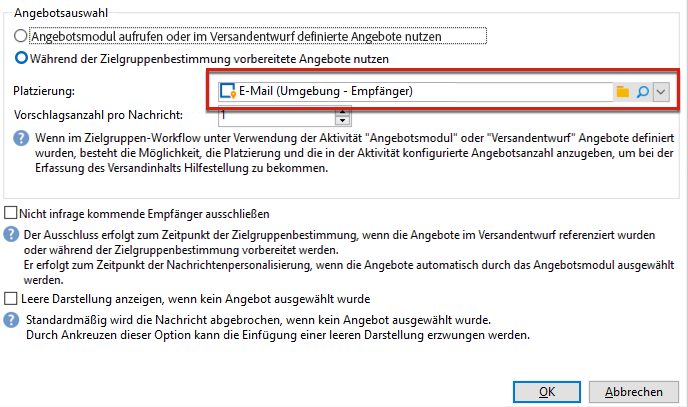
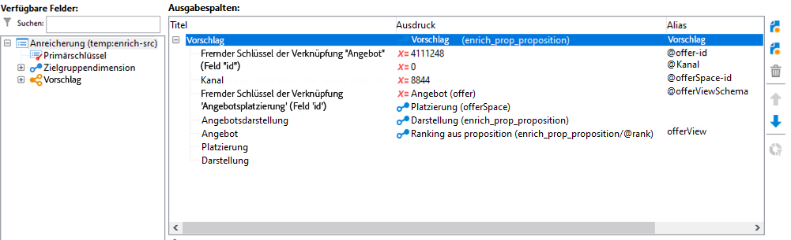

# Best Practices für Interaction{#interaction-best-practices}

## Allgemeine Empfehlungen {#general-recommendations}

Die Verwaltung von Angeboten in Adobe Campaign erfordert für effiziente Arbeit eine sorgfältige Verwaltung. Um Probleme zu vermeiden, müssen Sie ein Gleichgewicht zwischen der Anzahl der Kontakte und der Anzahl der Angebotskategorien und Angebote finden.

In diesem Abschnitt werden Best Practices für die Verwaltung des **Interaction**-Moduls in Adobe Campaign vorgestellt, einschließlich Eignungsregeln, vordefinierter Filter, Workflow-Aktivitäten und Datenbankoptionen.

* Wenn Sie **Interaktionen implementieren und konfigurieren**, müssen Sie die folgenden Empfehlungen beachten:

   * Für das Batch-Modul (typischerweise in der ausgehenden Kommunikation wie E-Mails verwendet) ist der Durchsatz das Hauptproblem, da mehrere Kontakte gleichzeitig verarbeitet werden können. Der typische Engpass hier ist die Datenbankleistung.
   * Die Haupteinschränkung für das Einzel-Modul (die typischerweise in der eingehenden Kommunikation wie bei einem Banner auf einer Website verwendet wird) ist die Latenzzeit, da eine Antwort erwartet wird. Der typische Engpass hier ist die CPU-Leistung.
   * Das Design des Angebotskatalogs hat einen großen Einfluss auf die Leistung von Adobe Campaign.
   * Bei der Arbeit mit vielen Angeboten empfiehlt es sich, diese in mehrere Angebotskataloge aufzuteilen.

* Im Folgenden finden Sie einige Best Practices für die Arbeit mit **Eignungsregeln**:

   * Vereinfachen Sie die Regeln. Die Komplexität von Regeln wirkt sich auf die Leistung aus, da sie den Suchvorgang verlängert. Eine komplexe Regel ist jede Regel, die mehr als fünf Bedingungen enthält.
   * Um die Leistung zu verbessern, können Regeln in verschiedene vordefinierte Filter zerlegt werden, die von mehreren Angeboten gemeinsam verwendet werden.
   * Setzen Sie die restriktivsten Angebotskategorieregeln an die oberste Position im Baum. Auf diese Weise filtern sie zuerst die meisten Kontakte heraus, wodurch die Zielgruppe verkleinert wird, sodass die Kontakte nicht von weiteren Regeln verarbeitet werden.
   * Setzen Sie die teuersten Regeln in Bezug auf Zeit oder Verarbeitung an die unterste Position im Baum. Auf diese Weise werden diese Regeln nur auf die verbleibende Zielgruppe angewendet.
   * Beginnen Sie bei einer bestimmten Kategorie, um zu vermeiden, dass der gesamte Baum durchsucht wird.
   * Um Verarbeitungszeit zu sparen, berechnen Sie Aggregate vor, anstatt komplexe Regeln mit Joins zu erstellen. Speichern Sie dazu Kundendaten in einer Referenztabelle, die anhand von Eignungsregeln durchsucht werden kann.
   * Verwenden Sie eine minimale Anzahl von Gewichtungen, um die Anzahl der Abfragen zu begrenzen.
   * Es wird empfohlen, eine begrenzte Anzahl von Angeboten pro Angebotsplatzierung zu verwenden. Dies ermöglicht je nach Platz einen schnelleren Abruf von Angeboten.
   * Verwenden Sie Indizes, insbesondere für häufig verwendete Suchspalten.

* Nachfolgend sind einige Best Practices bezüglich der **Vorschlagstabelle** aufgeführt:

   * Verwenden Sie möglichst wenige Regeln, um die Verarbeitung so schnell wie möglich zu gestalten.
   * Beschränken Sie die Anzahl der Datensätze in der Vorschlagstabelle: Bewahren Sie nur die Datensätze auf, die zum Tracken der Statusaktualisierung und für die Regeln erforderlich sind, und archivieren Sie sie dann in einem anderen System.
   * Führen Sie eine intensive Datenbankwartung für die Vorschlagstabelle durch, wie z. B. eine Neuerstellung des Index oder der Tabelle.
   * Begrenzen Sie die Anzahl der pro Zielgruppe abgefragten Vorschläge. Definieren Sie nicht mehr als die tatsächlich verwendete Anzahl.
   * Vermeiden Sie möglichst Joins in den Regelbedingungen.

## Tipps zum Verwalten von Angeboten {#tips-managing-offers}

Dieser Abschnitt enthält ausführlichere Ratschläge zur Verwaltung von Angeboten und zum Einsatz des Interaction-Moduls in Adobe Campaign.

### Mehrere Platzierungen in einer E-Mail {#multiple-offer-spaces}

Wenn Angebote in Sendungen einbezogen werden, werden die Angebote in der Regel zuvor im Campaign-Workflow über die Worfklow-Aktivität **Anreicherung** (oder eine andere ähnliche Aktivität) ausgewählt.

Bei der Auswahl von Angeboten in einer Aktivität **Anreicherung** können Sie festlegen, welche Platzierung verwendet werden soll. Das Menü zur Anpassung des Versands hängt jedoch unabhängig von der ausgewählten Platzierung von jener Platzierung ab, die im Versand eingerichtet wurde.

Im folgenden Beispiel lautet die im Versand ausgewählte Platzierung **[!UICONTROL E-Mail (Umgebung - Empfänger)]**:



Wenn für die Platzierung, die Sie im Versand auswählen, keine HTML-Rendering-Funktion eingerichtet ist, wird sie nicht im Versandmenü angezeigt und kann nicht ausgewählt werden. Dies ist unabhängig von der Platzierung, die in der Aktivität **Anreicherung** ausgewählt wurde.

Im folgenden Beispiel ist die HTML-Rendering-Funktion in der Dropdown-Liste verfügbar, da die im Versand ausgewählte Platzierung eine Rendering-Funktion hat:


Diese Funktion fügt Code wie folgt ein: `<%@ include proposition="targetData.proposition" view="rendering/html" %>`.

Wenn Sie den Vorschlag auswählen, lautet der Wert des Attributs **[!UICONTROL view]** wie folgt:
* &quot;rendering/html&quot;: html rendering. Die HTML-Rendering-Funktion wird verwendet.
* &quot;offer/view/html&quot;: html content. Die HTML-Rendering-Funktion wird nicht verwendet. Lediglich das HTML-Feld ist enthalten.

Wenn Sie komplexe Platzierungen in einem einzelnen E-Mail-Versand einschließen und einige von ihnen Rendering-Funktionen aufweisen und andere nicht, müssen Sie sich merken, welche Angebote welche Platzierungen verwenden und welche Platzierungen über Rendering-Funktionen verfügen.

Um Probleme zu vermeiden, wird daher empfohlen, für alle Platzierungen eine HTML-Rendering-Funktion zu definieren, auch wenn für Ihre Platzierung nur HTML-Inhalte erforderlich sind.

### Festlegen des Rangs in der Vorschlagsprotokolltabelle {#rank-proposition-log-table}

Platzierungen können Daten in der Vorschlagstabelle speichern, wenn Vorschläge generiert oder akzeptiert werden:


Dies gilt jedoch nur für eingehende Interaktionen.

Zudem ist es möglich, zusätzliche Daten in der Vorschlagstabelle zu speichern, wenn ausgehende Interaktionen bzw. wenn ausgehende Angebote ohne das Interaction-Modul verwendet werden.

Jedes Feld aus der temporären Workflow-Tabelle, dessen Name mit einem Feldnamen in der Vorschlagstabelle übereinstimmt, wird in dasselbe Feld der Vorschlagstabelle kopiert.

Wenn zum Beispiel in einer Workflow-Aktivität **Anreicherung** ein Angebot manuell (ohne Interaction) ausgewählt wird, sind die standardmäßigen Felder wie folgt definiert:



Zusätzliche Felder können hinzugefügt werden, z. B. ein Feld `@rank`:


Da sich in der Vorschlagstabelle ein Feld namens `@rank` befindet, wird der Wert in der temporären Workflow-Tabelle kopiert.

Weitere Informationen zum Speichern von zusätzlichen Feldern in der Vorschlagstabelle finden Sie in [diesem Abschnitt](interaction-send-offers.md#storing-offer-rankings-and-weights).

Bei ausgehenden Angeboten mit Interaction ist dies nützlich, wenn mehrere Angebote ausgewählt sind und Sie ermitteln möchten, in welcher Reihenfolge sie in einer E-Mail angezeigt werden sollen.

Sie können auch zusätzliche Metadaten direkt in der Vorschlagstabelle speichern, z. B. die aktuelle Ausgabenebene, um historische Aufzeichnungen über die Ausgaben zu speichern, die zum Zeitpunkt der Erstellung der Angebote vorgenommen wurden.

Bei Verwendung einer ausgehenden Interaktion kann das Feld `@rank` hinzugefügt werden (wie im Beispiel oben); dessen Wert wird jedoch auf Basis der von Interaction zurückgegebenen Reihenfolge automatisch festgelegt. Wenn Sie beispielsweise mit Interaction drei Angebote auswählen, werden im Feld `@rank` die Werte 1, 2 und 3 zurückgegeben.

Bei Verwendung von Interaction und manueller Auswahl von Angeboten können beide Ansätze kombiniert werden. Beispielsweise kann der Benutzer das Feld `@rank` für das manuell ausgewählte Angebot manuell auf &quot;1&quot; setzen und einen Ausdruck wie `"1 + @rank"` für die von Interaction zurückgegebenen Angebote verwenden. Wenn Interaction drei Angebote auswählt, werden die von beiden Ansätzen zurückgegebenen Angebote nach 1-4 geordnet:


### Erweitern des nms:offer-Schemas {#extending-nms-offer-schema}

Wenn Sie das nms:offer-Schema erweitern, stellen Sie sicher, dass Sie die bereits eingerichtete native Struktur befolgen:
* Definieren Sie ein neues Feld für die Inhaltsspeicherung unter `<element name="view">`.
* Jedes neue Feld muss zweimal definiert werden: einmal als normales XML-Feld und einmal als CDATA-XML-Feld mit „_jst“ an den Namen angehängt. Beispiel:

   ```
   <element label="Price" name="price" type="long" xml="true"/>
   <element advanced="true" label="Script price" name="price_jst" type="CDATA" xml="true"/>
   ```

* Alle Felder, die zu verfolgende URLs enthalten, müssen unter `<element name="trackedUrls">` platziert werden (zu finden unter `<element name="view" >`).
