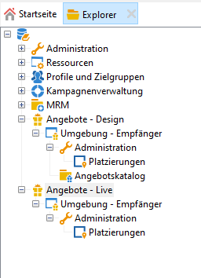
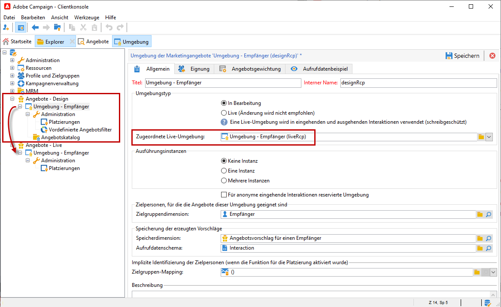
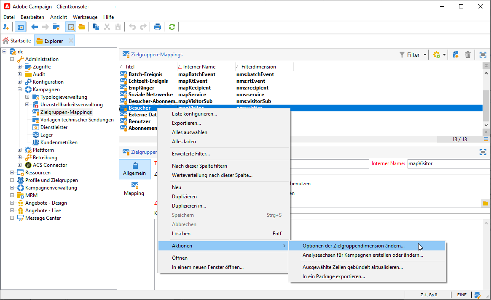
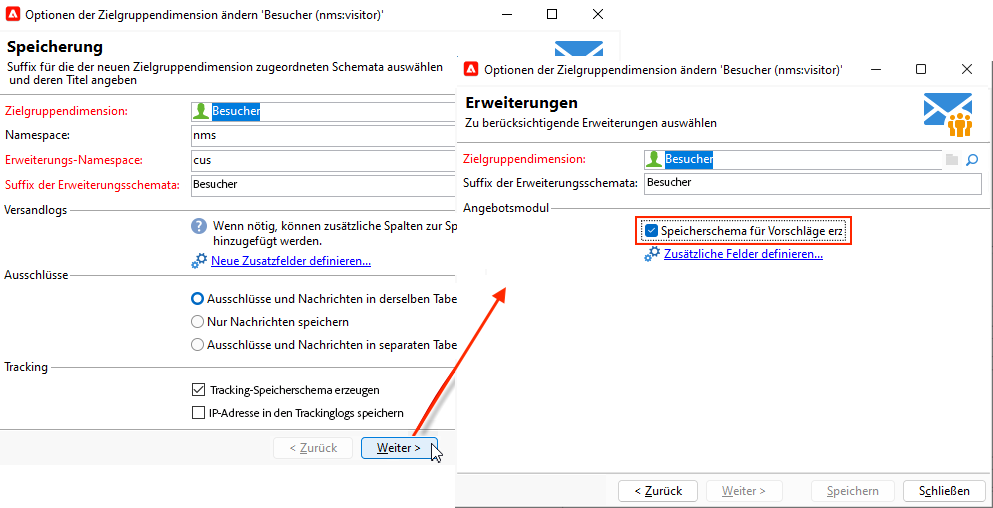
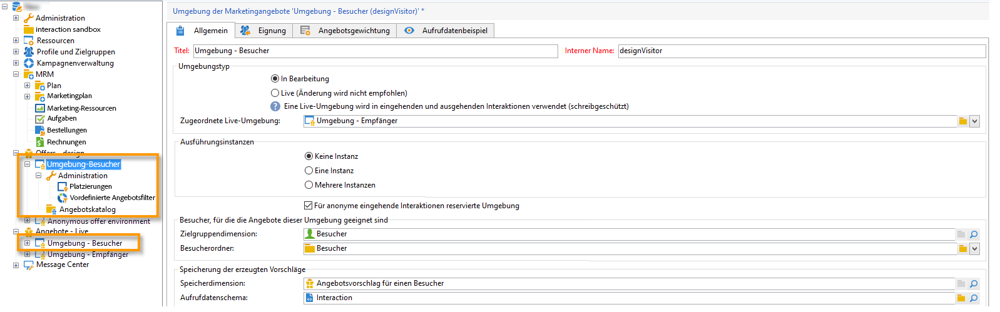

# Arbeiten mit Umgebungen{#work-with-environments}

## Live-/Design-Umgebung{#live-design-environments}

Interaction arbeitet mit zwei Angebotsumgebungstypen:

* **[!UICONTROL Design]** Angebotsumgebungen, die Angebote enthalten, die bearbeitet werden und geändert werden können. Diese Angebote haben den Genehmigungszyklus nicht durchlaufen und werden nicht an Kontakte gesendet.
* **[!UICONTROL Live]**-Angebotsumgebungen, die genehmigte Angebote enthalten, während sie Kontakten präsentiert werden. Die Angebote in dieser Umgebung sind schreibgeschützt.

Jede **[!UICONTROL Design]**-Umgebung ist mit einer **[!UICONTROL Live]**-Umgebung verknüpft. Wenn ein Angebot abgeschlossen ist, unterliegen sein Inhalt und seine Eignungsregeln einem Validierungszyklus. Das Angebot wird automatisch für die **[!UICONTROL Live-Umgebung]** bereitgestellt. Ab diesem Zeitpunkt ist es für den Versand verfügbar.

Standardmäßig verfügt Campaign über eine **[!UICONTROL Design]**-Umgebung und eine **[!UICONTROL Live]**-Umgebung, die mit der Design-Umgebung verknüpft ist. Beide Umgebungen sind für die [integrierte Empfängertabelle](../dev/datamodel.md#ootb-profiles) vorkonfiguriert.

>[!NOTE]
>
>Um die Empfängertabelle auszuwählen, müssen Sie den Zielgruppen-Mapping-Assistenten zur Erstellung der Umgebungen verwenden. [Weitere Informationen](#creating-an-offer-environment).

Versandverantwortliche können nur die **[!UICONTROL Live]**-Umgebung anzeigen und Angebote bereitstellen. Angebotsverantwortliche können die **[!UICONTROL Design]**-Umgebung anzeigen und nutzen und die **[!UICONTROL Live]**-Umgebung anzeigen. [Weitere Informationen](interaction-operators.md)

## Erstellen einer Umgebung für anonyme Interaktionen{#create-an-offer-environment}

Campaign verfügt standardmäßig über eine integrierte Umgebung, in der die Empfängertabelle (identifizierte Angebote) ausgewählt werden kann. Um eine andere Tabelle auszuwählen, z. B. anonyme Profile, die Ihre Website für eingehende Interaktionen besuchen, müssen Sie Ihre Konfiguration aktualisieren.

Gehen Sie wie folgt vor:

1. Navigieren Sie zu **[!UICONTROL Administration]** > **[!UICONTROL Kampagnenverwaltung]** > **[!UICONTROL Zielgruppen-Mappings]**, klicken Sie mit der rechten Maustaste auf das gewünschte Zielgruppen-Mapping und wählen Sie **[!UICONTROL Aktionen]** > **[!UICONTROL Optionen der Zielgruppendimension ändern]** aus.

   

1. Klicken Sie auf **[!UICONTROL Weiter]**, wählen Sie die Option **[!UICONTROL Speicherschema für Vorschläge erzeugen]** und klicken Sie auf **[!UICONTROL Speichern]**.

   

   >[!NOTE]
   >
   >Falls die Option bereits ausgewählt war, muss sie zunächst deaktiviert und dann erneut aktiviert werden.

1. Adobe Campaign erstellt zwei Umgebungen - **[!UICONTROL Design]** und **[!UICONTROL Live]** - mit Zielgruppenbestimmungsinformationen aus dem zuvor aktivierten Zielgruppen-Mapping. Die Umgebung ist mit den Targeting-Informationen vorkonfiguriert.

Im Falle eines Mappings mit der **[!UICONTROL Besuchertabelle]** ist das Feld **[!UICONTROL Für anonyme eingehende Interaktionen reservierte Umgebung]** im Tab **[!UICONTROL Allgemein]** der Umgebung automatisch ausgewählt.

Mit dieser Option können Sie anonyme interaktionsspezifische Funktionen aktivieren, insbesondere bei der Konfiguration von Platzierungen in der Umgebung. Sie können auch Optionen konfigurieren, mit denen Sie von einer „identifizierten“ Umgebung zu einer „anonymen“ Umgebung wechseln können.

Sie können beispielsweise eine Platzierung der Empfängerumgebung (identifizierter Kontakt) mit einer Platzierung verknüpfen, die einer Besucherumgebung (nicht identifizierter Kontakt) entspricht. Auf diese Weise werden dem Kontakt verschiedene Angebote unterbreitet, je nachdem, ob er identifiziert wurde oder nicht. Weitere Informationen hierzu finden Sie unter [Angebotsplatzierungen](interaction-offer-spaces.md).

>[!NOTE]
>
>Weiterführende Informationen zu anonymen Interaktionen in einem eingehenden Kanal finden Sie im Abschnitt [Anonyme Interaktionen](anonymous-interactions.md).
