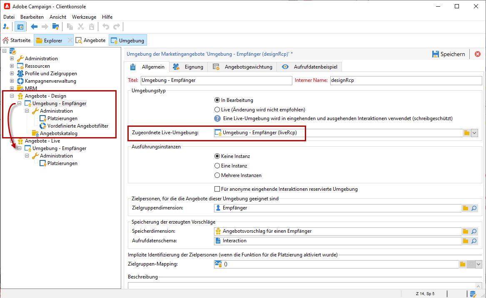
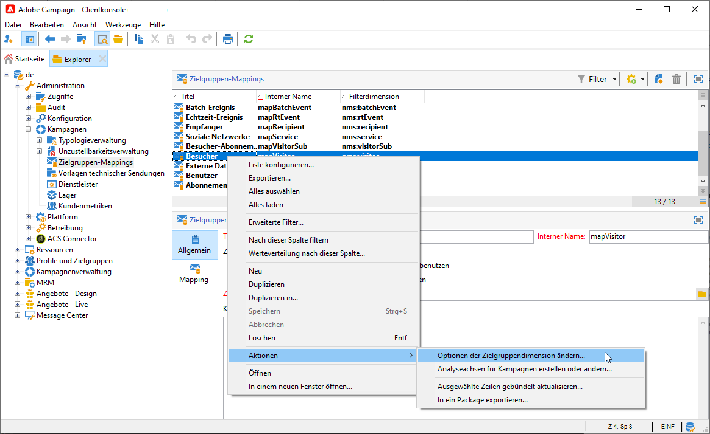

# Arbeiten mit Umgebungen{#work-with-environments}

## Live-/Design-Umgebung {#live-design-environments}

Interaction arbeitet mit zwei Angebotsumgebungstypen:

* **[!UICONTROL Design-Umgebungen]**, in denen Angebote erstellt und geändert werden können. Vor Validierung der Angebote oder etwaiger Änderungen stehen sie nicht zur Unterbreitung zur Verfügung.
* **[!UICONTROL Live-Umgebungen]**, in denen die validierten Angebote zur Unterbreitung zur Verfügung stehen. Die hier enthaltenen Angebote sind schreibgeschützt.

Jeder **[!UICONTROL Design-Umgebung]** entspricht eine **[!UICONTROL Live-Umgebung]**. Nach Erstellung eines Angebots unterlaufen sein Inhalt und die konfigurierten Eignungsregeln einen Validierungszyklus, nach dessen erfolgreichem Abschluss das Angebot automatisch für die **[!UICONTROL Live-Umgebung]** freigegeben wird. Nun kann es in Sendungen verwendet werden.

Standardmäßig verfügt Campaign über eine **[!UICONTROL Design]**-Umgebung und eine **[!UICONTROL Live]**-Umgebung, die mit der Design-Umgebung verknüpft ist. Beide Umgebungen sind für die [integrierte Empfängertabelle](../dev/datamodel.md#ootb-profiles) vorkonfiguriert.

>[!NOTE]
>
>Um die Empfängertabelle auszuwählen, müssen Sie den Zielgruppen-Mapping-Assistenten zur Erstellung der Umgebungen verwenden. [Weitere Informationen](#creating-an-offer-environment).

Versandverantwortliche können nur die **[!UICONTROL Live]**-Umgebung anzeigen und Angebote bereitstellen. Angebotsverantwortliche können die **[!UICONTROL Design]**-Umgebung anzeigen und nutzen und die **[!UICONTROL Live]**-Umgebung anzeigen. [Weitere Informationen](interaction-operators.md)

## Erstellen einer Umgebung für anonyme Interaktionen{#create-an-offer-environment}

Campaign verfügt standardmäßig über eine integrierte Umgebung, in der die Empfängertabelle (identifizierte Angebote) ausgewählt werden kann. Um eine andere Tabelle auszuwählen, z. B. anonyme Profile, die Ihre Website für eingehende Interaktionen besuchen, müssen Sie Ihre Konfiguration aktualisieren.

Gehen Sie wie folgt vor:

1. Navigieren Sie zu **[!UICONTROL Administration]** > **[!UICONTROL Kampagnenverwaltung]** > **[!UICONTROL Zielgruppen-Mappings]**, klicken Sie mit der rechten Maustaste auf das gewünschte Zielgruppen-Mapping und wählen Sie **[!UICONTROL Aktionen]** > **[!UICONTROL Optionen der Zielgruppendimension ändern]** aus.

   

1. Klicken Sie auf **[!UICONTROL Weiter]**, wählen Sie die Option **[!UICONTROL Speicherschema für Vorschläge erzeugen]** und klicken Sie auf **[!UICONTROL Speichern]**.

   

   >[!NOTE]
   >
   >Falls die Option bereits ausgewählt war, muss sie zunächst deaktiviert und dann erneut aktiviert werden.

1. Adobe Campaign erstellt nun die beiden dem zuvor ausgewählten Zielgruppen-Mapping entsprechenden Umgebungen (**[!UICONTROL Design-Umgebung]** und **[!UICONTROL Live-Umgebung]**). Beide Umgebungen sind mit den gewünschten Zielgruppeninformationen vorkonfiguriert.

Im Falle eines Mappings mit der **[!UICONTROL Besuchertabelle]** ist das Feld **[!UICONTROL Für anonyme eingehende Interaktionen reservierte Umgebung]** im Tab **[!UICONTROL Allgemein]** der Umgebung automatisch ausgewählt.

Diese Option ermöglicht die Aktivierung von für anonyme Interaktionen reservierten Funktionen, beispielsweise in Bezug auf die Konfiguration der Umgebungsplatzierungen. Dies ermöglicht es, Optionen zu konfigurieren, die den Wechsel von &quot;identifizierten&quot; zu &quot;anonymen&quot; Umgebungen erlauben.

Sie können beispielsweise eine Platzierung der Empfängerumgebung (identifizierter Kontakt) mit einer Platzierung verknüpfen, die einer Besucherumgebung (nicht identifizierter Kontakt) entspricht. Auf diese Weise werden dem Kontakt verschiedene Angebote unterbreitet, je nachdem, ob er identifiziert wurde oder nicht. Weitere Informationen hierzu finden Sie unter [Angebotsplatzierungen](interaction-offer-spaces.md).

>[!NOTE]
>
>Weiterführende Informationen zu anonymen Interaktionen in einem eingehenden Kanal finden Sie im Abschnitt [Anonyme Interaktionen](anonymous-interactions.md).
